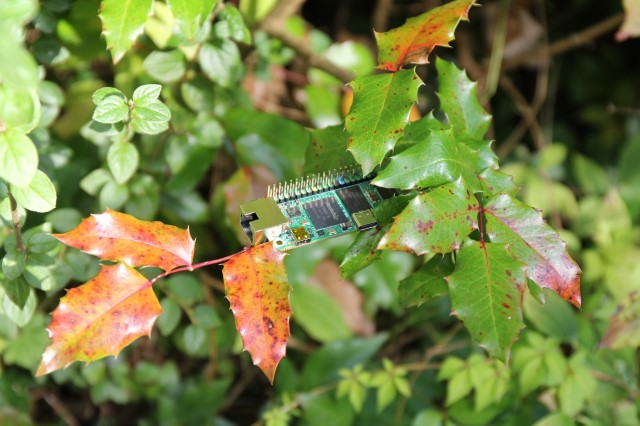

# Release Notes

## October 2024 (version 9.8)

### Overview

The **October 17th, 2024** release of **DietPi v9.8** offers improvements for the NanoPi M3/T3/R5S/R5C, ROCK 4/4 SE, Orange Pi 3B/Zero 3/Zero 2W SBCs, improvements for Portainer and NoMachine, and some bug fixes.

{: width="640" height="426" loading="lazy"}

!!! cite "Radxa ZERO 3E. *Photo by `StephanStS`, DietPi*"

### Enhancements

- [**Orange Pi 3B**](../hardware.md#orange-pi-series) :octicons-arrow-right-16: Added support for board revision v2.1, where Ethernet did not work with our previous kernel. Many thanks to [@raphamotta](https://dietpi.com/forum/u/raphamotta){: class="nospellcheck"} and others for making us aware of this: <https://dietpi.com/forum/t/20689>
- **DietPi-FirstBoot** :octicons-arrow-right-16: The network time sync mirror configured in `dietpi.txt` is now applied before the first time sync is done, instead of after login and initial DietPi update. Many thanks to [@bigops](https://dietpi.com/forum/u/bigops){: class="nospellcheck"} for making us aware of this: <https://dietpi.com/forum/t/21600>
- [**DietPi-Software**](../dietpi_tools/software_installation.md#dietpi-software) | [**NoMachine**](../software/remote_desktop.md#nomachine) :octicons-arrow-right-16: Our install option will now always download the latest NoMachine version, instead of a hardcoded one depending on the DietPi version. Many thanks to @tzvi208 for for figuring it out to version-agnostic download URLs: <https://github.com/MichaIng/DietPi/issues/7198>
- [**DietPi-Software**](../dietpi_tools/software_installation.md#dietpi-software) | [**Portainer**](../software/programming.md#portainer) :octicons-arrow-right-16: It has been enabled to accept private/custom CA certificates by using the trusted CA certificates of the host, instead of the ones shipped with the container image. Many thanks to @oldboys92 for implementing this enhancement: <https://github.com/MichaIng/DietPi/pull/7217>

### Bug fixes

- [**NanoPi M3/T3**](../hardware.md#nanopi-series-friendlyelec) :octicons-arrow-right-16: Resolved an issue where our recent image did not boot because the bootloader did not define a default device tree path anymore. Many thanks to @rozcietrzewiacz for reporting this issue: <https://github.com/MichaIng/DietPi/issues/2630#issuecomment-2322085507>
- [**NanoPi R5S/R5C**](../hardware.md#nanopi-series-friendlyelec) :octicons-arrow-right-16: Resolved an issue where the Ethernet LEDs did not work on systems upgraded from the legacy Linux 5.10 kernel. Many thanks to [@innovodev](https://dietpi.com/forum/u/innovodev){: class="nospellcheck"} for reporting this issue: <https://dietpi.com/forum/t/21026>
- [**ROCK 4**](../hardware.md#radxa) :octicons-arrow-right-16: Resolved an issue where a false APT component was applied for your APT server, leading to errors and missing kernel/firmware upgrades. Many thanks to [@cdlenfert](https://dietpi.com/forum/u/cdlenfert){: class="nospellcheck"} for reporting this issue: <https://dietpi.com/forum/t/20771>
- [**ROCK 4 SE**](../hardware.md#radxa) :octicons-arrow-right-16: Resolved an issue where WiFi did not work if Bluetooth was disabled. Many thanks to @MidG971 and @c00ldchan for reporting this issue: <https://github.com/MichaIng/DietPi/issues/6943>
- [**Orange Pi 3B/Zero 3/Zero 2W**](../hardware.md#orange-pi-series) :octicons-arrow-right-16: Resolved an issue where enabling Bluetooth via `dietpi-config` did not work. Many thanks to [@ridhoperdana](https://dietpi.com/forum/u/ridhoperdana){: class="nospellcheck"} for reporting this issue: <https://dietpi.com/forum/t/18808>
- **Bullseye images** :octicons-arrow-right-16: Solved an issue with our Bullseye images, where the FAT setup partition was not detected, preventing import of config files from it, as well as proper root filesystem expansion. Many thanks to @rozcietrzewiacz for reporting this issue and detecting the actual underlying reason for it: <https://github.com/MichaIng/DietPi/issues/2630>
- [**DietPi-Tools**](../dietpi_tools.md) | [**DietPi-Drive_Manager**](../dietpi_tools/system_configuration.md#dietpi-drive-manager) :octicons-arrow-right-16: Resolved an issue where formatting the internal eMMC in drive mode on some SBCs, like Odroid N2, failed. Many thanks to [@ankagar](https://dietpi.com/forum/u/ankagar){: class="nospellcheck"} for reporting this issue: <https://dietpi.com/forum/t/20689/33>
- [**DietPi-Tools**](../dietpi_tools.md) | [**DietPi-Services**](../dietpi_tools/system_configuration.md#dietpi-services) :octicons-arrow-right-16: Resolved an issue where the `nfs-kernel-server` service did show mode `alias`. `nfs-kernel-server` is indeed an alias for the actual service name `nfs-server`, which is now used.
- [**DietPi-Tools**](../dietpi_tools.md) | [**DietPi-Config**](../dietpi_tools/system_configuration.md#dietpi-config) :octicons-arrow-right-16: Resolved an issue where username and password in proxy settings could not be cleared, since the input box kept asking for an non-empty input. Many thanks to @dipisoft for reporting this issue: <https://github.com/MichaIng/DietPi/issues/7211>
- [**DietPi-Software**](../dietpi_tools/software_installation.md#dietpi-software) | [**NoMachine**](../software/remote_desktop.md#nomachine) :octicons-arrow-right-16: Resolved an issue where the installation failed due to an outdated download URL. Many thanks to @tzvi208 for reporting this issue: <https://github.com/MichaIng/DietPi/issues/7198>
- [**DietPi-Software**](../dietpi_tools/software_installation.md#dietpi-software) | [**Raspotify**](../software/media.md#raspotify) :octicons-arrow-right-16: Resolved an issue where the service failed to start with the latest Raspotify release, since it contains a config, incompatible with the bundles `librespot`: <https://github.com/dtcooper/raspotify/pull/674>
- [**DietPi-Software**](../dietpi_tools/software_installation.md#dietpi-software) | [**Home Assistant**](../software/home_automation.md#home-assistant) :octicons-arrow-right-16: Resolved an issue where the latest Home Assistant version did not start. Many thanks to @whyisthisbroken and others for reporting this issue: <https://github.com/MichaIng/DietPi/issues/7231>
- [**DietPi-Software**](../dietpi_tools/software_installation.md#dietpi-software) | [**Folding@Home**](../software/distributed_projects.md#foldinghome) :octicons-arrow-right-16: Resolved an issue where the installation failed. Due to larger changes in Folding@Home v8, v7 will be installed for now, before we find time to implement the needed changes for v8. Many thanks to @cruzadernl for reporting this issue: <https://github.com/MichaIng/DietPi/issues/7187>

As always, many smaller code performance and stability improvements, visual and spelling fixes have been done, too much to list all of them here. Check out all code changes of this release on GitHub: <https://github.com/MichaIng/DietPi/pull/7246>
