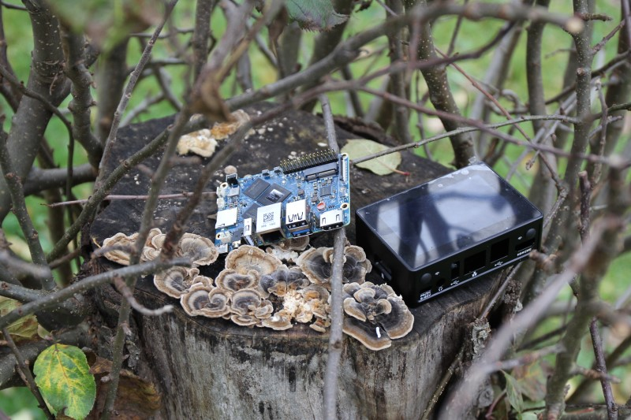

# Release Notes

## December 2024 (version 9.9)

### Overview

The **December 23rd, 2024** release of **DietPi v9.9** comes with new images for the Orange Pi 5 Max, Orange Pi 5 Pro and NanoPi M6 SBCs, improvements for YaCy, MineOS, frp, Logitech Media Server and the NFS server and additionally with several bug fixes.

{: width="640" height="426" loading="lazy"}

!!! cite "NanoPi M6. *Photo by `StephanStS`, DietPi*"

### New images

- [**Orange Pi 5 Pro**](../hardware.md#orange-pi-series) :octicons-arrow-right-16: Support for this new variant of the Orange Pi 5 family has been added to DietPi. Compared to the original Orange Pi 5, it features onboard WiFi 5, an eMMC slot, dual HDMI, and supports NVMe SSDs up to 2280 format.
- [**Orange Pi 5 Max**](../hardware.md#orange-pi-series) :octicons-arrow-right-16: Support for this new variant of the Orange Pi 5 family has been added to DietPi. Compared to the Orange Pi 5 Pro, it features onboard WiFi 6E and 2.5G Ethernet.
- [**NanoPi M6**](../hardware.md#nanopi-series-friendlyelec) :octicons-arrow-right-16: Support for this FriendlyELEC SBC with RK3588 SoC has been added to DietPi. Compared to the NanoPi R6S/R6C and NanoPC T6, aside of the great onboard features, we observed a significantly lower idle power usage. As usual, the optional metal case keeps it at cool temperatures, and has an LCD display builtin, which can be enabled via device tree overlay in DietPi. A related dietpi-config toggle is added with next release.

### Enhancements

- [**Virtual Machines**](../hardware.md#native-pc-virtual-machines) :octicons-arrow-right-16: `systemd-logind` is now enabled by default on VMs, as it provides ACPI functionality, needed to properly shutdown or reboot the VM from the virtualiser software, usually expected by users.
- [**DietPi-Tools**](../dietpi_tools.md) | [**DietPi-DDNS**](../dietpi_tools/software_installation.md#dietpi-ddns) :octicons-arrow-right-16: The `IPv6or4` option to update IPv6 only, if supported by server, network and provider, has been replaced with `IPv4and6`. A server being reachable via IPv6 only is rarely wanted, as many networks do not support it. Instead, usually one will want to have it reachable via both, IPv4 as well as IPv6, which is now possible when using DietPi-DDNS, and the new default. If, e.g. for security reason, IPv6 only is wanted, this option of course remains available, like before. Many thanks to @LOGIN-TB for doing this suggestion: <https://github.com/MichaIng/DietPi/issues/7278>
- [**DietPi-Tools**](../dietpi_tools.md) | [**DietPi-DDNS**](../dietpi_tools/software_installation.md#dietpi-ddns) :octicons-arrow-right-16: The cron job does now log server response messages and connection errors separately with respective severities. Some DDNS providers do not return an HTTP error code, but an error text embedded into a regular HTTP 200 response. This, as well as success responses can now be seen via `journalctl -t dietpi-ddns`. Many thanks to @jtmoon79 for doing this suggestion: <https://github.com/MichaIng/DietPi/issues/5954>
- [**DietPi-Tools**](../dietpi_tools.md) | [**DietPi-Services**](../dietpi_tools/system_configuration.md#dietpi-services) :octicons-arrow-right-16: `dietpi-services start` will not start disabled services anymore. This aligns with the behaviour of the `restart` command, which as well skips disabled services. The script is used within other DietPi scripts to (re)start services after maintenance operations, and it is unexpected when services, who were not running before, but explicitly disabled, are running afterwards. To manually start/stop individual services from the console, we recommend using `systemctl` directly, like on any other Linux distribution with `systemd`. Many thanks to @intiplink for reporting this unexpected behaviour while using dietpi-drive_manager: <https://github.com/MichaIng/DietPi/issues/7302>
- [**DietPi-Software**](../dietpi_tools/software_installation.md#dietpi-software) | [**NFS Server**](../software/file_servers.md#nfs) :octicons-arrow-right-16: The `fsid=0` option has been removed from the `/mnt/dietpi_userdata` default export. As it is uncommon and not respected in `showmount -e` export lists, it caused confusion and issues.
- [**DietPi-Software**](../dietpi_tools/software_installation.md#dietpi-software) | [**YaCy**](../software/distributed_projects.md#yacy) :octicons-arrow-right-16: The latest YaCy version will now be installed, and the global software password will be set as default admin password on fresh installs.
- [**DietPi-Software**](../dietpi_tools/software_installation.md#dietpi-software) | [**MineOS**](../software/gaming.md#mineos) :octicons-arrow-right-16: As a security enhancement and workaround for a web UI login issue, a dedicated `mineos` user is created again. For new MineOS installs or after reinstall, one can login with this user, and the global software password. It has permissions to install and manage Minecraft instances.
- [**DietPi-Software**](../dietpi_tools/software_installation.md#dietpi-software) | [**frp**](../software/advanced_networking.md#frp) :octicons-arrow-right-16: It is now possible to connect the client to a server which has no (an empty) authentication token configured. `frp` can now be installed non-interactively, where client + server daemons are both installed and configured to work with each other, with respective defaults for all inputs.
- [**DietPi-Software**](../dietpi_tools/software_installation.md#dietpi-software) | [**frp**](../software/advanced_networking.md#frp) :octicons-arrow-right-16: Since the `ini` format for config files has been deprecated, and support will be removed in a future `frp` release, new installs and reinstalls/updates will generated `toml` format config files from now on. As of the large amount of config keys, which all changed between those formats, an automated conversion is sadly not possible. When doing a reinstall with existing `ini` configs, you will be informed about it, the old config(s) will be kept as backup in place, for a manual migration. All config keys for the `toml` format can be found here: <https://github.com/fatedier/frp/tree/dev/conf>
- [**DietPi-Software**](../dietpi_tools/software_installation.md#dietpi-software) | [**Lyrion Music Server**](../software/media.md#lyrion-music-server) :octicons-arrow-right-16: LMS has been renamed to Lyrion Music Server. For more details, see their new official website: <https://lyrion.org/reference/lyrion-music-server/>
- [**DietPi-Software**](../dietpi_tools/software_installation.md#dietpi-software) | [**Sonarr**](../software/bittorrent.md#sonarr) :octicons-arrow-right-16: Sonarr v4 will be installed from now on, and a migration to Sonarr v4 is now possible by reinstall it via `dietpi-software reinstall 144`. Note that, since Sonarr v4 does not support ARMv6, this is not the case and not possible on RPi 1 and Zero (1). After a migration, one might want to uninstall Mono, which is not required for Sonarr v4 anymore. Note that some settings may be lost as of the database migration. At best create a backup, offered before the reinstall, and inform yourself about possible database migration issues and losses on the Sonarr websites.

### Bug fixes

- [**NanoPi M1 Plus**](../hardware.md#nanopi-series-friendlyelec) :octicons-arrow-right-16: Resolved an issue where Ethernet did not work because of a faulty kernel patch. Many thanks to @InnovoMagicCube and @InnovoDeveloper for reporting this issue: <https://github.com/MichaIng/DietPi/issues/6974>
- [**DietPi-Tools**](../dietpi_tools.md) | [**DietPi-DDNS**](../dietpi_tools/software_installation.md#dietpi-ddns) :octicons-arrow-right-16: Resolved an issue where the YDNS update test failed due to a changed response from the server API. Many thanks to @NatureHog for reporting and solving the issue: <https://github.com/MichaIng/DietPi/pull/7262>
- [**DietPi-Tools**](../dietpi_tools.md) | [**DietPi-Drive_Manager**](../dietpi_tools/system_configuration.md#dietpi-drive-manager) :octicons-arrow-right-16: Resolved an issue where a mounted drive could be mistakenly detected as dietpi_userdata location.
- [**DietPi-Software**](../dietpi_tools/software_installation.md#dietpi-software) | [**InfluxDB**](../software/databases.md#influxdb) :octicons-arrow-right-16: Resolved an issue where the service did not start up after the recent package upgrade. The package upgrade removes the symlink `/var/lib/influxdb => /mnt/dietpi_userdata/influxdb`, which is recreated with this DietPi update. Many thanks to @uwjhn for reporting this issue: <https://dietpi.com/forum/t/influxdb-not-working-after-update/21868>
- [**DietPi-Software**](../dietpi_tools/software_installation.md#dietpi-software) | [**Node-RED**](../software/hardware_projects.md#node-red) :octicons-arrow-right-16: Resolved an issue where the service failed on ARMv6 systems, since a dependency module of Node-RED v4 does not support this architecture. Node-RED v3 will now be installed on those old RPi models. Many thanks to @mvanbrab for reporting this issue: <https://github.com/MichaIng/DietPi/issues/7252>
- [**DietPi-Software**](../dietpi_tools/software_installation.md#dietpi-software) | [**Chromium**](../software/desktop.md#chromium) :octicons-arrow-right-16: Resolved an issue where optional Chromium flags via `CHROMIUM_OPTS+=` line in `/var/lib/dietpi/dietpi-software/installed/chromium-autostart.sh` did not have any effect, as `+=` is bash-only syntax, while the script is executed with dash (`Bourne shell`). Many thanks to @Nurgak for reporting this issue: <https://github.com/MichaIng/DietPi/issues/7263#issuecomment-2463626660>
- [**DietPi-Software**](../dietpi_tools/software_installation.md#dietpi-software) | [**MineOS**](../software/gaming.md#mineos) :octicons-arrow-right-16: Worked around an issue where the install failed on Bookworm systems, as one of the Node.js modules failed to compile for unknown reasons. Many thanks to @mikedebian for reporting this issue: <https://github.com/MichaIng/DietPi/issues/7265>
- [**DietPi-Software**](../dietpi_tools/software_installation.md#dietpi-software) | [**MineOS**](../software/gaming.md#mineos) :octicons-arrow-right-16: Worked around an issue where login into the web interface failed since Bullseye, as MineOS does not support the new default yescrypt password hash algorithm for UNIX users. A new dedicated `mineos` user is now created, and its password set explicitly with SHA512 hash algorithm. Many thanks to @maybaxstv for reporting this issue: <https://github.com/MichaIng/DietPi/issues/5759>
- [**DietPi-Software**](../dietpi_tools/software_installation.md#dietpi-software) | [**Node.js**](../software/webserver_stack.md#nodejs) :octicons-arrow-right-16: Resolved an issue where node failed on ARMv7 Bullseye systems, since the latest version for this architecture requires a newer C++ standard library than provided on Bullseye.
- [**DietPi-Software**](../dietpi_tools/software_installation.md#dietpi-software) | [**frp**](../software/advanced_networking.md#frp) :octicons-arrow-right-16: Resolved an issue where server address and port inputs for the client config generation were parsed incorrectly.

As always, many smaller code performance and stability improvements, visual and spelling fixes have been done, too much to list all of them here. Check out all code changes of this release on GitHub: <https://github.com/MichaIng/DietPi/pull/7313>
