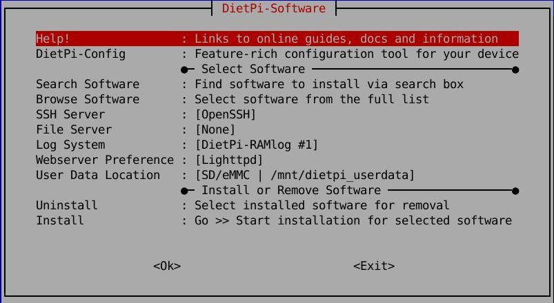

# DietPi software options

## Overview

**DietPi-Software** is a core DietPi tool, allowing you to install **Ready to run** and **optimized software items** for your device. It automates the installation and configuration process for you and also applies specific optimizations unique to your hardware model. As a result DietPi-Software ensure you get the **maximum performance** from your device.

??? info "How do I run **DietPi-Software** and install **optimised software** items?"
    To install any of the **DietPi optimised software items** listed below run `dietpi-launcher` from the command line and select *DietPi-Software* or launch the tool `dietpi-software`.

    Choose **Browse Software** and select one or more items. Finally select `Install`.  
    DietPi will do all the necessary steps to install and start these software items.

    {: width="643" height="365" loading="lazy"}

    To see all the DietPi configurations options, review the [DietPi Tools](../dietpi_tools/) section.

## [Advanced Networking](advanced_networking/)

- [**WiFi HotSpot - Turn your device into a wireless hotspot/access point**](advanced_networking/#wifi-hotspot)
- [**Tor HotSpot - Optional: Routes all WiFi hotspot traffic through the Tor network**](advanced_networking/#tor-hotspot)
- [**HAProxy - High performance TCP/HTTP load balancer**](advanced_networking/#haproxy)
- [**frp - Reverse Proxy**](advanced_networking/#frp)

## [BitTorrent & Download Tools](bittorrent/)

- [**Transmission - Lightweight BitTorrent server with web interface**](bittorrent/#transmission)
- [**Deluge - Alternative BitTorrent server with web interface**](bittorrent/#deluge)
- [**qBittorrent - Lightweight and fast (C++) BitTorrent server with web interface**](bittorrent/#qbittorrent)
- [**rTorrent - BitTorrent server with ruTorrent web interface**](bittorrent/#rtorrent)
- [**Aria2 - Download manager with web interface**](bittorrent/#aria2)
- [**SABnzbd - NZB download manager with web interface**](bittorrent/#sabnzbd)
- [**Medusa - Automatically download TV shows**](bittorrent/#medusa)
- [**Sonarr - Automatically download TV shows**](bittorrent/#sonarr)
- [**Radarr - Automatically download Movies**](bittorrent/#radarr)
- [**Bazarr - Automatically download Subtitles for Sonarr/Radarr**](bittorrent/#bazarr)
- [**Lidarr - Automatically download Music**](bittorrent/#lidarr)
- [**Readarr - Automatically download Ebooks**](bittorrent/#readarr)
- [**Prowlarr - Indexer manager & proxy for PVR**](bittorrent/#prowlarr)
- [**Jackett - API Support for your favourite torrent trackers**](bittorrent/#jackett)
- [**NZBGet - NZB download manager with web interface**](bittorrent/#nzbget)
- [**HTPC Manager - combines all your favourite software into one slick interface**](bittorrent/#htpc-manager)
- [**youtube-dl - download videos from YouTube and other sites**](bittorrent/#youtube-dl)

## [Camera & Surveillance](camera/)

- [**RPi Cam Web Interface - Web interface & controls for your RPi camera**](camera/#rpi-cam-web-interface)
- [**MotionEye - Web interface & surveillance for your camera**](camera/#motioneye)
- [**mjpg-streamer - Simple camera streaming tool with HTML plugin**](camera/#mjpg-streamer)

## [Cloud & Backup systems](cloud/)

- [**ownCloud - Your own personal cloud based backup/data storage system**](cloud/#owncloud)
- [**Nextcloud - Self-hosted productivity platform**](cloud/#nextcloud)
- [**Nextcloud Talk - Video calls via Nextcloud, including TURN server**](cloud/#nextcloud-talk)
- [**Pydio - Feature-rich backup and sync server with web interface**](cloud/#pydio)
- [**UrBackup Server - Full backups for systems on your network**](cloud/#urbackup)
- [**Gogs - GitHub style server, with web interface**](cloud/#gogs)
- [**Gitea - GitHub style server, with web interface**](cloud/#gitea)
- [**Syncthing - Backup and sync server with web interface**](cloud/#syncthing)
- [**MinIO - S3 compatible distributed object server**](cloud/#minio)
- [**Firefox Sync Server - Sync bookmarks, tabs, history and passwords**](cloud/#firefox-sync-server)
- [**vaultwarden - Unofficial Bitwarden password manager server written in Rust**](cloud/#vaultwarden)
- [**FuguHub - Your Own Personal Cloud Server**](cloud/#fuguhub)
- [**File Browser - Light web based file manager with sharing features**](cloud/#file-browser)
- [**Rclone - Utility to sync your files to cloud storages**](cloud/#rclone)

## [Databases & Data Stores](databases/#overview)

- [**MariaDB - Open Source Relational Database**](databases/#mariadb)
- [**phpMyAdmin - SQL Administration Tool for MariaDB**](databases/#phpmyadmin)  
- [**SQLite - Small, Fast and High reliable SQL database engine**](databases/#sqlite)
- [**Redis - Open Source In-memory key–value Data Store**](databases/#redis)
- [**InfluxDB - Open Source Time Series Database**](databases/#influxdb)
- [**PostgreSQL - Persistent and advanced SQL database engine**](databases/#postgresql)

## [Desktops](desktop/)

- [**LXDE - Highly optimized ultra lightweight desktop**](desktop/#lxde)
- [**LXQt - Slick and optimized lightweight desktop**](desktop/#lxqt)
- [**MATE - Popular Gnome 2 desktop**](desktop/#mate)
- [**Xfce - Lightweight desktop**](desktop/#xfce)
- [**GNUstep - Alternative/unique desktop**](desktop/#gnustep)

### [Desktop Utilities](desktop/)

- [**Chromium - Web browser**](desktop/#chromium)
- [**Firefox - Web browser**](desktop/#firefox)
- [**GIMP - Image editor**](desktop/#gimp)
- [**QuiteRSS - RSS and Atom news feeds reader**](desktop/#quiterss)
- [**Xfce Power Manager - Power manager with brightness control**](desktop/#xfce-power-manager)

## [Development & Programming](programming/)

- [**Python 3 - High-level interpreted programming language**](programming/#python-3)
- [**Go - Programming language**](programming/#go)
- [**Docker - Build, ship, and run distributed applications**](programming/#docker)
- [**Docker-Compose - Run multi-container applications on Docker**](programming/#docker-compose)
- [**Portainer - Docker container management**](programming/#portainer)
- [**VSCodium - FLOSS version of Microsoft VSCode**](programming/#vscodium)

## [Distributed Projects](distributed_projects/)

- [**Folding@Home - Use processing power to assist with disease research**](distributed_projects/#foldinghome)
- [**Tor Relay - Add a node to the Tor network**](distributed_projects/#tor-relay)
- [**YaCy - Decentralized open source search engine**](distributed_projects/#yacy)
- [**IPFS Node - Contribute to a decentralized internet**](distributed_projects/#ipfs-node)

## [DNS Servers](dns_servers/)

- [**Pi-hole - Network-wide Ad Blocking**](dns_servers/#pi-hole)
- [**Unbound - A validating, recursive, and caching DNS resolver**](dns_servers/#unbound)
- [**AdGuard Home - A powerful network-wide ads & trackers blocking DNS server**](dns_servers/#adguard-home)

## [File Servers](file_servers/)

- [**ProFTPD - Simple, efficient, lightweight FTP file server**](file_servers/#proftpd)
- [**Samba - Feature rich file server**](file_servers/#samba)
- [**vsftpd - Feature rich FTP file server**](file_servers/#vsftpd)
- [**NFS - Network file system server**](file_servers/#nfs)

## [Gaming & Emulation](gaming/)

- [**OpenTyrian - Open-source port of the DOS game Tyrian**](gaming/#opentyrian)
- [**Cuberite - Fast Minecraft server with web interface**](gaming/#cuberite)
- [**MineOS - Multiple Minecraft servers with web interface**](gaming/#mineos)
- [**Nukkit - Server for Minecraft Pocket Edition**](gaming/#nukkit)
- [**Amiberry - Optimised Amiga emulator for ARM-based SoCs**](gaming/#amiberry)
- [**DXX-Rebirth - Descent 1 and 2 OpenGL port**](gaming/#dxx-rebirth)
- [**Steam - Steam client**](gaming/#steam)
- [**PaperMC - Fast and optimized Minecraft server**](gaming/#papermc)
- [**Box86 - i386 userspace emulation for ARMv7**](gaming/#box86)
- [**Box64 - x86_64 userspace emulation for ARMv8**](gaming/#box64)

## [Hardware Projects](hardware_projects/)

- [**Google AIY - Voice kit "Ok, Google"!**](hardware_projects/#google-aiy)
- [**Mycroft AI - Open source voice assistant**](hardware_projects/#mycroft-ai)
- [**PiJuice - PiSupply UPS/battery power system**](hardware_projects/#pijuice)
- [**RPi.GPIO - GPIO Interface library for RPi (python)**](hardware_projects/#rpigpio)
- [**WiringPi - GPIO Interface library**](hardware_projects/#wiringpi)
- [**WebIOPi - Web interface to control RPi GPIO**](hardware_projects/#webiopi)
- [**Node-RED - Visual tool for wiring together hardware devices, APIs and online services**](hardware_projects/#node-red)
- [**Mosquitto - Message broker that implements MQTT protocol**](hardware_projects/#mosquitto)
- [**Blynk Server - iOS and Android apps to control Arduino, ESP8266, Raspberry Pi and similar microcontroller boards over the Internet**](hardware_projects/#blynk-server)
- [**Audiophonics PI-SPC - Power control module for Raspberry Pi, allowing physical button power on/off**](hardware_projects/#audiophonics-pi-spc)
- [**Grafana - The open platform for beautiful analytics and monitoring**](hardware_projects/#grafana)

## [Home Automation](home_automation/)

- [**Home Assistant - Open-source home automation platform running on Python 3**](home_automation/#home-assistant)
- [**Domoticz - Multi platform Home Automation System**](home_automation/#domoticz)
- [**TasmoAdmin - Administrative website for Tasmota devices**](home_automation/#tasmoadmin)

## [Logging Systems](log_system/)

- [**DietPi-RAMlog - Lightweight RAM logging**](log_system/#dietpi-ramlog)
- [**Full - Full logging system with Rsyslog and Logrotate**](log_system/#full-logging)

## [Media Systems](media/)

- [**Kodi - Media Centre / Player**](media/#kodi)
- [**ympd - Lightweight web Interface audio player for MPD**](media/#ympd)
- [**myMPD - Lightweight web Interface audio player for MPD**](media/#mympd)
- [**O!MPD - Feature-rich web Interface audio player for MPD**](media/#ompd)
- [**CAVA - Optional: Console-based audio visualizer for MPD**](media/#cava)
- [**Mopidy - Web Interface Music /Radio Player**](media/#mopidy)
- [**Airsonic-Advanced - Feature rich media streaming server with web interface**](media/#airsonic)
- [**Logitech Media Server - aka LMS, Squeezebox Server**](media/#logitech-media-server)
- [**Squeezelite - Audio player for Logitech Media Server**](media/#squeezelite)
- [**Shairport Sync - AirPlay audio player with multiroom sync**](media/#shairport-sync)
- [**ReadyMedia - (MiniDLNA) Media streaming server (DLNA, UPnP)**](media/#readymedia)
- [**Ampache - Web interface media streaming server**](media/#ampache)
- [**Emby - Web interface media streaming server**](media/#emby)
- [**Plex Media Server - Web interface media streaming server**](media/#plex-media-server)
- [**Tautulli - Monitoring and tracking tool for Plex Media Server**](media/#tautulli)
- [**Murmur - Mumble VoIP Server**](media/#murmur)
- [**Roon Bridge - Turns your device into a Roon capable audio player**](media/#roon-bridge)
- [**Roon Server - Turns your device into a Roon capable audio player and Roon core**](media/#roon-server)
- [**Roon Extension Manager - Manage extensions from within Roon**](media/#roon-extension-manager)
- [**NAA Daemon - Signalyst Network Audio Adaptor (NAA)**](media/#naa-daemon)
- [**IceCast - Shoutcast Streaming Server, including DarkIce**](media/#icecast)
- [**Koel - Web interface streaming server**](media/#koel)
- [**GMediaRender - Resource efficient UPnP/DLNA renderer**](media/#gmediarender)
- [**Ubooquity - Free home server for your comics and ebooks library**](media/#ubooquity)
- [**Komga - Free and open source comics/mangas media server with web UI**](media/#komga)
- [**Raspotify - Spotify Connect client**](media/#raspotify)
- [**Spotify Connect Web - Web interface, client and player for Spotify Premium**](media/#spotify-connect-web)
- [**Spotifyd - Lightweight FOSS Spotify client**](media/#spotifyd)
- [**Jellyfin - Media streaming server including live TV**](media/#jellyfin)
- [**Beets - Music organizer and manager**](media/#beets)
- [**Snapcast Server - Multi room audio server**](media/#snapcast-server)
- [**Snapcast Client - Multi room audio client**](media/#snapcast-client)
- [**Navidrome - Web interface media streaming server**](media/#navidrome)

## [Printing Server](printing/)

- [**OctoPrint - Web interface for controlling 3D printers**](printing/#octoprint)
- [**CUPS - Common UNIX printing system**](printing/#cups)

## [Remote Desktop & Remote Access](remote_desktop/)

### [Remote Desktop](remote_desktop/#remote-desktop)

- [**TigerVNC Server - Desktop for remote connection**](remote_desktop/#tigervnc-server)
- [**RealVNC Server - Desktop for remote connection**](remote_desktop/#realvnc-server)
- [**XRDP - Remote desktop server for Windows Remote Desktop Client**](remote_desktop/#xrdp)
- [**NoMachine - Feature rich remote desktop connection**](remote_desktop/#nomachine)

### [Remote Access](remote_desktop/#remote-access)

- [**Remote.It - Access your device over the internet**](remote_desktop/#remoteit)
- [**VirtualHere - Share physically attached USB devices from your SBC over the network**](remote_desktop/#virtualhere)

## [Social & Search](social/)

- [**FreshRSS - A self-hosted RSS feed aggregator**](social/#freshrss)
- [**phpBB - Free flat-forum bulletin board software solution**](social/#phpbb)
- [**Wordpress - Website Blog and Publishing platform**](social/#wordpress)
- [**Single File PHP Gallery - Host and browse your images from a web interface**](social/#single-file-php-gallery)
- [**Baïkal - Lightweight CalDAV + CardDAV server**](social/#baikal)
- [**Synapse - Decentralized communication with the Matrix protocol**](social/#synapse)

## [SSH Server](ssh/)

- [**Dropbear - Lightweight SSH Server**](ssh/#dropbear)
- [**OpenSSH - Feature rich SSH server with SFTP/SCP support**](ssh/#openssh)

## [System Security](system_security/)

- [**Let’s Encrypt - Enable HTTPS / SSL**](system_security/#lets-encrypt)
- [**Fail2Ban - Protects your system from brute-force attacks**](system_security/#fail2ban)

## [System Stats & Management](system_stats/)

- [**DietPi-Dashboard - Official lightweight standalone DietPi web interface**](system_stats/#dietpi-dashboard)
- [**DietPi-CloudShell - Lightweight system stats for your LCD display or monitor**](system_stats/#dietpi-cloudshell)
- [**Linux Dash - Web interface system stats**](system_stats/#linux-dash)
- [**phpSysInfo - Web interface system stats**](system_stats/#phpsysinfo)
- [**RPi-Monitor - Web interface system stats**](system_stats/#rpi-monitor)
- [**Netdata - Web interface system stats**](system_stats/#netdata)
- [**Webmin - Remote system management with web interface**](system_stats/#webmin)
- [**K3s - Lightweight Kubernetes**](system_stats/#k3s)
- [**MicroK8s - Low-ops, minimal production Kubernetes**](system_stats/#microk8s)
- [**Prometheus Node Exporter - Prometheus exporter for hardware and OS metrics**](system_stats/#prometheus-node-exporter)
- [**Homer - A modern homepage for your services**](system_stats/#homer)

## [VPN](vpn/)

- [**OpenVPN - Easy to use, minimal hassle VPN server**](vpn/#openvpn)
- [**PiVPN - OpenVPN server installer & management tool**](vpn/#pivpn)
- [**WireGuard - An extremely simple yet fast and modern VPN**](vpn/#wireguard)
- [**Tailscale - Zero config VPN**](vpn/#tailscale)
- [**ZeroTier - Free easy to deploy cloud-hosted VPN service**](vpn/#zerotier)

## [Web development](webserver_stack/)

### [Stacks for web development](webserver_stack/#stacks-for-web-development)

- [**LAMP web stack - Apache / MariaDB / PHP**](webserver_stack/#lamp-web-stack)
- [**LASP web stack - Apache / SQLite / PHP**](webserver_stack/#lasp-web-stack)
- [**LEMP web stack - Nginx / MariaDB / PHP**](webserver_stack/#lemp-web-stack)
- [**LESP web stack - Nginx / SQLite / PHP**](webserver_stack/#lesp-web-stack)  
- [**LLMP web stack - Lighttpd / MariaDB / PHP**](webserver_stack/#llmp-web-stack)
- [**LLSP web stack - Lighttpd / SQLite / PHP**](webserver_stack/#llsp-web-stack)

### [Webservers](webserver_stack/#webservers)

- [**Apache - Feature-rich webserver**](webserver_stack/#apache)  
- [**Nginx - High performance web server, load balancer & reverse proxy**](webserver_stack/#nginx)  
- [**Lighttpd - Extremely lightweight webserver**](webserver_stack/#lighttpd)
- [**Tomcat8 - Apache Tomcat server**](webserver_stack/#tomcat)  

### [Programming & Web development Frameworks](webserver_stack/#web-development-programming-frameworks)

- [**PHP - Scripting language especially suited to web development**](webserver_stack/#php)
- [**PHP Composer** - A Dependency Manager for PHP](webserver_stack/#php-composer)
- [**Flask - Micro web framework powered by Python**](webserver_stack/#flask)
- [**Node.js** - JavaScript runtime designed to build scalable network applications](webserver_stack/#nodejs)
