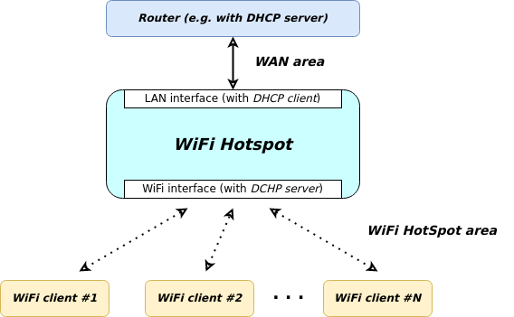

# Advanced Networking

## Overview

- [**WiFi HotSpot - Turn your device into a wireless hotspot/access point**](#wifi-hotspot)
- [**Tor HotSpot - Optional: Routes all WiFi HotSpot traffic through the Tor network**](#tor-hotspot)
- [**HAProxy - High performance TCP/HTTP load balancer**](#haproxy)
- [**frp - Reverse Proxy**](#frp)

??? info "How do I run **DietPi-Software** and install **optimised software** items?"
    To install any of the **DietPi optimised software items** listed below run from the command line:

    ```sh
    dietpi-software
    ```

    Choose **Browse Software** and select one or more items. Finally select `Install`.  
    DietPi will do all the necessary steps to install and start these software items.

    {: width="643" height="365" loading="lazy"}

    To see all the DietPi configurations options, review the [DietPi Tools](../dietpi_tools.md) section.

[Return to the **Optimised Software list**](../software.md)

## WiFi HotSpot

The WiFi HotSpot package turns your device into a wireless hotspot/access point. This allows other wireless devices to connect and share the internet connection.

{: width="550" height="345" loading="lazy"}

=== "Requirements"

    The requirements are:

    - 1x Ethernet connection (LAN)
    - 1x Supported USB WiFi adapter or onboard WiFi. This may vary depending on device and available WiFi drivers/modules. However, common adapters (e.g.: Atheros) should be fine.

=== "Initial connection credentials"

    Use the following credentials to initially connect devices to your hotspot.

    - SSID = `DietPi-HotSpot`
    - Access Key = `dietpihotspot`

=== "Change hotspot settings"

    Some hotspot settings can be changed to adopt to various circumstances. The main settings of the WiFi hotspot reside in the DHCP configuration file `/etc/dhcp/dhcpd.conf` and can be edited. The DHCP server configuration options are manifold and can be checked out e.g. via the [man pages of `isc-dhcp-server`](https://manpages.debian.org/testing/isc-dhcp-server/dhcpd.conf.5.en.html).  
    Below there are some basic settings described.

    <h3>Change WiFi settings (SSID/Key/Channel)</h3>

    Once installed, you can change the WiFi HotSpot settings (SSID/Key/Channel) at any time:

    1. Run `dietpi-config`
    2. Navigate to *Networking Options: Adapters*, then select *WiFi*
    3. Whilst in this menu, it is highly recommended you set the Country Code to your country. Depending on your country regulations, this could allow for channels 12/13 and increased power output (range) for the hotspot

    <h3>Change hotspot subnet address</h3>

    The WiFi hotspot offer the WiFi clients IP settings within a certain IP subnet (see lower part of graphics):

    {: width="550" height="345" loading="lazy"}

    The default values for these subnet settings are:

    - IP address of WiFi hotspot: 192.168.**42.1**
    - Subnet mask: 255.255.255.0
    - DHCP range: 192.168.**42.10** .. 192.168.**42.250**

    If these settings shall be changed, the following files need to be adjusted:

    - `/etc/dhcp/dhcp.conf`
    - `/etc/network/interfaces`
    - `/etc/iptables.ipv4.nat`

    These changes should be followed by a reboot to activate the settings (this is an easy way compared to restart the relevant services by hand).

    For example, the default contents of the WiFi setting area within the file `/etc/network/interfaces` is:

    ```
    # WiFi
    allow-hotplug wlan0
    iface wlan0 inet static
    address 192.168.42.1
    netmask 255.255.255.0
    #gateway 192.168.0.1
    #dns-nameservers 9.9.9.9 149.112.112.112
    wireless-power off
    ```

    As can be seen, the address 192.168.42.1 would need to be changed.

    These setting changes can be done by hand or via a shell line using this command  
    (exemplary changing IP addresses from 192.168.**42.x** to 192.168.**43.x**): 
    
    ```sh
    sed -i 's/192\.168\.42\./192.168.43./g' /etc/dhcp/dhcpd.conf /etc/network/interfaces /etc/iptables.ipv4.nat
    ```

    <h3>Change DHCP lease time settings</h3>

    The DHCP lease time denotes the time how long an IP address is bound to a DHCP client: DHCP-assigned IP addresses are typically not permanent and expire after a certain time. This time is called *DHCP lease time*.  
    This lease time can be set, so that an IP address is not dedicated to a device forever and is available for other devices too, when needed.

    The lease time is set via the entry `default-lease-time` within the configuration file `/etc/dhcp/dhcpd.conf`.

    There are many further setting options around the lease behaviour, for details e.g. see [man pages of `isc-dhcp-server`](https://manpages.debian.org/testing/isc-dhcp-server/dhcpd.conf.5.en.html).

    The default-lease-time time of the `isc-dhcp-server` is 43200 seconds (12 hrs). Depending of the usage situation of the WiFi hotspot, a different setting might fit better.  
    Typical good practice values are:

    - Internet cafe: 1 hour resp. 3600 seconds
    - Guest networks in an office: 8 hours resp. 28800 seconds
    - Wireless devices at trusted networks / at home: 24 hours .. 1 week resp. 86.400 .. 604.800 seconds
    - (Cable connected devices / LAN: 8 days resp. 691.200 seconds)

=== "Diagnosis"

    The status of the WiFi hotspot can be evaluated with these commands:

    - 

        ```sh
        systemctl status isc-dhcp-server hostapd
        ```

    - 
    
        ```sh
        journalctl -u isc-dhcp-server
        ```

        resp.  

        ```sh
        journalctl -u isc-dhcp-server -u hostapd -u ifup@wlan0
        ```


    Additionally, DHCP leases can be monitored via the file `/var/lib/dhcp/dhcpd.leases`. 

=== "Combine with AdGuard Home resp. Pi-hole"

    The WiFi HotSpot can be combined with AdGuard Home resp. Pi-hole. To do this, the DHCP server needs to know the IP address of the Ad-Blocker system and announces it as the DNS server for the WiFi area.

    The corresponding file is `/etc/dhcp/dhcpd.conf`, the entry `option domain-name-servers` has to be set to your Ad-Blocker IP address.  
    In the following there are three examples given starting from the following base `dhcpd.conf` content:

    ```
    authoritative;
    #default-lease-time 43200;
    #max-lease-time 86400;

    subnet 192.168.42.0 netmask 255.255.255.0 {
        range 192.168.42.10 192.168.42.250;
        option broadcast-address 192.168.42.255;
        option routers 192.168.42.1;
        option domain-name "local";
        option domain-name-servers 9.9.9.9, 149.112.112.112;
    }
    ```

    1. AdGuard Home runs on the same DietPi system as the WiFi HotSpot runs. Then the "subnet" section contents has to be changed to
        ```
        subnet 192.168.42.0 netmask 255.255.255.0 {
            range 192.168.42.10 192.168.42.250;
            option broadcast-address 192.168.42.255;
            option routers 192.168.42.1;
            option domain-name "local";
            # AdGuard Home runs on the localhost (with IP address 192.168.42.1)
            option domain-name-servers 192.168.42.1;
        }
        ```

    1. Pi-hole runs in the subnet the (superimposed) LAN connection belongs to. Depending on the LAN subnet (e.g. 192.168.178.0/24) the "subnet" section contents might be changed to
        ```
        subnet 192.168.42.0 netmask 255.255.255.0 {
            range 192.168.42.10 192.168.42.250;
            option broadcast-address 192.168.42.255;
            option routers 192.168.42.1;
            option domain-name "local";
            # Pi-hole runs on the LAN (with IP address 192.168.178.2)
            option domain-name-servers 192.168.178.2;
        }
        ```

    1. Pi-hole runs in the subnet the WiFi connection belongs to. Depending on the WiFi HotSpot subnet (e.g. 192.168.42.0/24) the "subnet" section contents might be changed to
        ```
        subnet 192.168.42.0 netmask 255.255.255.0 {
            range 192.168.42.10 192.168.42.250;
            option broadcast-address 192.168.42.255;
            option routers 192.168.42.1;
            # Pi-hole runs on the WiFi subnet (with IP address 192.168.42.250)
            option domoption domain-name-servers 192.168.42.250;
        }
        ```

***

YouTube video tutorial (German language): [Raspberry Hotspot: Internet Sperren umgehen mit eigenen WiFi Hotspot unter DietPi (für alle Geräte)](https://www.youtube.com/watch?v=3ZROq90tM_s){:class="nospellcheck"}

## Tor HotSpot

The Tor HotSpot package turns your device into a WiFi HotSpot/Access Point with Tor routing. All WiFi HotSpot traffic for all connected WiFi devices will be routed through the Tor network.  
This is perfect for users requiring anonymity and privacy.

It also Installs:

- [WiFi HotSpot](#wifi-hotspot)

{: width="550" height="308" loading="lazy"}

=== "Requirements"

    The requirements are:

    - 1x Ethernet connection
    - 1x Supported USB WiFi adapter or onboard WiFi. This may vary depending on device and available WiFi drivers/modules. However, common adapters (e.g.: Atheros) should be fine.

=== "Connection credentials"

    These are identical to the [WiFi HotSpot credentials](#wifi-hotspot).

=== "Verification"

    To verify that the traffic is being routed through Tor you can check the following:  
    On the connected WiFi device, go to the following URL: <https://check.torproject.org>

=== "View logs"

    Tor service logs can be viewed with the following command:

    ```sh
    journalctl -t tor
    ```

***

Wikipedia: <https://wikipedia.org/wiki/Tor_(anonymity_network)>  
YouTube video tutorial: [DietPi Tor Hotspot Setup on Raspberry Pi 3 B Plus](https://www.youtube.com/watch?v=rik-ABzSoHM)

## HAProxy

HAProxy, which stands for High Availability Proxy, is a popular open source software TCP/HTTP Load Balancer and proxy solution. Its most common use is to improve the performance and reliability of a server environment by distributing the workload across multiple servers (e.g. web, application, database).

It is best suited for high traffic web sites and powers quite a number of the world's most visited ones: GitHub, Imgur, Instagram, and Twitter. It has become the de-facto standard open-source load balancer, and it is often deployed by default in cloud platforms.

{: width="1898" height="650" loading="lazy"}

!!! warning "This software title is recommended ONLY for advanced users!"

=== "Quick start"

    After installation, you need to manually modify the `haproxy.cfg` to best fit your network requirements. Check the configuration manual [here](https://www.haproxy.org/#docs).

    ```sh
    systemctl stop haproxy
    nano /etc/haproxy/haproxy.cfg
    systemctl start haproxy    
    ```

    The stats web interface is accessible via port **1338**:

    - URL = `http://<your.IP>:1338`
    - Prometheus metrics = `http://<your.IP>:1338/metrics`
    - Username = `admin`
    - Password = `<yourGlobalSoftwarePassword>` (default: `dietpi`)

    !!! hint "This installation was made possible by Jerome Queneuder, who provided the methods for compiling and installation."

=== "Load balancing"

    The simplest way to load balance network traffic to multiple servers is to use layer 4 (transport layer) load balancing. Load balancing this way will forward user traffic based on IP range and port.

    {: width="690" height="248" loading="lazy"}

    The user accesses the load balancer, which forwards the user’s request to the web-backend group of backend servers. Whichever backend server is selected will respond directly to the user’s request.

    Help text extracted from the tutorial: [An Introduction to HAProxy and Load Balancing Concepts](https://www.digitalocean.com/community/tutorials/an-introduction-to-haproxy-and-load-balancing-concepts)

=== "High availability"

    A high availability (HA) setup is an infrastructure without a single point of failure. It prevents a single server failure from being a downtime event by adding redundancy to every layer of your architecture. A load balancer facilitates redundancy for the backend layer (web/app servers), but for a true high availability setup, you need to have redundant load balancers as well.

    Here is a diagram of a basic high availability setup:
    {: width="1200" height="577" loading="lazy"}

    Help text extracted from the tutorial: [An Introduction to HAProxy and Load Balancing Concepts](https://www.digitalocean.com/community/tutorials/an-introduction-to-haproxy-and-load-balancing-concepts)

***

Website: <https://www.haproxy.org/>  
Official documentation: <https://docs.haproxy.org/>

## frp

A fast reverse proxy, helping you to expose a local server behind a NAT or firewall to the Internet. It supports more protocols, naming a few: TCP, UDP, HTTP(S), and also P2P connect mode.

=== "Access to web services"

    Aside from proxies, frp also has a few dashboards that you can use to monitor it.

    - Admin UI (Client): `http://<your.IP>:7400`
    - Dashboard (Server): `http://<your.IP>:7500`
        - User name: `admin`
        - Password: `<yourGlobalSoftwarePassword>` (default: `dietpi`)

=== "Configuration Files"

    Depending on whether you have installed as client, server, or both, there will be only the configuration files for that component.

    - Client: `/etc/frp/frpc.toml`
    - Server: `/etc/frp/frps.toml`

    Note: You will need `root` access to edit these files. You can also edit the _client_ configuration file using Admin UI.

***

Official documentation: <https://github.com/fatedier/frp/blob/dev/README.md>  
Source code: <https://github.com/fatedier/frp>

[Return to the **Optimised Software list**](../software.md)
