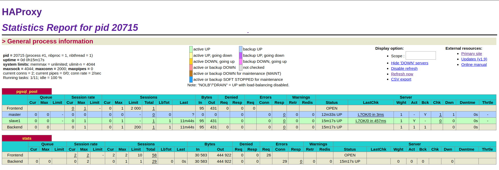
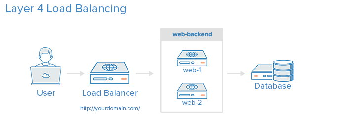
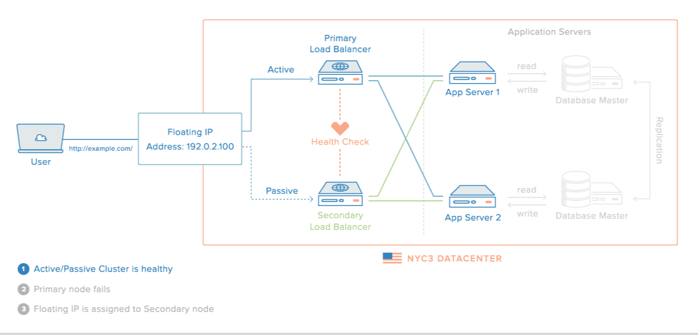

# Advanced Networking

## Overview

- [**WiFi HotSpot - Turn your device into a wireless hotspot/access point**](#wifi-hotspot)
- [**Tor HotSpot - Optional: Routes all WiFi HotSpot traffic through the Tor network**](#tor-hotspot)
- [**HAProxy - High performance TCP/HTTP load balancer**](#haproxy)
- [**frp - Reverse Proxy**](#frp)

??? info "How do I run **DietPi-Software** and install **optimised software** items?"
    To install any of the **DietPi optimised software items** listed below run from the command line:

    ```sh
    dietpi-software
    ```

    Choose **Browse Software** and select one or more items. Finally select `Install`.  
    DietPi will do all the necessary steps to install and start these software items.

    {: width="643" height="365" loading="lazy"}

    To see all the DietPi configurations options, review the [DietPi Tools](../../dietpi_tools/) section.

[Return to the **Optimised Software list**](../../software/)

## WiFi HotSpot

The WiFi HotSpot package turns your device into a wireless hotspot/access point. This allows other wireless devices to connect and share the internet connection.

{: width="550" height="345" loading="lazy"}

=== "Requirements"

    The requirements are:

    - 1x Ethernet connection
    - 1x Supported USB WiFi adapter or onboard WiFi. This may vary depending on device and available WiFi drivers/modules. However, common adapters (e.g.: Atheros) should be fine.

=== "Initial connection credentials"

    Use the following credentials to initially connect devices to your hotspot.

    - SSID = `DietPi-HotSpot`
    - Access Key = `dietpihotspot`

=== "Change WiFi HotSpot settings"

    Once installed, you can change the WiFi HotSpot settings (SSID/Key/Channel) at any time:

    1. Run `dietpi-config`
    2. Navigate to *Networking Options: Adapters*, then select *WiFi*
    3. Whilst in this menu, it is highly recommended you set the Country Code to your country. Depending on your country regulations, this could allow for channels 12/13 and increased power output (range) for the hotspot

***

YouTube video tutorial (German language): `Raspberry Hotspot: Internet Sperren umgehen mit eigenen WiFi Hotspot unter DietPi (für alle Geräte)`.

<iframe src="https://www.youtube-nocookie.com/embed/3ZROq90tM_s?rel=0" frameborder="0" allow="fullscreen" width="560" height="315" loading="lazy"></iframe>

## Tor HotSpot

The Tor HotSpot package turns your device into a WiFi HotSpot/Access Point with Tor routing. All WiFi HotSpot traffic for all connected WiFi devices will be routed through the Tor network.  
This is perfect for users requiring anonymity and privacy.

It also Installs:

- [WiFi HotSpot](#wifi-hotspot_1)

{: width="550" height="308" loading="lazy"}

=== "Requirements"

    The requirements are:

    - 1x Ethernet connection
    - 1x Supported USB WiFi adapter or onboard WiFi. This may vary depending on device and available WiFi drivers/modules. However, common adapters (e.g.: Atheros) should be fine.

=== "Connection credentials"

    These are identical to the [WiFi HotSpot credentials](#wifi-hotspot_1).

=== "Verification"

    To verify that the traffic is being routed through Tor you can check the following:  
    On the connected WiFi device, go to the following URL: <https://check.torproject.org>

=== "View logs"

    Tor service logs can be viewed with the following command:

    ```sh
    journalctl -t tor
    ```

***

Wikipedia: <https://wikipedia.org/wiki/Tor_(anonymity_network)>  
YouTube video tutorial: *DietPi Tor Hotspot Setup on Raspberry Pi 3 B Plus*.

<iframe src="https://www.youtube-nocookie.com/embed/rik-ABzSoHM?rel=0" frameborder="0" allow="fullscreen" width="560" height="315" loading="lazy"></iframe>

## HAProxy

HAProxy, which stands for High Availability Proxy, is a popular open source software TCP/HTTP Load Balancer and proxy solution. Its most common use is to improve the performance and reliability of a server environment by distributing the workload across multiple servers (e.g. web, application, database).

It is best suited for high traffic web sites and powers quite a number of the world's most visited ones: GitHub, Imgur, Instagram, and Twitter. It has become the de-facto standard open-source load balancer, and it is often deployed by default in cloud platforms.

{: width="1898" height="650" loading="lazy"}

!!! warning "This software title is recommended ONLY for advanced users!"

=== "Quick start"

    After installation, you need to manually modify the `haproxy.cfg` to best fit your network requirements. Check the configuration manual [here](https://www.haproxy.org/#docs).

    ```sh
    systemctl stop haproxy
    nano /etc/haproxy/haproxy.cfg
    systemctl start haproxy    
    ```

    The stats web interface is accessible via port **1338**:

    - URL = `http://<your.IP>:1338`
    - Username = `admin`
    - Password = `dietpi`

    !!! hint "This installation was made possible by Jerome Queneuder, who provided the methods for compiling and installation."

=== "Load balancing"

    The simplest way to load balance network traffic to multiple servers is to use layer 4 (transport layer) load balancing. Load balancing this way will forward user traffic based on IP range and port.

    {: width="690" height="248" loading="lazy"}

    The user accesses the load balancer, which forwards the user’s request to the web-backend group of backend servers. Whichever backend server is selected will respond directly to the user’s request.

    Help text extracted from the tutorial: [An Introduction to HAProxy and Load Balancing Concepts](https://www.digitalocean.com/community/tutorials/an-introduction-to-haproxy-and-load-balancing-concepts)

=== "High availability"

    A high availability (HA) setup is an infrastructure without a single point of failure. It prevents a single server failure from being a downtime event by adding redundancy to every layer of your architecture. A load balancer facilitates redundancy for the backend layer (web/app servers), but for a true high availability setup, you need to have redundant load balancers as well.

    Here is a diagram of a basic high availability setup:
    {: width="1200" height="577" loading="lazy"}

    Help text extracted from the tutorial: [An Introduction to HAProxy and Load Balancing Concepts](https://www.digitalocean.com/community/tutorials/an-introduction-to-haproxy-and-load-balancing-concepts)

***

Website: <https://www.haproxy.org/>  
Official documentation: <https://www.haproxy.org/#docs>

## frp

A fast reverse proxy, helping you to expose a local server behind a NAT or firewall to the Internet. It supports more protocols, naming a few: TCP, UDP, HTTP(S), and also P2P connect mode.

=== "Access to web services"

    Aside from proxies, frp also has a few dashboards that you can use to monitor it.

    - Admin UI (Client): `http://<your.IP>:7400`
    - Dashboard (Server): `http://<your.IP>:7500`
        - User name: `admin`
        - Password: `<yourGlobalSoftwarePassword>` (default: `dietpi`)

=== "Configuration Files"

    Depending on whether you have installed as client, server, or both, there will be only the configuration files for that component.

    - Client: `/etc/frp/frpc.ini`
    - Server: `/etc/frp/frps.ini`

    Note: You will need `root` access to edit these files. You can also edit the _client_ configuration file using Admin UI.

***

Official documentation: <https://github.com/fatedier/frp/blob/dev/README.md>  
Source code: <https://github.com/fatedier/frp>

[Return to the **Optimised Software list**](../../software/)
