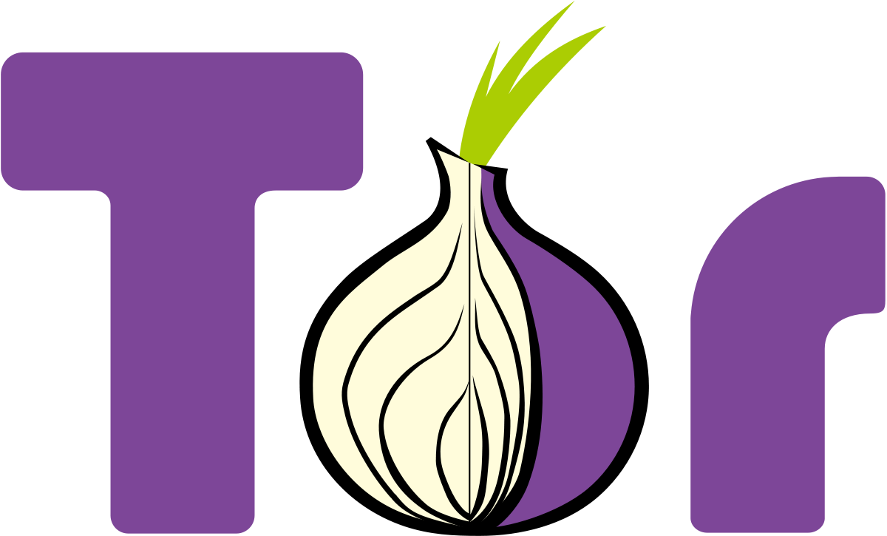

# Advanced Networking

## Overview

- [**WiFi HotSpot - Turn your device into a wireless hotspot/access point**](#wifi-hotspot)
- [**Tor HotSpot - Optional: Routes all WiFi HotSpot traffic through the Tor network**](#tor-hotspot)
- [**Tor Relay - Add a node to the Tor network**](#tor-relay)
- [**HAProxy - High performance TCP/HTTP load balancer**](#haproxy)
- [**No-IP - Dynamic DNS update client**](#no-ip)

??? info "How do I run **DietPi-Software** and install **optimised software** ?"
    To install any of the **DietPi optimised software** listed below run from the command line:

    ```
    dietpi-software
    ```

    Choose **Software Optimised** and select one or more items. Finally click on `Install`. DietPi will do all the necessary steps to install and start these software items.

    

    To see all the DietPi configurations options, review [DietPi Tools](../../dietpi_tools) section.

[Return to the **Optimised Software list**](../../dietpi_optimised_software)

## WiFi HotSpot

The WiFi HotSpot package turns your device into a wireless hotspot/access point. This allows other wireless devices to connect and share the internet connection.

{: style="width:550px"}

=== "Requirements"

    The requirements are:

    - 1x Ethernet connection
    - 1x Supported USB WiFi adapter or onboard WiFi. This may vary depending on device and available WiFi drivers/modules. However, common adapters (e.g.: Atheros) should be fine.

=== "Initial connection credentials"

    Use the following credentials to initially connect devices to your hotspot.

    - SSID = `DietPi-HotSpot`
    - Access Key = `dietpihotspot`

=== "Change WiFi HotSpot settings"

    Once installed, you can change the WiFi HotSpot settings (SSID/Key/Channel) at any time:

    1. Run `dietpi-config`
    2. Navigate to *Networking Options: Adapters*, then select *WiFi*
    3. Whilst in this menu, it is highly recommended you set the Country Code to your country. Depending on your country regulations, this could allow for channels 12/13 and increased power output (range) for the hotspot

***

YouTube video #1 (German language): [`Raspberry Hotspot: Internet Sperren umgehen mit eigenen WiFi Hotspot unter DietPi (für alle Geräte)`](https://www.youtube.com/watch?v=3ZROq90tM_s)

## Tor HotSpot

The Tor HotSpot package turns your device into a WiFi HotSpot/Access Point with Tor routing. All WiFi HotSpot traffic for all connected WiFi devices will be routed through the Tor network.  
This is perfect for users requiring anonymity and privacy.

It also Installs:

- [WiFi HotSpot](#wifi-hotspot_1)

{: style="width:550px"}

=== "Requirements"

    The requirements are:

    - 1x Ethernet connection
    - 1x Supported USB WiFi adapter or onboard WiFi. This may vary depending on device and available WiFi drivers/modules. However, common adapters (e.g.: Atheros) should be fine.

=== "Connection credentials"

    These are identical to the [WiFi HotSpot credentials](#wifi-hotspot_1).

=== "Verification"

    To verify that the traffic is being routed through Tor you can check the following:  
    On the connected WiFi device, go to the following URL: <https://check.torproject.org>

***

Wikipedia: <https://wikipedia.org/wiki/Tor_(anonymity_network)>  
YouTube video: [DietPi Tor Hotspot Setup on Raspberry Pi 3 B Plus](https://www.youtube.com/watch?v=rik-ABzSoHM)

## Tor Relay

{: style="width:150px"}

Contribute a node to the Tor network, which allows people to be anonymous on the internet.

=== "Types of relay"

    You can run many types of relay, each with their own technical requirements and legal implications.

    Bridges are the safest relay to run from home, and are relatively easy, low-risk and low bandwidth, but they have a big impact on users, especially in censored countries. Normally, IP addresses and other information of Tor relays is published, making it easy for websites to blacklist the relay, and anything else using that IP address. Since a bridge isn't listed publicly, it is unlikely to be blocked by websites or receive abuse complaints.

    Guard/Middle relays are the first and second relays connected to, respectively. Information about them is listed, but they are unlikely to receive abuse complaints. However, they may be blocked by certain services that don't understand how Tor works or deliberately want to censor Tor users. If you have one static IP address, consider running a bridge instead.

    Exit relays are the final relay connected to, and the one that actually sends traffic to its destination. The website will see the exit relay's IP address instead of the real IP address of the Tor user. Exit relays have the greatest legal exposure and liability of all the relays, and should not be run from home.

    ??? info "Exit relay prep"
        Running exit relays requires some preparation.
        Before running an exit relay, you should set a reverse DNS (and, if possible, WHOIS) record to make it clearer that your IP address is a Tor exit relay.
        Also, it is recommended that you run an exit relay on its own server, with its own IP address.

=== "Monitoring"

    The simplest way to monitor the Tor relay is to use the DietPi-CloudShell scene, for this run `dietpi-cloudshell` from command line and select the "Tor Relay" scene. It uses the Tor monitor [nyx](https://nyx.torproject.org/) which can be called in standalone mode by executing `nix` from command line.

=== "Keeping up-to-date"

    Keeping Tor relays updated is important to the safety of both the users and the operator. Because of this, automated upgrades are recommended and asked about when first installing. Otherwise, use `apt-get update && apt-get upgrade`

***

Official documentation: <https://community.torproject.org/relay/setup>

## HAProxy

HAProxy, which stands for High Availability Proxy, is a popular open source software TCP/HTTP Load Balancer and proxy solution. Its most common use is to improve the performance and reliability of a server environment by distributing the workload across multiple servers (e.g. web, application, database).

It is best suited for high traffic web sites and powers quite a number of the world's most visited ones: GitHub, Imgur, Instagram, and Twitter. It has become the de-facto standard open-source load balancer, and it is often deployed by default in cloud platforms.


!!! warning ""
    This software title is recommended ONLY for advanced users !

=== "Quick start"

    After installation, you need to manually modify the `haproxy.cfg` to best fit your network requirements. Check the configuration manual [here](http://www.haproxy.org/#docs).

    ``` bash
    systemctl stop haproxy
    nano /etc/haproxy/haproxy.cfg
    systemctl start haproxy    
    ```

    Access web interface stats:

    ``` bash
    URL = http://<your.local.ip>:1338
    Username = admin
    Password = dietpi
    ```

    !!! hint ""
        This installation was made possible by Jerome Queneuder, who provided the methods for compiling and installation.

=== "Load balancing"

    The simplest way to load balance network traffic to multiple servers is to use layer 4 (transport layer) load balancing. Load balancing this way will forward user traffic based on IP range and port.

    

    The user accesses the load balancer, which forwards the user’s request to the web-backend group of backend servers. Whichever backend server is selected will respond directly to the user’s request.

    Help text extracted from the tutorial: [An Introduction to HAProxy and Load Balancing Concepts](https://www.digitalocean.com/community/tutorials/an-introduction-to-haproxy-and-load-balancing-concepts)

=== "High availability"

    A high availability (HA) setup is an infrastructure without a single point of failure. It prevents a single server failure from being a downtime event by adding redundancy to every layer of your architecture. A load balancer facilitates redundancy for the backend layer (web/app servers), but for a true high availability setup, you need to have redundant load balancers as well.

    Here is a diagram of a basic high availability setup:
    

    Help text extracted from the tutorial: [An Introduction to HAProxy and Load Balancing Concepts](https://www.digitalocean.com/community/tutorials/an-introduction-to-haproxy-and-load-balancing-concepts)

***

Website: <http://www.haproxy.org>  
Official documentation: <http://www.haproxy.org/#docs>

## No-IP

Use your No-IP account and website URL address to always have it pointing to your DietPi system. Essential if your hosting a website.

{: style="width:200px"}

The setup of No-IP is done as follows:

- Create your free No-IP account <https://www.noip.com/sign-up> and select a web address for your account.
- Type `dietpi-config` in a terminal and press enter.
- Go to *Networking Options: Misc* and select *No-IP* from the menu.
    If No-IP is not yet installed, confirm the installation and reselect No-IP from the menu once completed.
- Type in your *username* and *password* details at the prompt.
- Type in *5* for the interval option.

If successful, the No-IP current status will change to: *Online*.  
You will need to enable port forwarding on your router for all programs your require and point them to DietPi. E.g.: TCP port 80/443 for websites, pointing to 192.168.0.100.

***

Website: <https://www.noip.com>

[Return to the **Optimised Software list**](../../dietpi_optimised_software)
