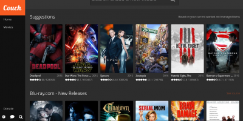

# BitTorrent / Download Tools

## Overview

- [**Transmission - Lightweight BitTorrent server with web interface**](#transmission-lightweight-bittorrent-server-with-web-interface)
- [**Deluge - Alternative BitTorrent server with web interface**](#deluge-alternative-bittorrent-server-with-web-interface)
- [**qBittorrent - Lightweight and fast (C++) BitTorrent server with web interface**](#qbittorrent-lightweight-and-fast-c-bittorrent-server-with-web-interface)
- [**rTorrent - BitTorrent server with ruTorrent web interface**](#rtorrent-bittorrent-server-with-rutorrent-web-interface)
- [**Aria2 - Download manager with web interface**](#aria2-download-manager-with-web-interface)
- [**SABnzbd - NZB download manager with web interface**](#sabnzbd-nzb-download-manager-with-web-interface)
- [**Medusa - Automatically download TV shows**](#medusa-automatically-download-tv-shows)
- [**Sonarr - Automatically download TV shows**](#sonarr-automatically-download-tv-shows)
- [**Radarr - Automatically download Movies**](#radarr-automatically-download-movies)
- [**Bazarr - Automatically download Subtitles for Sonarr/Radarr**](#bazarr-automatically-download-subtitles-for-sonarrradarr)
- [**Lidarr - Automatically download Music**](#lidarr-automatically-download-music)
- [**CouchPotato - Automatically download movies**](#couchpotato-automatically-download-movies)
- [**Jackett - API Support for your favourite torrent trackers**](#jackett-api-support-for-your-favourite-torrent-trackers)
- [**NZBGet - NZB download manager with web interface**](#nzbget-nzb-download-manager-with-web-interface)
- [**HTPC Manager - combines all your favourite software into one slick interface**](#htpc-manager-combines-all-your-favourite-software-into-one-slick-interface)

??? info "How do I run **DietPi-Software** and install **optimised software** ?"
    To install any of the **DietPi optimised software** listed below run from the command line:

    ```
    dietpi-software
    ```

    Choose **Software Optimised** and select one or more items. Finally click on `Install`. DietPi will do all the necessary steps to install and start these software items.

    

    To see all the DietPi configurations options, review [DietPi Tools](../../dietpi_tools) section.

[Return to the **Optimised Software list**](../../dietpi_optimised_software)

## Transmission - Lightweight BitTorrent server with web interface

Transmission, the lightweight web interface BitTorrent server that allows you to download bittorrent files.

??? hint "USB dedicated hard drive highly recommended"

{: style="width:500px"}

=== "Access to the web interface"

    - URL = `http://<your.IP>:9091`
    - Username = `root`
    - Password = `dietpi`

=== "Access Downloads"

    Make sure you have one of DietPi's [File Servers](https://dietpi.com/docs/software/file_servers/) installed.  
    Folders used by Transmission:

    - folder accessed via file server = `downloads`
    - local folder = `/mnt/dietpi_userdata/downloads`

=== "Port closed Issues"

    DietPi sets up Transmission to use port forwarding on the router.  
    In rare cases this won't work with some routers and you will need to manually setup port forwarding:

    - Use TCP+UDP with the default DietPi transmission port of 51413.
    - Point this port to the IP address of your DietPi system.

    Once port forwarding is setup, simply complete the following to update transmission:

    - Load up the transmission web interface
    - Click the `settings` button (bottom left spanner)
    - Click the `network` tab
    - Where is says `Use port forwarding on my router`, untick this box.

    Simply close and reopen this screen to refresh the port status.

=== "Recommended: Protect your privacy with a VPN"

    Although we enable forced encryption on all our BitTorrent clients, if you wish to ensure complete privacy and peice of mind for all your downloaded content, using a VPN is critical.  
    We highly recommend [***NordVPN***](../vpn/#dietpi-nordvpn-openvpn-and-dietpi-gui-for-nordvpn-users) as it offers unlimited bandwidth, zero logging and upto 6 devices on a single account.  
    {: style="width:200px"}

## Deluge - Alternative BitTorrent server with web interface

Deluge, the web interface BitTorrent server that allows you to download bittorrent files. This python coded bittorrent server is an alternative to the [Lightweight Transmission](#transmission-lightweight-bittorrent-server-with-web-interface) option.

??? hint "USB dedicated hard drive highly recommended"

{: style="width:500px"}

=== "Access to the web interface"

    - URL = `http://<your.IP>:8112`
    - Password = `dietpi`

    Select the host 127.0.0.1 and click `connect`.

=== "Access Deluge console"

    `sudo -u debian-deluged deluge-console`

=== "Connect using your desktop Deluge client"

    - Open up Deluge client on your other system
    - Select `Preferences` \> `Interface` and disable (untick) `Classic Mode`. Save changes and restart Deluge
    - When the connection manager appears, select `Add`.
    - Enter the following details:
        - Hostname = Your device's IP address (eg: 192.168.0.100)
        - Port = 58846
        - Username = `root`
        - Password = `dietpi`
    - Simply select and connect to the new entry

=== "Access Downloads"

    Make sure you have one of DietPi's [File Servers](https://dietpi.com/docs/software/file_servers/) installed.  
    Folders used by Deluge:

    - folder accessed via file server = `downloads`
    - local folder = `/mnt/dietpi_userdata/downloads`

=== "Recommended: Protect your privacy with a VPN"

    Although we enable forced encryption on all our BitTorrent clients, if you wish to ensure complete privacy and peice of mind for all your downloaded content, using a VPN is critical.  
    We highly recommend [***NordVPN***](../vpn/#dietpi-nordvpn-openvpn-and-dietpi-gui-for-nordvpn-users) as it offers unlimited bandwidth, zero logging and upto 6 devices on a single account.  
    {: style="width:200px"}

## qBittorrent - Lightweight and fast (C++) BitTorrent server with web interface

qBitTorrent is a lightweight BitTorrent server with a slick web interface. As its coded in C++ (Qt), it offers excellent performance on any device.

??? hint "USB dedicated hard drive highly recommended"

{: style="width:500px"}

=== "Access to the web interface"

    - URL = `http://<your.IP>:1340`
    - Username = `qbittorrent`
    - Password = `<your global password>`

=== "Access Downloads"

    Make sure you have one of DietPi's [File Servers](https://dietpi.com/docs/software/file_servers/) installed.  
    Folders used by qBittorrent:

    - folder accessed via file server = `downloads`
    - local folder = `/mnt/dietpi_userdata/downloads`

=== "Using of search plugins"

    Before activating search plugins within qBitTorrent, you would need to install Python first. Afterwards you can search and activate the plugins.

=== "Recommended: Protect your privacy with a VPN"

    Although we enable forced encryption on all our BitTorrent clients, if you wish to ensure complete privacy and peice of mind for all your downloaded content, using a VPN is critical.  
    We highly recommend [***NordVPN***](../vpn/#dietpi-nordvpn-openvpn-and-dietpi-gui-for-nordvpn-users) as it offers unlimited bandwidth, zero logging and upto 6 devices on a single account.  
    {: style="width:200px"}

## rTorrent - BitTorrent server with ruTorrent web interface

rTorrent is a BitTorrent server. ruTorrent is also installed to allow for web interface access and control.  

Also installs:

- Webserver

??? hint "USB dedicated hard drive highly recommended"

{: style="width:500px"}

=== "Access to the web interface"

    - URL = `http://<your.IP>/rutorrent`
    - Username = `root`
    - Password = `dietpi`

=== "Access Downloads"

    Make sure you have one of DietPi's [File Servers](https://dietpi.com/docs/software/file_servers/) installed.  
    Folders used by rTorrent:

    - folder accessed via file server = `downloads`
    - local folder = `/mnt/dietpi_userdata/downloads`

    Important note:  
    rTorrent creates a lock file based on the systems hostname. When the hostname is changed (e.g. via `dietpi-config` \> ? Security Options`), then the old lock file needs to be removed to allow rTorrent creating a new one based on the new hostname:

    ```sh
    rm /mnt/dietpi_userdata/downloads/.session/rtorrent.lock
    systemctl restart rtorrent
    ```

=== "Recommended: Protect your privacy with a VPN"

    Although we enable forced encryption on all our BitTorrent clients, if you wish to ensure complete privacy and peice of mind for all your downloaded content, using a VPN is critical.  
    We highly recommend [***NordVPN***](../vpn/#dietpi-nordvpn-openvpn-and-dietpi-gui-for-nordvpn-users) as it offers unlimited bandwidth, zero logging and upto 6 devices on a single account.  
    {: style="width:200px"}

## Aria2 - Download manager with web interface

Download manager, with a slick web UI interface. Also supports BitTorrent downloads.

Also installs:

- Webserver

{: style="width:500px"}

=== "Access to the web interface"

    - URL = `http://<your.IP>/aria2/docs`
    - rpc secret password = `dietpi`

    This needs to be entered in the following location, in the web interface:

    - `Settings`
    - `Connection Settings`
    - Enter the rpc secret password into the `Enter the secret token (optional):` box, then save changes

=== "Access Downloads"

    Make sure you have one of DietPi's [File Servers](https://dietpi.com/docs/software/file_servers/) installed.  
    Folders used by Aria2:

    - folder accessed via file server = `downloads`
    - local folder = `/mnt/dietpi_userdata/downloads`

=== "Make setting changes permanently"

    Please note, the `aria2-webui` does not support saving settings after session shutdown, this is a known limitation with the software, please use the file `aria2.conf` to make changes:

    - Stop services with `dietpi-services stop`
    - Edit the following configuration file: `/mnt/dietpi_userdata/aria2/aria2.conf`, making your required changes.
    - Start services with `dietpi-services start`

    Full list of `aria2.conf` settings: <https://aria2.github.io/manual/en/html/aria2c.html>

=== "Recommended: Protect your privacy with a VPN"

    Although we enable forced encryption on all our BitTorrent clients, if you wish to ensure complete privacy and peice of mind for all your downloaded content, using a VPN is critical.  
    We highly recommend [***NordVPN***](../vpn/#dietpi-nordvpn-openvpn-and-dietpi-gui-for-nordvpn-users) as it offers unlimited bandwidth, zero logging and upto 6 devices on a single account.  
    {: style="width:200px"}


## SABnzbd - NZB download manager with web interface

NZB download manager with web interface.

{: style="width:500px"}

=== "Access to the web interface"

    - URL= `http://<your.IP>:8080/sabnzbd`

=== "Web interface not loading / Unable to access"

    In some instances, initial config generation during installation isn't successful.  
    If you experience this, please run the following commands to reapply config settings for DietPi (copy and paste all).

    ```sh
    systemctl stop sabnzbd
    G_CONFIG_INJECT 'download_dir =' "download_dir = /mnt/dietpi_userdata/downloads/incomplete" /etc/sabnzbd/sabnzbd.ini
    G_CONFIG_INJECT 'complete_dir =' "complete_dir = /mnt/dietpi_userdata/downloads/complete" /etc/sabnzbd/sabnzbd.ini
    G_CONFIG_INJECT 'nzb_backup_dir =' "nzb_backup_dir = /mnt/dietpi_userdata/downloads/sabnzbd_nzb_backup" /etc/sabnzbd/sabnzbd.ini
    G_CONFIG_INJECT 'admin_dir =' "admin_dir = /mnt/dietpi_userdata/downloads/sabnzbd_admin" /etc/sabnzbd/sabnzbd.ini
    G_CONFIG_INJECT 'log_dir =' 'log_dir = /var/log/sabnzbd' /etc/sabnzbd/sabnzbd.ini
    G_CONFIG_INJECT 'log_level =' 'log_level = 0' /etc/sabnzbd/sabnzbd.ini
    G_CONFIG_INJECT 'refresh_rate =' 'refresh_rate = 2' /etc/sabnzbd/sabnzbd.ini
    G_CONFIG_INJECT 'host =' 'host = 0.0.0.0' /etc/sabnzbd/sabnzbd.ini
    G_CONFIG_INJECT 'permissions =' 'permissions = 0775' /etc/sabnzbd/sabnzbd.ini
    G_CONFIG_INJECT 'auto_browser =' 'auto_browser = 0' /etc/sabnzbd/sabnzbd.ini
    systemctl start sabnzbd
    ```

=== "Access Downloads"

    Make sure you have one of DietPi's [File Servers](https://dietpi.com/docs/software/file_servers/) installed.  
    Folders used by SABnzbd:

    - folder accessed via file server = `downloads/complete`
    - local folder = `/mnt/dietpi_userdata/downloads/complete`

=== "Optional: Multi threaded PAR2"

    Requires compile install, please see:  
    <https://sabnzbd.org/wiki/installation/multicore-par2>

    Remark: The steps require a Git client and build tools. You can install these via:  
    `dietpi-software install 16 17`

=== "Recommended: Protect your privacy with a VPN"

    Although we enable forced encryption on all our BitTorrent clients, if you wish to ensure complete privacy and peice of mind for all your downloaded content, using a VPN is critical.  
    We highly recommend [***NordVPN***](../vpn/#dietpi-nordvpn-openvpn-and-dietpi-gui-for-nordvpn-users) as it offers unlimited bandwidth, zero logging and upto 6 devices on a single account.  
    {: style="width:200px"}

## Medusa - Automatically download TV shows

Automatically download your favorite TV shows, as they become available.  
Searches both Bit Torrent and Usenet, has a feature to automatically download and organise the download, with your favorite Bit Torrent app.

??? note "A download client is required"

    Transmission BitTorrent server is recommended to enable automatic downloads

{: style="width:500px"}

=== "Access to the web interface"

    - URL= `http://<your.IP>:8081`

=== "Add a TV show"

    Once registered and logged in with Medusa:

    - Click the `Shows` button (top of screen)
    - Click the `Add Shows` option.
    - Select the `Add new show` option
    - Input a TV show to find in the search box, select one of the entries from the search results, then click `Next`
    - Make sure the parent folder is `/mnt/dietpi_userdata/downloads`, then click `Next`
    - Finally, click the `Add show` button

=== "Optional: Change which BitTorrent sites Medusa will search"

    - Click the `Settings` "cog" button (the top right hand corner of the screen)
    - Select `Search providers`
    - Select and tick the BitTorrent sites you would like enable. When Medusa searches for a TV show, these sites will then be searched for the available torrent.
    - Finally click `Save changes` (bottom of the page)

=== "Setup Medusa to automatically download torrents"

    To use this feature, you will need a supported BitTorrent server installed. All of the BitTorrent servers available in `dietpi-software` are supported by Medusa.

    - Click the `Settings` "cog" button (the top right hand corner of the screen)
    - Select `Search settings`
    - Select `Torrent search` tab.
    - Make sure the entry enable torrent search providers is enabled (ticked)
    - Under the section `Send .torrent files to`, select the BitTorrent program you have installed, then enter the details.
    - Use the `Test connection` button at the bottom of the page to ensure Medusa can connect to your BitTorrent server.
    - Finally click `Save changes` (bottom of the page)

=== "Recommended: Protect your privacy with a VPN"

    Although we enable forced encryption on all our BitTorrent clients, if you wish to ensure complete privacy and peice of mind for all your downloaded content, using a VPN is critical.  
    We highly recommend [***NordVPN***](../vpn/#dietpi-nordvpn-openvpn-and-dietpi-gui-for-nordvpn-users) as it offers unlimited bandwidth, zero logging and upto 6 devices on a single account.  
    {: style="width:200px"}

## Sonarr - Automatically download TV shows

Automatically download your favorite TV shows, as they become available.

??? note "A download client is required"

    Transmission BitTorrent server is recommended to enable automatic downloads

{: style="width:500px"}

=== "Access to the web interface"

    - URL= `http://<your.IP>:8989`

=== "First run setup"

    Before you can add TV shows, you'll need to select a search indexer to use from the web interface:

    - Simply goto `Settings` \> `Indexer` then choose at least one indexer.

    Setup your download client:

    - Simply goto `Settings` \> `Download Client`, select your installed download client and enter [required credentials](#transmission-lightweight-bittorrent-server-with-web-interface).

    Setup file creation mask:  
    If you require write access from other applications (e.g. Plex subtitle downloads), you'll also need to set the file/folder creation mask to allow this.

    - In the Sonarr web interface, select `Settings`
    - Toggle to `Advanced settings` slider (enable it)
    - Under `Media Management` tab, scroll down to the bottom of the page under Permissions, set the following values:

      {: style="width:400px"}

    - Save changes

=== "Add a TV show"

    - Simply select `Series` \> `Add TV Show`
    - Type a name of the show you wish to find
    - Once found, under path use the following location `/mnt/dietpi_userdata/downloads`
    - Change any further options (such as video quality) if needed, then select `+`

=== "Using custom download/media directories outside of /mnt/"

    By default Sonarr has strict permissions to only access download and media directories inside `/mnt/`. If you need to use a different location, please do the following:

    1. Run `dietpi-services` from console
    2. Select `sonarr`
    3. Select `Edit`
    4. Uncomment (remove leading `#`) the line, starting with `ReadWritePaths=``
    5. Add your custom path to the end of this line, separated by one space
    6. Press `CTRL+o` buttons to save and `CTRL+x` to exit

=== "Link databases to RAM"

    Link the Sonarr info/settings database to RAM to increase access performance, reduce disk I/O and avoide constant external HDD spinning due to the very regular access to these files:  
    <https://dietpi.com/phpbb/viewtopic.php?f=8&t=5828>

=== "Recommended: Protect your privacy with a VPN"

    Although we enable forced encryption on all our BitTorrent clients, if you wish to ensure complete privacy and peice of mind for all your downloaded content, using a VPN is critical.  
    We highly recommend [***NordVPN***](../vpn/#dietpi-nordvpn-openvpn-and-dietpi-gui-for-nordvpn-users) as it offers unlimited bandwidth, zero logging and upto 6 devices on a single account.  
    {: style="width:200px"}

## Radarr - Automatically download Movies

Automatically download your favorite movies, as they become available.

??? note "A download client is required"

    Transmission BitTorrent server is recommended to enable automatic downloads

{: style="width:500px"}

=== "Access to the web interface"

    - URL= `http://<your.IP>:7878`

=== "First run setup"

    Before you can add movies, you'll need to select a search indexer to use from the web interface:

    - Simply goto `Settings` \> `Indexer` then choose at least one indexer.

    Setup your download client:

    - Simply goto `Settings` \> `Download Client`, select your installed download client and enter [required credentials](#transmission-lightweight-bittorrent-server-with-web-interface).

    Setup file creation mask:  
    If you require write access from other applications (e.g. Plex subtitle downloads), you'll also need to set the file/folder creation mask to allow this.

    - In the Sonarr web interface, select `Settings`
    - Toggle to `Advanced settings` slider (enable it)
    - Under `Media Management` tab, scroll down to the bottom of the page under Permissions, set the following values:

      {: style="width:400px"}

    - Save changes

=== "Add a movie"

    - Simply select `Add Movies`
    - Type a name of the movie you wish to find
    - Once found, under `path` use the following location `/mnt/dietpi_userdata/downloads`
    - Change any further options (such as video quality) if needed, then select `+`

=== "Using custom download/media directories outside of /mnt/"

    By default Radarr has strict permissions to only access download and media directories inside `/mnt/`. If you need to use a different location, please do the following:

    1. Run `dietpi-services` from console
    2. Select `radarr`
    3. Select `Edit`
    4. Uncomment (remove leading `#`) the line, starting with `ReadWritePaths=``
    5. Add your custom path to the end of this line, separated by one space
    6. Press `CTRL+o` buttons to save and `CTRL+x` to exit

=== "Link databases to RAM"

    Link the Radarr info/settings database to RAM to increase access performance, reduce disk I/O and avoide constant external HDD spinning due to the very regular access to these files:  
    <https://dietpi.com/phpbb/viewtopic.php?f=8&t=5828>

=== "Recommended: Protect your privacy with a VPN"

    Although we enable forced encryption on all our BitTorrent clients, if you wish to ensure complete privacy and peice of mind for all your downloaded content, using a VPN is critical.  
    We highly recommend [***NordVPN***](../vpn/#dietpi-nordvpn-openvpn-and-dietpi-gui-for-nordvpn-users) as it offers unlimited bandwidth, zero logging and upto 6 devices on a single account.  
    {: style="width:200px"}

## Bazarr- Automatically download Subtitles for Sonarr/Radarr

Bazarr is a companion application to Sonarr and Radarr that manages and downloads subtitles based on your requirements.

Key features:

- **Automatic search**
    Search automatically for missing subtitles and download them as soon as they become available in your desired language.
- **Manual search**
    Find all the matching subtitles, choose the one you want and download it to your media directory with the proper name to be used by your media player.
- **Subtitles upgrade**
    Search for matching subtitles on a regular basis and upgrade the one you previously downloaded if a better one is found.


=== "Quick start"

    After installation access the web interface using port **6767** (e.g.: `http://<your.IP>:6767`)

    

=== "Advanced"

    - Install directory: `/opt/bazarr`
    - Data directory: `/mnt/dietpi_userdata/bazarr`
    - Bazarr configuration file: `/mnt/dietpi_userdata/bazarr/config/config.ini`

    View logs:

    - Service: `journalctl -u bazarr`
    - Binary: `/var/log/bazarr/bazarr.log`

    Update to latest version:

    - Use the internal web based updater

=== "Official documentation"

    - [Official docs](https://github.com/morpheus65535/bazarr/wiki)
    - [Source code](https://github.com/morpheus65535/bazarr)

## Lidarr - Automatically download Music

Automatically download your favorite music.

??? note "A download client is required"

    Transmission BitTorrent server is recommended to enable automatic downloads

{: style="width:500px"}

=== "Access to the web interface"

    - URL= `http://<your.IP>:8686`

=== "First run setup"

    Before you can music, you'll need to select a search indexer to use from the web interface:

    - Simply goto `Settings` \> `Indexer` then choose at least one indexer.

    Setup your download client:

    - Simply goto `Settings` \> `Download Client`, select your installed download client and enter [required credentials](#transmission-lightweight-bittorrent-server-with-web-interface).

    Setup file creation mask:  
    If you require write access from other applications (e.g. Plex subtitle downloads), you'll also need to set the file/folder creation mask to allow this.

    - In the Sonarr web interface, select `Settings`
    - Toggle to `Advanced settings` slider (enable it)
    - Under `Media Management` tab, scroll down to the bottom of the page under Permissions, set the following values:

      {: style="width:400px"}

    - Save changes

=== "Add a music"

    - Simply select `Artist` \> `Add New`
    - Type a name of the artist you wish to find
    - Once found, under root folder, use the following location `/mnt/dietpi_userdata/downloads`
    - Change any other settings as required, then select `Add`

=== "Using custom download/media directories outside of /mnt/"

    By default Lidarr has strict permissions to only access download and media directories inside `/mnt/`. If you need to use a different location, please do the following:

    1. Run `dietpi-services` from console
    2. Select `lidarr`
    3. Select `Edit`
    4. Uncomment (remove leading `#`) the line, starting with `ReadWritePaths=``
    5. Add your custom path to the end of this line, separated by one space
    6. Press `CTRL+o` buttons to save and `CTRL+x` to exit

=== "Link databases to RAM"

    Link the Lidarr info/settings database to RAM to increase access performance, reduce disk I/O and avoide constant external HDD spinning due to the very regular access to these files:  
    <https://dietpi.com/phpbb/viewtopic.php?f=8&t=5828>

=== "Recommended: Protect your privacy with a VPN"

    Although we enable forced encryption on all our BitTorrent clients, if you wish to ensure complete privacy and peice of mind for all your downloaded content, using a VPN is critical.  
    We highly recommend [***NordVPN***](../vpn/#dietpi-nordvpn-openvpn-and-dietpi-gui-for-nordvpn-users) as it offers unlimited bandwidth, zero logging and upto 6 devices on a single account.  
    {: style="width:200px"}

## CouchPotato - Automatically download movies

Automatically download movies as they are released.

Recommend additional software:

- Transmission: For torrent download support
- SABnzbd: For NZB download support

{: style="width:500px"}

=== "Access to the web interface"

    - URL= `http://<your.IP>:5050`

=== "Access Downloads"

    Make sure you have one of DietPi's [File Servers](https://dietpi.com/docs/software/file_servers/) installed.  
    Folders used by Transmission:

    - folder accessed via file server = `downloads`
    - local folder = `/mnt/dietpi_userdata/downloads`

    Folders used by CouchPotato:

    - folder accessed via file server = `couchpotato`
    - local folder = `/mnt/dietpi_userdata/couchpotato`

=== "Recommended: Protect your privacy with a VPN"

    Although we enable forced encryption on all our BitTorrent clients, if you wish to ensure complete privacy and peice of mind for all your downloaded content, using a VPN is critical.  
    We highly recommend [***NordVPN***](../vpn/#dietpi-nordvpn-openvpn-and-dietpi-gui-for-nordvpn-users) as it offers unlimited bandwidth, zero logging and upto 6 devices on a single account.  
    {: style="width:200px"}

## Jackett - API Support for your favourite torrent trackers

API Support for your favorite torrent trackers.

Jackett works as a proxy server: it translates queries from apps (Sonarr, Radarr, SickRage, CouchPotato) into tracker-site-specific http queries, parses the html response, then sends results back to the requesting software. This allows for getting recent uploads (like RSS) and performing searches.

{: style="width:500px"}

=== "Access to the web interface"

    - URL= `http://<your.IP>:9117`

=== "Recommended: Protect your privacy with a VPN"

    Although we enable forced encryption on all our BitTorrent clients, if you wish to ensure complete privacy and peice of mind for all your downloaded content, using a VPN is critical.  
    We highly recommend [***NordVPN***](../vpn/#dietpi-nordvpn-openvpn-and-dietpi-gui-for-nordvpn-users) as it offers unlimited bandwidth, zero logging and upto 6 devices on a single account.  
    {: style="width:200px"}

## NZBGet - NZB download manager with web interface

Extremely efficient and fast NZB download manager with web interface. Coded in C++.

{: style="width:500px"}

=== "Access to the web interface"

    - URL= `http://<your.IP>:6789`
    Username = `admin`
    Password = `<your global password>`

=== "Access Downloads"

    Make sure you have one of DietPi's [File Servers](https://dietpi.com/docs/software/file_servers/) installed.  
    Folders used by Transmission:

    - folder accessed via file server = `downloads/complete`
    - local folder = `/mnt/dietpi_userdata/downloads/complete`

=== "Recommended: Protect your privacy with a VPN"

    Although we enable forced encryption on all our BitTorrent clients, if you wish to ensure complete privacy and peice of mind for all your downloaded content, using a VPN is critical.  
    We highly recommend [***NordVPN***](../vpn/#dietpi-nordvpn-openvpn-and-dietpi-gui-for-nordvpn-users) as it offers unlimited bandwidth, zero logging and upto 6 devices on a single account.  
    {: style="width:200px"}

## HTPC Manager - combines all your favourite software into one slick interface

HTPC Manager combines all your favourite software into one slick interface.  
Do all your HTPC tasks without using 5 different interfaces!

{: style="width:500px"}

=== "Access to the web interface"

    - URL= `http://<your.IP>:8085`

=== "Update to latest version"

    `dietpi-software reinstall 155`

[Return to the **Optimised Software list**](../../dietpi_optimised_software)
