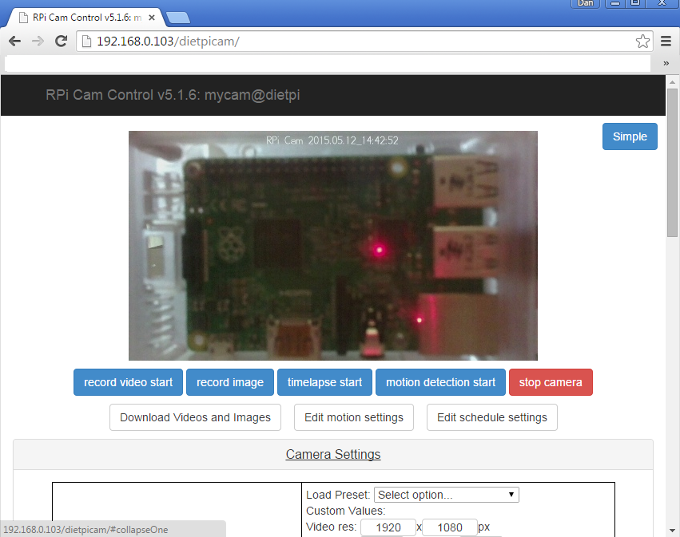
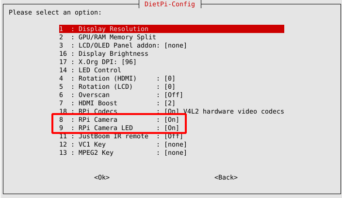
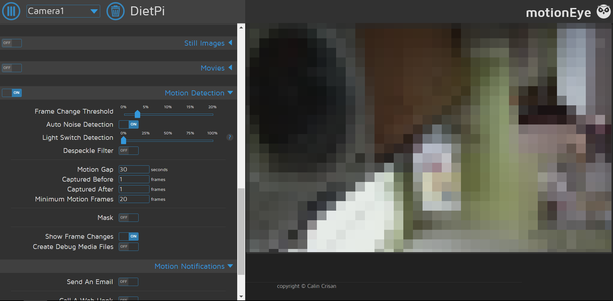

# Camera & Surveillance

## Overview

- [**RPi Cam Web Interface - Web interface & controls for your RPi camera**](#rpi-cam-web-interface)
- [**motionEye - Web interface & surveillance for your camera**](#motioneye)
- [**mjpg-streamer - Simple camera streaming tool with HTML plugin**](#mjpg-streamer)

??? info "How do I run **DietPi-Software** and install **optimised software** items?"
    To install any of the **DietPi optimised software items** listed below run from the command line:

    ```sh
    dietpi-software
    ```

    Choose **Browse Software** and select one or more items. Finally select `Install`.  
    DietPi will do all the necessary steps to install and start these software items.

    {: width="643" height="365" loading="lazy"}

    To see all the DietPi configurations options, review the [DietPi Tools](../../dietpi_tools/) section.

[Return to the **Optimised Software list**](../../software/)

## RPi Cam Web Interface

The *RPi Cam Web Interface* package can be used in combination with a Raspberry Pi camera module to

- take an image
- record a video
- observe based on motion detection
- record a video with time lapse

It consists of full control of the camera in a web-based interface.

{: width="500" height="395" loading="lazy"}

=== "Access the web interface"

    The web interface is accessible via:

    - URL = `http://<your.IP>/rpicam`

=== "Access recordings (w/o web interface)"

    To access you recordings remotely without the web interface, you might want to have one of [DietPi's file servers](../file_servers/) installed.  
    Directories used by motionEye:

    - Media directory = `/mnt/dietpi_userdata/rpicam`
    - Accessed from file server = `/rpicam`

=== "Update to latest version"

    RPi Cam Web Interface can be updated to the latest version by reinstalling it via

    ```sh
    dietpi-software reinstall 59
    ```

=== "RPi camera module"

    The RPi camera module is automatically enabled during the installation process. However, It requires a reboot and/or sometimes a power cycle to take effect.  
    The camera activation may be checked via `dietpi-config` > `Display Options` > `RPi Camera` to show `[On]`. Additionally, the behaviour of the cameras LED can be set in the same dialog via `RPi Camera LED`.

    Remark: After changing the camera activation you need to reboot and/or sometimes power cycle the SBC incl. camera.

    {: width="500" height="290" loading="lazy"}

***

Github page: <https://github.com/silvanmelchior/RPi_Cam_Web_Interface>  
Wiki: <https://elinux.org/RPi-Cam-Web-Interface>  
License: [MIT](https://github.com/silvanmelchior/RPi_Cam_Web_Interface/blob/master/LICENSE.txt)

## motionEye

The *motionEye* package offers surveillance for your camera.  
It is mainly focused towards motion detection usage. It contains a web interface.

The software can

- take an image
- record a video
- observe based on motion detection
- record a video with time lapse

from any RPi camera, USB camera or an IP camera network stream.

{: width="500" height="246" loading="lazy"}

=== "Access the web interface"

    The web interface is accessible via port **8765**:

    - URL = `http://<your.IP>:8765`
    - User = `admin`
    - Password = not required

    Passwords can be configured in the web interface.

=== "Access recordings (w/o web interface)"

    To access you recordings remotely without the web interface, you might want to have one of [DietPi's file servers](../file_servers/) installed.  
    Directories used by motionEye:

    - Media directory = `/mnt/dietpi_userdata/motioneye`
    - Accessed from file server = `/motioneye`

=== "Update to latest version"

    motionEye can be updated to the latest version via

    ```sh
    sudo pip2 install -U motioneye
    ```

=== "RPi camera module"

    If you have an official Raspberry Pi camera module, it can be enabled via `dietpi-config` > `Display Options` > `RPi Camera` to show `[On]`.  
    Additionally, the behaviour of the cameras LED can be set in the same dialog via `RPi Camera LED`.

    Remark: After changing the camera activation you need to reboot and/or sometimes power cycle the SBC incl. camera.

    {: width="500" height="290" loading="lazy"}

***

Github page: <https://github.com/ccrisan/motioneye>  
Wiki: <https://github.com/ccrisan/motioneye/wiki>  
Tutorial: [motionEye on DietPi on Raspberry Pi: keeping an eye on things](https://mansfield-devine.com/speculatrix/2018/12/motioneye-on-dietpi-on-raspberry-pi/)  
YouTube video tutorial (German language): [DietPi & motionEye - Vollautomatische Installation inkl. Wlan Konfiguration, Updates und Anwendung](https://www.youtube.com/watch?v=vQxL3TfQK5E){:class="nospellcheck"}  
License: [GPLv3](https://github.com/ccrisan/motioneye/blob/dev/LICENSE)

## mjpg-streamer

Stream JPEG frames from various sources to various possible outputs. With the default setup it streams an attached camera image to a simple web page with the included HTTP plugin.

{: width="500" height="400" loading="lazy"}

=== "Access the HTTP stream"

    The web interface uses port **8082**:

    - Stream: `http://<your.IP>:8082/?action=stream`
    - Snapshot: `http://<your.IP>:8082/?action=snapshot`
    - HTTP plugin docs: <https://github.com/jacksonliam/mjpg-streamer/blob/master/mjpg-streamer-experimental/plugins/output_http/README.md>

=== "Setup for OctoPrint"

    When [OctoPrint](../printing/#octprint) is installed, it will be automatically configured to use the mjpg-streamer HTTP stream and snapshots, as this is the major use case this software title was requested for. You can review and test the setup from within the OctoPrint web interface settings.

=== "HTML authentication"

    By default, the HTTP stream is accessible on port **8082** without any authentication. This is required when you embed it into [OctoPrint](../printing/#octprint), since the browser sends the request and cannot pass credentials currently. If you however use the stream otherwise, especially when you expose it to the world-wide-web, we recommend to setup a password. For this:

    1. Run `dietpi-services`
    2. Select `mjpg-streamer`
    3. Select `Edit` to open a service override config with the `nano` command line editor.
    4. In the `[Service]` section, uncomment the `ExecStart=` line and add ` -c username:password` to the last single quote `'` block, with username and password of your choice.
    5. Above that line you need to add another `ExecStart=` without any content, which is to remove the original start command, so that yours is effectively replacing it. The file may finally look like this:

        ```systemd
        [Unit]
        #Description=mjpg-streamer (DietPi)
        #Documentation=https://github.com/jacksonliam/mjpg-streamer/tree/master/mjpg-streamer-experimental
        #Wants=network-online.target
        #After=network-online.target dietpi-boot.service

        [Service]
        #User=mjpg-streamer
        #WorkingDirectory=/opt/mjpg-streamer
        ExecStart=
        ExecStart=/opt/mjpg-streamer/mjpg_streamer -i 'input_uvc.so -d /dev/video0' -o 'output_http.so -p 8082 -n -c micha:youNeverGuessThis!'

        # Hardening
        #ProtectSystem=strict
        #PrivateTmp=true
        #ProtectHome=true
        #ProtectKernelTunables=true
        #ProtectControlGroups=true

        [Install]
        #WantedBy=multi-user.target
        ```

    6. Press ++ctrl+o++ to save the file and ++ctrl+x++ to exit the editor. When exiting `dietpi-services`, the service is automatically reloaded to be password-protected from now on.

=== "Update to latest version"

    mjpg-streamer can be updated to the latest version by reinstalling it via

    ```sh
    dietpi-software reinstall 137
    ```

=== "Logging"

    You can view the service logs via

    ```sh
    journalctl -u mjpg-streamer
    ```

    and the service status via

    ```sh
    systemctl status mjpg-streamer
    ```

=== "RPi camera module"

    If you have an official Raspberry Pi camera module, it can be enabled via `dietpi-config` > `Display Options` > `RPi Camera` to show `[On]`.  
    Additionally, the behaviour of the cameras LED can be set in the same dialog via `RPi Camera LED`.

    Remark: After changing the camera activation you need to reboot and/or sometimes power cycle the SBC incl. camera.

    {: width="500" height="290" loading="lazy"}

***

Github page: <https://github.com/jacksonliam/mjpg-streamer>  
Plugin docs: <https://github.com/jacksonliam/mjpg-streamer/tree/master/mjpg-streamer-experimental>  
License: [GPLv2](https://github.com/jacksonliam/mjpg-streamer#license)

[Return to the **Optimised Software list**](../../software/)
