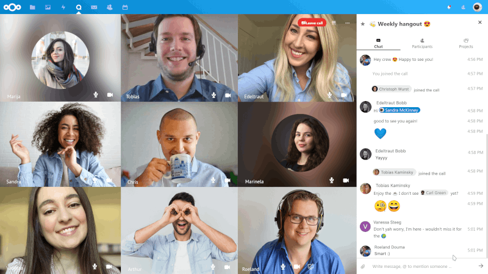
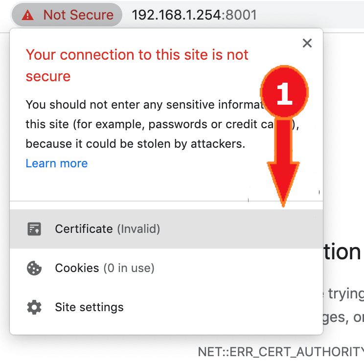
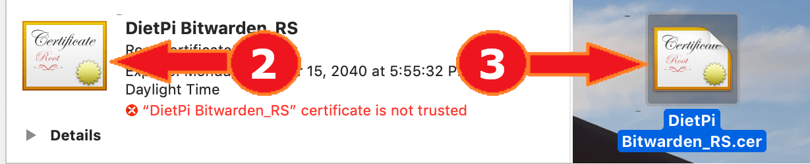
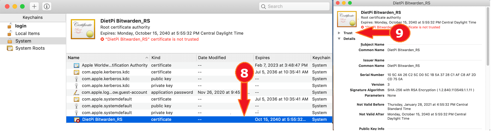
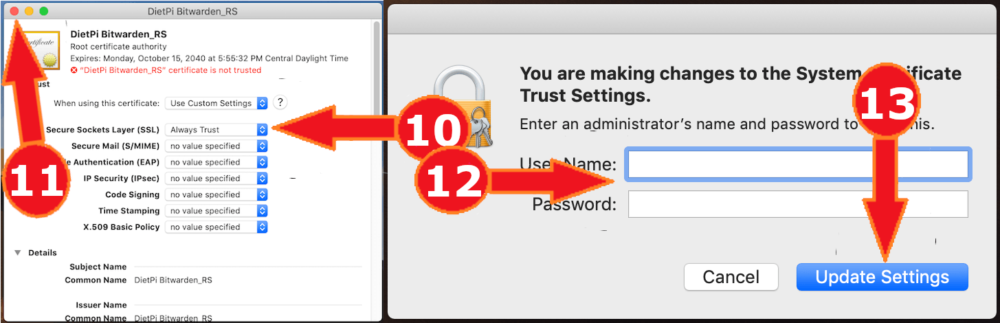

# Cloud & Backup systems

## Overview

- [**ownCloud - Your own personal cloud based backup/data storage system**](#owncloud)
- [**Nextcloud - Self-hosted productivity platform**](#nextcloud)
- [**Nextcloud Talk - Video calls via Nextcloud, including TURN server**](#nextcloud-talk)
- [**Pydio - Feature-rich backup and sync server with web interface**](#pydio)
- [**UrBackup Server - Full backups for systems on your network**](#urbackup)
- [**Gogs - GitHub style server, with web interface**](#gogs)
- [**Gitea - GitHub style server, with web interface**](#gitea)
- [**Syncthing - Backup and sync server with web interface**](#syncthing)
- [**MinIO - S3 compatible distributed object server**](#minio)
- [**Firefox Sync Server - Sync bookmarks, tabs, history and passwords**](#firefox-sync-server)
- [**vaultwarden - Unofficial Bitwarden password manager server written in Rust**](#vaultwarden)
- [**FuguHub - Your Own Personal Cloud Server**](#fuguhub)
- [**File Browser - Light web based file manager with sharing features**](#file-browser)
- [**Rclone - Utility to sync your files to cloud storages**](#rclone)

??? info "How do I run **DietPi-Software** and install **optimised software** items?"
    To install any of the **DietPi optimised software items** listed below run from the command line:

    ```sh
    dietpi-software
    ```

    Choose **Browse Software** and select one or more items. Finally select `Install`.  
    DietPi will do all the necessary steps to install and start these software items.

    {: width="643" height="365" loading="lazy"}

    To see all the DietPi configurations options, review the [DietPi Tools](../../dietpi_tools/) section.

[Return to the **Optimised Software list**](../../software/)

## ownCloud

The ownCloud package turns your DietPi system into your very own personal cloud based backup/data storage system (e.g.: Dropbox).

Also Installs:

- Webserver
- USB dedicated hard drive highly recommended

{: width="400" height="218" loading="lazy"}

=== "Quick start"

    ownCloud is accessible via regular HTTP/HTTPS TCP ports **80**/**443** below the `/owncloud` path:

    - URL: `http://<your.IP>/owncloud`
    - Username: `admin` (or the one you set in `dietpi.txt`)
    - Password: `<your global password>` (default: `dietpi`)

=== "Configuration"

    You can configure ownCloud via CLI from command line. To simplify this, DietPi has added a shortcut to the otherwise necessary `sudo -u www-data php /var/www/owncloud/occ`.  
    Simply run `occ` from your console:

    ```sh
    occ list
    ```

    More details about available commands can be found in the [ownCloud admin manual](https://doc.owncloud.com/server/next/admin_manual/configuration/server/occ_command.html#core-commands).

=== "Update"

    1. Option: Use the web-based updater from within the ownCloud web UI settings.
    2. Option: Use the updater script from console (recommended):

        ```sh
        sudo -u www-data php /var/www/owncloud/updater/application.php
        1
        ```

    3. Follow the official documentation for a manual upgrade process: <https://doc.owncloud.com/server/next/admin_manual/maintenance/upgrading/manual_upgrade.html>

=== "FAQ"

    **Where is my data stored?**

    `/mnt/dietpi_userdata/owncloud_data` (or `dietpi.txt` choice)

    **Why am I limited to 2 GiB file size uploads?**

    DietPi will automatically apply the max supported upload size to the PHP and ownCloud configs.

    - 32-bit systems can handle 2 GiB
    - 64-bit systems can handle 8796 PiB, yep, in petabyte
    - `echo -e "$(( $(php -r 'print(PHP_INT_MAX);') / 1024 / 1024)) MiB"`

    **Will my data be saved after deinstallation?**

    Your userdata directory will stay after deinstallation.  
    As well a database backup will be saved to your userdata directory. Thus you can easily restore your instance by reinstalling ownCloud and restore the database dump.

***

Official website: <https://owncloud.com/>  
Official documentation: <https://doc.owncloud.com/server/next/admin_manual/>

## Nextcloud

Nextcloud gives you access to all your files wherever you are. Store your documents, calendar, contacts and photos on a server at home, at one of our providers or in a data center you trust.

{: width="2048" height="1280" loading="lazy"}

=== "Quick start"

    Nextcloud is accessible via regular HTTP/HTTPS ports **80**/**443** below the `/nextcloud` path:

    - URL: `http://<your.IP>/nextcloud`
    - Username: `admin` (or the one you set in `dietpi.txt`)
    - Password: `<your global password>` (default: `dietpi`)

=== "Configuration"

    You can configure Nextcloud via CLI from command line. To simplify this, DietPi has added a shortcut to the otherwise necessary `sudo -u www-data php /var/www/nextcloud/occ`.  
    Simply run `ncc` from your console:

    ```sh
    ncc list
    ```

    More details about available commands can be found in the [Nextcloud admin manual](https://docs.nextcloud.com/server/latest/admin_manual/configuration_server/occ_command.html).

=== "Brute-force protection"

    Nextcloud offers built-in brute force protection and additionally a plugin ***Brute-force settings***.  
    This will delay your login rate in case of several failed login attempts.

    This protection can be extended with Fail2Ban (see following tab).

    See also:

    - <https://apps.nextcloud.com/apps/bruteforcesettings>
    - <https://docs.nextcloud.com/server/latest/admin_manual/configuration_server/bruteforce_configuration.html>

=== "Fail2Ban integration"

    Using Fail2Ban your can block users after failed login attempts. This hardens your system, e.g. against brute force attacks.

    - Set options in the ***Nextcloud configuration file*** (typical `/var/www/nextcloud/config/config.php`):

        - Add trusted domains if not already set via the `'trusted_domains'` entry.

            ```ini
            'trusted_domains' =>
             array (
               0 => 'localhost',
               1 => '<your_trusted_domain>',
             ),
            ```

            The entry of the trusted domains is important, because one of the Fail2Ban regular expressions in the Fail2Ban filter file ("Trusted domain error", see below) deals with trusted domain login errors. By default, if you login via a non trusted domain, Nextcloud will show an error login dialog.  

            !!! attention
              Take care, if you use this "Trusted domain error" `failregex` option and you then reload the page several times (more often than `maxretry` value in the Fail2Ban jail file) you lockout yourself also for logging in via a trusted domain from the IP address you are using.

        - log file options: These are set to appropriate values by default (e.g. `log_level`, `log_type`) resp. DietPi defaults (`logfile` via `SOFTWARE_NEXTCLOUD_DATADIR` within `/boot/dietpi.txt`), so that they do not need to be set as sometimes otherwise described.

    - Create new ***Fail2Ban filter*** (e.g. `/etc/fail2ban/filter.d/nextcloud.conf`):

        ```ini
        # Fail2Ban filter for Nextcloud

        [Definition]
        _groupsre = (?:(?:,?\s*"\w+":(?:"[^"]+"|\w+))*)
        failregex = ^\{%(_groupsre)s,?\s*"remoteAddr":"<HOST>"%(_groupsre)s,?\s*"message":"Login failed:
                    ^\{%(_groupsre)s,?\s*"remoteAddr":"<HOST>"%(_groupsre)s,?\s*"message":"Trusted domain error.
        datepattern = ,?\s*"time"\s*:\s*"%%Y-%%m-%%d[T ]%%H:%%M:%%S(%%z)?"
        ```

    - Create new ***Fail2Ban jail file*** `/etc/fail2ban/jail.d/nextcloud.local`:

        ```ini
        [nextcloud]
        backend = auto
        enabled = true
        port = http,https
        protocol = tcp
        filter = nextcloud
        maxretry = 5
        bantime = 600
        logpath = /mnt/dietpi_userdata/nextcloud_data/nextcloud.log
        ```

        Check whether the `logpath` is identical to the value in the Nextcloud configuration file (`config.php`see above).

        As not specified here, Fail2Ban uses properties like `maxretry`, `bantime`, etc. from `/etc/fail2ban/jail.conf` or `/etc/fail2ban/jail.local` (if present). Note the setting `backend = auto`. By default, `backend` is set to `systemd` in `/etc/fail2ban/jail.conf`. As a result, Fail2Ban ignores the `logpath` entry here in the jail `nextcloud.conf`, with the consequence, that Fail2Ban does not recognize an attack on Nextcloud (port 80, 443) even though attacks are listed in `/mnt/dietpi_userdata/nextcloud_data/nextcloud.log`.

    - Restart Fail2Ban: `systemctl restart fail2ban`.
    - Test your settings by trying to sign in multiple times from a remote PC with a wrong user or password. After `maxretry` attempts your IP must be banned for `bantime` seconds (DietPi does not respond anymore) as the default action by Fail2Ban is `route`, specified in `/etc/fail2ban/action.d/route.conf`.
    - Check the current status on your DietPi with `fail2ban-client status nextcloud`.
    - See also:
        - [Fail2Ban](../system_security/#fail2ban-protects-your-system-from-brute-force-attacks)
        - <https://help.nextcloud.com/t/repeated-login-attempts-from-china/6510/11?u=michaing>
        - <https://www.c-rieger.de/nextcloud-installationsanleitung/#c06>

=== "Update"

    1. Option: Use the web-based updater from within the Nextcloud web UI settings.
    2. Option: Use the updater script from console (recommended):

        ```sh
        phpenmod phar # The PHP Phar module is required
        sudo -u www-data php /var/www/nextcloud/updater/updater.phar
        y # Starts download and install of files
        y # Starts the internal database upgrade and migration steps
        N # Do not keep maintenance mode active
        ```

    3. Follow the official documentation for a manual upgrade process: <https://docs.nextcloud.com/server/latest/admin_manual/maintenance/manual_upgrade.html>

=== "FAQ"

    **Where is my data stored?**

    `/mnt/dietpi_userdata/nextcloud_data` (or `dietpi.txt` choice)

    **Why am I limited to 2 GiB file size uploads?**

    DietPi will automatically apply the max supported upload size to the PHP and Nextcloud configs.

    - 32-bit systems can handle 2 GiB
    - 64-bit systems can handle 8796 PiB, yep, in petabyte
    - `echo -e "$(( $(php -r 'print(PHP_INT_MAX);') / 1024 / 1024)) MiB"`

    **Will my data be saved after deinstallation?**

    Your user data directory will stay after deinstallation. As well a database backup will be saved to your user data directory. Thus you can easily restore your instance by reinstalling Nextcloud and restore the database dump.

    **How can I check my OPcache status?**

    PHP uses a so called *OPcache* to store PHP scripts in optimised *opcode* format in RAM, which speeds up browser access as the raw PHP scripts do not need to be read from disk and parsed first.  
    The Nextcloud admin panel includes a check for sufficient OPcache settings and in case shows a recommendation for settings to apply. If such appears, we recommend to apply them with an own configuration file, e.g.:

    ```sh
    echo -e '; Custom Nextcloud OPcache settings\n; priority=99\nopcache.memory_consumption=128' > /etc/php/7.4/mods-available/custom.ini
    phpenmod custom
    ```

    You can watch the actual usage with the pre-installed [opcache-gui](https://github.com/amnuts/opcache-gui){:class="nospellcheck"} by @amnuts.

    - URL: `http://<your.IP>/opcache.php`

    {: width="700" height="976" loading="lazy"}

    The dialog shows the cache status as well as the settings.

    **What shall I do about missing `bcmath`, `gmp` and `imagick` PHP modules?**

    After a fresh install via `dietpi-software`, the Nextcloud admin panel shows warnings about three missing modules. We propose to ignore them: `imagick` is not needed at all and a subject of discussion about security issues, `bcmath` and `gmp` are required only if you want to use the WebAuthn passwordless authentication with Nextcloud.  
    If you must mute those warnings, you can install the modules manually:

    ```sh
    sudo apt install php-bcmath php-gmp php-imagick libmagickcore-6.q16-6-extra
    ```

    The `imagick` related warning can be solved alternatively by disabling the `Theming` app (in the Nextcloud apps settings), if no manual theming is done to the Nextcloud instance anyway.

***

Website: <https://nextcloud.com/>  
Official documentation: <https://docs.nextcloud.com/server/latest/admin_manual/contents.html>  
YouTube video tutorial #1: [DietPi Nextcloud Setup on Raspberry Pi 3 B Plus](https://www.youtube.com/watch?v=Q3R2RqFSyE4)  
YouTube video tutorial #2: [DietPi Docker Nextcloud External Storage Setup with SAMBA SERVER on RPI3B](https://www.youtube.com/watch?v=NOb12BuNpZ8)

## Nextcloud Talk

Host video calls on your own Nextcloud instance. The TURN server ***Coturn*** will be installed and configured as well to allow reliable video calls through outside the local network, NAT and firewall setups.

Also installs:

- [**Nextcloud**](#nextcloud)
- **Coturn**

{: width="2560" height="1440" loading="lazy"}

=== "Installation notes"

    For video call throughout your local network, a so called [TURN server](https://en.wikipedia.org/wiki/Traversal_Using_Relays_around_NAT) is required. *Coturn* is a common implementation and hence installed by default together with our Nextcloud Talk option.

    During installation you will be asked to enter your server's external domain and a port, that you want to use for the Coturn TURN server. Note that you need to forward the chosen port and/or open it in your firewall.

    Coturn will be configured with authentication via shared secret and some additional security measures. For details, see this HowTo: <https://help.nextcloud.com/t/howto-setup-nextcloud-talk-with-turn-server/30794>

***

Website: <https://nextcloud.com/talk/>  
Source code: <https://github.com/nextcloud/spreed>  
Coturn source code: <https://github.com/coturn/coturn>

## Pydio

Pydio is a feature-rich backup and sync server with web interface. Similar to ownCloud with vast configuration options to meet your "cloud" needs.

Also Installs:

- Webserver

{: width="400" height="243" loading="lazy"}

=== "Access to the web interface"

    URL = `http://<your.IP>/pydio`

=== "First time connect"

    - Ignore the warnings and click the button titled `CLICK HERE TO CONTINUE TO PYDIO`.  
      Remark: If you require SSL access, please use LetsEncrypt to set this up.
    - The wizard can now be started, click the `start wizard >` button to begin.
    - Enter and create a new admin account for use with Pydio. Then click the `>>` button.
    - Under database details, enter the following:
        - Database type = `MySQL`
        - Host = `localhost`
        - Database = `pydio`
        - User = `pydio`
        - Password = `<your global password>` (default: `dietpi`)
        - Use MySqli = No
    - Click test connection, when successful, click the `>>` button.
    - Under advanced options, use the default values, then click the `Install Pydio` button.

=== "Setup sync client on remote systems"

    Once the server has been configured (as per above):

    - Download the sync client for your system: <https://pydio.com/en/get-pydio/downloads/pydiosync-desktop-app>
    - When configuring the remote server, use the following:
        - Select HTTP option (unless you have setup an SSL cert)
        - URL = `http://<your.IP>/pydio` (replace IP with your system IP)
        - User = The "admin" user you setup in initial setup.
        - Password = The "admin" password you setup in initial setup.

***

Website: <https://pydio.com>

## UrBackup

UrBackup Server is an Open Source client/server backup system, that through a combination of image and file backups accomplishes both data safety and a fast restoration time.  
Basically, it allows you to create a complete system backup, using a simple web interface, for systems on your network.

{: width="400" height="103" loading="lazy"}

=== "Access to the web interface"

    The web interface is accessible via port **55414**:

    URL = `http://<your.IP>:55414`  
    Remark: Change the IP address for your system.

=== "Backup storage location"

    The location of the backups can be changed in the web interface:

    - Select `Settings`.
    - Change the Backup Storage Path: `/mnt/dietpi_userdata/urbackup` is recommended.
    - Click `Save`.
    - Restart service with `systemctl restart urbackupsrv`.

=== "Download the client"

    Install the appropriate client on the systems you wish to backup from <https://www.urbackup.org/download.html#client_windows>.

***
Website: <https://www.urbackup.org/index.html>

## Gogs

Your very own GitHub style server, with web interface.

{: width="400" height="175" loading="lazy"}

=== "Access to the web interface"

    The web interface is accessible via port **3000**:

    - URL: `http://<your.IP>:3000`

=== "First run setup"

    Has to be done once, when connected to the web interface:

    - Change the following values only:
        - Database Type: `MySQL`
        - Host: `/run/mysqld/mysqld.sock`
        - Password: `<your global password>` (default: `dietpi`)
        - Repository Root Path: `/mnt/dietpi_userdata/gogs-repo`
        - Run User: `gogs`
        - Domain: `<your.domain/IP>`
        - Application URL: `http://<your.domain/IP>:3000/`
        - Log Path: `/var/log/gogs`
    - Scroll to the bottom of page and select "Install Gogs".
    - Depending on whether the application URL above was entered correctly/is accessible by the connected browser, you may need to reconnect to the web page using the IP address, e.g.: `http://<your.IP>:3000`
    - Once the page has reloaded, you will need to click `Register` to create the admin account.

=== "External access"

    If you wish to allow external access to your Gogs server, you will need to setup port forwarding on your router, pointing to the IP address of your DietPi device.

    - Port: 3000
    - Protocol: TCP+UDP

    If an external access is used, HTTPS is strongly recommended to increase your system security. You can get a free certificate e.g. via [dietpi-letsencrypt](../../dietpi_tools/#dietpi-letsencrypt){:class="nospellcheck"}.

=== "View logs"

    Initial service logs can be viewed via:

    ```sh
    journalctl -u gogs
    ```

    Daemon logs can be found in the following directory:

    ```
    /var/log/gogs
    ```

=== "Update to latest version"

    You can easily update Gogs by reinstalling it. Your settings and data are preserved by this:

    ```sh
    dietpi-software reinstall 49
    ```

***

Official website: <https://gogs.io/>  
Official documentation: <https://gogs.io/docs>  
Source code: <https://github.com/gogs/gogs>  
License: [MIT](https://github.com/gogs/gogs/blob/main/LICENSE)

## Gitea

Your very own GitHub style server, with web interface.

{: width="320" height="200" loading="lazy"}

=== "Access to the web interface"

    The web interface is accessible via port **3000**:

    - URL: `http://<your.IP>:3000`

=== "First run setup"

    Has to be done once, when connected to the web interface:

    - Change the following values only:
        - Host: `/run/mysqld/mysqld.sock`
        - Password: `<your global password>` (default: `dietpi`)
        - Server Domain: `<your.domain/IP>`
        - Gitea Base URL: `http://<your.domain/IP>:3000/`
        - Log Path: `/var/log/gitea` (However, file logging is disabled by default.)
    - Scroll to the bottom of page and select "Install Gitea".
    - Depending on whether the base URL above was entered correctly/is accessible by the connected browser, you may need to reconnect to the web page using the IP address, e.g.: `http://<your.IP>:3000`
    - Once the page has reloaded, you will need to click `Register` to create the admin account.

=== "External access"

    If you wish to allow external access to your Gitea server, you will need to setup port forwarding on your router, pointing to the IP address of your DietPi device.

    - Port: 3000
    - Protocol: TCP+UDP

    If an external access is used, HTTPS is strongly recommended to increase your system security. You can get a free certificate e.g. via [dietpi-letsencrypt](../../dietpi_tools/#dietpi-letsencrypt){:class="nospellcheck"}.

=== "Fail2Ban integration"

    Using Fail2Ban your can block IP addresses after failed login attempts. This hardens your system against e.g. brute-force attacks.

    === "When using journal logging (default)"

        By default Gitea logs to the systemd journal (see "View logs" tab), in which case Fail2Ban protection can be enabled with the following steps:

        Create a new filter `/etc/fail2ban/filter.d/gitea.conf`:

        ```ini
        [Definition]
        journalmatch = _SYSTEMD_UNIT=gitea.service
        failregex = Failed authentication attempt for \x1b\[1m.+\x1b\[0m from \x1b\[1m<HOST>:\d+\x1b\[0m:
        ```

        Create a new jail `/etc/fail2ban/jail.d/gitea.conf`:

        ```ini
        [gitea]
        enabled = true
        backend = systemd
        ```

    === "When using file logging"

        When file logging is enabled (see "View logs" tab), Fail2Ban protection can be enabled with the following steps:

        Create a new filter `/etc/fail2ban/filter.d/gitea.conf`:

        ```ini
        [Definition]
        failregex = Failed authentication attempt for .+ from <HOST>:\d+:
        ```

        Create a new jail `/etc/fail2ban/jail.d/gitea.conf`:

        ```ini
        [gitea]
        enabled = true
        backend = auto
        logpath = /var/log/gitea/gitea.log
        ```

    You can specify other properties like `maxretry` or `bantime` to overwrite the defaults in `/etc/fail2ban/jail.conf` or `/etc/fail2ban/jail.local` if present. When done:

    - Restart Fail2Ban: `systemctl restart fail2ban`
    - Try to login to the Gitea web interface with a wrong password.
    - Check whether the failed login has been detected: `fail2ban-client status gitea`
    - When you further try to login `maxretry` times, your IP should be banned for `bantime` seconds, so that neither the Gitea web interface, nor SSH or any other network application will respond to requests from your client. When Fail2Ban was installed via `dietpi-software`, by default `route`/`blackhole` blocking is used, so that `ip r` on the server should show a `blackhole` route for your client's IP.
    - See also:
        - [Fail2Ban](../system_security/#fail2ban)
        - <https://docs.gitea.io/en-us/fail2ban-setup/>

=== "View logs"

    By default, logs can be viewed with the following command:

    ```sh
    journalctl -u gitea
    ```

    File logging to `/var/log/gitea/gitea.log` can be enabled by editing `/mnt/dietpi_userdata/gitea/custom/conf/app.ini` and changing `MODE = console` in the `[log]` section to `MODE = file`.

=== "Update to latest version"

    You can easily update Gitea by reinstalling it. Your settings and data are preserved by this:

    ```sh
    dietpi-software reinstall 165
    ```

***

Official website: <https://gitea.io/>  
Official documentation: <https://docs.gitea.io/>  
Official forum: <https://discourse.gitea.io/>  
Source code: <https://github.com/go-gitea/gitea>  
License: [MIT](https://github.com/go-gitea/gitea/blob/main/LICENSE)

## Syncthing

Backup and sync server with web interface. Extremely lightweight and efficient as no webserver is required.

{: width="400" height="195" loading="lazy"}

=== "Access to the web interface"

    The web interface is accessible via port **8384**:

    URL = `http://<your.IP>:8384`

=== "First run setup"

    Has to be done once, when connected to the web interface.

    - When the `Danger! Please set a GUI Authentication User and Password in the Settings dialog.` box appears, click the `settings` button inside the box.
    - Under `GUI Authentication User` and `GUI Authentication Password`: Enter new login details you would like to use for access to the web interface. Then click `save`.

    DietPi will automatically setup your default folder share to `/mnt/dietpi_userdata`.

=== "Setup a second system to sync with"

    In this example we will use a Windows system. The goal is to "sync" the user data from your DietPi device with another system.

    - Download, extract and run the Windows application `syncthing.exe`: <https://syncthing.net/downloads/>.
    - Syncthing web interface will load automatically, if not, you can access it via `http://127.0.0.1:8384/`.
        - Click `Actions` at the top right, then select `Show ID`. Copy the UUID code.
    - On the DietPi device, open the web interface and click `Add remote device` (bottom right).
        - Under `Device ID`, paste in the UUID we copied earlier.
        - Under `Device name`, enter any name. e.g.: *My Windows PC*.
        - Under `Share Folders With Device` tick/select DietPi user data, then click `save`.
    - After a few seconds, go back to the Windows web interface `http://127.0.0.1:8384/`. You should receive a message asking you to confirm the new device, click `Add Device`.
        - Under `Share Folders With Device` tick/select DietPi user data, then click `save`.

    You devices should now duplicate the user data from your DietPi device to your Windows PC.

***

Website: <https://syncthing.net>

## MinIO

It is an open source Kubernetes Native, High Performance Object Storage (S3 Compatible). It helps building cloud-native data infrastructure for machine learning, analytics and application data workloads.

{: width="417" height="443" loading="lazy"}

=== "Quick start"

    The web interface is accessible via port **9000**:

    - URL: `http://<your.IP>:9000`
    - Username: `minioadmin`
    - Password: `minioadmin`
    - [MinIO Server Quick Start Guide](https://docs.min.io/docs/minio-quickstart-guide.html)
    - [Python Client Quick Start Guide - MinIO](https://docs.min.io/docs/python-client-quickstart-guide.html)
    - [JavaScript Client Quick Start Guide - MinIO](https://docs.min.io/docs/javascript-client-quickstart-guide.html)

***

Website: <https://min.io/product/overview>  
Official documentation: <https://docs.min.io/>

## Firefox Sync Server

This is Mozilla's Firefox Sync Server which manages syncing Firefox instance bookmarks, history, tabs and passwords across devices. Out of the box it runs on a Python server for small loads and can be configured to run behind Nginx or Apache.

{: width="300" height="95" loading="lazy"}

=== "Configure Firefox"

    - Open `about:config` to access advanced settings.
    - Search for: `identity.sync.tokenserver.uri`.
    - Set value to: `http://<your.IP>:5002/token/1.0/sync/1.5`.
        - We recommend to access your Firefox Sync Server only from local network or via VPN, keeping the default listening port **5002** closed for access from outside of your LAN.
        - If you need to access it remotely without VPN, adjust the `public_url` setting inside the config file `/mnt/dietpi_userdata/firefox-sync/syncserver.ini` to contain your public IP or domain and desired port.

=== "Directories"

    - Install directory: `/opt/firefox-sync`
    - Data directory: `/mnt/dietpi_userdata/firefox-sync`
    - Config file: `/mnt/dietpi_userdata/firefox-sync/syncserver.ini`

=== "View logs"

    View the logs by executing:

     ```sh
     journalctl -u firefox-sync
     ```

=== "Update to latest version"

    You can easily update the Firefox Sync Server by reinstalling it. Your settings and data are preserved by this:

    ```sh
    dietpi-software reinstall 177
    ```

***

Official documentation: <https://mozilla-services.readthedocs.io/en/latest/howtos/run-sync-1.5.html>  
Source code: <https://github.com/mozilla-services/syncserver>  
License: [MPL2.0](https://github.com/mozilla-services/syncserver/blob/master/LICENSE)

Credits: This software title has been added to DietPi-Software by [CedArctic](https://github.com/CedArctic), many thanks! :D

## vaultwarden

vaultwarden is an unofficial Bitwarden password manager server with web interface, written in Rust.

{: width="600" height="247" loading="lazy"}

=== "First access"

    - During install, a self-signed 4096-bit RSA TLS certificate is created to allow encrypted HTTPS access, which is required for access with most Bitwarden clients and reasonable as of the sensitivity of the data a password manager handles.
    - Most web browsers will warn you on access that the certificate is not trusted, although usually you can choose to ignore that and still access the web vault.
    - Most Bitwarden clients on the other hand will deny to access your server, as long as the certificate is not trusted.
    - As far as you have a public domain name for your DietPi server, we recommend to request an official trusted CA certificate, e.g. via `dietpi-letsencrypt` and setup either a reverse proxy, or configure vaultwarden to use the retrieved key and certificate directly via ROCKET_TLS setting in the config file (see "Directories" tab).

    ??? info "How do I add a self-signed certificate to the OS' Trusted Root Certification Authorities store?"

        === "Windows 10"

            1. In your browser, next to the address bar, select the warning or lock icon.
                Then select the certificate button to open Windows' Certificate view.
            2. Switch to the "Details" tab.  
                
            3. Select "Save to file".
            4. In the newly opened window, select "Continue".  
                
            5. Leave default DER coding and select "Continue".
            6. Select "Browse" to chose a target file location.  
                
            7. Choose a target file location and name, it is only required temporarily.
            8. Select "Continue".
            9. Select "Finish".  
                
            10. Double-click the created certificate file and select "Install certificate".
            11. Select "Local system".
            12. Select "Continue", which requires administrator permissions.  
                
            13. Choose "Save all certificates to the following store".
            14. Select "Browse".
            15. Select "Trusted Root Certification Authorities".
            16. Select "Ok".
            17. Select "Continue".
            18. Select "Finish".  
                

        === "macOS"

            1. In your browser (note that this cannot be done in Safari), next to the address bar, select the warning or lock icon.
                Then select the "Certificate (Invalid)" button.  
                {: width="250px"}
            2. Drag the certificate icon to your desktop, it is only required temporarily.
            3. Double-click on the certificate file.  
                
            4. On the "Keychain" dropdown, select "System".
            5. Select "Add".
            6. Enter an administrator username and password.
            7. Select "Modify Keychain".  
                
            8. Double-click on the certificate in the list.
            9. Select "Trust".  
                
            10. On the "Secure Sockets Layer (SSL)" dropdown, select "Always Trust".
            11. Click the red button in the top left corner of the window.
            12. Enter an administrator username and password.
            13. Select "Update Settings".  
                

=== "Web access"

    The web interface is accessible via port **8001**:

    - URL = `https://<your.IP>:8001`
    - On first access, you need to create an account, either via web UI or via client (see "Client access" tab).

=== "Client access"

    Any official Bitwarden client will work: <https://bitwarden.com/download>

    1. Select the settings cog at the top left of the window.
    2. Add `https://<your.IP>:8001` into the custom server field.
    3. Create a new account, which will be created on your own server only.

=== "Directories"

    - Install directory: `/opt/vaultwarden`
    - Data directory: `/mnt/dietpi_userdata/vaultwarden`
    - Config file: `/mnt/dietpi_userdata/vaultwarden/vaultwarden.env`

=== "View logs"

    ```sh
    journalctl -u vaultwarden
    ```

=== "Update to latest version"

    ```sh
    dietpi-software reinstall 183
    ```

***

Official documentation: <https://github.com/dani-garcia/vaultwarden/wiki>  
Forum: <https://vaultwarden.discourse.group>  
Source code: <https://github.com/dani-garcia/vaultwarden>  
Open-source license: [GPLv3](https://github.com/dani-garcia/vaultwarden/blob/master/LICENSE.txt)

Credits: This software title has been added to DietPi-Software by @CactiChameleon9. Thank you!

## FuguHub

FuguHub transforms your DietPi device into a secure online storage system, letting you access and share files from any connected computer or device.

{: width="149" height="140" loading="lazy"}

=== "Web interface"

    The web interface is accessible via regular HTTP and HTTPS ports **80** and **443**:

    - URL: `http://<your.IP>` or `https://<your.IP>` (When using HTTPS, you may ignore the browser warning because of the self-signed certificate which is used by default.)
    - Username: `dietpi`
    - Password: `<your global password>` (default: `dietpi`)

    !!! warning "The fact that FuguHub runs on ports 80 and 443 by default makes it incompatible with regular web servers when using the default setup."

    {: width="1920" height="1088" loading="lazy"}

=== "Setup details"

    - Install directory: `/home/bd`
    - Config file: `/home/bd/bdd.conf`
    - File server directory: `/mnt/dietpi_userdata/fuguhub-data`

=== "Logs"

    - Service: `journalctl -u bdd`
    - Trace: `/home/bd/trace/`  
      It contains an info about the database creation only, even after playing around with the web UI a bit.

=== "Update"

    To update FuguHub, simply reinstall it:

    ```sh
    dietpi-software reinstall 161
    ```

    All your settings and data will be preserved.

***

Official website: <https://fuguhub.com/>

## File Browser

Access and manage your data from anywhere via browser with this lightweight remote file manager. Other than ownCloud and Nextcloud, it accesses the raw data on your filesystem, based on a chosen root directory, which makes it similar to Syncthing. You can setup multiple users with their own root directory and also sharing files and directories via password-protected link is possible.

{: width="150" height="150" loading="lazy"}

=== "Access to the web interface"

    The web interface is accessible via port **8084**:

    - URL = `http://<your.IP>:8084`
    - Username = `dietpi`
    - Password = `<your global password>`

=== "Directories"

    - Install directory: `/opt/filebrowser`
    - Config directory: `/mnt/dietpi_userdata/filebrowser`
    - Default data directory: `/mnt`

=== "View logs"

    View the logs by executing:

     ```sh
     journalctl -u filebrowser
     ```

=== "Update to latest version"

    You can easily update File Browser by reinstalling it. Your settings and data are preserved by this:

    ```sh
    dietpi-software reinstall 198
    ```

***

Official documentation: <https://filebrowser.org/>  
Source code: <https://github.com/filebrowser/filebrowser>  
License: [Apache 2.0](https://github.com/filebrowser/filebrowser/blob/master/LICENSE)

## Rclone

Rclone is a command-line program to manage files on cloud storage. It is a feature-rich alternative to cloud vendors' web storage interfaces. Over [40 cloud storage products](https://rclone.org/#providers) support Rclone, including S3 object stores, business & consumer file storage services, as well as standard transfer protocols.

{: width="300" height="69" loading="lazy"}

=== "Quick start"

    Run `rclone config` to setup. See [Rclone config docs](https://rclone.org/docs/) for more details.

=== "Update"

    Rclone can be updated by simply reinstalling it:

    ```sh
    dietpi-software reinstall 202
    ```

***

Official documentation: <https://rclone.org/>  
Source code: <https://github.com/rclone/rclone>  
License: [MIT](https://github.com/rclone/rclone/blob/master/COPYING)

[Return to the **Optimised Software list**](../../software/)
