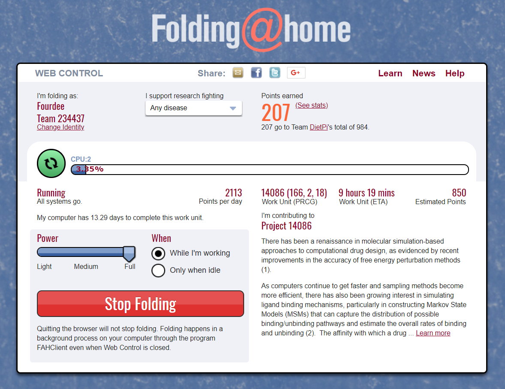

# Computational Science

## Overview

- [**Folding@Home - Use processing power to assist with disease research**](#foldinghome)  

??? info "How do I run **DietPi-Software** and install **Optimised software** ?"
    To install any of the **DietPi Optimised Software** listed below run from the command line:

    ```
    dietpi-launcher
    ```

    and selected _DietPi-Software_. or launch directly the tool:

    ```
    dietpi-software
    ```

    Choose **Software optimised** and select one or more items. Finally click on `Install`. DietPi will do all the necessary steps to install and start these software items.

    

    To see all the DietPi configurations options, review [DietPi Tools](../../dietpi_tools) section.

[Return to the **Optimised Software list**](../../dietpi_optimised_software)

## Folding@Home

[Folding@home](https://foldingathome.org/home/) is a project focused on disease research.  
The problems which are solved require so many computer calculations that help from the community is needed to find the cures!

*By default, our installation will add you to the DietPi team group, however, you can change this in the web interface at any time.*

{: style="width:550px"}

=== "Access the web interface"

    The web interface is accessible via the port 7396 on the machine running the computation, e.g. this could be:  
    URL = `http://192.168.0.100:7396`

=== "Configuration"

    The configuration is located in the file **/mnt/dietpi_userdata/fahclient/config.xml**.  
    You can change the configuration with the following steps:

    1. Stop services with `dietpi-services stop`
    2. Edit */mnt/dietpi_userdata/fahclient/config.xml*
    3. Save changes and restart services with `dietpi-services start`

=== "Logging"

    Folding@Home has a logging feature which outputs into the journal logging system. The logs can be viewed via `journalctl -u fahclient`.

=== "Influence the computational power"

    In addition to the *power slider* in the web interface the user can influence the number of jobs that run on the system.  
    The example config given below has 3 job slots, ideal for a 6 core CPU (allowing 2 CPU cores per job slot):

    ```html
    <config>
      <!-- Slot Control -->
      <power v='FULL'/>

      <!-- User Information -->
      <user v='Fourdee'/>

      <!-- Folding Slots -->
      <slot id='0' type='CPU'/>
      <slot id='1' type='CPU'/>
      <slot id='2' type='CPU'/>
    </config>
    ```
