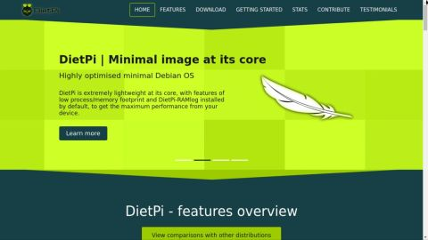

# Desktop environments & utilities

## Overview

### Desktops

- [**LXDE - Highly optimized ultra lightweight desktop**](#lxde)
- [**LXQt - Slick and optimized lightweight desktop**](#lxqt)
- [**MATE - Popular Gnome 2 desktop**](#mate)
- [**Xfce - Lightweight desktop**](#xfce)
- [**GNUstep - Alternative/unique desktop**](#gnustep)

### Desktop Utilities

- [**Chromium - Web browser**](#chromium)
- [**Firefox - Web browser**](#firefox)
- [**GIMP - Image editor**](#gimp)
- [**QuiteRSS - RSS and Atom news feeds reader**](#quiterss)
- [**Xfce Power Manager - Power manager with brightness control**](#xfce-power-manager)

??? info "How do I run **DietPi-Software** and install **optimised software** items?"
    To install any of the **DietPi optimised software items** listed below run from the command line:

    ```sh
    dietpi-software
    ```

    Choose **Browse Software** and select one or more items. Finally select `Install`.  
    DietPi will do all the necessary steps to install and start these software items.

    {: width="643" height="365" loading="lazy"}

    To see all the DietPi configurations options, review the [DietPi Tools](../dietpi_tools.md) section.

[Return to the **Optimised Software list**](../software.md)

## LXDE

LXDE is highly optimised and ultra lightweight desktop. It works well with computers on the low end of the performance spectrum such as new generation netbooks and small computers, or older resource-constrained machines.

{: width="795" height="600" loading="lazy"}

=== "Quick start"
    After installation, desktop can be run by typing

    ```sh
    startx
    ```

=== "Enable autostart"
    To start different programs when the system boots, run from the command line:

    ```sh
    dietpi-autostart
    ```

    To see all the DietPi configurations options, review [DietPi Tools](../dietpi_tools.md) section.

***

Official website: <https://www.lxde.org/>

## LXQt

Optimised lightweight desktop without the bloatware. Slick and fluid GUI, however, more resource heavy than LXDE.

{: width="1280" height="720" loading="lazy"}

Source: [LXQt](https://lxqt.github.io/screenshots/), CC BY-SA 3.0, [wikimedia](https://commons.wikimedia.org/w/index.php?curid=52420839).

=== "Quick start"
    After installation, desktop can be run by typing

    ```sh
    startx
    ```

=== "Enable autostart"
    To start different programs when the system boots, run from the command line:

    ```sh
    dietpi-autostart
    ```

    To see all the DietPi configurations options, review [DietPi Tools](../dietpi_tools.md) section.

***

Official website: <https://lxqt-project.org/>
Source code: <https://github.com/lxqt/lxqt>

## MATE

Popular Gnome2 based desktop environment.

{: width="1280" height="960" loading="lazy"}

=== "Quick start"
    After installation, desktop can be run by typing

    ```sh
    startx
    ```

=== "Enable autostart"
    To start different programs when the system boots, run from the command line:

    ```sh
    dietpi-autostart
    ```

    To see all the DietPi configurations options, review [DietPi Tools](../dietpi_tools.md) section.

***

Website: <https://mate-desktop.org>

## Xfce

{: width="800" height="450" loading="lazy"}

=== "Quick start"
    After installation, desktop can be run by typing

    ```sh
    startx
    ```

=== "Enable autostart"
    To start different programs when the system boots, run from the command line:

    ```sh
    dietpi-autostart
    ```

    To see all the DietPi configurations options, review [DietPi Tools](../dietpi_tools.md) section.

***

Website: <https://wiki.debian.org/Xfce>

## GNUstep

{: width="885" height="720" loading="lazy"}

=== "Quick start"
    After installation, desktop can be run by typing

    ```sh
    startx
    ```

=== "Enable autostart"
    To start different programs when the system boots, run from the command line:

    ```sh
    dietpi-autostart
    ```

    To see all the DietPi configurations options, review [DietPi Tools](../dietpi_tools.md) section.

***

Website: <http://gnustep.org>

## Desktop utilities

### Chromium

{: width="1376" height="858" loading="lazy"}

=== "Chromium kiosk mode"

    <h4>Overview</h4>

    The **Chromium kiosk mode** is a Chromium feature that allows your device to be used in a single-window resp. single-app kiosk mode. Generally, any access to the rest of your system is locked.  
    The mode can be used to set the web browser to these properties:

    - Full screen
    - No menu bar, no toolbar, no address field,...
    - No option to exit the browser resp. change the tabs

    Two examples using the mode are to use your system

    - as a display of only one or several web pages (via tabs) without access to the whole system
    - as a browser based smart home GUI

    The kiosk mode can be distinguished to the **Single App Kiosk Mode**, where the user is locked into one single particular site having a fullscreen mode that can't be changed or exited.  
    Following is an example of a kiosk mode screenshot for the example site `dietpi.com`:

    {: width="360" height="208" loading="lazy"}

    <h4>Activate Chromium kiosk mode</h4>

    To put your Chromium browser into kiosk mode the following steps have to be achieved:

    1. Install Chromium browser via 

        ```sh
        dietpi-software install 113
        ```

        If Chromium is not installed, you will get a startup error message that the file `/var/lib/dietpi/dietpi-software/installed/chromium-autostart.sh` is not found if you activate Chromium kiosk mode via `dietpi-autostart`.

    1. Select Chromium kiosk mode (with automatic login) via

        ```sh
        dietpi-autostart
        ```

        and select `11 : Chromium - Dedicated use without desktop` in the main dialog.  
        In the following dialog enter the autostart web page which shall be displayed initially.

    1. Reboot to the Chromium kiosk mode

    <h4>Deactivate Chromium kiosk mode</h4>

    To deactivate the kiosk mode, e.g. login to the system via ssh and execute `dietpi-autostart` to switch away from the kiosk mode.

    <h4>Tweak kiosk mode behaviour</h4>

    The kiosk mode behaviour is defined by the contents of the file  
    `/var/lib/dietpi/dietpi-software/installed/chromium-autostart.sh`  
    which can be tweaked by editing it.

    There are some hints how to achieve tweaking:

    - [DietPi issue #3389: *Chromium Autostart / Kiosk Mode*](https://github.com/MichaIng/DietPi/issues/3389)
    - [DietPi Forum entry #14886: *Non-Interactive Kiosk Improvements*](https://dietpi.com/forum/t/non-interactive-kiosk-improvements/14886)
    - [DietPi issue #2575: *Chromium: Hide mouse in autostart kiosk mode*](https://github.com/MichaIng/DietPi/issues/2575)
    - [DietPi Forum entry #15769: *How do I get rid of the mouse pointer when I start chromium w/o desktop?*](https://dietpi.com/forum/t/how-do-i-get-rid-of-the-mouse-pointer-when-i-start-chromium-w-o-desktop/15769)
    - [DietPi issue #2938: *Chromium: Allow to use app mode instead of kiosk mode*](https://github.com/MichaIng/DietPi/issues/2938)

=== "Enable Widevine DRM protected content"

    To enable the support for Widevine DRM protected content, these options exist:

    - Manually: <https://blog.vpetkov.net/2019/07/12/netflix-and-spotify-on-a-raspberry-pi-4-with-latest-default-chromium/>
    - with scripts: <https://blog.vpetkov.net/2020/03/30/raspberry-pi-netflix-one-line-easy-install-along-with-hulu-amazon-prime-disney-plus-hbo-spotify-pandora-and-many-others/>

=== "FAQs"

    <h4>Where can I check the status of GPU acceleration?</h4>

    Once Chromium is running, simply go to the following address: `chrome://gpu`

***

### Firefox

{: width="128" height="128" loading="lazy"}

Firefox Browser, also known as simply Firefox, is a free and open-source web browser developed by the Mozilla Foundation and its subsidiary, the Mozilla Corporation.

Similar to [Chromium](#chromium), Firefox has been made a separate install option. For desktop installs users can choose between Chromium, Firefox or no web browser.

{: width="1024" height="723" loading="lazy"}

***

### GIMP

MS Paint on steroids. If you need to edit pixels with a vast number of tools, GIMP is the only program you'll need.

{: width="960" height="587" loading="lazy"}

***

Website: <https://www.gimp.org>

***

### QuiteRSS

QuiteRSS is an open-source cross-platform RSS / Atom news feeds reader, with the main idea to be fast and comfortable to the end-user.

{: width="760" height="564" loading="lazy"}

***

### Xfce Power Manager

Enables laptop users to set up a power profile for two different modes `on battery power` and `on AC Power` while still allowing desktop users to at least change the DPMS settings and CPU frequency using the settings dialogue.

{: width="799" height="569" loading="lazy"}

[Return to the **Optimised Software list**](../software.md)
