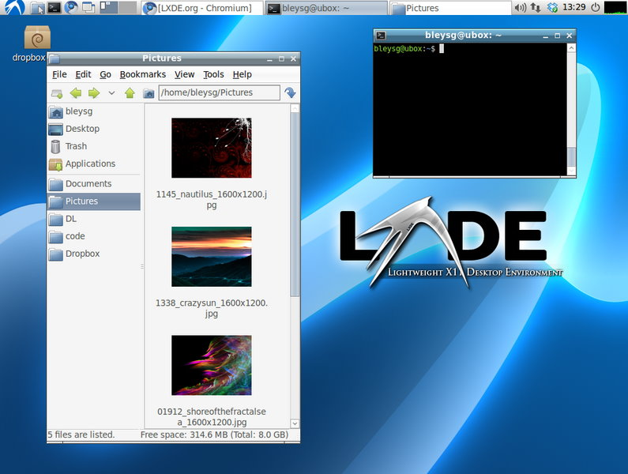
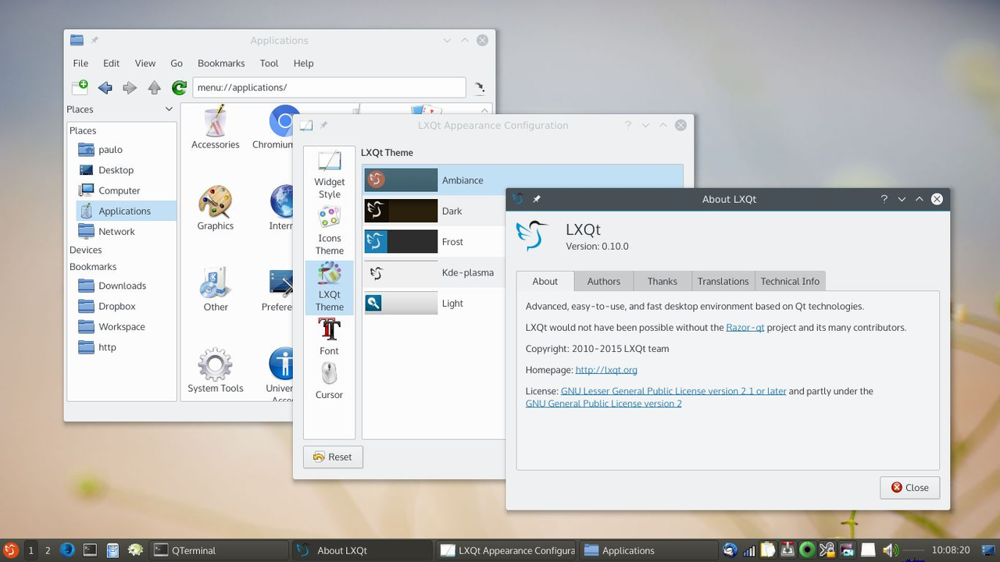
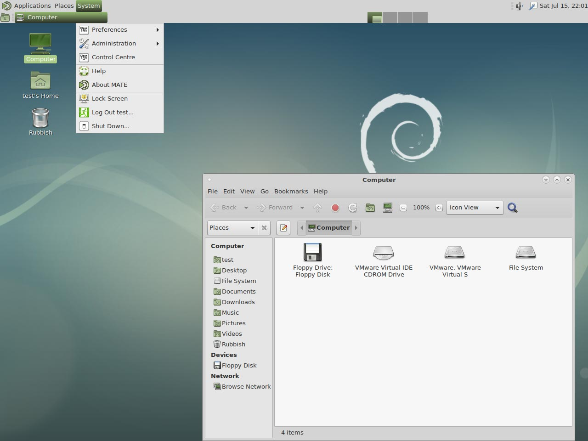
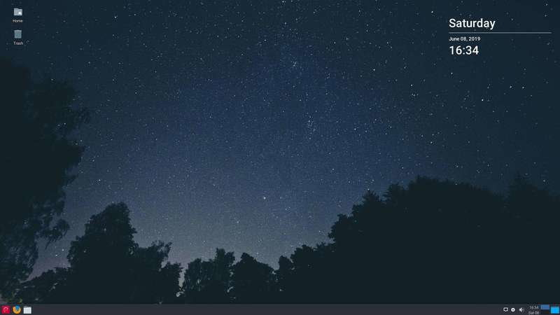
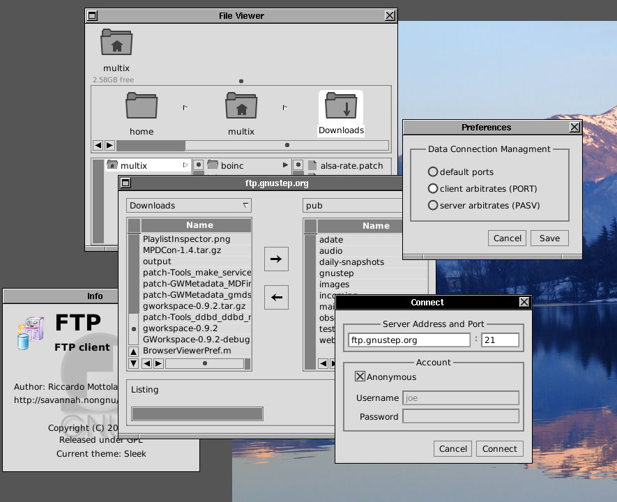
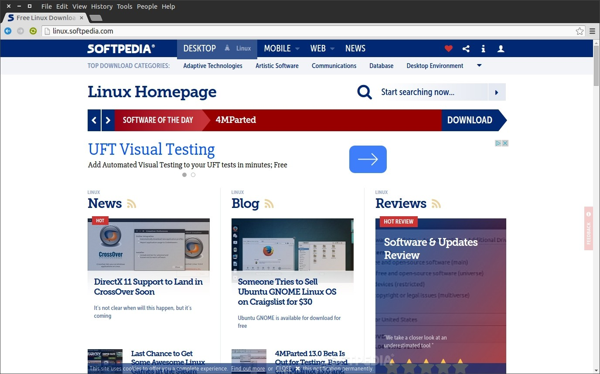
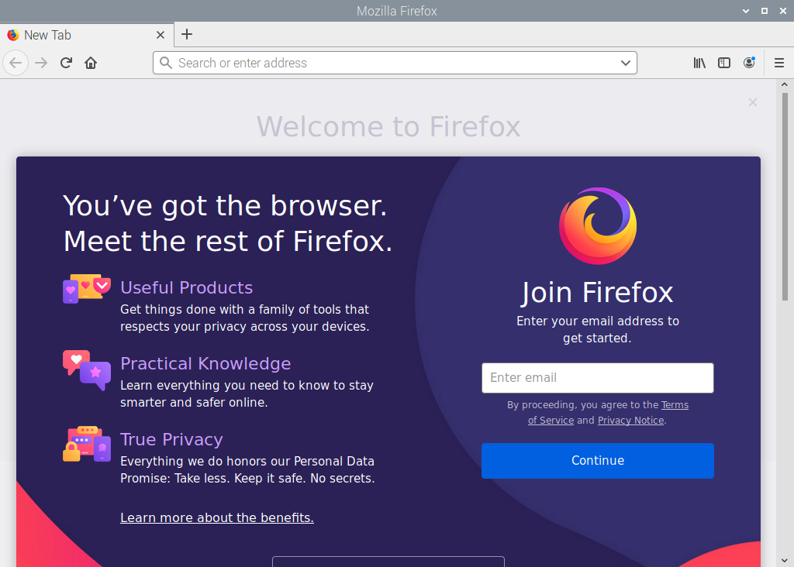
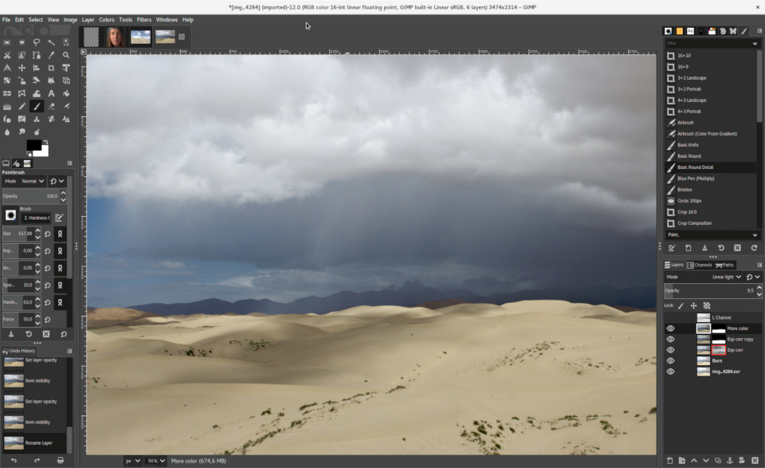
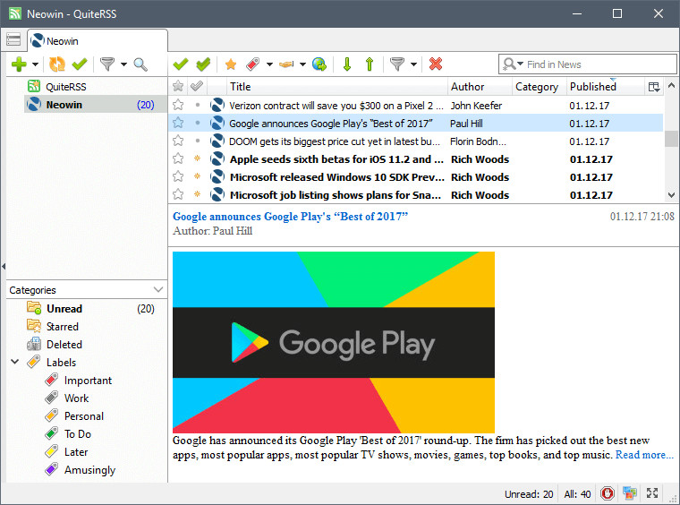
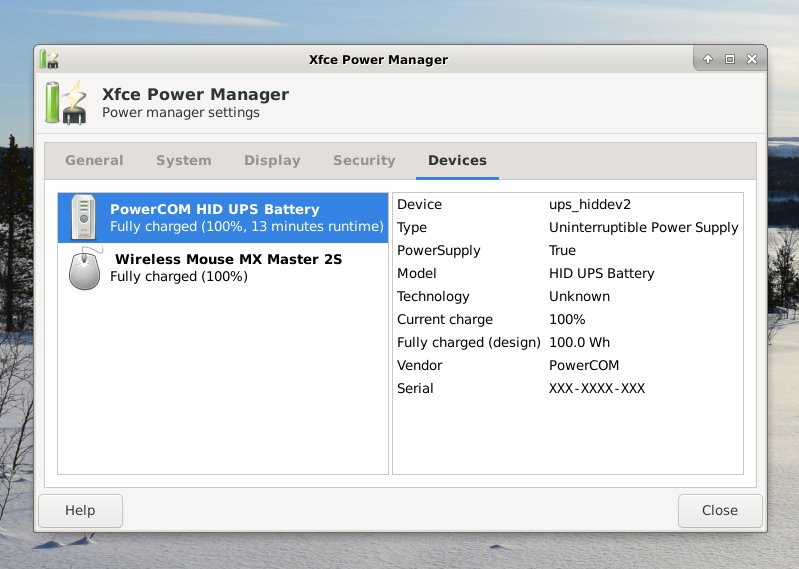

# Desktop environments & utilities

## Overview

### Desktops

- [**LXDE - Highly optimized ultra lightweight desktop**](#lxde)
- [**LXQt - Slick and optimized lightweight desktop**](#lxqt)
- [**MATE - Popular Gnome 2 desktop**](#mate)
- [**Xfce - Lightweight desktop**](#xfce)
- [**GNUstep - Alternative/unique desktop**](#gnustep)

### Desktop Utilities

- [**Chromium - Web browser**](#chromium)
- [**Firefox - Web browser**](#firefox)
- [**GIMP - Image editor**](#gimp)
- [**QuiteRSS - RSS and Atom news feeds reader**](#quiterss)
- [**Xfce Power Manager - Power manager with brightness control**](#xfce-power-manager)

??? info "How do I run **DietPi-Software** and install **optimised software** items?"
    To install any of the **DietPi optimised software items** listed below run from the command line:

    ```sh
    dietpi-software
    ```

    Choose **Browse Software** and select one or more items. Finally select `Install`.  
    DietPi will do all the necessary steps to install and start these software items.

    {: width="643" height="365" loading="lazy"}

    To see all the DietPi configurations options, review the [DietPi Tools](../../dietpi_tools/) section.

[Return to the **Optimised Software list**](../../software/)

## LXDE

LXDE is highly optimised and ultra lightweight desktop. It works well with computers on the low end of the performance spectrum such as new generation netbooks and small computers, or older resource-constrained machines.

{: width="795" height="600" loading="lazy"}

=== "Quick start"
    After installation, desktop can be run by typing

    ```sh
    startx
    ```

=== "Enable autostart"
    To start different programs when the system boots, run from the command line:

    ```sh
    dietpi-autostart
    ```

    To see all the DietPi configurations options, review [DietPi Tools](../../dietpi_tools/) section.

***

Official website: <https://www.lxde.org/>

## LXQt

Optimised lightweight desktop without the bloatware. Slick and fluid GUI, however, more resource heavy than LXDE.

{: width="1280" height="720" loading="lazy"}

Source: [LXQt](https://lxqt.github.io/screenshots/), CC BY-SA 3.0, [wikimedia](https://commons.wikimedia.org/w/index.php?curid=52420839).

=== "Quick start"
    After installation, desktop can be run by typing

    ```sh
    startx
    ```

=== "Enable autostart"
    To start different programs when the system boots, run from the command line:

    ```sh
    dietpi-autostart
    ```

    To see all the DietPi configurations options, review [DietPi Tools](../../dietpi_tools/) section.

***

Official website: <https://lxqt-project.org/>
Source code: <https://github.com/lxqt/lxqt>

## MATE

Popular Gnome2 based desktop environment.

{: width="1280" height="960" loading="lazy"}

=== "Quick start"
    After installation, desktop can be run by typing

    ```sh
    startx
    ```

=== "Enable autostart"
    To start different programs when the system boots, run from the command line:

    ```sh
    dietpi-autostart
    ```

    To see all the DietPi configurations options, review [DietPi Tools](../../dietpi_tools/) section.

***

Website: <https://mate-desktop.org>

## Xfce

{: width="800" height="450" loading="lazy"}

=== "Quick start"
    After installation, desktop can be run by typing

    ```sh
    startx
    ```

=== "Enable autostart"
    To start different programs when the system boots, run from the command line:

    ```sh
    dietpi-autostart
    ```

    To see all the DietPi configurations options, review [DietPi Tools](../../dietpi_tools/) section.

***

Website: <https://wiki.debian.org/Xfce>

## GNUstep

{: width="885" height="720" loading="lazy"}

=== "Quick start"
    After installation, desktop can be run by typing

    ```sh
    startx
    ```

=== "Enable autostart"
    To start different programs when the system boots, run from the command line:

    ```sh
    dietpi-autostart
    ```

    To see all the DietPi configurations options, review [DietPi Tools](../../dietpi_tools/) section.

***

Website: <http://gnustep.org>

## Desktop utilities

### Chromium

#### Does my device support GPU acceleration?

Not all devices support GPU acceleration with Chromium.

- RPis supports native OpenGL and will be configured during installation.
- Odroids support OpenGLES and will be configured during installation.
- Other devices will most likely be limited to software rendering.

#### Where can I check the status of GPU acceleration?

Once Chromium is running, simply go to the following address: `chrome://gpu`

#### Enable support for Widevine DRM protected content on RPi

- Manually: [https://blog.vpetkov.net/2019/07/12/net ... -chromium/](https://blog.vpetkov.net/2019/07/12/netflix-and-spotify-on-a-raspberry-pi-4-with-latest-default-chromium/)
- with scripts: [https://blog.vpetkov.net/2020/03/30/ras ... many-others/](https://blog.vpetkov.net/2020/03/30/raspberry-pi-netflix-one-line-easy-install-along-with-hulu-amazon-prime-disney-plus-hbo-spotify-pandora-and-many-others/)

{: width="1376" height="858" loading="lazy"}

### Firefox

{: width="128" height="128" loading="lazy"}

Firefox Browser, also known as simply Firefox, is a free and open-source web browser developed by the Mozilla Foundation and its subsidiary, the Mozilla Corporation.

Similar to [Chromium](#chromium), Firefox has been made a separate install option. For desktop installs users can choose between Chromium, Firefox or no web browser.

{: width="1024" height="723" loading="lazy"}

### GIMP

MS Paint on steroids. If you need to edit pixels with a vast number of tools, GIMP is the only program you'll need.

{: width="960" height="587" loading="lazy"}

***

Website: <https://www.gimp.org>

### QuiteRSS

QuiteRSS is a open-source cross-platform RSS / Atom news feeds reader, with the main idea to be fast and comfortable to the end-user.

{: width="760" height="564" loading="lazy"}

### Xfce Power Manager

Enables laptop users to set up a power profile for two different modes `on battery power` and `on AC Power` while still allowing desktop users to at least change the DPMS settings and CPU frequency using the settings dialogue.

{: width="799" height="569" loading="lazy"}

[Return to the **Optimised Software list**](../../software/)
