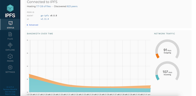

# Distributed Projects

## Overview

- [**Folding@Home - Use processing power to assist with disease research**](#foldinghome)
- [**Tor Relay - Add a node to the Tor network**](#tor-relay)
- [**YaCy - Decentralized open source search engine**](#yacy)
- [**IPFS Node - Contribute to a decentralized internet**](#ipfs-node)

??? info "How do I run **DietPi-Software** and install **optimised software** items?"
    To install any of the **DietPi optimised software items** listed below run from the command line:

    ```sh
    dietpi-software
    ```

    Choose **Browse Software** and select one or more items. Finally select `Install`.  
    DietPi will do all the necessary steps to install and start these software items.

    {: width="643" height="365" loading="lazy"}

    To see all the DietPi configurations options, review the [DietPi Tools](../../dietpi_tools/) section.

[Return to the **Optimised Software list**](../../software/)

## Folding@Home

[Folding@home](https://foldingathome.org/home/) is a project focused on disease research.  
The problems which are solved require so many computer calculations that help from the community is needed to find the cures!

*By default, our installation will add you to the DietPi team group, however, you can change this in the web interface at any time.*

{: width="550" height="424" loading="lazy"}

=== "Access to the web interface"

    The web interface is accessible via the port **7396**, e.g. this could be:  

    - URL = `http://<your.IP>:7396`

=== "Configuration"

    The configuration is located in the file `/mnt/dietpi_userdata/fahclient/config.xml`.  
    You can change the configuration with the following steps:

    1. Stop services with `dietpi-services stop`
    2. Edit `/mnt/dietpi_userdata/fahclient/config.xml`
    3. Save changes and restart services with `dietpi-services start`

=== "Logging"

    Folding@Home has a logging feature which outputs into the journal logging system. The logs can be viewed via:

    ```sh
    journalctl -u fahclient
    ```

=== "Influence the computational power"

    In addition to the *power slider* in the web interface the user can influence the number of jobs that run on the system.  
    The example config given below has 3 job slots, ideal for a 6 core CPU (allowing 2 CPU cores per job slot):

    ```xml
    <config>
      <!-- Slot Control -->
      <power v='FULL'/>

      <!-- User Information -->
      <user v='Fourdee'/>

      <!-- Folding Slots -->
      <slot id='0' type='CPU'/>
      <slot id='1' type='CPU'/>
      <slot id='2' type='CPU'/>
    </config>
    ```

## Tor Relay

{: width="150" height="91" loading="lazy"}

Contribute a node to the Tor network, which allows people to be anonymous on the internet.

=== "Types of relay"

    You can run many types of relay, each with their own technical requirements and legal implications.

    Bridges are the safest relay to run from home, and are relatively easy, low-risk and low bandwidth, but they have a big impact on users, especially in censored countries. Normally, IP addresses and other information of Tor relays is published, making it easy for websites to blacklist the relay, and anything else using that IP address. Since a bridge isn't listed publicly, it is unlikely to be blocked by websites or receive abuse complaints.

    Guard/Middle relays are the first and second relays connected to, respectively. Information about them is listed, but they are unlikely to receive abuse complaints. However, they may be blocked by certain services that don't understand how Tor works or deliberately want to censor Tor users. If you have one static IP address, consider running a bridge instead.

    Exit relays are the final relay connected to, and the one that actually sends traffic to its destination. The website will see the exit relay's IP address instead of the real IP address of the Tor user. Exit relays have the greatest legal exposure and liability of all the relays, and should not be run from home.

    ??? info "Exit relay preparation"
        Running exit relays requires some preparation.
        Before running an exit relay, you should set a reverse DNS (and, if possible, WHOIS) record to make it clearer that your IP address is a Tor exit relay.
        Also, it is recommended that you run an exit relay on its own server, with its own IP address.

=== "Monitoring"

    The simplest way to monitor the Tor relay is to use the DietPi-CloudShell scene, for this run `dietpi-cloudshell` from the command line and select the "Tor Relay" scene. It uses the Tor monitor [nyx](https://nyx.torproject.org/) which can be called in standalone mode by executing `nyx` from command line.

    You can also monitor it with the [Tor relay search](https://metrics.torproject.org/rs.html). Just paste either the fingerprint (found at `/var/lib/tor/fingerprint`) or nickname of your relay.

    ??? info "Note for bridge operators"
        The Tor relay search will not always work for bridges, sometimes showing them as down when they are running. In that case, use the specific Tor bridge monitoring URL:  
        `https://bridges.torproject.org/status?type=obfs4&id=<FINGERPRINT>`

=== "Keeping up-to-date"

    Keeping Tor relays updated is important to the safety of both the users and the operator. Because of this, automated upgrades are recommended and asked about when first installing. Otherwise, regularly run the following commands to keep your system packages up-to-date:

    ```sh
    apt update
    apt upgrade
    ```

=== "View logs"

    Tor service logs can be viewed with the following command:

    ```sh
    journalctl -t tor
    ```

***

Official documentation: <https://community.torproject.org/relay/setup>

## YaCy

YaCy is a decentralized open source search engine.  
Essentially, it is a "peer-to-peer" Google search engine, not controlled by Google.

{: width="400" height="233" loading="lazy"}

=== "Access to the web interface"

    The web interface is accessible via port **8090**:

    - URL = `http://<your.IP>:8090`

=== "Admin Interface Login"

    Set password with:

    ```sh
    /etc/yacy/bin/passwd.sh mypassword
    ```

    Login details are then:

    - Username = `admin`
    - Password = `mypassword`

=== "Reduce CPU usage"

    YaCy is extremely CPU intensive, coupled with constant background processing, we highly recommend using `dietpi-services` to reduce process priority.

    Recommended setting: Nice = 19

## IPFS Node

IPFS (InterPlanetary File System) is a peer-to-peer hypermedia protocol designed to make the web faster, safer, and more open.
This node lets you download files through IPFS and add your own files to the network.

{: width="400" height="233" loading="lazy"}

=== "Access to the web interface and IPFS gateway"

    The web interface is accessible via port **5003**, and the gateway through **8087**:

    - WebUI = `http://<your.IP>:5003/webui`
    - Gateway = `http://<your.IP>:8087/ipfs/IPFSHash`

=== "Usage with IPFS Companion browser extension"

    You can use your IPFS node with the IPFS Companion browser extension to automatically download IPFS-hosted files through your node.
    In the settings page of the extension, change "IPFS API URL" to `http://<your.IP>:5003`, and "Local Gateway" to `http://<your.IP>:8087`.

    Firefox: https://addons.mozilla.org/en-US/firefox/addon/ipfs-companion/

    Chromium and derivatives: https://chrome.google.com/webstore/detail/ipfs-companion/nibjojkomfdiaoajekhjakgkdhaomnch

    ??? info "Note for using with extension"
        IPFS content will not load on `https://` pages without an SSL certificate. We recommend a free one from LetsEncrypt using [DietPi-LetsEncrypt](../../dietpi_tools/#dietpi-letsencrypt).

=== "Logging"

    You can view the service logs via

    ```sh
    journalctl -u ipfs
    ```

=== "Updating"

    You can update your IPFS node by running

    ```sh
    dietpi-software reinstall 186
    ```

    IPFS has a built in update command (`ipfs update`), but this requires the `ipfs-update` binary found at https://dist.ipfs.io/#ipfs-update.

Official documentation: <https://docs.ipfs.io>

!!! warning "Do not expose to internet"
    The IPFS web interface requires no authentication to use. Do not expose it to the internet without taking proper security measures, like an authenticated reverse proxy, VPN or similar.

[Return to the **Optimised Software list**](../../software/)
