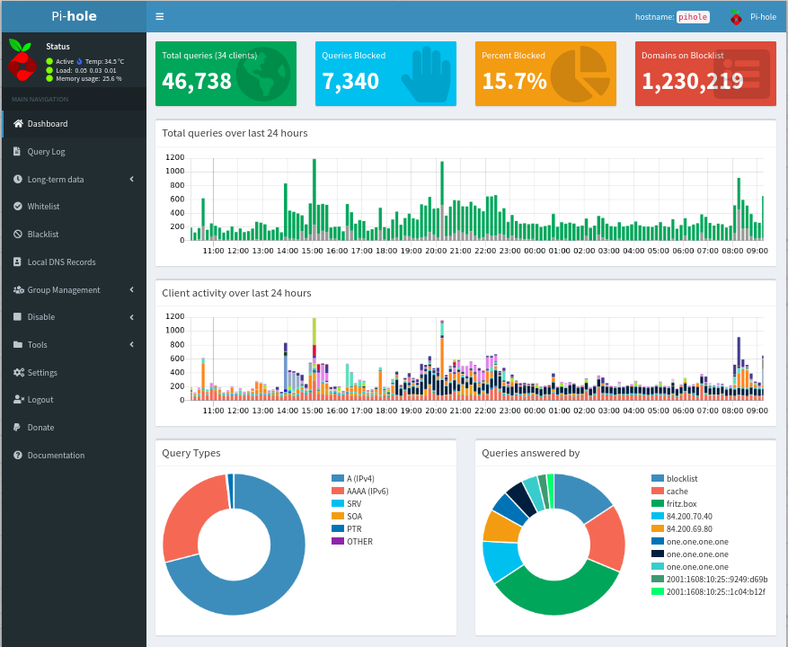
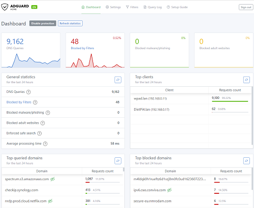
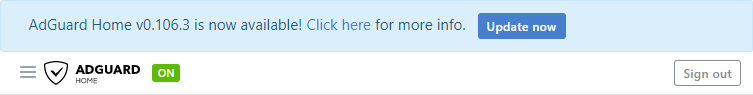

# DNS Servers

## Overview

- [**Pi-hole - Network-wide Ad Blocking**](#pi-hole)
- [**Unbound - A validating, recursive and caching DNS resolver**](#unbound)
- [**AdGuard Home - A powerful network-wide ads & trackers blocking DNS server**](#adguard-home)

??? info "How do I run **DietPi-Software** and install **optimised software** items?"
    To install any of the **DietPi optimised software items** listed below run from the command line:

    ```sh
    dietpi-software
    ```

    Choose **Browse Software** and select one or more items. Finally select `Install`.  
    DietPi will do all the necessary steps to install and start these software items.

    {: width="643" height="365" loading="lazy"}

    To see all the DietPi configurations options, review the [DietPi Tools](../../dietpi_tools/) section.

[Return to the **Optimised Software list**](../../software/)

## Pi-hole

Pi-hole is a DNS sinkhole with web interface that will block ads for any device on your network.

- Also Installs: [Webserver stack](../webserver_stack/)

{: width="500" height="410" loading="lazy"}

!!! warning "Webserver installation"
    DietPi-Software calls the Pi-hole installer with the `--disable-install-webserver` flag, which skips the Lighttpd and PHP installation parts. Instead, Lighttpd, Nginx or Apache is installed separately, based on user choice, and PHP as standalone PHP-FPM server or module for Apache respectively. This allows more flexible webserver configurations as well, easy HTTPS, other web sites/applications on the same server etc. When **repairing** and **reconfiguring** Pi-hole (see "Repairing Pi-hole" tab below), it is important to **NOT** select to install Lighttpd when being asked, as this would lead to doubled PHP and webserver installs or conflicting webserver settings.

=== "Access the web interface"

    The web interface of Pi-hole can be accessed via:

    - URL = `http://<your.IP>/admin`
    - Password = `<yourGlobalSoftwarePassword>` (default: `dietpi`)

=== "Configuration"

    The configuration contains setting devices (e.g. router) to use Pi-hole for DNS resolution.

    <h2>Option 1 - Setup single devices to use the Pi-hole DNS server</h2>

    Simply change your DNS settings to use the IP address of your Pi-hole device. This will need to be done for each device that you want Pi-hole to work with.

    Example:

    - My Pi-hole device has the IP address of 192.168.0.100
    - On my PC, I would set the DNS address to 192.168.0.100
    - Tutorial [The Ultimate Guide to Changing Your DNS settings](https://www.howtogeek.com/167533/the-ultimate-guide-to-changing-your-dns-server/).

    <h2>Option 2 - Setup your router to use the Pi-hole DNS server</h2>

    This method will automatically point every device (that uses DHCP) on your network to Pi-hole.
    On your routers control panel web page, you will need to find a option called "DNS server". This should be located under DHCP settings.

    Simply enter the IP address of your Pi-hole device under "DNS server":

    {: width="400" height="240" loading="lazy"}

    On your Pi-hole device, you will need to set a different DNS server.  
    Depending on your router configuration, if you don't do this step, the Pi-hole device may not be able to access the internet. It's highly recommended to have the device running Pi-hole, pointing to a DNS server outside your network.

    - Run the following command: `dietpi-config 8 1`
    - Select: *Ethernet*
    - If you are running in DHCP mode, select *Change Mode*, then select: *Copy Current address to Static*
    - Select *Static DNS* from the list, then choose a DNS server, or manually enter a custom entry.
    - Once completed, select *Apply* to save the changes.

=== "DietPi differences"

    The DietPi Pi-hole implementation uses the official installer script, but it comes with a few differences, compared to the official default setup:

    1. The `/var/log/pihole.log` plain text DNS query log is disabled by default. It is a second query log implementation, as `/etc/pihole/pihole-FTL.db` is used as a database-wise log implementation already, used by the web interface to search long-term logs. If you however want to use the `pihole -t`/`pihole tail` command, to print colourised logs to console, you need to re-enable the file-based logging:

        ```sh
        pihole -l on
        ```

        Also the DietPi [logging system](../../dietpi_tools/#quick-selections) needs to be changed, to disable DietPi-RAMlog, as otherwise `/var/log/pihole.log` is cleared hourly.
    2. The logging duration for the database-wise DNS query log in `/etc/pihole/pihole-FTL.db` is reduced from 365 days to 2 days. An internal discussion revealed that no-one of us uses logs old than a few hours. One year of logs leads to database sizes from hundreds of MiBs to GiBs. We leave it at 2 days so that web interface dashboard graphs/diagrams are not empty after Pi-hole (re)starts. You can easily adjust the logging duration by editing the `/etc/pihole/pihole-FTL.conf` config file. E.g. to restore the default 365 days of logs:

        ```sh
        MAXDBDAYS=365
        ```

=== "Updating Pi-hole"

    Pi-hole can be updated via the shell command `pihole -up`.

=== "Repairing Pi-hole"

    You can use `pihole -r` to repair or reconfigure your Pi-hole instance.

    !!! warning "Do **NOT** select to install Lighttpd"
        Do **NOT** select to install Lighttpd when being asked, as this would lead to doubled PHP and webserver installs or conflicting webserver settings.

=== "Setting the password"

    If you forgot your login password for the Pi-hole admin web page, you can set it with the shell command `pihole -a -p` on your Pi-hole device.

=== "Blocklists and whitelists"

    There are many sites in the web giving blocklists and whitelists for Pi-hole. They can be used when you want to have more blocking as the standard installation gives you. Here are some examples:

    - [The Big Blocklist Collection by `WaLLy3K`](https://firebog.net/)
    - [Phishing Army blocklist](https://phishing.army/)
    - [Whitelist collection by `anudeepND`](https://github.com/anudeepND/whitelist)

=== "Accessing via OpenVPN or WireGuard"

    To allow (OpenVPN or WireGuard) VPN clients accessing your local Pi-hole instance, you need to allow DNS requests from all network interfaces: `pihole -a -i local`.

=== "Monitor Pi-hole"

    [DietPi-CloudShell](../system_stats/#dietpi-cloudshell) has a Pi-hole scene included, which can be used to monitor the most important DNS query and block statistics. Simply run `dietpi-cloudshell`, select `Scenes` and assure that `8 Pi-hole` is selected. Toggle `Output Display` to choose whether to print the output to the current console or the main screen, then select `Start / Restart` to start the output.

***

Official website: <https://pi-hole.net/>  
Official documentation: <https://docs.pi-hole.net/>  
Wikipedia: <https://wikipedia.org/wiki/Pi-hole>  
Source code: <https://github.com/pi-hole>  
DietPi Blog: [Pi-Hole & Unbound: How to have ad-free & safer internet in just few minutes](https://dietpi.com/blog/?p=564)  
YouTube video tutorial #1: [Raspberry Pi / Pi-hole / Diet-Pi / Network wide Ad Blocker !!!!](https://www.youtube.com/watch?v=RO2_eZlVrj4)  
YouTube video tutorial #2: [Block ads everywhere with Pi-hole and PiVPN on DietPi](https://www.youtube.com/watch?v=qbLEHlKkGiE){:class="nospellcheck"}  
YouTube video tutorial #3 (German language): [Raspberry Pi & DietPi : Pi-hole der Werbeblocker für Netzwerke mit Anleitung für AVM FritzBox](https://www.youtube.com/watch?v=vXUvFWhXW6c&list=PLQIL7cyHMGboXtOzwAcX4hGPW6ECbVinp&index=6){:class="nospellcheck"}  
YouTube video tutorial #4 (German language): [Raspberry Pi Zero W mit Pi-hole - günstiger Werbeblocker & Schritt für Schritt Anleitung unter DietPi](https://www.youtube.com/watch?v=IxWuMHu9IYk&list=PLQIL7cyHMGboXtOzwAcX4hGPW6ECbVinp&index=2){:class="nospellcheck"}  
Blog entry with YouTube video #5 (German language): [Unbound Installation für PiHole unter DietPi](https://blog.login.gmbh/unbound-installation-fuer-pihole-unter-dietpi/){:class="nospellcheck"}

## Unbound

Unbound is a validating, recursive, caching DNS resolver. It can resolve hostnames by querying the root name servers directly, replacing ISP/public DNS resolvers. Eliminating one player involved in handling your DNS requests, increases your internet privacy. Additionally Unbound can be configured to use the encrypted DoT protocol, which requires again a public DNS provider, but masks requests for your LAN operator and ISP instead. For more info, see the "Activating DNS over TLS (DoT)" tab below.

{: width="150" height="34" loading="lazy"}

{: width="500" height="274" loading="lazy"}

=== "Default DNS ports"

    - Default DNS port: **53**
    - DNS port when Pi-hole or AdGuard Home are installed: **5335**

=== "Configuration directory"

    The configuration directory is located there: `/etc/unbound`

=== "View logs"

    View the log files:

     ```sh
     journalctl -u unbound
     ```

=== "Updating unbound"

    Update to latest version:

    ```sh
    apt update
    apt upgrade
    ```

=== "Activating DNS over TLS (DoT)"

    DoT sends DNS requests encrypted, masking them from your LAN operator and ISP. But it requires again a public DNS provider, to query the root name servers, which is otherwise, thanks to Unbound, not required. Root name server requests can only be unencrypted, either sent directly from Unbound (default) or by a public provider (when using DoT). Whether DoT (or any other encrypted DNS wrapper protocol) is preferable or not, depends on your individual case and needs, i.e. if you trust your LAN operator and ISP more, or a public DNS provider. You can activate DoT by copying and executing the following command block:

    ```sh
    cat << '_EOF_' > /etc/unbound/unbound.conf.d/dietpi-dot.conf
    # Adding DNS-over-TLS support
    server:
    tls-cert-bundle: /etc/ssl/certs/ca-certificates.crt
    forward-zone:
    name: "."
    forward-tls-upstream: yes
    ## Cloudflare
    forward-addr: 1.1.1.1@853#cloudflare-dns.com
    forward-addr: 1.0.0.1@853#cloudflare-dns.com
    ## Quad9
    forward-addr: 9.9.9.9@853#dns.quad9.net
    forward-addr: 149.112.112.112@853#dns.quad9.net
    _EOF_
    ```

    !!! note "The used DNS servers are examples only and can be replaced by your favorite one."
        A list of public DNS providers, their IP addresses and their in cases included ad blocking / adult content blocking features are available on Wikipedia:

        - <https://wikipedia.org/wiki/Public_recursive_name_server>

    For the change to take effect, the Unbound service needs to be restarted:

    ```sh
    systemctl restart unbound
    ```

***

Official website: <https://www.nlnetlabs.nl/projects/unbound/about/>  
Official documentation: <https://nlnetlabs.nl/documentation/unbound/unbound>  
New WIP documentation: <https://unbound.readthedocs.io/>  
Wikipedia: <https://wikipedia.org/wiki/Unbound_(DNS_server)>  
Source code: <https://github.com/NLnetLabs/unbound>

DietPi Blog: [Pi-Hole & Unbound: How to have ad-free & safer internet in just few minutes](https://dietpi.com/blog/?p=564)

Blog entry with YouTube video (German language): [Unbound Installation für PiHole unter DietPi](https://blog.login.gmbh/unbound-installation-fuer-pihole-unter-dietpi/){:class="nospellcheck"}

## AdGuard Home

AdGuard Home is a DNS sinkhole with web interface that will block ads for any device on your network.

{: width="500" height="410" loading="lazy"}

=== "Access the web interface"

    The web interface is accessible via port **8083**:

    - URL = `http://<your.IP>:8083`
    - User = `admin`
    - Password = `<yourGlobalSoftwarePassword>` (default: `dietpi`)

=== "Configuration"

    The configuration contains setting devices (e.g. router) to use AdGuard Home for DNS resolution.

    <h2>Option 1 - Setup single devices to use the AdGuard Home DNS server</h2>

    Simply change your DNS settings to use the IP address of your AdGuard Home device. This will need to be done for each device that you want AdGuard Home to work with.

    Example:

    - My AdGuard Home device has the IP address of 192.168.0.100
    - On my PC, I would set the DNS address to 192.168.0.100
    - Tutorial [The Ultimate Guide to Changing Your DNS settings](https://www.howtogeek.com/167533/the-ultimate-guide-to-changing-your-dns-server/).

    <h2>Option 2 - Setup your router to use the AdGuard Home DNS server</h2>

    This method will automatically point every device (that uses DHCP) on your network to AdGuard Home.
    On your routers control panel web page, you will need to find a option called "DNS server". This should be located under DHCP settings.

    Simply enter the IP address of your AdGuard Home device under "DNS server":

    {: width="400" height="240" loading="lazy"}

    On your AdGuard Home device, you will need to set a different DNS server.  
    Depending on your router configuration, if you don't do this step, the AdGuard Home device may not be able to access the internet. It's highly recommended to have the device running AdGuard Home, pointing to a DNS server outside your network.

    - Run the following command: `dietpi-config 8 1`
    - Select: *Ethernet*
    - If you are running in DHCP mode, select *Change Mode*, then select: *Copy Current address to Static*
    - Select *Static DNS* from the list, then choose a DNS server, or manually enter a custom entry.
    - Once completed, select *Apply* to save the changes.

=== "Updating AdGuard Home"

    Please use the internal updater from the web interface to update your AdGuard Home. You will see a notification at the top of the page once an update is available.

    {: width="753" height="95" loading="lazy"}

=== "Setting the password"

    If you forgot your login password for the AdGuard Home admin web page, you can set it with the following shell command on your AdGuard Home device.

    ```sh
    G_CONFIG_INJECT 'password:[[:blank:]]' "  password: $(htpasswd -bnBC 10 '' "<your_new_password>" | tr -d ':\n' | sed 's/\$2y/\$2a/')" /mnt/dietpi_userdata/adguardhome/AdGuardHome.yaml
    systemctl restart adguardhome
    ```

=== "Blocklists and whitelists"

    There are many sites in the web giving blocklists and whitelists for AdGuard Home. They can be used when you want to have more blocking as the standard installation gives you. Here are some examples:

    - [The Big Blocklist Collection by `WaLLy3K`](https://firebog.net/)
    - [Phishing Army blocklist](https://phishing.army/)
    - [Whitelist collection by `anudeepND`](https://github.com/anudeepND/whitelist)

***

Official website: <https://adguard.com/en/adguard-home/overview.html>  
Official documentation: <https://github.com/AdguardTeam/AdGuardHome/wiki>  
Wikipedia: <https://en.wikipedia.org/wiki/AdGuard#AdGuard_Home>  
Source code: <https://github.com/AdguardTeam/AdGuardHome>  
License: [GPLv3](https://github.com/AdguardTeam/AdGuardHome/blob/master/LICENSE.txt)

[Return to the **Optimised Software list**](../../software/)
