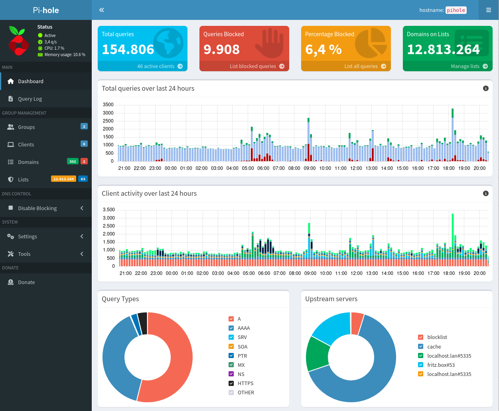

# DNS Servers

## Overview

- [**Pi-hole - Network-wide Ad Blocking**](#pi-hole)
- [**Unbound - A validating, recursive, and caching DNS resolver**](#unbound)

??? info "How do I run **DietPi-Software** and install **optimised software** ?"
    To install any of the **DietPi optimised software** listed below run from the command line:

    ```
    dietpi-software
    ```

    Choose **Software Optimised** and select one or more items. Finally click on `Install`. DietPi will do all the necessary steps to install and start these software items.

    

    To see all the DietPi configurations options, review [DietPi Tools](../../dietpi_tools) section.

[Return to the **Optimised Software list**](../../dietpi_optimised_software)

## Pi-hole

Pi-hole is a DNS sinkhole with web interface that will block ads for any device on your network.

- Also Installs: [Webserver stack](../webserver_stack/)

{: style="width:500px"}

=== "Access the web interface"

    The web interface of Pi-hole can be accessed via:

    - URL= `http://<your.IP>/admin`
    - Password = `<yourGlobalSoftwarePassword>` (default: `dietpi`)

=== "Configuration"

    The configuration contains setting devices (e.g. router) to use Pi-hole for DNS resolution.

    #### Option 1 - Setup single devices to use the Pi-hole DNS server

    Simply change your DNS settings to use the IP address of your Pi-hole device. This will need to be done for each device that you want Pi-hole to work with.

    Example:

    - My Pi-hole device has the IP address of 192.168.0.100
    - On my PC, I would set the DNS address to 192.168.0.100
    - Tutorial [The Ultimate Guide to Changing Your DNS settings](https://www.howtogeek.com/167533/the-ultimate-guide-to-changing-your-dns-server/).

    #### Option 2 - Setup your router to use the Pi-hole DNS server

    This method will automatically point every device (that uses DHCP) on your network to Pi-hole.
    On your routers control panel web page, you will need to find a option called "DNS server". This should be located under DHCP settings.

    Simply enter the IP address of your Pi-hole device under "DNS server":

    {: style="width:500px"}

    On your Pi-hole device, you will need to set a different DNS server.  
    Depending on your router configuration, if you don't do this step, the Pi-hole device may not be able to access the internet. It's highly recommended to have the device running Pi-hole, pointing to a DNS server outside your network.

    - Run the following command: `dietpi-config 8 1`
    - Select: *Ethernet*
    - If you are running in DHCP mode, select *Change Mode*, then select: *Copy Current address to Static*
    - Select *Static DNS* from the list, then choose a DNS server, or manually enter a custom entry.
    - Once completed, select *Apply* to save the changes.

=== "Updating Pi-hole"

    Pi-hole can be updated via the shell command `pihole -up`.

=== "Repairing Pi-hole"

    You can use `pihole -r` to repair or reconfigure your Pi-hole instance.

    !!! warning "No selection of Lighttpd during repair procedure"
        Do NOT select to install Lighttpd when being asked, as this will mix our own webserver stack setup with a different once provided by the Pi-hole installer, which causes various issues.

=== "Setting the password"

    If you forgot your login password for the Pi-hole admin web page, you can set it with the shell command `pihole -a -p` on your Pi-hole device.

=== "Accessing via OpenVPN or WireGuard"

    To allow (OpenVPN or WireGuard) VPN clients accessing your local Pi-hole instance, you need to allow DNS requests from all network interfaces: `pihole -a -i local`.

=== "Pi-hole & Netdata"

    The monitoring of a *Pi-hole* system via Netdata is described there: <https://learn.netdata.cloud/guides/monitor/pi-hole-raspberry-pi>.

***

Wikipedia: <https://wikipedia.org/wiki/Pi-hole>  
YouTube video #1: [Raspberry Pi / Pi-hole / Diet-Pi / Network wide Ad Blocker !!!!](https://www.youtube.com/watch?v=RO2_eZlVrj4)  
YouTube video #2: [Block ads everywhere with Pi-hole and PiVPN on DietPi](https://www.youtube.com/watch?v=qbLEHlKkGiE)  
YouTube video #3 (german language): [Raspberry Pi & DietPi : PiHole der Werbeblocker für Netzwerke mit Anleitung für AVM FritzBox](https://www.youtube.com/watch?v=vXUvFWhXW6c&list=PLQIL7cyHMGboXtOzwAcX4hGPW6ECbVinp&index=6)  
YouTube video #4 (german language): [Raspberry Pi Zero W mit PiHole - günstiger Werbeblocker & Schritt für Schritt Anleitung unter DietPi](https://www.youtube.com/watch?v=IxWuMHu9IYk&list=PLQIL7cyHMGboXtOzwAcX4hGPW6ECbVinp&index=2)

## Unbound

Unbound is a validating, recursive, caching DNS resolver.  
For more details see [unbound "about" description](https://nlnetlabs.nl/projects/unbound/about/).

{: style="width:150px"}

{: style="width:500px"}

=== "Default DNS ports"

    - Default DNS port: 53
    - DNS port when Pi-hole is installed: 5353

=== "Configuration directory"

    The configuration directory is located there: `/etc/unbound`

=== "View logs"

    View the log files: `journalctl -u unbound`

=== "Updating unbound"

    Update to latest version: `apt update && apt upgrade`

***

Source code: <https://github.com/NLnetLabs/unbound>.  
Official documentation: <https://nlnetlabs.nl/documentation/unbound> resp. <https://nlnetlabs.nl/documentation/unbound/unbound>

[Return to the **Optimised Software list**](../../dietpi_optimised_software)
