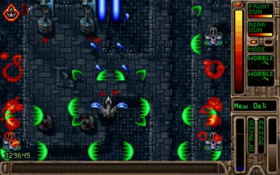
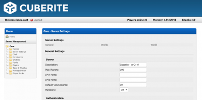
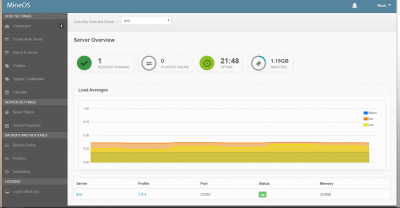
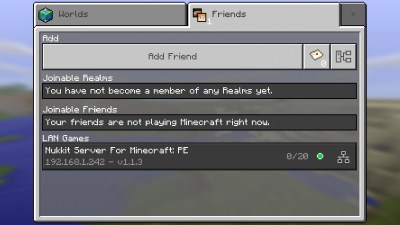
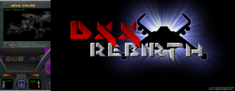

# Gaming & Emulation

## Overview

- [**OpenTyrian - Open-source port of the DOS game Tyrian**](#opentyrian)
- [**Cuberite - Fast Minecraft server with web interface**](#cuberite)
- [**MineOS - Multiple Minecraft servers with web interface**](#mineos)
- [**Nukkit - Server for Minecraft Pocket Edition**](#nukkit)
- [**Amiberry - Amiga emulation system**](#amiberry)
- [**DXX-Rebirth - Descent 1 and 2 OpenGL port**](#dxx-rebirth)
- [**Steam - Steam client**](#steam)
- [**PaperMC - Fast and optimised Minecraft server**](#papermc)
- [**Box86 - i386 userspace emulation for ARMv7**](#box86)
- [**Box64 - x86_64 userspace emulation for ARMv8**](#box64)

??? info "How do I run **DietPi-Software** and install **optimised software** items?"
    To install any of the **DietPi optimised software items** listed below run from the command line:

    ```sh
    dietpi-software
    ```

    Choose **Browse Software** and select one or more items. Finally select `Install`.  
    DietPi will do all the necessary steps to install and start these software items.

    {: width="643" height="365" loading="lazy"}

    To see all the DietPi configurations options, review the [DietPi Tools](../../dietpi_tools/) section.

[Return to the **Optimised Software list**](../../software/)

## OpenTyrian

Tyrian is an arcade-style vertical scrolling shooter. The story is set
in 20,031 where you play as Trent Hawkins, a skilled fighter pilot employed
to fight MicroSol and save the galaxy.

{: width="400" height="251" loading="lazy"}

=== "Start the game"

    - Console: To run OpenTyrian from console, use the following command: `opentyrian`
    - Desktop: To run OpenTyrian from desktop, a desktop icon and start menu entry have been added.
    - Autostart: To run OpenTyrian automatically at boot, select it from `dietpi-autostart` menu or directly via: `dietpi-autostart 4`

=== "Personal note"

    Tyrian (OpenTyrian) if not the best game in the world, is the best top down shooter/scroller game ever created.  
    OpenTyrian is best experienced by using a mouse and the ++enter++ key to change rear fire mode.  
    It's old, retro, and a classic etc, but I doubt you will to find a similar recent game that is anywhere close to OpenTyrian addictiveness.

## Cuberite

Cuberite allows you to create a single, blazingly fast Minecraft server, which utilizes the performance benefits of C++ (instead of Java) and comes with a handy web interface.

{: width="400" height="198" loading="lazy"}

=== "Access the web interface"

    The web interface is accessible via port **1339**:

    - URL = `http://<your.IP>:1339`
    - Username = `admin`
    - Password = `<globalSoftwarePassword>` (default: `dietpi`)

=== "Tweaking"

    Tweak the server settings by modifying the following files:

    - General server settings:

        ```
        /mnt/dietpi_userdata/cubrite/settings.ini
        ```

    - Settings for the web administration:

        ```
        /mnt/dietpi_userdata/cubrite/webadmin.ini
        ```

    - Settings for the world:

        ```
        /mnt/dietpi_userdata/cubrite/world/world.ini
        ```

=== "Restart service"

    You can restart the service by running:

    ```sh
    systemctl restart cuberite
    ```

=== "View logs"

    - Log files: `/mnt/dietpi_userdata/cubrite/logs/`
    - Service logs: `journalctl -u cuberite`

=== "Update"

    Update to newest version:

    ```sh
    dietpi-software reinstall 52
    ```

## MineOS

MineOS allows you to create multiple Minecraft servers with ease, using a simple web interface.

{: width="400" height="208" loading="lazy"}

=== "Access to web interface"

    The web interface is accessible via port **8443**:

    - URL: `https://<your.IP>:8443`  
      You can safely ignore the certificate "warning" if one appears.
    - Username: `root`
    - Password: The same as your root login password. Default is `dietpi`

=== "1st run setup"

    Once logged into the web interface:

    1. Click profiles on the left hand side of screen
    2. Choose a Minecraft version to match your needs, then click download
    3. Click create new server on the left hand side of screen
    4. Enter a server name, then click create new server at the bottom
    5. Your server will now be visible at the bottom of the dashboard screen, select it
    6. In the drop down boxes `Change profile to:` and `Change runnable jar to:` select the entry which contains the server version number you downloaded in profiles
    7. Click accept EULA
    8. Click accept EULA again
    9. Click Start

    Your server should now be running, on the default port 25565.

***

Official forum: <https://discourse.codeemo.com/>  
Source code: <https://github.com/hexparrot/mineos-node>  
License: [GPLv3](https://github.com/hexparrot/mineos-node/blob/master/LICENSE.md)

## Nukkit

Nukkit is a Java-based server for Minecraft Pocket Edition.

{: width="400" height="225" loading="lazy"}

=== "Info"

    Nukkit by default runs a single server, available on LAN.

=== "Tweaking"

    Tweak the server settings by modifying the following file:

    ```
    /usr/local/bin/nukkit/server.properties
    ```

=== "Restart service"

    You can restart the service by running:

    ```sh
    systemctl restart nukkit
    ```

## Amiberry

Amiberry is an optimised Amiga emulator for the Raspberry Pi and other ARM-based SoCs, that brings you the highest performance Amiga emulation. Be it a classic A500, A1200, CD32 or up to a high-end model equipped with a 68040 and a graphics card, we have got you covered.

This installation is possible due to a collaboration with Dimitris Panokostas (Amiberry) and Daniel Knight (DietPi).

- Keyboard + mouse is highly recommended.
- We also offer completely automated installation images for Amiberry on Raspberry Pi, which can be found on our download page: <https://dietpi.com/#download>

{: width="400" height="189" loading="lazy"}

=== "1st run setup"

    - **Kickstarts (Amiga BIOS/boot system)**  
      Amiga Kickstart ROM images are required to run the system(s) you want to emulate. These can not be bundled due to copyright restrictions.  
      If you own the Amiga Forever product, you can legally download and use Kickstarts you are eligible for, from: <https://www.amigaroms.com/>  
      **Remark:** *Kickstart 1.3 (A500-A2500-A3000-CDTV) is highly recommended to work with most games.*  
      Kickstarts can be placed in `/mnt/dietpi_userdata/amiberry/kickstarts`.
    - **Floppy disks (Amiga `.adf` images)**  
      Amiga's floppy disk images have a `.adf` file extension.  
      You will need obtain at least one ADF image to start your Amiga experience.  
      Load your ADF from or place them where every you want it, e.g. create and use:  
      `/mnt/dietpi_userdata/amiberry/floppy_images`  
      To allow uploads via file servers, remember to grant required permissions, e.g.:

        ```sh
        chown dietpi:dietpi /mnt/dietpi_userdata/amiberry/floppy_images
        ```

=== "Starting"

    - Amiberry can be started by running:

        ```sh
        systemctl start amiberry
        ```

    - Optionally, you can enable Amiberry autostart to boot straight into the Amiga environment as fast as possible, with the least possible interference from Linux.  
      Run `dietpi-autostart 6` from console or `dietpi-autostart` and select **Amiberry fast boot** from the menu, then reboot your system.  
      If you face issues with the fast boot option or need to have other services starting up first, use `dietpi-autostart 8` or select **Amiberry standard boot** respectively.

=== "Create an Amiga configuration"

    Once Amiberry is running, you will need to configure the emulator, to tell it which Amiga system to emulate.

    - Select **Quickstart** (from the left hand side menu)
    - Under Amiga model: Select the Amiga model you'd like to emulate (example A500)
    - Under Config: Select the additional options for the target Amiga model (if required)
    - Click the Set configuration, button to apply changes.

    Next you will need to setup the emulator for the Kickstart and floppy disk image you wish to use:

    - Select a Kickstart (ROM):
        - On the left hand side, select **ROM**.
        - Under **Main ROM File:**, select the browse button (3 dots) ...
        - Navigate to your Kickstarts directory:  
          `/mnt/dietpi_userdata/amiberry/kickstarts`\*
        - Select the Kickstart (1.3 is recommended) you wish to use.

    - Select a Floppy disk image (ADF):
        - On the left hand side, select **Floppy drives**.
        - Under `DF0:`, select the browse button (3 dots) ...
        - Navigate to your floppy image directory:  
          `/mnt/dietpi_userdata/amiberry/floppy_images`\*
        - Select the ROM you wish to use.

    \* Remark: Amiberry does not currently support symbolic links. If you moved DietPi userdata to an external drive, run the following command to derive it's actual path:  

    ```sh
    readlink -f /mnt/dietpi_userdata/amiberry
    ```

    With `dietpi-drive_manager`'s default mount point it looks like:  
    `/mnt/<UUID>/dietpi_userdata/amiberry`

=== "Enable fullscreen output"

    On the left hand side, select **Display**.  
    Ensure the **Fullscreen** option is enabled.

=== "Optional: Set CPU speed to fastest (recommended)"

    This will emulate the Amiga as fast as possible, ensuring you get the maximum FPS for your SBC hardware.

    - On the left hand side, select **CPU and FPU**.
    - Under CPU Speed, select the fastest option.
    - If you find this change slows down the emulation, try using the fixed value of **25 MHz**.

=== "Optional: Save configuration (recommended)"

    It is recommended to save your settings. This will ensure the settings are applied on next startup of Amiberry.

    - On the left hand side, select **Configurations**.
    - Enter the name, e.g. "autostart", then click **Save**.

=== "Update"

    To update Amiberry to the latest version, simply reinstall it:

    ```sh
    dietpi-software reinstall 108
    ```

=== "FAQ"

    <h4>How can I transfer Kickstarts & Floppy Images to the device?</h4>

    Make sure you have one of DietPi's File Servers installed.

    - Floppy Disk Image (`.adf`) directory as chosen before, e.g. `/amiberry/floppy_images`
    - Kickstarts (`.rom`) directory = `/amiberry/kickstarts`

    <h4>How can I open the configuration window once the emulator has started?</h4>

    The pre-defined key for that is ++f12++.

    <h4>How can I reboot the Amiga emulation environment (Amiga reset)?</h4>

    Use ++ctrl+lwin+rwin++ keys.  
    If you don't have an ++rwin++ key, try using the ++menu++ key instead.

    <h4>What are the default controls for Joystick, when using a Keyboard?</h4>

    When using a keyboard, the default joystick controls are:

    - ++up++/++down++/++left++/++right++ = Up/Down/Left/Right
    - ++page-down++ = Fire/Button 1
    - ++page-up++ = Fire/Button 2

    <h4>How can I improve performance (frame rate)?</h4>

    A ***lower resolution*** may improve performance on most games. From the emulator main menu:

    - On the left hand side, select **Display**.
    - **640x256** is high resolution.
    - **320x256** is low resolution and should provide improved performance.

    ***Overclocking*** your system will improve performance. Stability may vary across devices and overclocking is not officially supported:  

    - From a terminal, run `dietpi-config`.
    - Select the **Performance Options** menu.
    - Select **Overclocking**.
    - Select an overclocking profile, then `reboot` the system to apply the change.

    <h4>How do I set the floppy drive speed for compatibility?</h4>

    Floppy drive emulation is to set to **800 %** by default. This reduces loading times by up to 8x.  
    You can lower this to **100 %**, increasing compatibility:

    - On the left hand side, select **Floppy drives**.
    - Change the Floppy Drive Emulation Speed value to **100 %**.

    <h4>Some games are not in full screen</h4>

    Games run at various resolutions, from the emulator main menu:

    - On the left hand side, select **Display**.
    - Change the **Height** value to **200** or **256**.
    - Press the **Resume** or **Start** button.

### Good to GO
  
When ready, select **Start** to launch the emulator. Have fun!

***

YouTube video tutorial #1: [Amiga on the Raspberry Pi with DietPi and Amiberry: I got the Pi 400 to work!](https://www.youtube.com/watch?v=osBU7iVSQ78)  
YouTube video tutorial #2: [Amiga on the Raspberry Pi with DietPi and Amiberry: Workbench and Autobooting](https://www.youtube.com/watch?v=LU-G0PRNffQ)

## DXX-Rebirth

Descent 1 & 2. A masterpiece 3D FPS. Brought back to life with the DXX-Rebirth project. Play Descent as true to the original with OpenGLES rendering.

- DietPi will install the Demo and Shareware versions of Descent. Please see the FAQ below to transfer the full game.
- Keyboard + mouse is highly recommended
- We have compiled the latest version of DXX-Rebirth (0.58.1) with support for FB and RPi OpenGL.

{: width="400" height="156" loading="lazy"}

=== "Starting DXX-Rebirth"

    DXX-Rebirth can be started by running `dxx-rebirth`.  
    To automatically start DXX-Rebirth at boot, simply run `dietpi-autostart 7` from console or `dietpi-autostart` and select `DXX-Rebith (Descent 1/2)` from the menu, then reboot your system.

=== "Choosing a pilot"

    We have created a pilot called DietPi. The config has been setup for WSAD style play and is recommended for FPS players who use WSAD + mouse.

    - ++w++/++a++/++s++/++d++ = Forward/Backwards/Left/Right
    - ++q++/++z++ = Up/Down
    - ++e++/++r++ = Rotate Z (forward) axis
    - ++f++ = Launch flare
    - ++alt+f2++ = Save game

=== "FAQ"

    #### How do I transfer the original Descent full game files?

    Before you begin, you will need the original game files, from a legal copy and installation of Descent.  
    Make sure you have one of DietPi's File Servers installed.

    - Copy your Descent 1 Game files to `/mnt/dietpi_userdata/dxx-rebirth/descent_1_game`
    - Copy your Descent 2 Game files to `/mnt/dietpi_userdata/dxx-rebirth/descent_2_game`

***

Official website: <https://www.dxx-rebirth.com/>

## Steam

{: width="400" height="267" loading="lazy"}

Steam is a gaming client and store made by Valve.

### Steam on ARM

Steam is made for x86, but it, and many Steam games that have Linux versions, can be run on ARM with the help of [Box86](#box86). Note that 2D games are the best to play, and more complex ones may require overclocking your device.

??? warning "Known issues on ARM"

    - Only small mode (the mini games list) is supported, as the internal library browser depends on 64-bit components.
    - Hence it is not possible to search/add games from the client, which needs to be done from the website store (doesn't work for free games) or a different client.
    - Quitting the Steam client only works by running `killall steam.sh` from a console. Using the exit button from the menu or panel icon will hang Steam.

## PaperMC

A highly optimized Minecraft server with plugins, written in Java.  
PaperMC by default runs a single server, available on LAN, but can be port forwarded so other people can connect.

{: width="100" height="100" loading="lazy"}

{: width="500" height="300" loading="lazy"}

=== "Default server/query port"

    - The default server/query port is: **25565**

=== "Console access via rcon"

    - Port: **25575**
    - Password: `<globalSoftwarePassword>` (default: `dietpi`)
    - Console command: `mcrcon -p <globalSoftwarePassword>`

=== "Directories"

    - Launcher: `/opt/papermc`
    - Config and data: `/mnt/dietpi_userdata/papermc`
    - Logs: `/var/log/papermc`

=== "View logs"

    - Service: `journalctl -u papermc`
    - File: `/var/log/papermc/latest.log`

=== "Tweaking"

    Tweak the server settings by modifying the following file or any file within the config directory that ends in `.yml`:  
    `/mnt/dietpi_userdata/papermc/server.properties`

=== "Memory management"

    Since PaperMC runs as Java application, it's system memory demand highly depends on the Java heap size, that can be adjusted. The absolute minimum head size that is required to run PaperMC is 512 MiB, which will result in ~850 MiB overall used system memory. We recommend to raise it to a minimum of 1 GiB (~1.35 GiB overall memory usage) for production use, or higher, depending on the amount of users and installed plugins.

    To change the Java heap size, do the following:

    1. Run `dietpi-services` from console.
    2. Select `papermc`.
    3. Select `Edit`.
    4. Uncomment the line that starts with `#ExecStart=` (remove the leading `#`) and add/change e.g. `-Xms1G -Xmx1G` right behind the `java` command to apply 1 GiB heap size. Additionally you need to add an `ExecStart=` above to unset the command of the original service, so that it finally looks like this:

        ```
        ExecStart=
        ExecStart=/usr/bin/java -Xms1G -Xmx1G -jar /opt/papermc/paperclip.jar --nogui --noconsole
        ```

    5. Use ++ctrl+o++ and ++enter++ to save the file, then ++ctrl+x++ to return to the `dietpi-services` menu. On exit, it will ask whether you want to restart the service to apply the changes.

    !!! warning "Do not keep your swap file on an SD card!"
        If the used system memory exceeds the physical RAM of your SBC, we highly recommend to **not** store the swap file on an SD card, but on an external drive, in case, as SD cards usually won't survive regularly used swap file writes for long, leading to server crashes and data loss in worst case.

=== "Restart service"

    You can restart the service by running:

    ```sh
    systemctl restart papermc
    ```

=== "Update to latest version"

    ```sh
    dietpi-software reinstall 181
    ```

=== "FAQ"

    #### How do I interface with the server's console?

    Use the installed tool MCrcon: `mcrcon -p <globalSoftwarePassword>`

    #### How do I find and install plugins?

    <https://www.spigotmc.org/resources/categories/spigot.4/>

    Just move the downloaded JAR file to the `/mnt/dietpi_userdata/papermc/plugins` directory.

    #### What version of Minecraft does this work on?

    PaperMC is built to run on Java edition, however with the optional Geyser and Floodgate plugins, it can run on Bedrock edition as well.  
    Just choose to install them at the beginning.

***

Official website: <https://paper.readthedocs.io>  
Source code: <https://github.com/PaperMC/Paper>

## Box86

Box86 lets you run **i386** Linux programs (such as games) on **ARMv7** systems. Thanks to [binfmt_misc](https://en.wikipedia.org/wiki/Binfmt_misc), which is enabled by default, you can execute **i386** binaries like every other executable and Box86 is invoked automatically.

## Box64

Box64 lets you run **x86_64** Linux programs (such as games) on **ARMv8** systems. Thanks to [binfmt_misc](https://en.wikipedia.org/wiki/Binfmt_misc), which is enabled by default, you can execute **x86_64** binaries like every other executable and Box64 is invoked automatically.

[Return to the **Optimised Software list**](../../software/)
