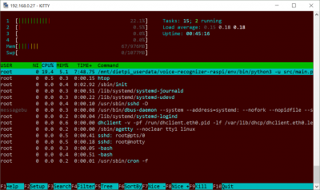
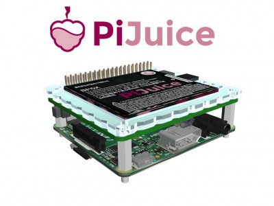
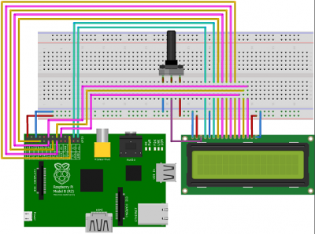
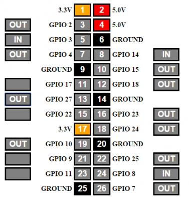
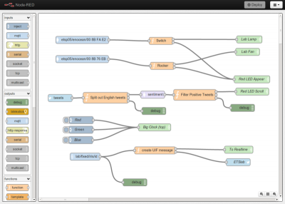
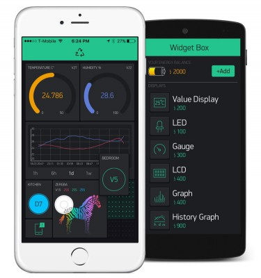
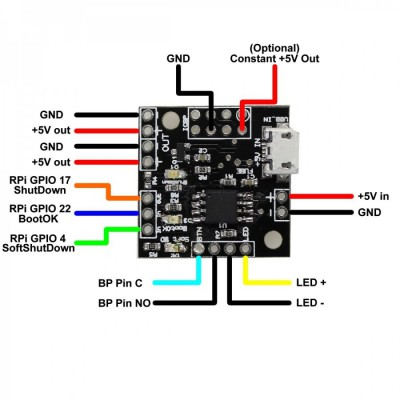
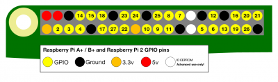
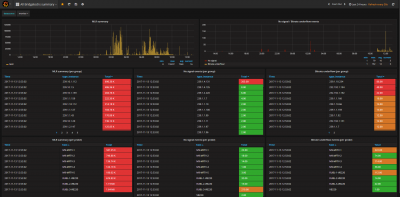

# Hardware Projects

## Overview

- [**Google AIY - Voice kit "Ok, Google"!**](#google-aiy)
- [**Mycroft AI - Open source voice assistant**](#mycroft-ai)
- [**PiJuice - PiSupply UPS/battery power system**](#pijuice)
- [**RPi.GPIO - GPIO Interface library for RPi (python)**](#rpigpio)
- [**WiringPi - GPIO Interface library**](#wiringpi)
- [**WebIOPi - Web interface to control RPi GPIO**](#webiopi)
- [**Node-RED - Visual tool for wiring together hardware devices, APIs and online services**](#node-red)
- [**Mosquitto - Message broker that implements MQTT protocol**](#mosquitto)
- [**Blynk Server - iOS and Android apps to control Arduino, ESP8266, Raspberry Pi and similar microcontroller boards over the Internet**](#blynk-server)
- [**Audiophonics PI-SPC - Power control module for Raspberry Pi, allowing physical button power on/off**](#audiophonics-pi-spc)
- [**Grafana - The open platform for beautiful analytics and monitoring**](#grafana)

??? info "How do I run **DietPi-Software** and install **optimised software**?"
    To install any of the **DietPi optimised software** listed below run from the command line:

    ```sh
    dietpi-software
    ```

    Choose **Software Optimised** and select one or more items. Finally click on `Install`. DietPi will do all the necessary steps to install and start these software items.

    {: width="643" height="365" loading="lazy"}

    To see all the DietPi configurations options, review [DietPi Tools](../../dietpi_tools/) section.

## Google AIY

"Ok Google. Who is your daddy?"

???+ note "Our installation is highly optimized and lightweight"

    We do not install a desktop environment. User will be required to setup Google API and keys on another system (please see first run setup below).  
    We highly recommend SSH to allow for a quick setup of Google API and device link.  
    We also recommend one of [DietPi File servers](https://dietpi.com/docs/software/file_servers/), for easy transfer of `assistant.json`, generated during Google API setup.

{: width="400" height="239" loading="lazy"}

=== "First run setup"

    Once DietPi has installed the Google AIY voice kit, and rebooted, you will need to setup your Google API account and link the device.

    - Follow the link below, to setup Google API and download client keys, required to enable the speech API:  
      <https://aiyprojects.withgoogle.com/voice#users-guide-1-2--turn-on-the-google-assistant-api>  
      Remark: When setting up the activity controls, ensure you also enable "Include Chrome browsing history and activity from websites and apps that use Google services", else she will not function ;)
    - Make sure you have one of [DietPi's File Servers](https://dietpi.com/docs/software/file_servers/) installed.  
      Once completed, download the `client_secret.json` and save it to:
        - If using SSH = `/mnt/dietpi_userdata/voice-recognizer-raspi/assistant.json`
        - If using File Server = `voice-recognizer-raspi/assistant.json`
    - Run the command below, then follow the onscreen link/instructions to setup verification:

        ```sh
        sudo -u dietpi /mnt/dietpi_userdata/voice-recognizer-raspi/env/bin/python3 -u /mnt/dietpi_userdata/voice-recognizer-raspi/src/main.py
        ```

    - Once the "Ok, Google" prompt appears, test the device. Then you can terminate the program with ++ctrl+c++ and restart the services:

      ```sh
      dietpi-services restart
      ```

=== "Installation notes"

    The voice software is located there:  
    `/mnt/dietpi_userdata/voice-recognizer-raspi`

=== "Check service status"

    To check the status of the service run:

    ```sh
    dietpi-services status
    ```

    {: width="500px"}

## Mycroft AI

Mycroft AI is a free and open source voice assistant.

{: width="200" height="33" loading="lazy"}

=== "Interactive install"

    1. Branch selection: For inexperienced users we recommend the master branch as well: ++y++
    2. Auto updates: It slows down the the startup process a bit, but it anyway takes a while to load all skills, so we recommend this as well: ++y++
    3. Add Mycroft commands to PATH: Chose *NO* here, since the installer runs as user `mycroft`, which is no login user, which is why this has no effect: ++n++
    4. Check code before submitting: If you are an official Mycroft developer, choose ++y++, else: ++n++

=== "Initial setup"

    1. If you did no reboot after install, load Mycroft commands to current shell session: `. /etc/bashrc.d/mycroft.sh`
    2. Start CLI client: `mycroft-cli-client`
    3. You should see and at best hear the invitation to pair your device, e.g.: `PairingSkill - INFO - Pairing code: XXYYZZ`
    4. Visit <https://home.mycroft.ai/> to start pairing and configuring your device and skills.

=== "Build Mimic for offline TTS (British Male) support (optional)""

    Remark: this requires about 3 GiB of RAM and takes a while, so assure that you have enough memory (4 GiB recommended), in case increase your swap file size and grab yourself a coffee.

    ```sh
    cd /mnt/dietpi_userdata/mycroft-core
    sudo -u mycroft ./scripts/install-mimic.sh $(nproc)
    ```

## PiJuice

PiJuice is an all in one, battery based power supply HAT for the RPi, featuring UPS capabilities and battery run time.

{: width="400" height="300" loading="lazy"}

=== "Basic information"

    Our default installation does not include the desktop application. If required, please install a desktop first, then execute the following command to install the GUI afterwards:

    ```sh
    apt install pijuice-gui
    ```

    The PiJuice program can then be launched (LXDE) from LXDE start \> Preferences

    - SW1 = Power on unit
    - SW2 = Power off unit (runs a sample script which can be modified `/var/lib/dietpi/dietpi-software/installed/pijuice/pijuice_func1.sh`)
    - Additional configuration can be made via editing the following file (Full list of available config options):

        ```sh
        nano /var/lib/pijuice/pijuice_config.JSON
        ```

    Restart services to apply any changes:  
    `dietpi-services restart`

=== "Update firmware"

    At the time of writing, this will update firmware on the device to `V1.1_2018_01_15`, however, please replace the firmware link with the latest version:

    ```sh
    wget https://github.com/PiSupply/PiJuice/raw/master/Firmware/PiJuice-V1.1_2018_01_15.elf.binary -O package.binary
    chmod +x package.binary
    pijuiceboot 14 package.binary
    ```

## RPi.GPIO

The standard, well known GPIO interface library for the RPi (Python). Bring out the engineer in you!

{: width="250" height="186" loading="lazy"}

***

Website: <https://pypi.python.org/pypi/RPi.GPIO>

## WiringPi

Alternative GPIO interface library based on C. Bring out the engineer in you!

{: width="250" height="186" loading="lazy"}

=== "View installed examples/documentation"

    ```sh
    cd /root/wiringPi*
    ls -l
    ```

=== "Test/view GPIO"

    ```sh
    gpio -v
    gpio readall
    ```

***

Website: <http://wiringpi.com>

## WebIOPi

WebIOPi allows you to control your Raspberry Pi's GPIO hardware using a web interface.

{: width="200" height="212" loading="lazy"}

=== "Access to the web interface"

    The web interface is accessible via port **8000**:

    - URL = `http://<your.IP>:8000`
    - Username = `webiopi`
    - Password = `raspberry`

=== "Change the login password"

    - Run `webiopi-passwd`
    - Enter the username `webiopi`
    - Enter your new password twice

    You must also restart the `webiopi` service for your new password to take effect:  
    `service webiopi restart`

=== "Access WebIOPi over the internet"

    To be able to access your WebIOPi interface over the internet, you may install [Remot3.it (Weaved)](https://dietpi.com/docs/software/remote_desktop/#remot3it-weaved-access-your-device-over-the-internet).

***

Website: <https://webiopi.trouch.com>

## Node-RED

Node-RED is a visual tool for wiring together hardware devices, APIs and online services in new and interesting ways. Node-RED uses a standalone web server that can be accessed remotely.

{: width="400" height="286" loading="lazy"}

=== "Access to the programming IDE"

    The web interface is accessible via port **1880**:

    - URL = `http://<your.IP>:1880`

=== "Access to the dashboard"

    To install the Node-RED dashboard, the user interface of Node-RED, use settings "Manage palette" from programming IDE or run the following command from console:

    ```sh
    node-red-admin install node-red-dashboard
    ```

    Use the following URL to connect to the dashboard from your browser:  
    `https://<your.IP>:1880/ui/`

=== "Data and config directory"

    Node-RED, all configs and data is stored in the following location:  
    `/mnt/dietpi_userdata/node-red`

=== "View logs"

    To view Node-RED service logs, run the following command from console:

    ```sh
    journalctl -u node-red
    ```

=== "Update to current version"

    You can update Node-RED modules via programming IDE. To update the "node-red" core module, run the following command from console:

    ```sh
    systemctl stop node-red
    cd /mnt/dietpi_userdata/node-red
    sudo -u nodered npm up node-red
    systemctl start node-red
    ```

    The current Node-RED version can be read in the programming IDE in the *burger menu* at the right upper corner.

***

Website: <https://nodered.org>  
Libraries resp. flows: <https://flows.nodered.org>

## Mosquitto

Eclipse Mosquitto™ is an open source (EPL/EDL licensed) message broker that implements the MQTT protocol versions 3.1 and 3.1.1.  
MQTT provides a lightweight method of carrying out messaging using a publish/subscribe model. This makes it suitable for "Internet of Things" messaging such as with low power sensors or mobile devices such as phones, embedded computers or microcontroller like the Arduino.

{: width="100" height="76" loading="lazy"}

***

Official documentation: <https://mosquitto.org/documentation>

## Blynk Server

Platform with iOS and Android apps to control Arduino, ESP8266, Raspberry Pi and similar microcontroller boards over the Internet.

Also installs:

- Blynk JS Library

{: width="375" height="400" loading="lazy"}

=== "Installation notes"

    DietPi installs Blynk (including user data and config file) to the following location:  
    `/mnt/dietpi_userdata/blynk`

    Log files can be found in:  
    `/var/log/blynk`

    We created a `systemd` service for Blynk, DietPi will automatically start this:

    ```sh
    systemctl status blynkserver
    ```

    DietPi will also install ***Blynk JS Library***, along with this installation. Please skip this section when you reach the Blynk user guide.

=== "Access to the web admin interface"

    The web interface uses port **9443**:

    - URL = `https://<your.IP>:9443/admin`
    - Default user: `admin@blynk.cc`
    - Default password: `admin`

    These values can be adjusted by editing the config file below.

=== "Server configuration"

    Remark: The config file changes in the web UI do not have an effect yet: <https://github.com/blynkkk/blynk-server/issues/1318>

    To change settings you need to edit  
    `/mnt/dietpi_userdata/blynk/server.properties`  
    and restart the Blynk server:

    ```sh
    systemctl restart blynkserver
    ```

=== "Getting started with Blynk app"

    To log into your own server, press `Log In`, then the three dots at the bottom and switch the slider to `CUSTOM`. There you can enter your own Blynk servers IP/domain and use the above login credentials.

    You can then skip creating an external Blynk account and instead go on and create a new project directly: <https://docs.blynk.cc/#getting-started-getting-started-with-the-blynk-app-2-create-a-new-project>

=== "Run test script"

    Once you create a project in the iOS/Android app, replace the following with your `auth code`, then run the command:  
    `blynk-client Replace_With_Your_Auth_Code`

=== "Update to the latest version"

    Update Blynk with: `dietpi-software reinstall 131`.

***

Official documentation: <http://docs.blynk.cc>  
Install Blynk App (Android): <https://play.google.com/store/apps/details?id=cc.blynk>

## Audiophonics PI-SPC

Power control module for Raspberry Pi which allows you to physically power on/off the system, without the need to run `poweroff`.
See <https://www.audiophonics.fr/fr/kits-et-modules-diy/audiophonics-pi-spc-v2-module-de-controle-alimentation-type-atx-pre-assemble-p-11125.html> for further details.

{: width="400" height="400" loading="lazy"}

???+ notes "Ensure correct GPIO pins!"

    Please ensure the correct GPIO pins are used, when connecting Pi-SPC to RPi (see image below).  

    {: width="400" height="119" loading="lazy"}

To power off the system begin the shutdown process: Hold the power button for < 0.5 seconds. If you don't have a button, you can also close the pins `BP PIN C` and `BP PIN NO`, with your favorite electrically conductive metal (e.g.: tweezers).  
Remark: Avoid holding the power button for longer than 2 seconds, as this will hard power off the system (same effect as pulling the power cord). Doing so will create file-system corruptions, during shutdown IO operations.

## InfluxDB

InfluxDB is a database optimized to save time based data as logs or data from a sensor.  
The main interface to the database for management and data transferred are HTTP requests that are handled directly by the `influxdb` service (default port being used is 8086).

The data can be nicely viewed with Grafana.  
This installation and documentation was possible, thanks to [@marcobrianza](https://github.com/MichaIng/DietPi/issues/1784#issuecomment-390778313).

{: width="300" height="112" loading="lazy"}

### Usage

The package comes with a command line tool `influx` for database management operations.  
This tool also uses HTTP so it can manage a database on a remote machine setting the -host option.

#### Create a database

To create a database execute:

```sh
influx -execute 'create database mydb'
```

Alternative method:

```sh
curl -i -XPOST http://localhost:8086/query --data-urlencode "q=CREATE DATABASE mydb"
```

#### Posting data

Data can be posted by executing:

```sh
curl -i -XPOST 'http://localhost:8086/write?db=mydb' --data-binary 'temperature value=20.12'
```

#### Show data

```sh
influx -database mydb -execute 'SELECT * FROM temperature'
```

Alternative method:

```sh
curl -i -XPOST http://localhost:8086/query?db=mydb --data-urlencode "q=SELECT * FROM temperature"
```

#### Authentication

By default HTTP authentication is disabled. To enable it, change `auth-enabled = true` in the configuration file `/etc/influxdb/influxdb.conf`. Then restart services with `dietpi-services restart`.

#### Create users and authorizations from `influx` CLI

To start the InfluxDB database management interface enter:

```sh
influx -username admin -password admin01
```

Then create the database entries:

```sh
CREATE USER admin WITH PASSWORD 'admin01' WITH ALL PRIVILEGES
CREATE USER test_user WITH PASSWORD 'test_user01'
GRANT ALL ON mydb TO test_user
exit
```

### Install information

The data location for InfluxDB is stored resp. linked with symbolic links to the DietPi userdata directory: `/mnt/dietpi_userdata/influxdb`.

***

Official documentation: <https://docs.influxdata.com/influxdb>

## Grafana

The open platform for beautiful analytics and monitoring.

This installation and documentation was possible, thanks to [@marcobrianza](https://github.com/MichaIng/DietPi/issues/1784#issuecomment-390778313).  
Remark: Grafana binaries are specific to the CPU architecture, therefore, swapping SD cards between RPi 1 <> 2+, is not recommended.

{: width="400" height="197" loading="lazy"}

=== "Prerequisites"

    A database server is required for Grafana. As Grafana offers many options (InfluxDB/MySQL), we have not automatically installed either as manual configuration may be preferred.  
    However, we highly recommend installing [InfluxDB](../databases/#influxdb).

    You can do this using the install steps provided by **DietPi-Software** tool or running the next command line in the terminal:
    
    ```sh  
    dietpi-software install 74
    ```

    After the InfluxDB is installed, please follow the database creation guide [here](../databases/#influxdb).

=== "Access to the web interface"

    The web interface is accessible via port **3001**:

    - URL = `http://<your.IP>:3001`
    - Username = `admin`
    - Password = `<your global password>`

=== "Usage information"

    If you have created a database as per the InfluxDB online documentation, please follow these instructions:

    - From the Home Dashboard click `Add data source`, then enter the following information:
        - Type = `InfluxDB`
        - URL = `http://localhost:8086`
        - Database = `mydb`
        - Username = `test_user`
        - Password = `test_password01`
        - Leave the remaining items with the default values.
    - Click `Save & Test`
    - From the Home Dashboard
        - click `New dashboard`
        - click `Graph`
        - click on the example graph
        - Press ++e++ to edit the Data Source and the custom query

=== "Installation information"

    The data location for Grafana is stored resp. linked with symbolic links to the DietPi userdata directory:  
    `/mnt/dietpi_userdata/grafana`.

[Return to the **Optimised Software list**](../../software/)
