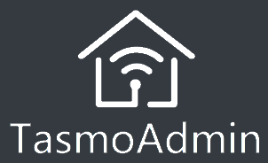

# Home Automation

## Overview

- [**Home Assistant - Open-source home automation platform running on Python 3**](#home-assistant)
- [**Domoticz - Multi platform Home Automation System**](#domoticz)
- [**TasmoAdmin - Administrative website for Tasmota devices**](#tasmoadmin)

??? info "How do I run **DietPi-Software** and install **optimised software** items?"
    To install any of the **DietPi optimised software items** listed below run from the command line:

    ```sh
    dietpi-software
    ```

    Choose **Browse Software** and select one or more items. Finally select `Install`.  
    DietPi will do all the necessary steps to install and start these software items.

    {: width="643" height="365" loading="lazy"}

    To see all the DietPi configurations options, review the [DietPi Tools](../../dietpi_tools/) section.

[Return to the **Optimised Software list**](../../software/)

## Home Assistant

Home Assistant is an open-source home automation platform running on Python 3. Track and control all devices at home and automate control. Perfect to run on a Raspberry Pi.

{: width="500" height="184" loading="lazy"}

=== "Initial install and access"

    !!! info "Long installation duration"
        The install process on slower SBC models can take a very long time, up to 2 hours, hence take a coffee, find some other activity and check back once in a while. It will show Installing Python-3.x.x... a very long time.  
        If you want to see processing details, run `htop` on a dedicated terminal or SSH session to watch Python build process live.

    After `dietpi-software` has finished and the service starts the first time, please go through the following steps manually:

    - Run `htop` and wait until the CPU usage of the `homeassistant` processes goes down to nearly zero.
    - Run `systemctl restart home-assistant`
    - Run `htop` and wait until the CPU usage of the `homeassistant` processes goes down to nearly zero.
    - Open the HA web UI (see "Access to the web interface" tab). It will again install some Python modules on first access, which can again take a little while. Always check `htop` if you are unsure, which reveals any currently running Python/pip module install process.

    !!! tip "Optional usage of the Home Assistant Community Store (HACS)"
        The Home Assistant Community Store (HACS) provides further community driven integrations, themes, etc.  
        To activate it, follow this guide: <https://hacs.xyz/docs/configuration/basic/>

=== "Access to the web interface"

    The web interface is accessible via port **8123**:

    URL: `http://<your.IP>:8123`

=== "Configuration files"

    The configuration files are stored system-wide within:  
    `/mnt/dietpi_userdata/homeassistant`

    Please see the online documentation: <https://home-assistant.io/docs/>

=== "Customize Python environment"

    Home Assistant is installed within a dedicated Python environment, powered by: <https://github.com/pyenv/pyenv>.  
    This places a standalone Python instance which runs completely independent from any other installed Python instance or modules. If you need to install additional Python modules into this pyenv environment, update Python itself or similar, you need to open a shell as user `homeassistant` and activate the pyenv environment:

    ```sh
    sudo -u homeassistant bash
    . /home/homeassistant/pyenv-activate.sh
    pip3 install <module> # Or whichever install/update you need to do
    ```

=== "Known additional dependencies for device integration"

    IKEA TRÅDFRI: `apt install autoconf`

=== "View logs"

    To view Home Assistant logs, run the following command from console:

    ```sh
    journalctl -u home-assistant
    ```

=== "Update"

    To quickly update Home Assistant to the current version, run:

    ```sh
    /home/homeassistant/homeassistant-update.sh
    ```

    To update as well the whole `pyenv` Python version, reinstall Home Assistant:

    ```sh
    dietpi-software reinstall 157
    ```

***

Official documentation: <https://home-assistant.io/docs>

## Domoticz

Domoticz is a Home Automation System that lets you monitor and configure various devices like lights, switches, various sensors/meters like for temperature, rain, wind, UV radiation, electric fields, gas, water and much more. Notifications/Alerts can be sent to any mobile device.

{: width="600" height="226" loading="lazy"}

=== "Access to the web interface"

    The web interface is accessible via port **8124** resp. **8424**:

    - HTTP: `http://<your.IP>:8124`
    - HTTPS: `https://<your.IP>:8424`

=== "View logs"

    ```sh
    journalctl -u domoticz
    ```

=== "Service handling"

    Use the following commands to control the Domoticz system service:

    ```sh
    systemctl status domoticz
    ```

    ```sh
    systemctl stop domoticz
    ```

    ```sh
    systemctl start domoticz
    ```

    ```sh
    systemctl restart domoticz
    ```

=== "Install directory"

    `/opt/domoticz`

=== "Data directory"

    `/mnt/dietpi_userdata/domoticz`

***

Source code: <https://github.com/domoticz/domoticz>

## TasmoAdmin

TasmoAdmin is an administrative website for devices flashed with Tasmota to be used for smart home systems.

Also installs:

- Webserver (based on your preference)
- PHP

{: width="302" height="184" loading="lazy"}

=== "Access to the web interface"

    `http://<your.IP>/tasmoadmin`

***

Source code: <https://github.com/reloxx13/TasmoAdmin>  
Credits: Implemented by @svh1985

[Return to the **Optimised Software list**](../../software/)
