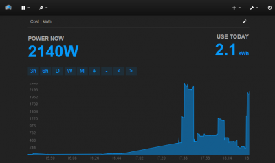
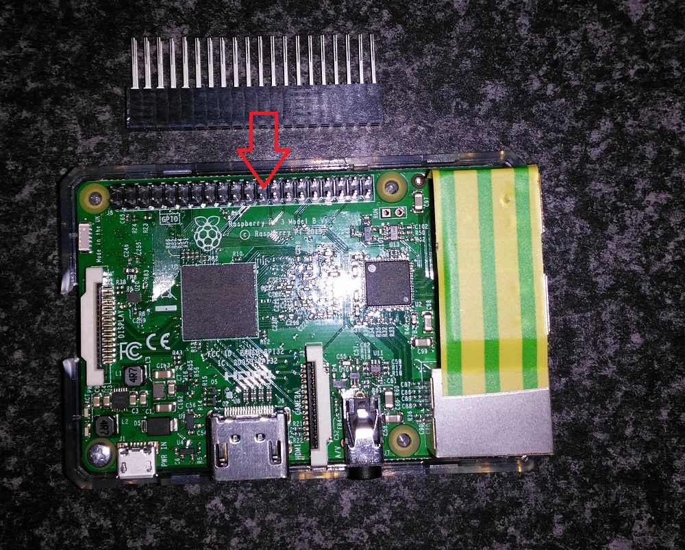
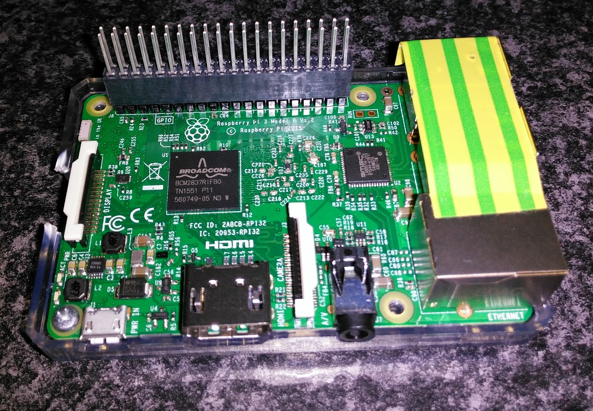
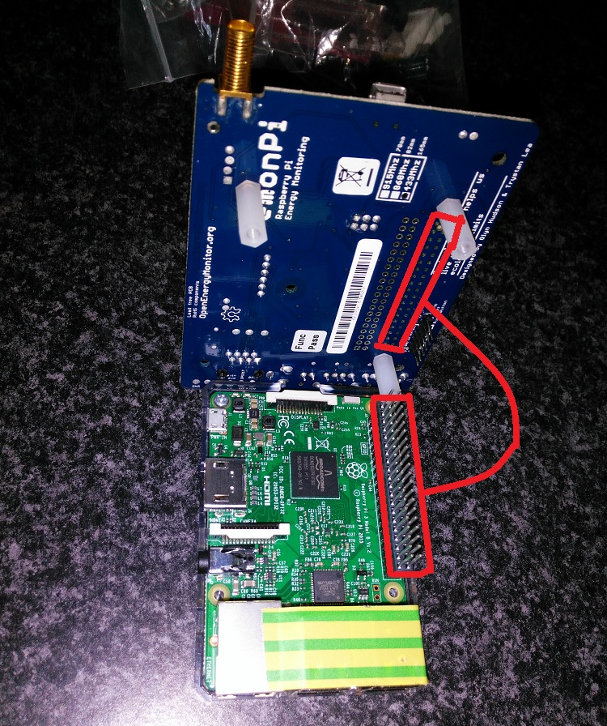
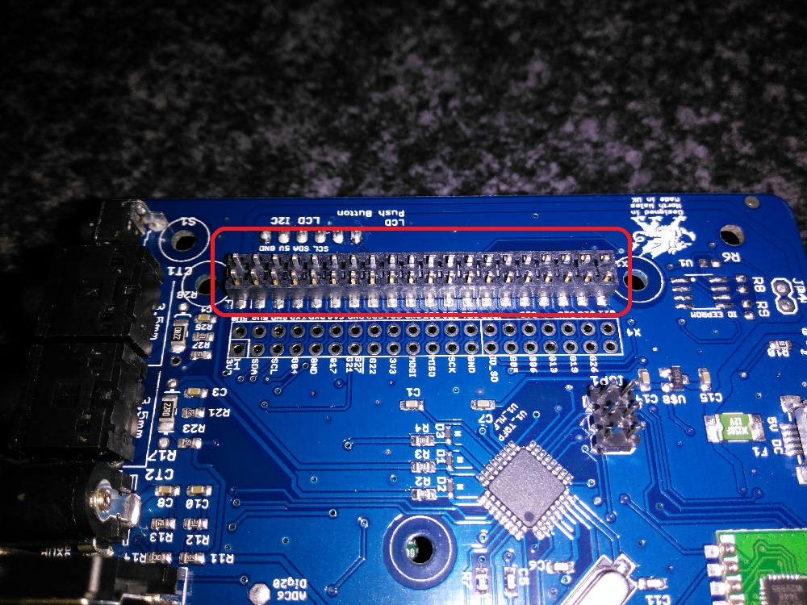
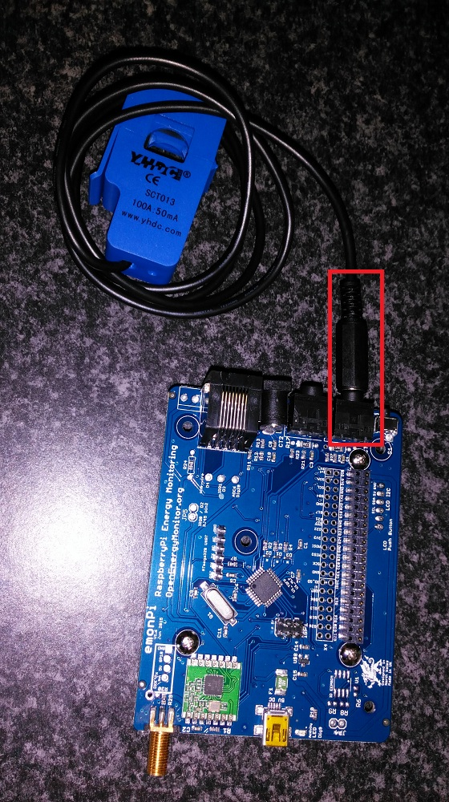
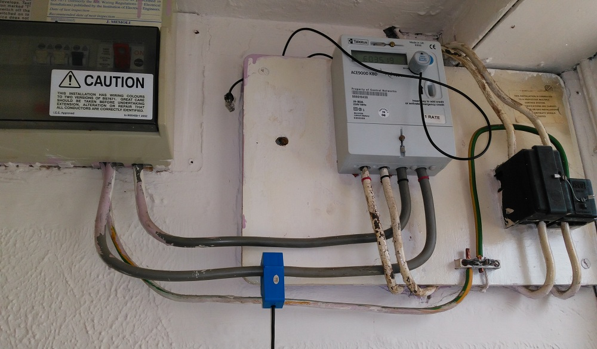
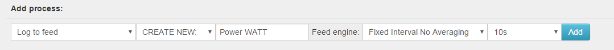
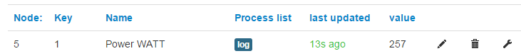

# Home Automation

## Overview

- [**Home Assistant - Open-source home automation platform running on Python 3**](#home-assistant-open-source-home-automation-platform-running-on-python-3)
- [**EmonPi - Lightweight Energy usage stats with EmonPi PCB**](#emonpi-lightweight-energy-usage-stats-with-emonpi-pcb)
- [**Domoticz - Multi platform Home Automation System**](#domoticz-multi-platform-home-automation-system)
- [**TasmoAdmin - Administrative website for Tasmota devices**](#tasmoadmin-administrative-website-for-tasmota-devices)

??? info "How do I run **DietPi-Software** and install **optimised software** ?"
    To install any of the **DietPi optimised software** listed below run from the command line:

    ```
    dietpi-software
    ```

    Choose **Software Optimised** and select one or more items. Finally click on `Install`. DietPi will do all the necessary steps to install and start these software items.

    

    To see all the DietPi configurations options, review [DietPi Tools](../../dietpi_tools) section.

[Return to the **Optimised Software list**](../../dietpi_optimised_software)

## Home Assistant - Open-source home automation platform running on Python 3

Home Assistant is an open-source home automation platform running on Python 3. Track and control all devices at home and automate control. Perfect to run on a Raspberry Pi.

{: style="width:500px"}

=== "Initial install and access"

    The install process on slower SBC models can take a very long time, up to 2 hours, hence take a coffee, find some other activity and check back once in a while. It will show Installing Python-3.8.0... a very long time.  
    If you want to see processing details, run `htop` on a dedicated terminal or SSH session to watch Python build process live.

    After `dietpi-software` has finished and the service starts the first time, please go through the following steps manually:

    - Run `htop` and wait until the CPU usage of the homeassistant processes goes down to nearly zero.
    - Run `systemctl restart home-assistant`
    - Run `htop` and wait until the CPU usage of the homeassistant processes goes down to nearly zero.
    - Open the HA web UI (see below). It will again install some Python modules on first access, which can again take a little while. Always check `htop` if you are unsure, which reveals any Python/pip module install process, if currently done.

=== "Access to the web interface"

    URL = `http://<your.IP>:8123`

=== "Configuration files"

    The configuration files are stored system-wide within:  
    `/mnt/dietpi_userdata/homeassistant`

    Please see the online documentation: <https://home-assistant.io/docs/>

=== "Customize Python environment"

    Home Assistant is installed within a dedicated Python environment, powered by: <https://github.com/pyenv/pyenv>.  
    This places a standalone Python instance which runs completely independent from any other installed Python instance or modules. If you need to install additional Python modules into this pyenv environment, update Python itself or similar, you need to open a shell as user homeassistant and activate the pyenv environment:

    ```sh
    sudo -u homeassistant bash
    . /home/homeassistant/pyenv-activate.sh
    pip3 install <module> # Or whichever install/update you need to do
    ```

=== "Update Home Assistant to current version"

    To quickly update Home Assistant to the current version, run:

    ```sh
    /home/homeassistant/homeassistant-update.sh
    ```

=== "Known additional dependencies for device integration"

    IKEA TRÅDFRI: `apt install autoconf`

## EmonPi - Lightweight Energy usage stats with EmonPi PCB

Turn your Raspberry Pi into a energy usage monitor with web interface.

{: style="width:500px"}

### Installation

The DietPi optimized installation for EmonPi is aimed at users who want the following:

- Ultra lightweight alternative installation to the official EmonPi image, with all the optimisations and features of DietPi. Allowing additional uses for your RPi device (e.g.: ownCloud server): [htop image of RPi Zero @700 MHz](https://dietpi.com/downloads/misc/EmonPi_Guide/EmonPi_DietPi_zero_700mhz.jpg), running our EmonPi installation.
- Real time and historical energy usage statistics uploaded to the [emoncms.org](https://emoncms.org/) cloud, viewable from a web browser and the [Android App](https://openenergymonitor.org/forum-archive/node/11260.html), from anywhere in the world.
- Use an existing RPi, or, do not wish to purchase the full EmonPi package (e.g.: case).
- Comfortable attaching the EmonPi to your Raspberry Pi GPIO. No soldering or wiring is required.

### Missing support

The DietPi installation does not support:

- RF transmission. RF receiver (sensor nodes) is supported (e.g.: EmonTX/EmonTH)
- EmonPi LCD screen.
- Local EmonCMS webserver on RPi. All EmonPi data is sent to [emoncms.org](https://emoncms.org/) cloud.

### Requirements

The following hardware is required:

- 1x EmonPi PCB - [Order one here](https://shop.openenergymonitor.com/emonpi-shield-kit-no-enclosure/): Select 1 Clip-on CT Current Sensor (all together £33.42), or sensors based on your needs. [Image of what you will receive](https://cdn2.bigcommerce.com/server4400/98a75/product_images/optionset_rule_images/28_zoom_1429716170.jpg).  
  This installation also supports the optional temperature sensor, but its not required.
- 1x Raspberry Pi (any model)
- 1x Good quality Raspberry Pi PSU. The EmonPi does not need its own power supply. It will draw power directly through the GPIOs on the RPi.
- Alternatively you can power the RPi through the EmonPi shield via GPIO. For this, add the EmonPi PSU to the chart and skip buying a dedicated PSU for the RPi itself.

=== "During Installation"

    You will be asked to create a [emoncms.org](https://emoncms.org/) account and input your unique API Key. DietPi will automatically apply your API Key during installation.
    If you did not complete this, or wish to change the API Key on your system, please follow the steps located here, otherwise continue below.

=== "Attach EmonPi to RPi"

    - Attach GPIO extender/riser to RPi:  
      {: style="width:400px"}  
      {: style="width:400px"}
    - Attach EmonPi to RPi:  
      {: style="width:400px"}
    - Verify pins are visible:  
      {: style="width:400px"}

=== "Connect power sensor"

    Connect the sensor to measure the power consumption to the EmonPi:

    - Plug the 3.5mm power consumption sensor into the EmonPi:  
      {: style="width:400px"}
    - Clip the power consumption sensor onto a positive (red) cable (cables are live, use caution):  
      {: style="width:400px"}

=== "Setup Inputs and feeds for power sensor"

    #### Assign a name to your power sensor input

    Inputs are the real time value of the data received from the EmonPi. We will assign a name to the power value so we can use it later.

    - Login to your `https://emoncms.org` account
    - Click `Setup` at the top right of screen, then click `Inputs`
    - Node 5 and Key 1 is your power value reading. Click the pencil on right hand side and change the name to *Power WATT*. Click the tick to save.

    #### Setup feed

    Feeds allow your EmonPi data (inputs) to be saved to a database. You will need feeds setup if you want to view historical (and pretty) stats.

    - Login to your `https://emoncms.org` account
    - Click `Setup` at the top right of screen, then click `Inputs`
    - Select the spanner on the far right of *Power WATT*
    - Check the screen matches the following image  
      {: style="width:640px"}  
      then click `add`
    - To verify the feed is active, click `Setup` at the top right of screen, then click `Inputs`. You should see `log` under *Process list* of *Power WATT*:  
      {: style="width:640px"}  

=== "Setup 'My Electric' App"

    *My electric* is an application that will allow you to view historical usage of your electricity. Also renders a pretty graph and can calculate costs.

    - Login to your `https://emoncms.org` account
    - Click `Apps` at the top of screen, then click `My Electric`
    - Under the *Logout* button at the top right, click the spanner
    - Under *Power feed (Watts)*: select `Power WATT`
    - Under *Bar graph feed*: select `Power WATT`
    - Under *Wh or kWh feed?*: select `Watt hours elapsed`
    - Enter your unit costs for your electric (optional).

    Then click `Save`.  
    Press `F5` to refresh the page and view your energy consumption.

## Domoticz - Multi platform Home Automation System

Domoticz is a Home Automation System that lets you monitor and configure various devices like: Lights, Switches, various sensors/meters like Temperature, Rain, Wind, UV, Electra, Gas, Water and much more. Notifications/Alerts can be sent to any mobile device.

{: style="width:600px"}

=== "Access to the web interface"

    - HTTP: `http://<your.IP>:8124`
    - HTTPS: `https://<your.IP>:8424`

=== "View logs"

    `journalctl -u domoticz`

=== "Install directory"

    `/opt/domoticz`

=== "Data directory"

    `/mnt/dietpi_userdata/domoticz`

See also: <https://github.com/domoticz/domoticz>

## TasmoAdmin - Administrative website for Tasmota devices

TasmoAdmin is an administrative website for devices flashed with Tasmota to be used for smart home systems.

Also installs:

- Webserver (based on your preference)
- PHP

{: style="width:200px"}

=== "Access to the web interface"

    `http://<your.IP>/tasmoadmin`

Implemented by: [@svh1985](https://github.com/svh1985)

Source code: <https://github.com/reloxx13/TasmoAdmin>

[Return to the **Optimised Software list**](../../dietpi_optimised_software)
