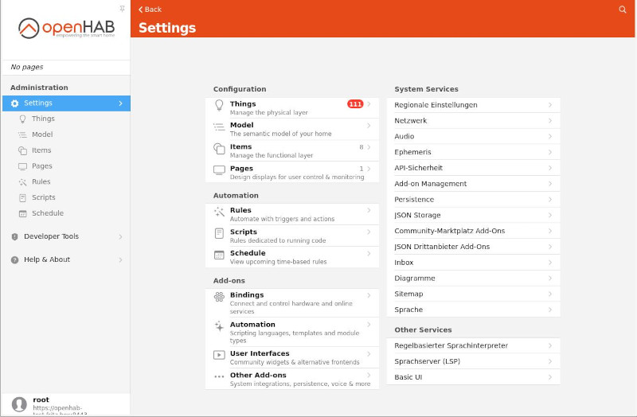

# Home Automation

## Overview

- [**Home Assistant - Open-source home automation platform running on Python 3**](#home-assistant)
- [**Domoticz - Multi platform Home Automation System**](#domoticz)
- [**TasmoAdmin - Administrative website for Tasmota devices**](#tasmoadmin)
- [**openHAB - Open Home Automation Bus, an open source home automation platform**](#openhab)
- [**Homebridge - Open Home Automation Bus, an open source home automation platform**](#homebridge)

??? info "How do I run **DietPi-Software** and install **optimised software** items?"
    To install any of the **DietPi optimised software items** listed below run from the command line:

    ```sh
    dietpi-software
    ```

    Choose **Browse Software** and select one or more items. Finally select `Install`.  
    DietPi will do all the necessary steps to install and start these software items.

    {: width="643" height="365" loading="lazy"}

    To see all the DietPi configurations options, review the [DietPi Tools](../dietpi_tools.md) section.

[Return to the **Optimised Software list**](../software.md)

## Home Assistant

Home Assistant is an open-source home automation platform running on Python 3. Track and control all devices at home and automate control. Perfect to run on a Raspberry Pi.

{: width="500" height="184" loading="lazy"}

=== "Initial install and access"

    !!! info "Automate install of additional dependencies"
        Some integrations may require additional APT and/or Python dependencies. The latter are usually installed ondemand by the Home Assistant core, when installing or accessing the integration, but APT packages need to be installed manually.  
        This can be automated with two `dietpi.txt` settings: `SOFTWARE_HOMEASSISTANT_APT_DEPS` and `SOFTWARE_HOMEASSISTANT_PIP_DEPS`

    !!! warning "Long installation duration"
        The install process on slower SBC models can take a up to 2 hours, hence take a coffee, find some other activity and check back once in a while. It will show "Installing Python-3.x.x..." a very long time.  
        If you want to see processing details, run `htop` on a dedicated terminal or SSH session to watch Python build process live.

    After `dietpi-software` has finished and the service starts the first time, please go through the following steps manually:

    - Run `htop` and wait until the CPU usage of the `homeassistant` processes goes down to nearly zero.
    - Run `systemctl restart home-assistant`
    - Run `htop` and wait until the CPU usage of the `homeassistant` processes goes down to nearly zero.
    - Open the HA web UI (see "Access to the web interface" tab). It will again install some Python modules on first access, which can again take a little while. Always check `htop` if you are unsure, which reveals any currently running Python/pip module install process.

    !!! tip "Optional usage of the Home Assistant Community Store (HACS)"
        The Home Assistant Community Store (HACS) provides further community driven integrations, themes, etc.  
        To activate it, follow this guide: <https://hacs.xyz/docs/use/configuration/basic/>

=== "Access to the web interface"

    The web interface is accessible via port **8123**:

    URL: `http://<your.IP>:8123`

=== "Configuration files"

    The configuration files are stored system-wide within:  
    `/mnt/dietpi_userdata/homeassistant`

    Please see the online documentation: <https://home-assistant.io/docs/>

=== "Customize Python environment"

    Home Assistant is installed within a dedicated Python environment, powered by: <https://github.com/pyenv/pyenv>.  
    This places a standalone Python instance which runs completely independent from any other installed Python instance or modules. If you need to install additional Python modules into this pyenv environment, update Python itself or similar, you need to open a shell as user `homeassistant` and activate the pyenv environment:

    ```sh
    sudo -u homeassistant bash
    . /home/homeassistant/pyenv-activate.sh
    pip3 install <module> # Or whichever install/update you need to do
    ```

=== "Known additional dependencies for device integration"

    IKEA TRÅDFRI: `apt install autoconf`

=== "View logs"

    To view Home Assistant logs, run the following command from console:

    ```sh
    journalctl -u home-assistant
    ```

=== "Update"

    To quickly update Home Assistant to the current version, run:

    ```sh
    /home/homeassistant/homeassistant-update.sh
    ```

    Home Assistant updates may drop support for old Python versions. The release notes would inform about this: <https://github.com/home-assistant/core/releases>  
    To update the `pyenv` Python version along with Home Assistant, reinstall it. Since Python dependencies need to be reinstalled, the first service start, and accessing certain integrations for the first time, may again take a while:

    ```sh
    dietpi-software reinstall 157
    ```

***

Official website: <https://www.home-assistant.io/>  
Official documentation: <https://home-assistant.io/docs>  
Source code: <https://github.com/home-assistant/core>  
License: [Apache-2.0](https://github.com/home-assistant/core/blob/dev/LICENSE.md)

## Domoticz

Domoticz is a Home Automation System that lets you monitor and configure various devices like lights, switches, various sensors/meters like for temperature, rain, wind, UV radiation, electric fields, gas, water and much more. Notifications/Alerts can be sent to any mobile device.

{: width="600" height="226" loading="lazy"}

=== "Access to the web interface"

    The web interface is accessible via port **8124** resp. **8424**:

    - HTTP: `http://<your.IP>:8124`
    - HTTPS: `https://<your.IP>:8424`
    - Username: `admin`
    - Password: `domoticz`

    !!! tip "Change default user and password"
        We recommend to create a new user with admin privileges via **Setup** -> **Users** and remove the default one, or at least change the default password.

=== "View logs"

    ```sh
    journalctl -u domoticz
    ```

=== "Service handling"

    Use the following commands to control the Domoticz system service:

    ```sh
    systemctl status domoticz
    ```

    ```sh
    systemctl stop domoticz
    ```

    ```sh
    systemctl start domoticz
    ```

    ```sh
    systemctl restart domoticz
    ```

=== "Install directory"

    `/opt/domoticz`

=== "Data directory"

    `/mnt/dietpi_userdata/domoticz`

***

Official website: <https://www.domoticz.com/>
Official docs: <https://www.domoticz.com/wiki/Main_Page>
Official forum: <https://www.domoticz.com/forum/>
Source code: <https://github.com/domoticz/domoticz>

## TasmoAdmin

TasmoAdmin is an administrative website for devices flashed with Tasmota to be used for smart home systems.

Also installs:

- Webserver (based on your preference)
- PHP

{: width="302" height="184" loading="lazy"}

=== "Access to the web interface"

    `http://<your.IP>/tasmoadmin`

***

Source code: <https://github.com/reloxx13/TasmoAdmin>  
Credits: Implemented by @svh1985

## openHAB

openHAB (open Home Automation Bus) is an open source home automation platform. The *keywords* are *Bindings*, *Things*, *Channels*, *Items*, *Rules*, *Pages*.

{: width="600" height="393" loading="lazy"}

=== "Access to the web interface"

    The web interface is accessible via port **8444**:

    - URL: `https://<your.IP>:8444`
    - Username/Password: Are set at first web interface login

=== "Directories"

    - Install directory: `/usr/share/openhab`
    - Site configuration directory: `/etc/openhab`
    - Config file: `/etc/default/openhab`
    - Data directory: `/var/lib/openhab`

    See also [openHAB file locations](https://www.openhab.org/docs/installation/linux.html#file-locations).

=== "View logs"

    ```sh
    journalctl -u openhab
    ```

=== "HTTP access"

    Per default, HTTPS is active and HTTP is inactive (DietPi recommendation).  
    In cases, that HTTP shall be used, it can be activated in the file `/etc/default/openhab` by setting `OPENHAB_HTTP_PORT=` to your desired port.

Official website: <https://www.openhab.org/>  
Official docs: <https://www.openhab.org/docs/>  
Official community: <https://community.openhab.org/>

## Homebridge

Homebridge allows you to integrate with smart home devices that do not natively support HomeKit. There are over 2,000 Homebridge plugins supporting thousands of different smart accessories.

{: width="300" height="300" loading="lazy"}

=== "Access to the web interface"

    The web interface is accessible via port **8581**:

    - URL: `https://<your.IP>:8581`
    - Username/Password: Are set at first web interface login

=== "Directories"

    - Install directory: `/opt/homebridge`
    - Config, Log & Backup folder: `/var/lib/homebridge`

=== "View logs"

    ```sh
    journalctl -u homebridge
    cat /var/lib/homebridge/homebridge.log
    ```

=== "Service handling"

    Use the following commands to control the Homebridge system service:

    ```sh
    hb-service status
    ```

    ```sh
    hb-service start
    ```

    ```sh
    hb-service stop
    ```

    ```sh
    hb-service restart
    ```

=== "Update Node.js"

    Use the following command to update the bundled Node.js runtime (do not use `sudo` if running from the Homebridge UI Terminal):

    ```sh
    sudo hb-service update-node 
    ```

Official website: <https://homebridge.io/>  
Official docs: <https://github.com/homebridge/homebridge/wiki>  

[Return to the **Optimised Software list**](../software.md)
