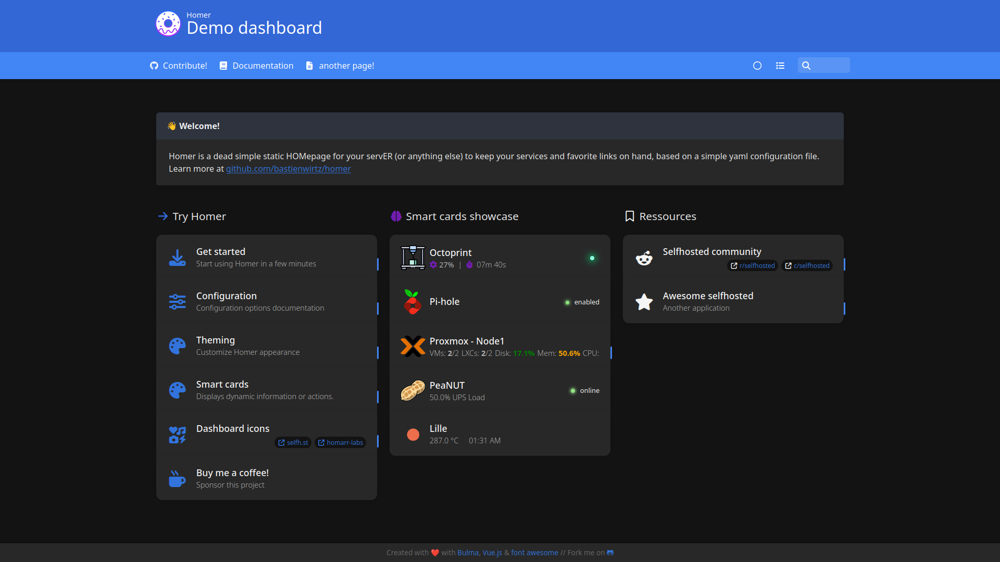

# Cloud & Backup systems

## Overview

- [**Homer**](#Homer)


??? info "How do I run **DietPi-Software** and install **optimised software** items?"
    To install any of the **DietPi optimised software items** listed below run from the command line:

    ```sh
    dietpi-software
    ```

    Choose **Browse Software** and select one or more items. Finally select `Install`.  
    DietPi will do all the necessary steps to install and start these software items.

    {: width="643" height="365" loading="lazy"}

    To see all the DietPi configurations options, review the [DietPi Tools](../../dietpi_tools/) section.

[Return to the **Optimised Software list**](../../software/)

## Homer

Homer is a modern and lighweight dashboard & homepage for your services

Also Installs:

- Nginx

{: width="400" height="218" loading="lazy"}

=== "Quick start"

    Homer is accessible via port 49157 by default

		- URL: `http://<your.IP>:49157`
    
		You may bookmark this and save it as your browser's home page, or preferably look into tools like nginx proxy manager and adguard home to give it a nice domain name such as homer.box.
		A guide on that specific setup is explained under the nginx-proxy-manager page.
     
=== "Configuration"

		To configure entries and icons for homer, you can edit it's config.yml file 

 		{: width="400" height="218" loading="lazy"}
 
		In the screenshot above, a column titled selfhosted is being made which contains 4 entries. In the same directory as the config.yml i've made the icons2 folder which contains icon images
	
=== "Theming - Dracula"

 		To apply the dracula theme to homer simply follow the steps below:
		
		1) `apt install git -y && git clone https://github.com/dracula/homer.git`
		2) `cp homer/custom.css /mnt/dietpi_userdata/Homer/assets/custom.css`
		3) `cp homer/dracula-background.png /mnt/dietpi_userdata/Homer/assets/dracula-background`
		
		Edit your config.yml with the below command:
		
		`nano /mnt/dietpi_userdata/Homer/assets/config.yml`
		
		And add the following lines:
		
		```
		# Will load Dracula theme.
		stylesheet:
  	  - "assets/custom.css"
		```
		
=== "Theming - Macos Theme"
		
		To apply a macos styled theme to homer simply follow the steps below:
		
		1) `apt install git -y && $ git clone https://github.com/WalkxCode/Homer-Theme.git``
		2) `cp Homer-Theme/custom.css /mnt/dietpi_userdata/Homer/assets/custom.css`
		3) `cp Homer-Theme/wallpaper.jpeg /mnt/dietpi_userdata/Homer/assets/wallpaper.jpeg`
		4) `cp -r Homer-Theme/fonts /mnt/dietpi_userdata/Homer/assets/`
		
		And add the following lines:
		
		Make sure to remove colors, theme, and columns if they previously existed
		
		```
		stylesheet:
		  - "assets/custom.css"

		columns: "3" # You can change this to any number that is a factor of 12: (1, 2, 3, 4, 6, 12)
		theme: default
		colors:
		  light:
		highlight-primary: "#fff5f2"
		    highlight-secondary: "#fff5f2"
				highlight-hover: "#bebebe"
				background: "#12152B"
				card-background: "rgba(255, 245, 242, 0.8)"
				text: "#ffffff"
				text-header: "#fafafa"
				text-title: "#000000"
				text-subtitle: "#111111"
				card-shadow: rgba(0, 0, 0, 0.5)
				link: "#3273dc"
				link-hover: "#2e4053"
				background-image: "../assets/wallpaper.jpeg" # Change wallpaper.jpeg to the name of your own custom wallpaper!
			dark:
				highlight-primary: "#181C3A"
				highlight-secondary: "#181C3A"
				highlight-hover: "#1F2347"
				background: "#12152B"
				card-background: "rgba(24, 28, 58, 0.8)"
				text: "#eaeaea"
				text-header: "#7C71DD"
				text-title: "#fafafa"
				text-subtitle: "#8B8D9C"
				card-shadow: rgba(0, 0, 0, 0.5)
				link: "#c1c1c1"
				link-hover: "#fafafa"
				background-image: "../assets/wallpaper.jpeg"
		```
		
***

Official website: <https://github.com/bastienwirtz/homer>  
Official demo: <https://homer-demo.netlify.app/>


[Return to the **Optimised Software list**](../../software/)
