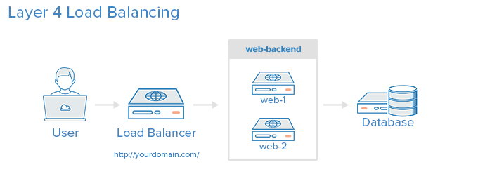
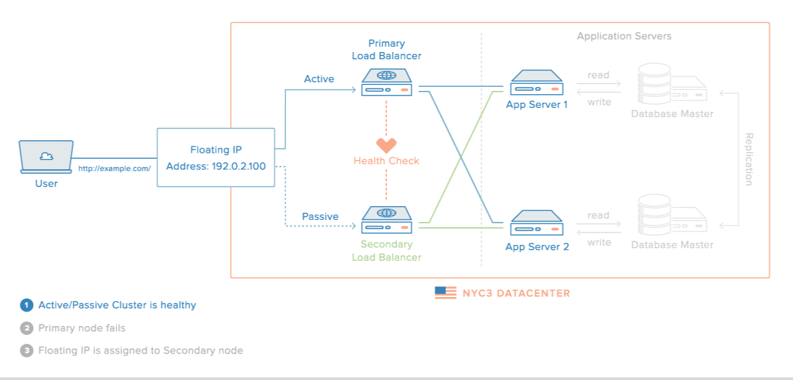
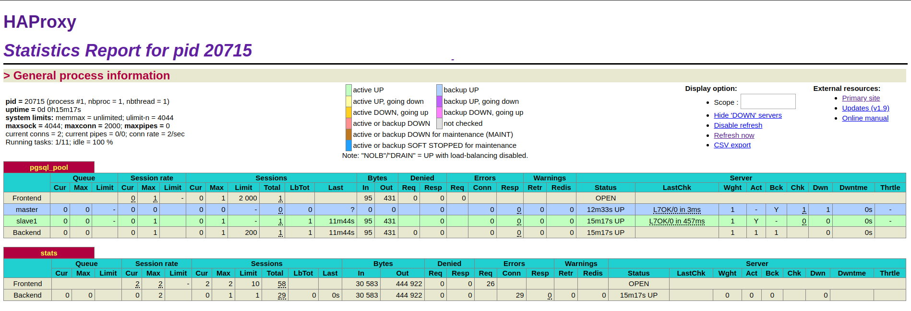

# Network Load Balancing

## HAProxy - High performance TCP/HTTP load balancer

HAProxy, which stands for High Availability Proxy, is a popular open source software TCP/HTTP Load Balancer and proxying solution. Its most common use is to improve the performance and reliability of a server environment by distributing the workload across multiple servers (e.g. web, application, database). 

It is best suited for high traffic web sites and powers quite a number of the world's most visited ones: GitHub, Imgur, Instagram, and Twitter. It has become the de-facto standard opensource load balancer, and it is often deployed by default in cloud platforms. 

!!! warning ""
    This software title is recommended ONLY for advanced users !

=== "Quick start"
    After installation, you need to manually modify the `haproxy.cfg` to best fit your network requirements. Check the configuration manual [here](http://www.haproxy.org#docs).

    ``` bash
    systemctl stop haproxy
    nano /etc/haproxy/haproxy.cfg
    systemctl start haproxy    
    ```

    Access web interface stats:
    ``` bash
    URL = http://<your.local.ip>:1338
    Username = admin
    Password = dietpi
    ```

    !!! hint ""
        This installation was made possible by Jerome Queneuder, who provided the methods for compiling and installation.

=== "Load balancing"

    The simplest way to load balance network traffic to multiple servers is to use layer 4 (transport layer) load balancing. Load balancing this way will forward user traffic based on IP range and port.

    

    The user accesses the load balancer, which forwards the user’s request to the web-backend group of backend servers. Whichever backend server is selected will respond directly to the user’s request.

    Help text extracted from the tutorial: [An Introduction to HAProxy and Load Balancing Concepts](https://www.digitalocean.com/community/tutorials/an-introduction-to-haproxy-and-load-balancing-concepts)

=== "High availability"

    A high availability (HA) setup is an infrastructure without a single point of failure. It prevents a single server failure from being a downtime event by adding redundancy to every layer of your architecture. A load balancer facilitates redundancy for the backend layer (web/app servers), but for a true high availability setup, you need to have redundant load balancers as well.

    Here is a diagram of a basic high availability setup:
    
    
    Help text extracted from the tutorial: [An Introduction to HAProxy and Load Balancing Concepts](https://www.digitalocean.com/community/tutorials/an-introduction-to-haproxy-and-load-balancing-concepts)

=== "Official documentation"
    [Website HAProxy Community Edition](http://www.haproxy.org)
    
    [HAProxy Documentation](http://www.haproxy.org#docs)



[Return to the **Optimised Software list**](../../dietpi_optimised_software)
