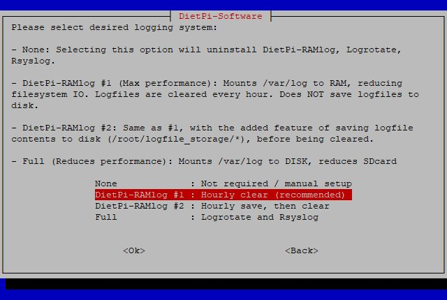

# Log System Choices

## Overview

- [**DietPi-RAMlog - Lightweight RAM logging**](#dietpi-ramlog)
- [**Full - Full logging system with Rsyslog and Logrotate**](#full-logging)

Various logging methods can be selected from lightweight to full. If you don't require log files, get a performance boost. If you need full persistent system logging features, DietPi can do that too.

The *Log System* can be changed at any time by running `dietpi-software` and selecting "Log System" from the menu.

{: style="width:200px"}

??? info "How do I set the **Log System** ?"
    To select the **Log System** listed below run from the command line:

    ```
    dietpi-software
    ```

    Choose **Log System** and select the desired item. Finally click on `Install`. DietPi will do all the necessary steps to change to the desired log system.

    {: style="width:400px"}

[Return to the **Optimised Software list**](../../software/)

## DietPi-RAMlog

Lightweight tmpfs-based RAM logging solution, which reduces disk I/O and might increase application performance.

=== "DietPi-RAMlog #1 (default)"

    This option is ideal for users who do not require log files.

    Pros/Cons:  
    \+ Mounts */var/log* to RAM  
    \+ Increases overall system performance  
    \+ Increases the life of your SD card by reducing filesystem IO (read/writes)  
    ─ DietPi will automatically clear log files in */var/log* every hour (to free memory)  
    ─ Log files are NOT saved to disk  
    ─ Rsyslog is not installed to save resources. This may prevent some programs logging that rely on Rsyslog

    Remark: If Rsyslog is required, it can be manually installed with `apt install rsyslog`.

=== "DietPi-RAMlog #2"

    This option is ideal for users who require the ability to keep log files, with the benefit of improved performance.

    Pros/Cons:  
    \+ Mounts */var/log* to RAM  
    \+ Increases overall system performance  
    \+ DietPi will automatically save/update log file data to disk every hour */root/log_file_storage*  
    \+ DietPi will then clear log files in */var/log* (to free memory used by DietPi-RAMlog)  
    ─ Potential of loosing up to 1 hour of log file data if power is interrupted  
    ─ Will increase SD card write cycles on an hourly basis to save logs  
    ─ Rsyslog is not installed to save resources. This may prevent some programs logging that rely on Rsyslog

    Remark: If Rsyslog is required, it can be manually installed with `apt install rsyslog`.

    Remark: This option significantly writes less so than a constant log writing system, e.g. the *Full logging mode*.  
    See also <https://www.raspberrypi.org/forums/viewtopic.php?t=11258#p123670>.

## Full Logging

This option is ideal for users who require persistent maximum logging, with no interference from DietPi. Rsyslog and Logrotate are installed as well to make core system logs available as text files in `/var/log` while limiting the growth of each individual log file.

Pros/Cons:  
─ */var/log* remains on disk.  
─ Decreases overall system performance  
─ Reduces the life of your SD card due to increased filesystem I/O (read/write)  
\+ Comes with both Rsyslog and Logrotate installed as standard  
\+ The "standard" of Linux logging systems, essential if your log file data is critical to system operation and/or maintenance

[Return to the **Optimised Software list**](../../software/)
