# Media Systems

## Overview

- [**Kodi - Media Centre / Player**](#kodi)
- [**ympd - Lightweight web Interface audio player for MPD**](#ympd)
- [**myMPD - Lightweight web Interface audio player for MPD**](#mympd)
- [**O!MPD - Feature-rich web Interface audio player for MPD**](#ompd)
- [**CAVA - Optional: Console-based audio visualizer for MPD**](#cava)
- [**Mopidy - Web Interface Music /Radio Player**](#mopidy)
- [**Airsonic-Advanced - Feature rich media streaming server with web interface**](#airsonic)
- [**Logitech Media Server - aka LMS, Squeezebox Server**](#logitech-media-server)
- [**Squeezelite - Audio player for Logitech Media Server**](#squeezelite)
- [**Shairport Sync - AirPlay audio player with multiroom sync**](#shairport-sync)
- [**ReadyMedia - (MiniDLNA) Media streaming server (DLNA, UPnP)**](#readymedia)
- [**Ampache - Web interface media streaming server**](#ampache)
- [**Emby - Web interface media streaming server**](#emby)
- [**Plex Media Server - Web interface media streaming server**](#plex-media-server)
- [**Tautulli - Monitoring and tracking tool for Plex Media Server**](#tautulli)
- [**Murmur - Mumble VoIP Server**](#murmur)
- [**Roon Bridge - Turns your device into a Roon capable audio player**](#roon-bridge)
- [**Roon Server - Turns your device into a Roon capable audio player and Roon core**](#roon-server)
- [**Roon Extension Manager - Manage extensions from within Roon**](#roon-extension-manager)
- [**NAA Daemon - Signalyst Network Audio Adaptor (NAA)**](#naa-daemon)
- [**IceCast - Shoutcast Streaming Server, including DarkIce**](#icecast)
- [**Koel - Web interface streaming server**](#koel)
- [**GMediaRender - Resource efficient UPnP/DLNA renderer**](#gmediarender)
- [**Ubooquity - Free home server for your comics and ebooks library**](#ubooquity)
- [**Komga - Free and open source comics/mangas media server with web UI**](#komga)
- [**Raspotify - Spotify Connect client**](#raspotify)
- [**Spotify Connect Web - Web interface, client and player for Spotify Premium**](#spotify-connect-web)
- [**Spotifyd - Lightweight FOSS Spotify client**](#spotifyd)
- [**Jellyfin - Media streaming server including live TV**](#jellyfin)
- [**Beets - Music organizer and manager**](#beets)
- [**Snapcast Server - Multi room audio server**](#snapcast-server)
- [**Snapcast Client - Multi room audio client**](#snapcast-client)

??? info "How do I run **DietPi-Software** and install **optimised software** items?"
    To install any of the **DietPi optimised software items** listed below run from the command line:

    ```sh
    dietpi-software
    ```

    Choose **Browse Software** and select one or more items. Finally select `Install`.  
    DietPi will do all the necessary steps to install and start these software items.

    {: width="643" height="365" loading="lazy"}

    To see all the DietPi configurations options, review the [DietPi Tools](../../dietpi_tools/) section.

[Return to the **Optimised Software list**](../../software/)

## Kodi

The only media centre/player you'll ever need.

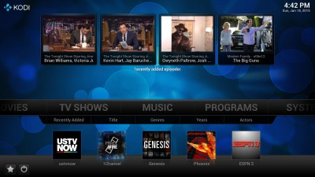{: width="400" height="225" loading="lazy"}

If you did not select Kodi to start from boot, you can modify the autostart options in `dietpi-autostart`:

- Desktop = Kodi is available via the LXDE start menu, and, desktop.
- Console = Kodi can also be run by typing `startkodi`.

## ympd

A lightweight, bare-bones, no frills HiFi music player with a web based interface. ympd is a front end for MPD.

Also installs:

- MPD (music player daemon)

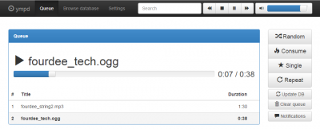{: width="400" height="162" loading="lazy"}

=== "Access to the web interface"

    The web interface is accessible via port **1337**:

    - URL = `http://<your.IP>:1337`

=== "Transfer/add music"

    Make sure you have one of DietPi's [File Servers](../file_servers/) installed.  
    Folders used:

    - local = `/mnt/dietpi_userdata/Music`
    - accessed from file server = `/Music`

=== "Refresh music files / database"

    Simply select the `Update DB` button from the settings menu in ympd.

=== "DietPi-JustBoom control panel"

    - Tweak audio options on the fly with the panel.
    - Simply run `dietpi-justboom` from the command line to launch it.

        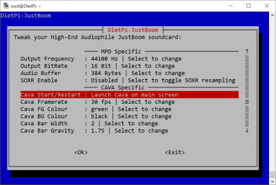{: width="400" height="269" loading="lazy"}

## myMPD

A lightweight, bare-bones, no frills HiFi music player with a web based interface. myMPD is a front end for MPD, and a recent fork of ympd.

Also installs:

- MPD (music player daemon)

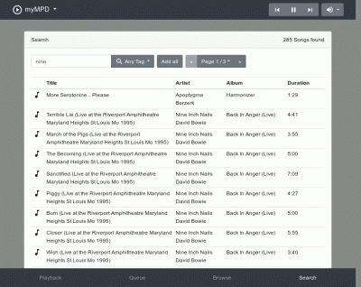{: width="400" height="318" loading="lazy"}

=== "Access to the web interface"

    The web interface is accessible via port **1333**:

    - URL = `http://<your.IP>:1333`

=== "Installation notes"

    We have disabled SSL and its redirect by default with the DietPi install. This is to prevent redirects to the hostname.  
    To re-enable the SSL connection and redirect option:

    - Edit `/etc/mympd.conf`
    - Replace `ssl = false` with `ssl = true`
    - Save changes and exit
    - Restart services with `systemctl restart mympd`
    - Use the same URL address above, it will redirect to HTTPS during connection

=== "Transfer/add music"

    Make sure you have one of DietPi's [File Servers](../file_servers/) installed.  
    Folders used:

    - local = `/mnt/dietpi_userdata/Music`
    - accessed from file server = `/Music`

=== "Refresh music files / database"

    Simply select the `Update database` option from the settings menu in myMPD.

=== "DietPi-JustBoom control panel"

    - Tweak audio options on the fly with the panel.
    - Simply run `dietpi-justboom` from the command line to launch it.

        {: width="400" height="269" loading="lazy"}

## O!MPD

A feature-rich web interface audio player for MPD. Includes song/album scraping, ideal for music catalog browsing.

Also installs:

- MPD (music player daemon)
- Web server

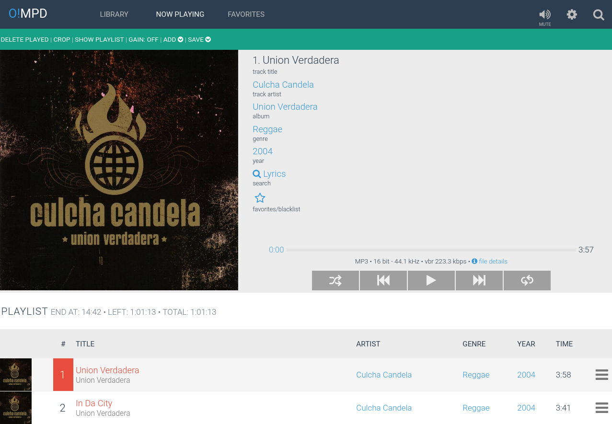{: width="400" height="199" loading="lazy"}

=== "Access to the web interface"

    - URL = `http://<your.IP>/ompd`
    - Username = `admin`
    - Password = `admin`

=== "Transfer/add music"

    Make sure you have one of DietPi's [File Servers](../file_servers/) installed.  
    Folders used by O!MPD:

    - Local = `/mnt/dietpi_userdata/Music`
    - Accessed from file server = `/Music`

=== "Update/scan library"

    Click the `settings` button (cog, top right).  
    Click `update`.

## CAVA

Console-based Audio Visualizer for MPD. Can be displayed in SSH terminals, consoles and LCD HATS.

Also installs:

- MPD (music player daemon)

{: width="500" height="114" loading="lazy"}

=== "Autostart option"

    If you did not select CAVA to start from boot:

    - CAVA can also be run by typing `cava`. Use ++ctrl+c++ to terminate.
    - You can modify the autostart options in `dietpi-autostart`.

=== "DietPi-JustBoom control panel"

    - Tweak CAVA options on the fly with the panel.
    - Simply run `dietpi-justboom` from the command line to launch it.

        {: width="400" height="269" loading="lazy"}

## Mopidy

Mopidy is a Python based music player web based user interface for MPD.

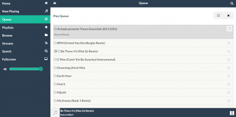{: width="400" height="198" loading="lazy"}

=== "Access to the web interface"

    The web interface uses port **6680**:

    - URL = `http://<your.IP>:6680/musicbox_webclient` or just `http://<your.IP>:6680`

=== "Transfer/add music"

    Make sure you have one of DietPi's [File Servers](../file_servers/) installed.  
    Folders used by Mopidy:

    - Local = `/mnt/dietpi_userdata/Music`
    - Accessed from file server = `/Music`

=== "Refresh music files / database"

    This is done automatic, however, you can force an update using the command

    ```sh
    mopidyctl local scan
    ```

=== "Adding Mopidy extensions"

    Mopidy is highly customisable and supports various extensions from alternative web clients to backend extensions. See [*Extensions*](https://mopidy.com/ext/) for a list.

    Those can be installed via `pip`, e.g.:

    ```sh
    pip3 install --no-cache-dir -U Mopidy-Jellyfin
    ```

    or on Stretch:

    ```sh
    pip2 install --no-cache-dir -U Mopidy-Jellyfin
    ```

=== "Support of codecs"

    Enable support for vast number of codecs like .m4a. Execute the following installation procedure:

    ```sh
    apt-get install -y gstreamer1.0-plugins-bad
    ```

    Many thanks to Roth for [this hint](https://dietpi.com/phpbb/viewtopic.php?t=785).

## Airsonic-Advanced {: #airsonic }

Feature rich media streaming server with a web interface, coded in Java.

{: width="350" height="100" loading="lazy"}

=== "Web interface"

    The web interface uses port **8080**:

    - URL: `http://<your.IP>:8080/airsonic`
    - Username: `admin`
    - Password: `admin`

    !!! hint "The web interface may feel sluggish on first access."

        This is normal on first access after service start. Once a page has been viewed, respectively an element selected the first time, subsequent accesses will perform much faster.

=== "First run setup"

    Once connected to the web interface for the first time, we recommend to do the following setup steps:

    First we check off the **Getting started** page and head over to **Settings**:

    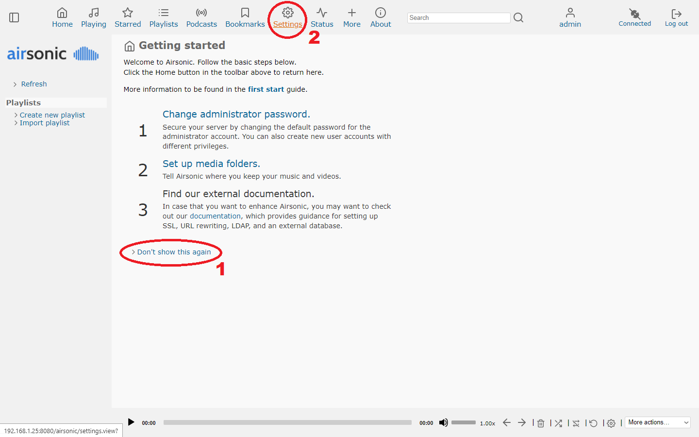{: width="1440" height="900" loading="lazy"}

    On the **Media folders** tab we change the path to DietPi's default music directory `/mnt/dietpi_userdata/Music`, save and scan the new media directory:

    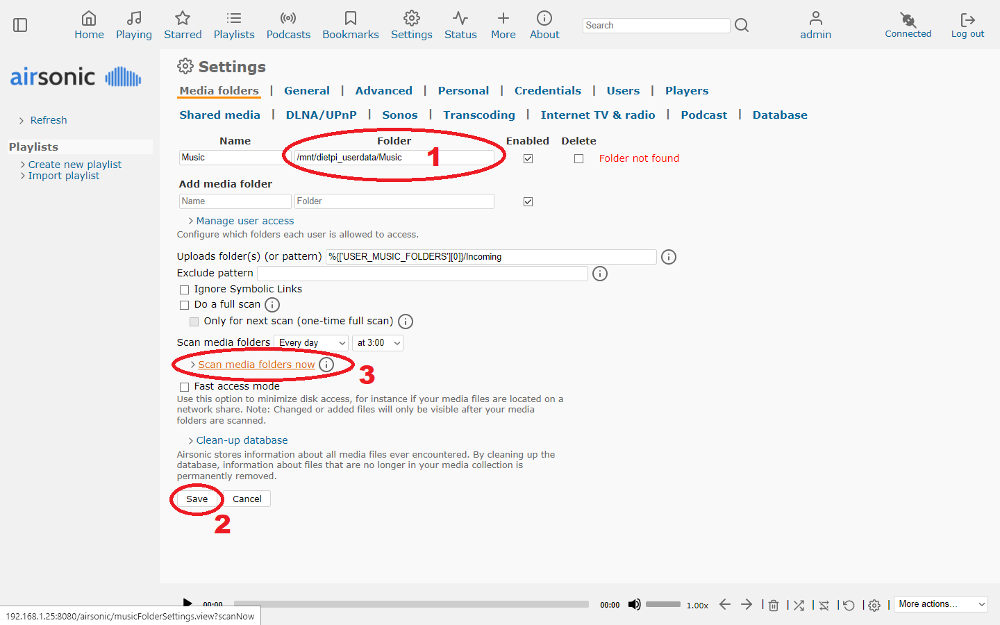{: width="1440" height="900" loading="lazy"}

    On the **Credentials** tab we add a new admin password, the default `bcrypt` encoding is very good for secure password storage. Then we delete the initial default password:

    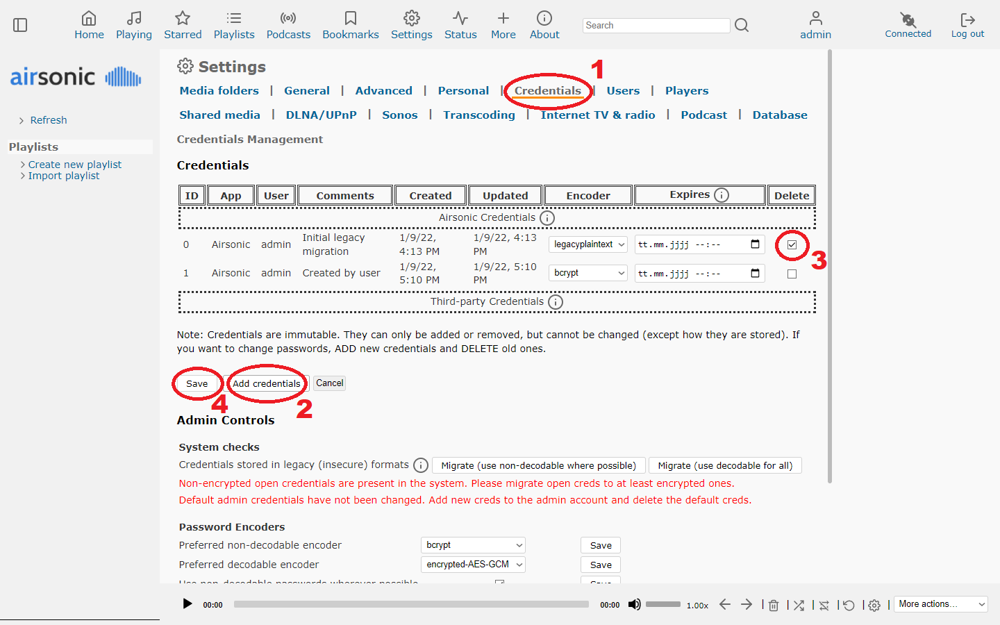{: width="1440" height="900" loading="lazy"}

    Finally, due to a [current bug with the default web player](https://github.com/airsonic-advanced/airsonic-advanced/issues/646), we need switch to the **Players** tab, first cloning the default player, then recreating it. Finally we can hit **Refresh** at the left side panel to have media files added to the list, which enables us to play our music through the browser:

    {: width="1440" height="900" loading="lazy"}

=== "Setup details"

    The install, config and data directory is located at:

    ```
    /mnt/dietpi_userdata/airsonic
    ```

=== "Service control"

    Since Airsonic-Advanced runs as systems service, it can be controlled with the following commands:

    ```sh
    systemctl status airsonic
    ```

    ```sh
    systemctl start airsonic
    ```

    ```sh
    systemctl stop airsonic
    ```

    ```sh
    systemctl restart airsonic
    ```

=== "Logs"

    Since Airsonic-Advanced runs as systemd service, its logs can be viewed via:

    ```sh
    journalctl -u airsonic
    ```

=== "Update"

    Airsonic-Advanced can be updated by simply reinstalling it:

    ```sh
    dietpi-software reinstall 33
    ```

***

Source code: <https://github.com/airsonic-advanced/airsonic-advanced>  
License: [GPLv3](https://github.com/airsonic-advanced/airsonic-advanced/blob/master/LICENSE.txt)

## Logitech Media Server

Logitech Media Server (aka LMS, Squeezebox Server) is the server software that enables web interface control of:

- Software audio players: Squeezelite
- Hardware audio players from Logitech: Squeezebox, SlimDevices

Remark: If you do not own a hardware player, you can turn your DietPi system into a Squeezebox audio capable player, by selecting Squeezelite for installation in `dietpi-software`.

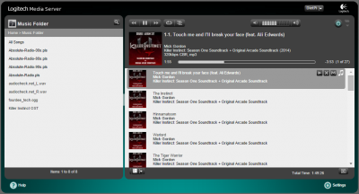{: width="400" height="216" loading="lazy"}

=== "Access to the web interface"

    The web interface is accessible via port **9000**:

    - URL = `http://<your.IP>:9000`

=== "Transfer/add music"

    Make sure you have one of DietPi's [File Servers](../file_servers/) installed.  
    Folders used by Mopidy:

    - Folder = `/mnt/dietpi_userdata/Music`  

=== "Change Squeezelite command line options"

    - Run `dietpi-services`
    - Select `squeezelite`
    - Select `Edit`
    - Unset and re-set the `ExecStart` entry:

      ```systemd
      ExecStart=
      ExecStart=/usr/bin/squeezelite [<your custom arguments>]
      ```

      The first `ExecStart=` is required to replace the existing `ExecStart` entry instead of adding a second one.

    - Save changes with ++ctrl+o++ and exit `dietpi-services`
    - Restart the service: `systemctl restart squeezelite`

=== "Update"

    To update Logitech Media Server to the current version, execute

    ```sh
    dietpi-software reinstall 35
    ```

## Squeezelite

Squeezelite is the audio player for the Logitech Media Server.

{: width="400" height="216" loading="lazy"}

=== "Access to the web interface"

    The web interface is accessible via port **9000**:

    - URL = `http://<your.IP>:9000`

=== "Transfer/add music"

    Make sure you have one of DietPi's [File Servers](../file_servers/) installed.  
    Folders used by Mopidy:

    - Folder = `/mnt/dietpi_userdata/Music`  

=== "Change Squeezelite command line options"

    - Run `dietpi-services`
    - Select `squeezelite`
    - Select `Edit`
    - Unset and re-set the `ExecStart` entry:

      ```systemd
      ExecStart=
      ExecStart=/usr/bin/squeezelite [<your custom arguments>]
      ```

      The first `ExecStart=` is required to replace the existing `ExecStart` entry instead of adding a second one.

    - Save changes with ++ctrl+o++ and exit `dietpi-services`
    - Restart the service: `systemctl restart squeezelite`

## Shairport Sync

Shairport Sync is an AirPlay audio player which plays audio streamed from iTunes, iOS devices and third-party AirPlay sources such as ForkedDaapd and Airfoil.  
Audio played by a Shairport Sync-powered device stays synchronised with the source and hence with similar devices playing the same source. This allows for synchronised multi-room audio on multiple devices.

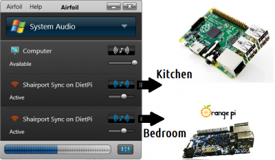{: width="400" height="233" loading="lazy"}

=== "AirPlay device name"

    When searching for an Airplay device, execute `shairport-sync` on DietPi.

=== "Stream from Android and iPad/iPhone"

    There are many AirPlay players available for Android (e.g. [AirPlay For Android](https://play.google.com/store/apps/details?id=com.screen.mirroring.airplay.streamtotv&hl=de)) and iPad/iPhone (e.g. [AirPlay](https://support.apple.com/en-gb/HT204289)).  
    Download and use the player of your choice.

=== "Stream from a Windows/Mac PC"

    Airfoil is an application that will let you stream audio playback directly to any Shairport Sync device. Press play on your favourite music player (e.g.: Winamp/Spotify) and click the speaker next to the DietPi device.

=== "Audiophiles - Master music in real time"

    By using a PC + [Airfoil](https://www.rogueamoeba.com/airfoil/), you can master the music in real time using the PCs CPU. This will allow all your Shairport Sync devices to sound even better without any performance hit on the device.

=== "Multiple Shairport devices / Change Shairport Sync name"

    If you are planning to use multiple Shairport devices on the same network, please make sure the hostname of each device is unique. The hostname will also effect the `shairport-sync` name.  
    This can be completed in `dietpi-config` \> `Security Options` \> `Change Hostname`.

=== "Soxr interpolation"

    Soxr interpolation will improve the output audio quality on Shairport. However, it is extremely CPU intensive.  
    Enable Soxr:

    ```sh
    sed -i '/interpolation = /c\interpolation = "soxr";' /usr/local/etc/shairport-sync.conf
    systemctl restart shairport-sync
    ```

    Disable Soxr:

    ```sh
    sed -i '/interpolation = /c\\/\/interpolation = "soxr";' /usr/local/etc/shairport-sync.conf
    systemctl restart shairport-sync
    ```

    If you have choppy playback using Soxr:  
    Increasing the `shairplay-sync` process priority (nice) may resolve the issue.

    - Run `dietpi-services` from the terminal
    - Select `shairport-sync` via up/down buttons then press ++enter++
    - Select `CPU Nice` via up/down buttons then press ++enter++
    - Select `-20 : (Highest priority)` via up button, then press ++enter++

    DietPi will then automatically apply and set the nice level.

    If the choppy playback continues, the CPU most likely is insufficient for the processing required for Soxr. Then Soxr should be disabled.

## ReadyMedia

Stream your shared media to any DLNA/UPnP capable device.

{: width="351" height="341" loading="lazy"}

=== "Access to ReadyMedia status"

    The web interface is accessible via port **8200**:

    - URL = `http://<your.IP>:8200`

=== "Transfer media files to ReadyMedia"

    Make sure you have one of DietPi's [File Servers](../file_servers/) installed.  
    Folders used by ReadyMedia:

    - `/Music`
    - `/Pictures`
    - `/Video`

=== "Refresh the ReadyMedia database"

    The database can be refreshed with this command:

    ```sh
    rm -r /mnt/dietpi_userdata/.MiniDLNA_Cache/* && systemctl restart minidlna
    ```

***

Available UPnP clients: <https://www.wikipedia.org/wiki/List_of_UPnP_AV_media_servers_and_clients#UPnP_AV_clients>

## Ampache

A web based audio/video streaming application and file manager allowing you to access your music & videos from anywhere, using almost any internet enabled device.

Also Installs:

- Webserver stack

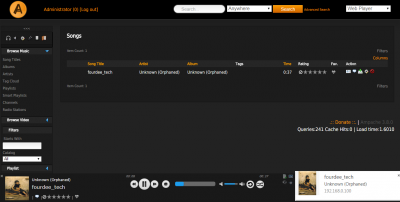{: width="400" height="202" loading="lazy"}

=== "Access to the web interface"

    - URL = `http://<your.IP>/ampache`
    - Username = `admin`
    - Password = `dietpi`

=== "Transfer media files to ReadyMedia"

    Make sure you have one of DietPi's [File Servers](../file_servers/) installed.  
    Folders used by Ampache:

    - audio = `/mnt/dietpi_userdata/Music`
    - videos = `/mnt/dietpi_userdata/Video`

=== "Scan for media, update Ampache database"

    DietPi will automatically add various catalogue directories to Ampache during installation. You can modify these directories as needed before running your first scan.  
    To start the scan and import your media into Ampache:

    - Select the `admin` button.
    - Select `show catalogues` from the left hand side.
    - Select `Update all`.

    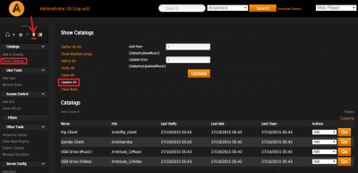{: width="400" height="193" loading="lazy"}

=== "Add custom media folders"

    - Select the `admin` button.
    - Select `add a catalogue` from the left hand side.
    - Enter the details of your path (See the image example below to add your USB drive music folder to Ampache).
    - Select the `add catalogue` button.

    Remark: For Ampache to access custom directories, you must ensure read access to the folder, e.g. by:

    ```sh
    chmod -R 775 /my/directory
    ```

    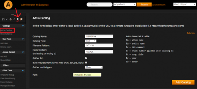{: width="400" height="180" loading="lazy"}

=== "Enable additional file formats via transcoding"

    - <https://github.com/ampache/ampache/wiki/Transcoding>
    - E.g. to allow .m4a playback:

      ```sh
      G_CONFIG_INJECT 'transcode_m4a[[:blank:]]' 'transcode_m4a = allowed' /var/www/ampache/config/ampache.cfg.php
      ```

=== "Update Ampache"

    To update Ampache to the current version, execute

    ```sh
    dietpi-software reinstall 40
    ```

## Emby

A web interface media streaming server. Think Kodi, but using any device with a web browser.

??? note "Transcoding performance on SBC"

    Video transcoding performance on SBC devices is sluggish and may stutter, even on the RPi 3:  
    <https://github.com/MichaIng/DietPi/issues/310#issuecomment-216262850>  
    SBCs should be fine for Music only.  
    A Virtual Machine is highly recommended for Video transcoding:  
    <https://github.com/MichaIng/DietPi/issues/310#issuecomment-219067830>

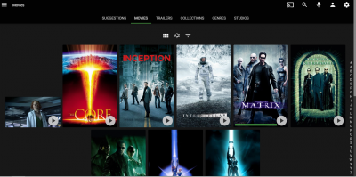{: width="400" height="199" loading="lazy"}

=== "Access to the web interface"

    The web interface is accessible via port **8096**:

    URL = `http://<your.IP>:8096`

=== "First run setup"

    Once connected to the web interface, simply follow the on screen instructions.  
    When you reach Setup your media libraries:

    ```sh
    /mnt/dietpi_userdata/Music
    /mnt/dietpi_userdata/Video
    ```

    You can also mount Samba/NFS shares by running `dietpi-drive_manager` and selecting `Mount network drive` from the menu.

=== "Transfer media files to your device"

    Make sure you have one of DietPi's [File Servers](../file_servers/) installed.  
    Folders used by Emby:

    - Audio: `/mnt/dietpi_userdata/Music`
    - Videos: `/mnt/dietpi_userdata/Video`

=== "View logs"

    To view Emby server logs, run the following command from console:

    ```sh
    journalctl -u emby-server
    ```

=== "Update"

    To update the Emby Server version simply reinstall Emby Server to update it to newest version. It will preserve any existing data and settings:

    ```sh
    dietpi-software reinstall 41
    ```

***

YouTube video tutorial: *DietPi Emby Media Server Setup on Raspberry Pi 3 B Plus*.

<iframe src="https://www.youtube-nocookie.com/embed/zEcNNLCFngI?rel=0" frameborder="0" allow="fullscreen" width="560" height="315" loading="lazy"></iframe>

## Plex Media Server

Plex organizes your video, music, and photo collections and streams them to all of your screens. Also known as a "Web interface media streaming server".

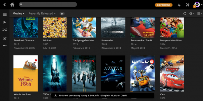{: width="400" height="199" loading="lazy"}

=== "Access to the web interface"

    The web interface uses port **32400**:

    URL = `http://<your.IP>:32400/web`

=== "First run setup"

    Please follow the onscreen instructions to complete the setup wizard:

    - Create your Plex account by signing up.
    - Give your server a name (e.g.: `DietPi-Plex`)
    - Click `library` to setup your media locations:

        ```
        /mnt/dietpi_userdata/Music
        /mnt/dietpi_userdata/Video
        ```

    You can also mount Samba/NFS shares by running `dietpi-drive_manager` and selecting `Mount network drive` from the menu.

=== "Transfer media files to your device"

    Make sure you have one of DietPi's [File Servers](../file_servers/) installed.  
    Folders used by Plex Media Server:

    - Audio = `/mnt/dietpi_userdata/Music`
    - Video = `/mnt/dietpi_userdata/Video`

***

Tutorial: [Setup Guide for Plex on Raspberry Pi](https://blog.barnettjones.com/2020/11/26/dietpi-plex-setup/)

YouTube video tutorial (German language): `Raspberry Pi 4 - Plex TV Media Server unter DietPi installieren und Zugriff von aussen (FritzBox)`.

<iframe src="https://www.youtube-nocookie.com/embed/EElrNjXc3aA?rel=0" frameborder="0" allow="fullscreen" width="560" height="315" loading="lazy"></iframe>

## Tautulli

A Python based monitoring and tracking tool for Plex Media Server.

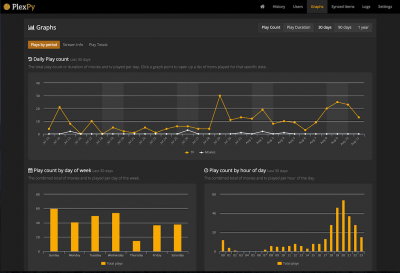{: width="400" height="273" loading="lazy"}

=== "Access to the web interface"

    The web interface is accessible via port **8181**:

    - URL = `http://<your.IP>:8181`

=== "Access to the log files"

    ```
    /mnt/dietpi_userdata/plexpy/logs/
    ```

## Murmur

Turn your device into a lightweight Mumble VoIP server.

{: width="100" height="100" loading="lazy"}

=== "Murmur Server connection details"

    The server is accessible via port **64738**:

    - URL = `http://<your.IP>:64738`
    - Password = No password required
    - Superuser Password = `dietpi`

=== "Change Murmur Server settings"

    You will need to edit the Murmur config file:

    ```sh
    nano /etc/mumble-server.ini
    systemctl restart mumble-server
    ```

## Roon Bridge

Turns your SBC into a Roon capable audio player. By using the main Roon application on another device, you can stream your music catalogue directly to the Roon Bridge running on your SBC.

{: width="150" height="81" loading="lazy"}

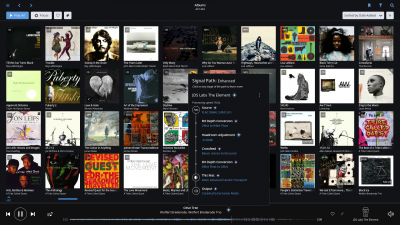{: width="400" height="225" loading="lazy"}

=== "Requirements"

    Roon on another system (e.g.: Windows PC) to control the player.  
    [Roon License](https://roonlabs.com/pricing) (free trial is also available).

***

Official website: <https://roonlabs.com/>  
Official forum: <https://community.roonlabs.com/>  
YouTube videos from `David Snyder`: <https://www.youtube.com/c/dsnyder0cnn/search?query=roon>

## Roon Server

Turns your device into a Roon capable audio player and core server.

{: width="150" height="81" loading="lazy"}

{: width="400" height="134" loading="lazy"}

=== "Install a Roon Remote on another system"

    You can use the Roon Remote apps to control and configure the Roon Server: <https://roonlabs.com/downloads>

=== "Recommended Music Storage Directory"

    When configuring your Roon Server, we highly recommend using the DietPi user data directory. This will allow you to transfer music over the network easily (see Transfer Music below), and storing the music on your Roon Server system:  

    ```
    /mnt/dietpi_userdata/Music
    ```

=== "Transfer media files to your device"

    Make sure you have one of DietPi's [File Servers](../file_servers/) installed.  
    Folders used by Roon Server:

    - Music directory = `/mnt/dietpi_userdata/Music`
    - Accessed from file server = `/Music`

=== "Directories"

    The Roon Server installation can be found at:

    ```
    /opt/roonserver
    ```

    Its configuration and data can be found at:

    ```
    /mnt/dietpi_userdata/roonserver
    ```

=== "Service control"

    Roon Server by default is started as systemd service and can hence be controlled with the following commands:

    ```sh
    systemctl status roonserver
    ```

    ```sh
    systemctl stop roonserver
    ```

    ```sh
    systemctl start roonserver
    ```

    ```sh
    systemctl restart roonserver
    ```

=== "View logs"

    Service logs can be reviewed with the following command:

    ```sh
    journalctl -u roonserver
    ```

    More detailed logs from the individual Roon server components can be found in the following files:

    - `/mnt/dietpi_userdata/roonserver/RAATServer/Logs/RAATServer_log.txt`
    - `/mnt/dietpi_userdata/roonserver/RoonServer/Logs/RoonServer_log.txt`
    - `/mnt/dietpi_userdata/roonserver/RoonGoer/Logs/RoonGoer_log.txt`

=== "Update to latest version"

    The Roon Server comes with an internal updater which should be used. If the installation is broken in a way, you can repair it with the following commands:

    ```sh
    rm -R /opt/roonserver
    dietpi-software reinstall 154
    ```

***

Official website: <https://roonlabs.com/>  
Official forum: <https://community.roonlabs.com/>  
YouTube videos from `David Snyder`: <https://www.youtube.com/c/dsnyder0cnn/search?query=roon>

## Roon Extension Manager

At startup the Roon Extension Manager accesses a repository containing the community developed extensions. Via `Settings` \> `Extensions` within Roon the repository can be viewed and an extension can be selected to perform a certain action.

{: width="150" height="81" loading="lazy"}

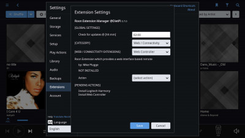{: width="400" height="225" loading="lazy"}

***

Details and usage information: <https://community.roonlabs.com/t/roon-extension-manager-v0-11-8/26632>  
Credits: Many thanks to @JanKoudijs for contributing this into DietPi

## NAA Daemon

Signalyst Network Audio Adapter (NAA) daemon allows you to stream music from an HQPlayer source (like Windows) and output directly from your DietPi device. Features DRC, high quality up-sampling (like 192 kHz) and more.  
Also works with Roon.

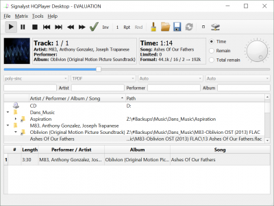{: width="400" height="300" loading="lazy"}

=== "HQPlayer Desktop (Windows)"

    This will allow you to stream audio from your Windows PC, to the NAA Daemon on the DietPi device.

    - Download and install HQPlayer Desktop for Windows:  
      <https://www.signalyst.eu/consumer.html>
    - Run the program
    - To configure HQPlayer to use the NAA Daemon on the DietPi device:
        - Select `File` then `Settings`
        - Under `Backend`, select `NetworkAudioAdapter`. The DietPi device should be detected automatically.
        - Click `OK` to save changes

=== "How do I use Roon and HQPlayer together?"

    Guide: <https://help.roonlabs.com/portal/en/kb/articles/faq-how-do-i-use-roon-and-hqplayer-together>

=== "Update method"

    ```sh
    dietpi-software reinstall 124
    ```

***

Website: <https://www.signalyst.eu/consumer.html>  

## IceCast

Shoutcast streaming server, includes DarkIce for audio input, like a microphone.

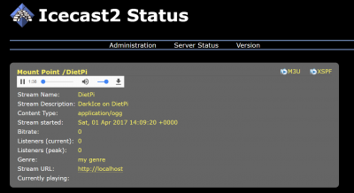{: width="400" height="218" loading="lazy"}

=== "Installation notes"

    DietPi will attempt to detect mic input during installation, and apply to DarkIce. If a microphone was not available, or you experience issues, check available microphones with:

    ```sh
    arecord -l
    ```

    - Then edit the device entry in `/etc/darkice.cfg`, or  
    - Simply copy and paste:

        ```sh
        sed -i "/^device[[:blank:]]/c\device = hw:$(arecord -l | mawk -F'[ :]' '/card/{print $2;exit}'),0" /etc/darkice.cfg
        ```

    - Restart the DarkIce service:

        ```sh
        systemctl restart darkice
        ```

    We create `systemd` services for both, IceCast and DarkIce, automatically started by DietPi. You can check their status by running the following command:

    ```sh
    systemctl status icecast2
    systemctl status darkice
    ```

=== "Access IceCast web interface"

    The web interface is accessible via port **8000**:

    - URL = `http://<your.IP>:8000`
    - Admin user = `admin`
    - Admin password = `<your global password>` (default: `dietpi`)
    - Source password = `<your global password>` (default: `dietpi`)
    - Relay password = `<your global password>` (default: `dietpi`)

=== "Access recording file"

    This is disabled by default.

    - A recording of the stream can be enabled by edit of `/etc/darkice.cfg`, then uncomment

        ```
        localDumpFile = /mnt/dietpi_userdata/darkice_recording.ogg
        ```

    - Restart the DarkIce service:

        ```sh
        systemctl restart darkice
        ```

    - A recording will then be saved in the following location: `/mnt/dietpi_userdata/darkice_recording.ogg`

=== "Configuration files"

    - IceCast: `/etc/icecast2/icecast.xml`
    - DarkIce: `/etc/darkice.cfg`

=== "View logs"

    Run the following commands on a console to view logs for IceCast and DarkIce:

    ```sh
    journalctl -u icecast2
    journalctl -u darkice
    ```

    IceCast additionally creates access and error log files at: `/var/log/icecast2/`

=== "Update to latest version"

    IceCast and DarkIce are installed from the Debian APT repository and hence can be updated by running the following commands:

    ```sh
    apt update
    apt install icecast2 darkice
    ```

## Koel

Web interface music streamer.

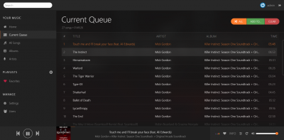{: width="400" height="197" loading="lazy"}

=== "Access to the web interface"

    The web interface is accessible via port **8003**:

    - URL = `http://<your.IP>:8003`
    - Email address = `admin@koel.dev`
    - Password = `KoelIsCool`

=== "First run setup"

    We strongly recommend to change the admin users email address and password:

    1. Login to the web interface
    2. Select "Users" at the bottom of the left-sided navigation panel
    3. However over the user tile and select "Update Profile"
    4. Change name and credentials and select "Save"

=== "Transfer media files to your device"

    Make sure you have one of DietPi's [File Servers](../file_servers/) installed.  
    Directories used by Koel:

    - Local = `/mnt/dietpi_userdata/Music`
    - Accessed from file server = `/Music`

=== "View logs"

    To view Koel service logs, run the following command from console:

    ```sh
    journalctl -u koel
    ```

=== "Update to latest version"

    To update Koel to the recent version, simply reinstall it:

    ```sh
    dietpi-software reinstall 143
    ```

***

Official website: <https://koel.dev/>  
Official documentation: <https://docs.koel.dev/>  
Source code: <https://github.com/koel/koel>  
License: [MIT](https://github.com/koel/koel/blob/master/LICENSE.md)

## GMediaRender

A DLNA audio render/endpoint. Allows you to stream and play music, from another device, such as [BubbleUPnP](https://play.google.com/store/apps/details?id=com.bubblesoft.android.bubbleupnp).

{: width="128" height="128" loading="lazy"}

## Ubooquity

Ubooquity is a free home server for your comics and ebooks library, with remote web interface viewing.

{: width="400" height="188" loading="lazy"}

=== "Access to the web interface"

    The web interface uses port **2038** resp. **2039**:

    - Admin page = `http://<your.IP>:2038/admin`
    - Library view page = `http://<your.IP>:2039`

=== "Transfer ebooks/comics to your device"

    Make sure you have one of DietPi's [File Servers](../file_servers/) installed.  

    - Use the following folders = `/mnt/dietpi_userdata/ebooks` and `/mnt/dietpi_userdata/comics`
    - Then use the admin page, to set the above locations for ebook and comic storage
    - Run a scan in the admin page to update the database

=== "Update to the latest version"

    ```sh
    dietpi-software reinstall 80
    ```

***

YouTube video tutorial: *DietPi Ubooquity Comics and Ebook Reader on Raspberry Pi 3 B Plus*.

<iframe src="https://www.youtube-nocookie.com/embed/xUewleo7f2Q?rel=0" frameborder="0" allow="fullscreen" width="560" height="315" loading="lazy"></iframe>

## Komga

Free and open source comics/mangas media server with web UI.

{: width="500" height="306" loading="lazy"}

=== "Access to the web interface"

    The web interface is accessible via port **2037**:

    - URL = `http://<your.IP>:2037`

=== "Data directory"

    Variable data and configs are stored in the following directory:

    ```
    /mnt/dietpi_userdata/komga
    ```

=== "Configuration file"

    The configuration file can be found at the following location:

    ```
    /mnt/dietpi_userdata/komga/application.yml
    ```

    You need to restart the service for changes to take effect:

    ```sh
    systemctl restart komga
    ```

=== "File hashing"

    File hashing is by default disabled on installs via DietPi, to reduce CPU load for small hardware. The downside is that when moving or renaming media files, Komga won't be able to keep metadata and read state attached, as the database entry is associated to the file path. The original media entry will remain shown as "unavailable" in the library, so that you can manually copy metadata over to the new entry. To remove the old entry, clear the trash of the library.

    With file hashing enabled, database entries and hence metadata and read state are associated to the file hash, so that it stays intact when files are moved or renamed only, with the downside of additional CPU load and resource usage, especially on smaller hardware. To enable file hashing, set the following entry in the configuration file:

    ```yaml
    file-hashing: true
    ```

    Read more: <https://komga.org/guides/trash.html#file-hashes>

=== "View logs"

    Logs are stored in the system journal and can be viewed by running the following command:

    ```sh
    journalctl -u komga
    ```

    If you require file logging, set a path via config file, e.g.:

    ```yaml
    logging:
      file:
        name: "/var/log/komga/komga.log"
    ```
    
    Assure that the directory exists and the `komga` user or group has write permissions.

=== "Update to latest version"

    To update Komga to the latest version, simply reinstall it via DietPi-Software:

    ```sh
    dietpi-software reinstall 179
    ```

***

Official website: <https://komga.org/>  
Official documentation: <https://komga.org/guides>  
Source code: <https://github.com/gotson/komga>  
License: [MIT](https://github.com/gotson/komga/blob/master/LICENSE)

## Raspotify

Spotify Connect client for the Raspberry Pi that Just Works™.

!!! note "You will need a Spotify Premium account in order to use the Spotify Connect client."

{: width="331" height="100" loading="lazy"}

=== "Changing options"

    Raspotify should work straight out of the box. However, you can change the available options in:

    - `/etc/default/raspotify`

    Then restart the service with:

    ```sh
    systemctl restart raspotify
    ```

=== "Service control"

    The service is started automatically at boot, but you can control it manually as well:

    - Manually start the service:

        ```sh
        systemctl start raspotify
        ```

    - Manually stop the service:

        ```sh
        systemctl stop raspotify
        ```

    - Manually restart the service:

        ```sh
        systemctl restart raspotify
        ```

=== "View logs"

    View the service logs via:

    ```sh
    journalctl -u raspotify
    ```

***

Official website: <https://dtcooper.github.io/raspotify/>  
Source code: <https://github.com/dtcooper/raspotify>

## Spotify Connect Web

Spotify Connect Web is a console client and player for Spotify Connect including a web frontend.

=== "Access to the web interface"

    The web interface is accessible via port **4000**:

    - URL: `http://<your.IP>:4000`

=== "Generate the Spotify API key"

    The generation of the `spotify_appkey.key` is required to grant the application access to Spotify API using your account.

    Fill out the application form <https://developer.spotify.com/documentation/general/guides/authorization/app-settings/>.  
    Wait for it to be "accepted".

=== "Transfer Spotify API key"

    Make sure you have one of DietPi's [File Servers](../file_servers/) installed.  
    Copy the `spotify_appkey.key` to the following directory:

    - Directory: `/mnt/dietpi_userdata/spotify-connect-web`
    - Accessed from file server: `/spotify-connect-web`

=== "Service control"

    The service is started automatically at boot, but you can control it manually as well:

    - Manually start the service:

        ```sh
        systemctl start spotify-connect-web
        ```

    - Manually stop the service:

        ```sh
        systemctl stop spotify-connect-web
        ```

    - Manually restart the service:

        ```sh
        systemctl restart spotify-connect-web
        ```

=== "View logs"

    View the service logs via:

    ```sh
    journalctl -u spotify-connect-web
    ```

***

Source code: <https://github.com/Fornoth/spotify-connect-web>  
Quick start documentation: <https://developer.spotify.com/documentation/web-api/quick-start>

## Spotifyd

Spotifyd is a lightweight FOSS Spotify client, supporting the Spotify Connect protocol.

!!! note "You will need a Spotify Premium account in order to use the Spotifyd."

{: width="331" height="100" loading="lazy"}

=== "Changing options"

    Spotifyd should work straight out of the box. However, you can change the available options in:

    - `/mnt/dietpi_userdata/spotifyd/spotifyd.conf`

    Then restart the service with:

    ```sh
    systemctl restart spotifyd
    ```

=== "Service control"

    The service is started automatically at boot, but you can control it manually as well:

    - Manually start the service:

        ```sh
        systemctl start spotifyd
        ```

    - Manually stop the service:

        ```sh
        systemctl stop spotifyd
        ```

    - Manually restart the service:

        ```sh
        systemctl restart spotifyd
        ```

=== "View logs"

    View the service logs via:

    ```sh
    journalctl -u spotifyd
    ```

***

Official documentation: <https://spotifyd.github.io/spotifyd/>  
Source code: <https://github.com/Spotifyd/spotifyd>  
License: [GPLv3](https://github.com/Spotifyd/spotifyd/blob/master/LICENSE)

## Jellyfin

A FOSS web interface media streaming server, including live TV, forked from Emby.

{: width="600" height="341" loading="lazy"}

=== "Access to the web interface"

    The web interface is accessible via port **8096**:

    - URL = `http://<your.IP>:8096`

=== "View logs"

    - Service:

        ```sh
        journalctl -u jellyfin
        ```

    - Binary: `/var/log/jellyfin/`

=== "Data directory"

    `/mnt/dietpi_userdata/jellyfin`

=== "Update to latest version"

    Code: Select all

    ```sh
    apt update
    apt install jellyfin jellyfin-ffmpeg
    ```

***

Source code: <https://github.com/jellyfin/jellyfin>

## Beets

A command-line music organizer and manager. Some of the key features are:

- flexible automatic metadata corrector and file renamer
- album art downloader, lyrics fetcher, and genre identifier
- music metadata inspection and modification tool for lots of audio file types

{: width="144" height="144" loading="lazy"}

=== "Quick start"

    Start by typing `beet` in the command line. All the options and commands will be made available. 
    
    You could start using Beets by importing music with `beet import` and then query the library with 'beet list'. For example next command line shows all Tangos in the year 2010

    ```sh
    beet ls year:2010 genre:Tango
    ```

=== "Changing configuration"

    You can change the Beets configuration, by editing next file: `/mnt/dietpi_userdata/beets/config.yaml`.

***

Official website: <https://beets.io/>  
Official documentation: <https://beets.readthedocs.io/en/stable/>  
Source code: <https://github.com/beetbox/beets>  
License: [MIT](https://github.com/beetbox/beets/blob/master/LICENSE)

## Snapcast Server

A FOSS multi room audio solution - this part is the server app it sends music to one or more clients to play.

{: width="300" height="48" loading="lazy"}

The Snapcast server needs to have its audio sources manually configured after installation. See the Snapcast documents for more details: <https://github.com/badaix/snapcast#server>

=== "Access to the web interface"

    The Snapcast server provides a web interface on port **1780**, which allows you to control volumes for all clients and optionally play audio through your browser:

    - URL = `http://<your.IP>:1780`

=== "Implementation details"

    DietPi-Software installs the Snapcast server nearly with default configs, as shipped with the official package. Only the JSON RPC, which listens by default on port **1705**, is disabled. To enable and configure it, check the `[tcp]` section of the config file (see "Changing options" tab).

=== "Changing options"

    - `/etc/snapserver.conf`

    Then restart services with:

    ```sh
    systemctl restart snapserver
    ```

=== "Using MPD as an input source"

    If you have MPD installed you can use it as an input source.

    First you need to ensure that MPD outputs to a pipe you can do this in two ways.
    1) Install CAVA from the DietPi software list.  
    OR  
    2) Add the following to `/etc/mpd.conf` and restart with `systemctl restart mpd`

    ```
    audio_output {
        type "fifo"
        enabled "yes"
        name "snapcast"
        path "/tmp/mpd.fifo"
        format "48000:16:2"
    }
    ```

    Once you have done that you then need to add the following to `/etc/snapserver.conf` under `[stream]`. The `name` is the name as it will appear to Snapcast clients here I have called it `myMPD`. Check the Snapcast server docs for additional parameters you can pass in: <https://github.com/badaix/snapcast/blob/master/doc/configuration.md#pipe>

    ```
    source = pipe:///tmp/mpd.fifo?name=myMPD&mode=read
    ```

=== "Using Mopidy as an input source"

    If you have Mopidy installed you can use it as an input source.

    First you need to ensure that Mopidy outputs to a pipe. Add the following to `/etc/mopidy/mopidy.conf` and restart with `systemctl restart mopidy`

    ```
    [audio]
    output = audioresample ! audioconvert ! audio/x-raw,rate=48000,channels=2,format=S16LE ! wavenc ! filesink location=/tmp/mopidy.fifo
    ```

    Once you have done that you then need to add the following to `/etc/snapserver.conf` under `[stream]`. The `name` is the name as it will appear to Snapcast clients here I have called it `myMopidy`. Check the Snapcast server docs for additional parameters you can pass in: <https://github.com/badaix/snapcast/blob/master/doc/configuration.md#pipe>

    ```
    source = pipe:///tmp/mopidy.fifo?name=myMopidy&mode=read
    ```

=== "Using Raspotify/librespot as an input source"

    If you have Raspotify installed you can use it as an input source.

    Add the following config under `[stream]`. The `name` is the name as it will appear to Snapcast clients here I have called it `mySpotify`. The `devicename` is the name that will be shown when connecting in Spotify. Check the Snapcast server docs for additional parameters you can pass in: <https://github.com/badaix/snapcast/blob/master/doc/configuration.md#librespot>. I have disabled the audio cache to protect the SD card.

    ```
    source = librespot:///usr/bin/librespot?name=mySpotify&devicename=SnapcastSpotify&disable_audio_cache=true
    ```

=== "Using AirPlay (Shairport Sync) as an input"

    First install `shairport-sync`.

    Then (at the moment - see: <https://github.com/MichaIng/DietPi/issues/4470>) we need to replace the Shairport Sync binary with one that supports `stdout`. To do this we need to compile a new binary - you will find details here:  
    <https://github.com/mikebrady/shairport-sync/blob/master/INSTALL.md#build-and-install>

    You need to use this line when configuring instead of the line from the docs:

    ```sh
    ./configure --sysconfdir=/etc --with-alsa --with-soxr --with-avahi --with-ssl=openssl --with-systemd --with-metadata --with-stdout
    ```

    Don't forget to run `make` and `make install`.

    Then add the following config under `[stream]`. The `name` is the name as it will appear to Snapcast clients here I have called it `myAirport`. The `devicename` is the name that will be shown when searching for Airport devices. Check the Snapcast server docs for additional parameters you can pass in: <https://github.com/badaix/snapcast/blob/master/doc/configuration.md#airplay>

    ```
    source = airplay:///usr/local/bin/shairport-sync?name=myAirport&devicename=SnapcastAirport&params=--configfile=/usr/local/etc/shairport-sync.conf
    ```

    You will then either need to mask the original Shairport Sync service

    ```sh
    systemctl mask shairport-sync
    ```

    or you can try to run one of them on a different port - Snapcast docs shows how to do this here: <https://github.com/badaix/snapcast/blob/master/doc/configuration.md#airplay>

***

Source code: <https://github.com/badaix/snapcast>

## Snapcast Client

A FOSS multi room audio solution - this part is a client app it listens to the server and plays the audio it is sent

{: width="300" height="48" loading="lazy"}

The Snapcast client will prompt you for the server's IP and port when installing and will be setup to start on boot up. This should work for most people but there are additional configuration parameters that can be found in the Snapcast documentation: <https://github.com/badaix/snapcast#client>

=== "Changing options"

    It should just work but, you can change the available options in:

    - `/etc/default/snapclient`

    Then restart services with:

    ```sh
    systemctl restart snapclient
    ```

***

Source code: <https://github.com/badaix/snapcast>

[Return to the **Optimised Software list**](../../software/)
