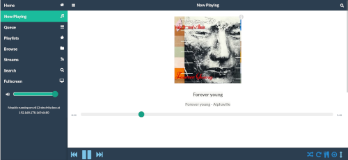

# Media Systems

## Overview

- [**Kodi - Media Centre / Player**](#kodi-media-centre-player)
- [**ympd - Lightweight web Interface audio player for MPD**](#ympd-lightweight-web-interface-audio-player-for-mpd)
- [**myMPD - Lightweight web Interface audio player for MPD**](#mympd-lightweight-web-interface-audio-player-for-mpd)
- [**O!MPD - Feature-rich web Interface audio player for MPD**](#ompd-feature-rich-web-interface-audio-player-for-mpd)
- [**CAVA - Optional: Console-based audio visualizer for MPD**](#cava-optional-console-based-audio-visualizer-for-mpd)
- [**Mopidy - Web Interface Music /Radio Player**](#mopidy-web-interface-music-radio-player)
- [**Airsonic - Feature rich media streaming server with web interface**](#airsonic-feature-rich-media-streaming-server-with-web-interface)
- [**Subsonic - Feature rich media streaming server with web interface**](#subsonic-feature-rich-media-streaming-server-with-web-interface)
- [**Logitech Media Server - aka LMS, Squeezebox Server**](#logitech-media-server-aka-lms-squeezebox-server)
- [**SqueezeLite - Audio player for Logitech Media Server**](#squeezelite-audio-player-for-logitech-media-server)
- [**Shairport Sync - AirPlay audio player with multiroom sync**](#shairport-sync-airplay-audio-player-with-multiroom-sync)
- [**ReadyMedia - (MiniDLNA) Media streaming server (DLNA, UPnP)**](#readymedia-minidlna-media-streaming-server-dlna-upnp)
- [**Ampache - Web interface media streaming server**](#ampache-web-interface-media-streaming-server)
- [**Emby - Web interface media streaming server**](#emby-web-interface-media-streaming-server)
- [**Plex Media Server - Web interface media streaming server**](#plex-media-server-web-interface-media-streaming-server)
- [**Tautulli - Monitoring and tracking tool for Plex Media Server**](#tautulli-monitoring-and-tracking-tool-for-plex-media-server)
- [**Murmur - Mumble VoIP Server**](#murmur-mumble-voip-server)
- [**Roon Bridge - Turns your device into a Roon capable audio player**](#roon-bridge-turns-your-device-into-a-roon-capable-audio-player)
- [**Roon Server - Turns your device into a Roon capable audio player and Roon core**](#roon-server-turns-your-device-into-a-roon-capable-audio-player-and-roon-core)
- [**Roon Extension Manager - Manage extensions from within Roon**](#roon-extension-manager-manage-extensions-from-within-roon)
- [**NAA Daemon - Signalyst Network Audio Adaptor (NAA)**](#naa-daemon-signalyst-network-audio-adaptor-naa)
- [**IceCast - Shoutcast Streaming Server, including DarkIce**](#icecast-shoutcast-streaming-server-including-darkice)
- [**jRiver - Media Center**](#jriver-media-center)
- [**Koel - Web interface streaming server**](#koel-web-interface-streaming-server)
- [**GMediaRender - Resource efficient UPnP/DLNA renderer**](#gmediarender-resource-efficient-upnpdlna-renderer)
- [**Ubooquity - Free home server for your comics and ebooks library**](#ubooquity-free-home-server-for-your-comics-and-ebooks-library)
- [**Komga - Free and open source comics/mangas media server with web UI**](#komga-free-and-open-source-comicsmangas-media-server-with-web-ui)

??? info "How do I run **DietPi-Software** and install **optimised software** ?"
    To install any of the **DietPi optimised software** listed below run from the command line:

    ```
    dietpi-software
    ```

    Choose **Software Optimised** and select one or more items. Finally click on `Install`. DietPi will do all the necessary steps to install and start these software items.

    

    To see all the DietPi configurations options, review [DietPi Tools](../../dietpi_tools) section.

## Kodi - Media Centre / Player

{: style="width:500px"}

## ympd - Lightweight web Interface audio player for MPD

{: style="width:500px"}

## myMPD - Lightweight web Interface audio player for MPD

{: style="width:500px"}

## O!MPD - Feature-rich web Interface audio player for MPD

{: style="width:500px"}

## CAVA - Optional: Console-based audio visualizer for MPD

{: style="width:500px"}

## Mopidy - Web Interface Music /Radio Player

{: style="width:500px"}

## Airsonic - Feature rich media streaming server with web interface

{: style="width:500px"}

## Subsonic - Feature rich media streaming server with web interface

{: style="width:500px"}

## Logitech Media Server - aka LMS, Squeezebox Server

{: style="width:500px"}

## SqueezeLite - Audio player for Logitech Media Server

{: style="width:500px"}

## Shairport Sync - AirPlay audio player with multiroom sync

{: style="width:500px"}

## ReadyMedia - (MiniDLNA) Media streaming server (DLNA, UPnP)

{: style="width:200px"}

## Ampache - Web interface media streaming server

{: style="width:500px"}

{: style="width:500px"}

{: style="width:500px"}

## Emby - Web interface media streaming server

{: style="width:500px"}

## Plex Media Server - Web interface media streaming server

{: style="width:500px"}

## Tautulli - Monitoring and tracking tool for Plex Media Server

{: style="width:500px"}

## Murmur - Mumble VoIP Server

{: style="width:150px"}

## Roon Bridge - Turns your device into a Roon capable audio player

{: style="width:500px"}

## Roon Server - Turns your device into a Roon capable audio player and Roon core

{: style="width:500px"}

## Roon Extension Manager - Manage extensions from within Roon

{: style="width:500px"}

## NAA Daemon - Signalyst Network Audio Adaptor (NAA)

{: style="width:500px"}

## IceCast - Shoutcast Streaming Server, including DarkIce

{: style="width:500px"}

## jRiver - Media Center

{: style="width:500px"}

## Koel - Web interface streaming server

{: style="width:500px"}

## GMediaRender - Resource efficient UPnP/DLNA renderer

{: style="width:150px"}

## Ubooquity - Free home server for your comics and ebooks library

{: style="width:600px"}

## Komga - Free and open source comics/mangas media server with web UI

{: style="width:500px"}

[Return to the **Optimised Software list**](../../dietpi_optimised_software)
