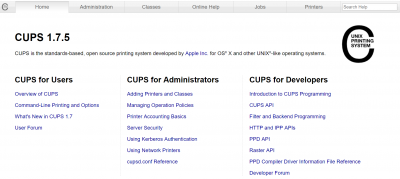
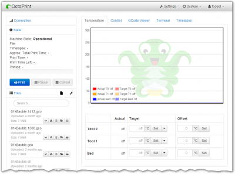

# Printing

## Overview

- [**CloudPrint - CUPS print server, with support for Google cloud printing**](#cloudprint-cups-print-server)
- [**OctoPrint - Web interface for controlling 3D printers**](#octoprint-web-interface-for-controlling-3d-printers)

??? info "How do I run **DietPi-Software** and install **Optimised software** ?"
    To install any of the **DietPi Optimised Software** listed below run from the command line:

    ```
    dietpi-software
    ```

    Choose **Software optimised** and select one or more items. Finally click on `Install`. DietPi will do all the necessary steps to install and start these software items.

    

    To see all the DietPi configurations options, review [DietPi Tools](../../dietpi_tools) section.

[Return to the **Optimised Software list**](../../dietpi_optimised_software)

## CloudPrint - CUPS print server

The package is based on the CUPS print server. It supports also the Google cloud printing.  
Also included is a web interface for CUPS, allowing easy setup of printers.

{: style="width:550px"}

=== "Access the web interface"

    The web interface is accessible via port 631 on the machine running the CUPS server, e.g. this could be:  

    - URL = `http://192.168.0.100:631`  
    - user = `root`  
    - password = `dietpi`

=== "Add a printer"

    In the CUPS web interface, you can add and configure printers by selecting:

    - *Home* \> *Adding Printers and Classes*

=== "Enable CloudPrint"

    Once the printer is setup you only have to run the following command to enable Google Cloud Print authentication on this device:

    ```
    cps-auth
    ```

    An URL will be generated. Use this URL link in a web browser to complete the authentication.  
    Afterwards restart the services with:

    ```
    dietpi-services restart
    ```

    If you experience issues, you can check the status of the CloudPrint service for info with:

    ```
    systemctl status cloudprintd -l
    ```

=== "Print"

    Your printer should now be available from <https://www.google.com/cloudprint/#printers>.

See also <https://wikipedia.org/wiki/Common_Unix_Printing_System> resp. <https://www.cups.org/>.

## OctoPrint - Web interface for controlling 3D printers

OctoPrint provides a web interface for controlling consumer 3D printers.

{: style="width:550px"}

=== "Access the web interface"

    The web interface is accessible via port 5000 on the machine running the OctoPrint server, e.g. this could be:  

    - URL = `http://192.168.0.100:5000`  

=== "First run setup"

    Once you are connected to the web interface, simply run through the setup wizard and configure the software/printers as needed:

    - Section: *Server Commands*:
        - Restart OctoPrint = `systemctl restart octoprint`
        - Restart system = `reboot`
        - Shutdown system = `poweroff`
    - Section: *Software Updates*:
        - OctoPrint checkout folder = **/opt/octoprint** (since DietPi v6.33)

=== "OctoPrint data/config directory"

    The data/config information is located in */mnt/dietpi_userdata/octoprint* (since DietPi v6.33).

=== "Command line interface (CLI)"

    !!! hint ""
        The CLI is relevant since DietPi v6.33.

    OctoPrint also offers a command line interface to execute OctoPrint commands.  
    To use this option, run `octoprint` from the command line. Do this as user *octoprint* to invoke the correct config/data directory. In a regular bash shell session this is the case automatically via alias and sudo, see: `/etc/bashrc.d/dietpi-octoprint.sh`.

    If you use a different shell, use:

    ```sh
    sudo -u octoprint octoprint <command>
    ```

See also <https://wikipedia.org/wiki/OctoPrint> resp. <https://octoprint.org/>.
