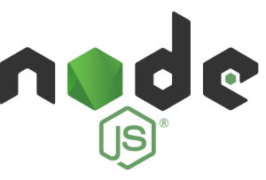

# Development & Programming

## Overview

- [**Python 3 - High-level interpreted programming language**](#python-3)
- [**Go - Programming language**](#go)
- [**Java - Programming language**](#java)
- [**Mono - Programming language**](#mono)
- [**VSCodium - FLOSS version of Microsoft VSCode**](#vscodium)
- [**Git - Distributed version control system**](#git)
- [**PHP Composer - A Dependency Manager for PHP**](#php-composer)
- [**Node.js - open-source, JavaScript runtime environment**](#nodejs)

??? info "How do I run **DietPi-Software** and install **optimised software** items?"
    To install any of the **DietPi optimised software items** listed below run from the command line:

    ```sh
    dietpi-software
    ```

    Choose **Browse Software** and select one or more items. Finally select `Install`.  
    DietPi will do all the necessary steps to install and start these software items.

    {: width="643" height="365" loading="lazy"}

    To see all the DietPi configurations options, review the [DietPi Tools](../dietpi_tools.md) section.

[Return to the **Optimised Software list**](../software.md)

## Python 3

Python is a text based interpreted programming language with object oriented programming options for general purpose applications.

{: width="200" height="59" loading="lazy"}

Source: By [www.python.org](https://www.python.org/community/logos/), [GPL](https://commons.wikimedia.org/w/index.php?curid=34991637)

You can find Python everywhere in the world of computer programming. For example, Python is the foundation of some of the world's most popular websites [^1], including Reddit, Dropbox, and YouTube, to name a few. The Python web framework [Django](https://www.djangoproject.com) powers both Instagram and Pinterest.

Currently, Python is 3rd most popular of programming language [^2].

To find out which version of Python is installed, just run

```sh
python3 -V
```

=== "Installation details"

    The install option explicitly installs only **Python 3**.  
    The `pip`/`pip3` Python package manager and development headers are included.
    To use the `pip` package manager, a typical usage will be `pip3 install -U <module>`.

=== "Python IDE packages"

    There are many Python IDE packages available. Following is a short list of well known and widely good accepted IDE packages (alphabetical order):

    | Name | URL |
    | :-: | - |
    | **Eclipse + Pydev** | <https://www.eclipse.org> and <https://www.pydev.org/> |
    | **IDLE** | <https://docs.python.org/3/library/idle.html> |
    | **Pycharm** | <https://www.jetbrains.com/pycharm> |
    | **Spyder** | <https://github.com/spyder-ide/spyder> |
    | **Thonny** | <https://thonny.org> |
    | **VSCodium** | [VSCodium](#vscodium) below |

***

Website: <https://www.python.org>  
Official documentation, from beginner to advanced: <https://www.python.org/doc/>  
How to Use Python: Your First Steps <https://realpython.com/python-first-steps/>
Wikipedia: <https://wikipedia.org/wiki/Python_(programming_language)>

## Go

Go is an open source programming language that makes it easy to build simple, reliable, and efficient software.

{: width="150" height="56" loading="lazy"}

Source: By [https://golang.org](https://blog.golang.org/go-brand), Creative Commons Attribution 3.0

Go is a compiled, fast and high-performance language intended to be simple and is designed to be easy to read and understand. Go was created at Google by Rob Pike, Robert Griesemer, and Ken Thompson, and it first appeared in Nov 2009.

Go is used by some of the big organizations such as Google, BBC, Uber, Soundcloud, Twitch, Medium, Daily Motion. Uber has reported better throughput, high performance, latency, and uptime. BBC, the house name in broadcasting the world news, uses it for backend, including crawlers and web scrapers. The build and deployment system of Soundcloud is in Go.

To find out which version of Go is installed, just run

```sh
go version
```

=== "Getting started"

    To edit the code you can use an editor of your choice, or use [VSCodium](#vscodium). The _Go extension_ available in VSCodium provides rich language support for the Go programming language.

    Just to have a taste of it, you could run some commands in [_Go playground_](https://play.golang.org/p/AAX1cLCmA1c)

    Checkout also the official tutorial [Get started with Go](https://golang.org/doc/tutorial/getting-started).

    Some common Go commands are:

    - `go env`: Prints the Go internal environment variables (e.g. GOPATH). Can also be used e.g. like `$(go env GOPATH)/bin`
    - `go mod tidy <MODULNAME>`: Generate a Go module
    - `go help`: Start the Go internal help in general, details for commands e.g. via `go help build`

=== "Directories"

    - `/usr/local/go`: This is the place where the Go development tools is installed.
    - When installing packages via `go get` or `go install`, they are installed into the users home directory `~/go` by default. A custom path can be set via the `GOPATH` environment variable. To also load binaries of compiled Go packages into your `PATH`, something like this can be done:

        ```sh
        cat << '_EOF_' >> ~/.bashrc
        export GOPATH=/path/to/go
        export PATH="$PATH:$GOPATH/bin"
        _EOF_
        ```

=== "Update to latest version"

    ```sh
    dietpi-software reinstall 188
    ```

***

Website: <https://golang.org>  
Official documentation: <https://golang.org/doc>  
Additional libraries: <https://github.com/avelino/awesome-go>  
Wikipedia: <https://en.wikipedia.org/wiki/Go_(programming_language)>  
Source code: <https://github.com/golang/go>  
License: [BSD 3-Clause](https://github.com/golang/go/blob/master/LICENSE)

## Java

{: width="80" height="151" loading="lazy"}

Source: <https://de.wikipedia.org/w/index.php?curid=2095155>

The Java options of DietPi contain these basic options

- Java Runtime Environment JRE
- Java Development Kit JDK

The Java Runtime Environment is the runtime environment of the Java technology. It serves as a more or less hardware dependent software platform to abstract the Java applications from the host system (operating system). It defines an API (application programming interface, which is host system independent and contains the so called Java Virtual Machine (JVM).

The Java Development Kit is one of several Java software development kits (SDK) and is often used by the Java developers. It contains the components Java compiler `javac`, Java debugger `jdb`, Java documentation tool `javadoc`, Java archiver `jar` and further small tools.  
To find out which version of Java is installed, just run

```sh
java -version
```

## Mono

{: width="100" height="119" loading="lazy"}

Source: User [`OsamaK`](https://en.wikipedia.org/wiki/User:OsamaK) - <https://de.wikipedia.org/w/index.php?curid=3548404>

[Mono](https://www.mono-project.com/) is a cross platform, open source .NET framework. Is an alternative implementation of the Microsoft .NET framework. It support the development of platform independent software on the standards of the Common Language Infrastructure and the programming language C#.

To find out which version of Mono is installed, just run

```sh
mono --version
```

## VSCodium

VSCodium is a FLOSS version of [Microsoft's Visual Studio code](https://code.visualstudio.com/), built directly from the source on GitHub, without branding, tracking, or telemetry.

{: width="1028" height="799" loading="lazy"}

=== "Update to latest version"

    VSCodium is installed as APT package, hence you can update it by running the following commands:

    ```sh
    apt update
    apt install codium
    ```

Documentation (Visual Studio Code): <https://code.visualstudio.com/docs>  
Documentation (VSCodium): <https://github.com/VSCodium/vscodium/blob/master/docs/index.md>  
Source code: <https://github.com/VSCodium/vscodium>  
License: [MIT](https://github.com/VSCodium/vscodium/blob/master/LICENSE)

## Git

{: width="292" height="92" loading="lazy"}

Source: <https://git-scm.com/downloads/logos>

[Git](https://git-scm.com) is a distributed version control system for tracking changes in source code during software development. It is designed for coordinating work among programmers, but it can be used to track changes in any set of files. Its goals include speed, data integrity, and support for distributed, non-linear workflows.

To find out which version of Git is installed, just run

```sh
git --version
```

See also [**Gogs**](cloud.md#gogs) and [**Gitea**](cloud.md#gitea), the GitHub style servers which are available in `dietpi-software` as an installation package.

***

Official website: <https://git-scm.com/>  
Official documentation: <https://git-scm.com/docs>  
Source code: <https://github.com/git/git>  
License: [GPLv2](https://github.com/git/git/blob/master/COPYING)

## PHP Composer

{: width="150" height="182" loading="lazy"}

Source: [WizardCat](https://getcomposer.org){: class="nospellcheck"} via [Wikimedia tech blog, MIT](https://commons.wikimedia.org/w/index.php?curid=38131432).

Composer is a tool for dependency management in PHP. It allows you to declare the libraries your project depends on and it will manage (install/update) them for you.

***

Website: <https://getcomposer.org/>  
Official documentation: <https://getcomposer.org/doc/>

## Node.js

Node.js is JavaScript runtime built on Chrome's V8 JavaScript engine.



Source: By [nodejs.org](https://nodejs.org), [Trademark policy](https://trademark-policy.openjsf.org/)

By using the event-callback/non-blocking approach, Node.js offers a single-threaded event-io model that allows orchestration of tasks running in parallel. It supports multiple connections without a need for a large memory footprint. Amazon, Netflix, eBay, Reddit, LinkedIn, Tumblr, and PayPal use Node.js [^3].

=== "Update"

    To update Node.js to the latest version, simply reinstall it:

    ```sh
    dietpi-software reinstall 9
    ```

***

Website: <https://nodejs.org/>  
Official documentation: <https://nodejs.org/api/>

[Return to the **Optimised Software list**](../software.md)

[^1]: [8 World-Class Software Companies That Use Python](https://realpython.com/world-class-companies-using-python/)
[^2]: [TIOBE Programming Community index](https://www.tiobe.com/tiobe-index/)
[^3]: <https://webtribunal.net/blog/node-js-stats>. Retrieved 29 May 2021
