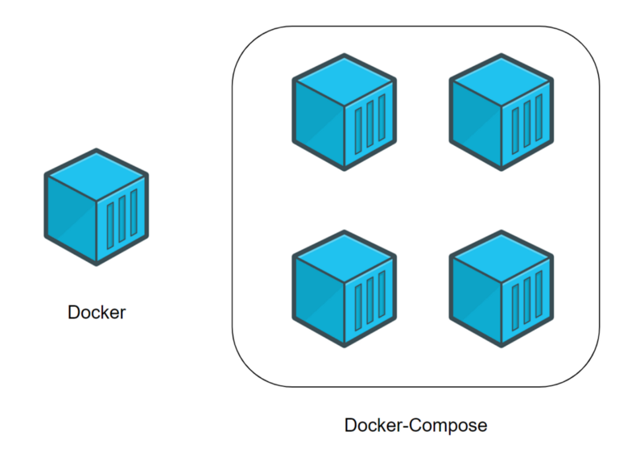

# Development & Programming

## Overview

- [**Python 3 - High-level interpreted programming language**](#python-3)
- [**Go - Programming language**](#go)
- [**Node.js - open-source, JavaScript runtime environment**](../webserver_stack/#nodejs)
- [**Docker -  Create, deploy, and run applications using containers**](#docker)
- [**Docker Compose - Define and run multi-container Docker applications**](#docker-compose)
- [**Portainer - Lightweight management UI, managing your Docker host or Swarm cluster**](#portainer)
- [**VSCodium - FLOSS version of Microsoft VSCode**](#vscodium)

??? info "How do I run **DietPi-Software** and install **optimised software** items?"
    To install any of the **DietPi optimised software items** listed below run from the command line:

    ```sh
    dietpi-software
    ```

    Choose **Browse Software** and select one or more items. Finally select `Install`.  
    DietPi will do all the necessary steps to install and start these software items.

    {: width="643" height="365" loading="lazy"}

    To see all the DietPi configurations options, review the [DietPi Tools](../../dietpi_tools/) section.

[Return to the **Optimised Software list**](../../software/)

## Python 3

Python is a text based interpreted programming language with object oriented programming options for general purpose applications.

{: width="200" height="59" loading="lazy"}

Source: By [www.python.org](https://www.python.org/community/logos/), [GPL](https://commons.wikimedia.org/w/index.php?curid=34991637)

You can find Python everywhere in the world of computer programming. For example, Python is the foundation of some of the world’s most popular websites [^3], including Reddit, Dropbox, and YouTube, to name a few. The Python web framework [Django](https://www.djangoproject.com) powers both Instagram and Pinterest.

Currently, Python is 3rd most popular of programming language [^4].

=== "Installation details"

    The install option explicitly installs only **Python 3**.  
    The `pip`/`pip3` Python package manager and development headers are included.
    To use the `pip` package manager, a typical usage will be `pip3 install -U <module>`.

=== "Python IDE packages"

    There are many Python IDE packages available. Following is a short list of well known and widely good accepted IDE packages (alphabetical order):

    | Name | URL |
    | :-: | - |
    | **Atom** | <https://atom.io> |
    | **Eclipse + Pydev** | <https://www.eclipse.org> and <https://www.pydev.org/> |
    | **IDLE** | <https://docs.python.org/3/library/idle.html> |
    | **Pycharm** | <https://www.jetbrains.com/pycharm> |
    | **Spyder** | <https://github.com/spyder-ide/spyder> |
    | **Thonny** | <https://thonny.org> |
    | **VSCodium** | [VSCodium](#vscodium) below |

***

Website: <https://www.python.org>  
Official documentation, from beginner to advanced: <https://www.python.org/doc/>  
How to Use Python: Your First Steps <https://realpython.com/python-first-steps/>
Wikipedia: <https://wikipedia.org/wiki/Python_(programming_language)>

## Go

Go is an open source programming language that makes it easy to build simple, reliable, and efficient software.


Source: By [https://golang.org](https://blog.golang.org/go-brand), Creative Commons Attribution 3.0

Go is a compiled, fast and high-performance language intended to be simple and is designed to be easy to read and understand. Go was created at Google by Rob Pike, Robert Griesemer, and Ken Thompson, and it first appeared in Nov 2009.

Go is used by some of the big organizations such as Google, BBC, Uber, Soundcloud, Twitch, Medium, Daily Motion[^2]. Uber has reported better throughput, high performance, latency, and uptime. BBC, the house name in broadcasting the world news, uses it for backend, including crawlers and web scrapers. The build and deployment system of Soundcloud is in Go.

=== "Getting started"

    To edit the code you can use an editor of your choice, or use [VSCodium](#vscodium). The _Go extension_ available in VSCodium provides rich language support for the Go programming language.

    Just to have a taste of it, you could run some commands in [_Go playground_](https://play.golang.org/p/AAX1cLCmA1c)

    Checkout also the official tutorial [Get started with Go](https://golang.org/doc/tutorial/getting-started).

=== "Install / Uninstall"

    - We switched to automatic Go version detection. Here is an example:

        ```sh
        root@DietPi3:~# go version
        go version go1.16.3 linux/arm
        ```

    - When the Go package gets uninstalled, the folder `/mnt/dietpi_userdata/go` is still kept.  
      This is the place where packages are installed, custom compilations are run, sources are downloaded etc.

        It is especially important to keep `/mnt/dietpi_userdata/go` as long as we don't have a good dependency system that blocks uninstalls of dependencies. Otherwise it would be possible to uninstall Go while [OpenBazaar](../social/#openbazaar) is still installed.  
        As a side effect, removing `/mnt/dietpi_userdata/go` would mean also removing [OpenBazaar](../social/#openbazaar).

=== "Directories"

    - `/mnt/dietpi_userdata/go`: This is the place where packages are installed, custom compilations are run, sources are downloaded etc.  
      This path is what is given in the environment variable GOPATH.

        !!! note "GOPATH is a global setting"
            In normal Go installations, GOPATH is a user specific environment variable. In DietPi it is global, i.e. all users have the same module cache and all see the same binaries below GOPATH/bin.

    - `/usr/local/go`: This is the place where the Go package is installed.
    - `/mnt/dietpi_userdata/go/pkg/mod`: This is the path for 3rd party Go packages. The environment variable GOMODCACHE directs to this.

=== "Getting started"

    Some common Go commands are:

    - `go version`: Prints the installed Go version
    - `go env`: Prints the Go internal environment variables (e.g. GOPATH). Can also be used e.g. like `$(go env GOPATH)/bin`
    - `go mod tidy <MODULNAME>`: Generate a Go module
    - `go help`: Start the Go internal help in general, details for commands e.g. via `go help build`

=== "Update to latest version"

    ```sh
    dietpi-software reinstall 188
    ```

    To check the installation, run `go version`.

    See also <https://golang.org/doc/install> or  
    <https://gist.github.com/nikhita/432436d570b89cab172dcf2894465753>.

***

Website: <https://golang.org>  
Official documentation, references and guided tours of Go programs : <https://golang.org/doc>  
One example source to grub for Go libraries: <https://github.com/avelino/awesome-go>  
Wikipedia: <https://en.wikipedia.org/wiki/Go_(programming_language)>

## Docker

In 2013, Docker introduced containers. These are a standardized unit of software that allows developers to isolate their application from the environment. Docker is de facto standard to build and share containerized apps - from single board computers (SBC), to desktop or cloud.

A Docker container image is a lightweight, standalone, executable package of software that includes everything needed to run an application: code, runtime, system tools, system libraries and settings.

<!-- {: width="200" height="???" loading="lazy"}  -->
{: width="400" height="369" loading="lazy"}

Source: [User:`Maklaan` - Based on a Docker blog post](https://commons.wikimedia.org/w/index.php?curid=37965701)

=== "View logs"

    Docker logs can be accessed using next command:

    ```sh
    journalctl -u docker -u containerd
    ```

=== "Configuration files"

    The location of the Docker configuration files:

    - Docker: `/etc/docker/daemon.json`
    - containerd: `/etc/containerd/config.toml`

***

Official documentation: <https://docs.docker.com/get-started/overview>  
Configuration file: <https://docs.docker.com/engine/reference/commandline/dockerd/#daemon-configuration-file>  
Logging: <https://docs.docker.com/config/containers/logging/configure>  
Wikipedia: <https://wikipedia.org/wiki/Docker_(software)>

For a quick intro, see **DietPi Docker Setup on Raspberry Pi 3 B Plus**:

<iframe src="https://www.youtube-nocookie.com/embed/y_VfLOGm5nA?rel=0" frameborder="0" allow="fullscreen" width="560" height="315" loading="lazy"></iframe>

## Docker Compose

Docker Compose is a [Docker](#docker) tool used to define and run multi-container applications. With Compose, you use a `YAML` file to create and configure your application's services from this configuration file.

`docker-compose` is an excellent tool for development, testing, continuous integration (CI) workflows, and staging environments.

<!--  -->
{: width="500" height="351" loading="lazy"}

_Docker (individual container) vs. Docker-Compose (several containers) - source: [A beginner’s guide to Docker](https://www.freecodecamp.org/news/a-beginners-guide-to-docker-how-to-create-a-client-server-side-with-docker-compose-12c8cf0ae0aa/)_

=== "Update to latest version"

    The tool is available soon after the installation. In case you need to upgrade it, here is the command:

    ```sh
    sudo pip3 install docker-compose --upgrade
    ```

***

Official documentation: <https://docs.docker.com/compose>  
Getting started: <https://docs.docker.com/compose/gettingstarted>  
Sample apps with Compose: <https://docs.docker.com/compose/samples-for-compose/>  
Release notes: <https://docs.docker.com/compose/release-notes/>  
Wikipedia: <https://wikipedia.org/wiki/Docker_(software)>

## Portainer

Portainer simplifies your Docker container management via Portainer web interface. It enables faster deploy of the applications and it gives real time visibility.

{: width="1159" height="636" loading="lazy"}

=== "Access to the web interface"

    The web interface is accessible via port **9002**[^1]:

    - URL = `http://<your.IP>:9002`

=== "Update to latest version"

    To update Portainer, simply reinstall it:

    ```sh
    dietpi-software reinstall 185
    ```

***

Official documentation: <https://documentation.portainer.io>  
Beginners guide: <https://codeopolis.com/posts/beginners-guide-to-portainer/>
Source code: <https://github.com/portainer/portainer>  
Open-source license: [zlib](https://github.com/portainer/portainer/blob/develop/LICENSE)

## VSCodium

VSCodium is a FLOSS version of [Microsoft's Visual Studio code](https://code.visualstudio.com/), built directly from the source on GitHub, without branding, tracking, or telemetry.

{: width="1028" height="799" loading="lazy"}

=== "Update to latest version"

    VSCodium is installed as APT package, hence you can update it by running the following commands:

    ```sh
    apt update
    apt install codium
    ```

Documentation (Visual Studio Code): <https://code.visualstudio.com/docs>  
Documentation (VSCodium): <https://github.com/VSCodium/vscodium/blob/master/DOCS.md>  
Source code: <https://github.com/VSCodium/vscodium>  
License: [MIT](https://github.com/VSCodium/vscodium/blob/master/LICENSE)

[Return to the **Optimised Software list**](../../software/)

[^1]:
    [Logitech Media Server](../media/#logitech-media-server) already listened to port `9000`, and this is why **Portainer** has been configured to start using port `9002`. For more details on the implementation Portainer in DietPi see the GitHub task: <https://github.com/MichaIng/DietPi/pull/3933>

[^2]: [7 Most Famous Companies That Use Golang](https://www.agiratech.com/blog/companies-using-golang/)

[^3]: [8 World-Class Software Companies That Use Python](https://realpython.com/world-class-companies-using-python/)

[^4]: [TIOBE Programming Community index](https://www.tiobe.com/tiobe-index/)
