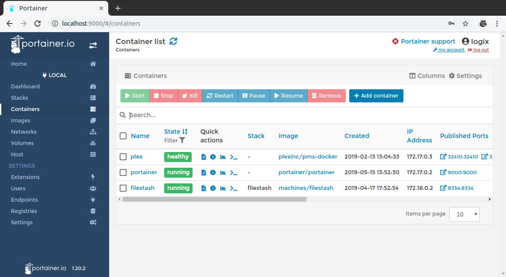

# Development & Programming

## Overview

- [Development & Programming](#development--programming)
  - [Overview](#overview)
  - [Python](#python)
  - [Docker](#docker)
  - [Docker Compose](#docker-compose)
  - [Portainer](#portainer)

??? info "How do I run **DietPi-Software** and install **optimised software** ?"
    To install any of the **DietPi optimised software** listed below run from the command line:

    ```
    dietpi-software
    ```

    Choose **Software Optimised** and select one or more items. Finally click on `Install`. DietPi will do all the necessary steps to install and start these software items.

    

    To see all the DietPi configurations options, review [DietPi Tools](../../dietpi_tools) section.

[Return to the **Optimised Software list**](../../software/)

## Python

Python is a text based interpreted programming language with object oriented programming options for general purpose applications.  

{: width="200px"}

Source: By [www.python.org](http://www.python.org/community/logos/), [GPL](https://commons.wikimedia.org/w/index.php?curid=34991637)

The install option explicitly only installs Python 3.  
The `pip` resp. `pip3` Python package manager and development headers are included.

To use the `pip` package manager, a typical usage will be `pip3 install -U <module>`.

***

Wikipedia: <https://wikipedia.org/wiki/Python_(programming_language)>

## Docker

In 2013, Docker introduced containers. These are a standardized unit of software that allows developers to isolate their application from the environment. Docker is de facto standard to build and share containerized apps - from single bord computers (SBC), to desktop or cloud.

A Docker container image is a lightweight, standalone, executable package of software that includes everything needed to run an application: code, runtime, system tools, system libraries and settings.

=== "How to access the logs"

    Logs can be viewed using next command:

    ```sh
    journalctl -u docker -u containerd
    ```

=== "Configuration files"

    The Docker configuration files location:

    - Docker: `/etc/docker/daemon.json`
    - containerd: `/etc/containerd/config.toml`

***

- Website: <https://docs.docker.com/get-started/overview>  
- Configuration file: <https://docs.docker.com/engine/reference/commandline/dockerd/#daemon-configuration-file>  
- Logging: <https://docs.docker.com/config/containers/logging/configure>  

For a quick intro, see **DietPi Docker Setup on Raspberry Pi 3 B Plus**:

<iframe width="560" height="315" src="https://www.youtube-nocookie.com/embed/y_VfLOGm5nA" frameborder="0" allow="accelerometer; autoplay; clipboard-write; encrypted-media; gyroscope; picture-in-picture" allowfullscreen></iframe>

## Docker Compose

Docker Compose is a [Docker](#docker) tool used to define and run multi-container applications. With Compose, you use a `YAML` file to create and configure your application's services from this configuration file.

`docker-compose` is an excellent tool for development, testing, continuous integration (CI) workflows, and staging environments. 

=== "Update to latest version"

    ```bash
    sudo pip3 install docker-compose --upgrade
    ```

***

- Official documentation: <https://docs.docker.com/compose>  
- Getting started: <https://docs.docker.com/compose/gettingstarted>

## Portainer

Portainer simplifies your Docker container management via Portainer web interface. It enables faster deploy of the applications and it gives real time visibility.



=== "Quick start"

    - It starts automatically after installation. View Portainer web interface by opening the browser using next URL: `http://<your.local.ip>:9002` [^1].

    - If you have basic questions on how to use **Portainer**, please read the beginner guide: <https://codeopolis.com/posts/beginners-guide-to-portainer/>.

=== "Update"

    Update to latest version:

    ```
    dietpi-software reinstall 185
    ```

***

Official documentation: <https://documentation.portainer.io>  
Source code: <https://github.com/portainer/portainer>  
Open-source license: zlib

[Return to the **Optimised Software list**](../../software/)

[^1]:
    [Logitech Media Server](../media/#logitech-media-server) already listened to port `9000`, and this is why **Portainer** has been configured to start using port `9002`. For more details on the implementation Portainer in DietPi see the GitHub task: <https://github.com/MichaIng/DietPi/pull/3933>
