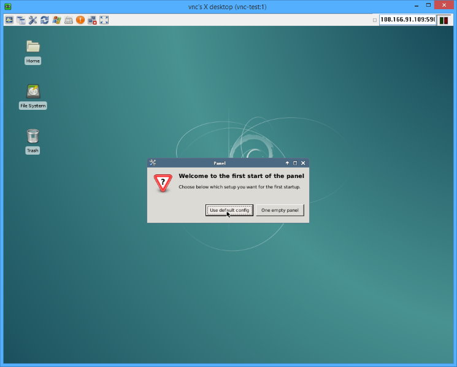
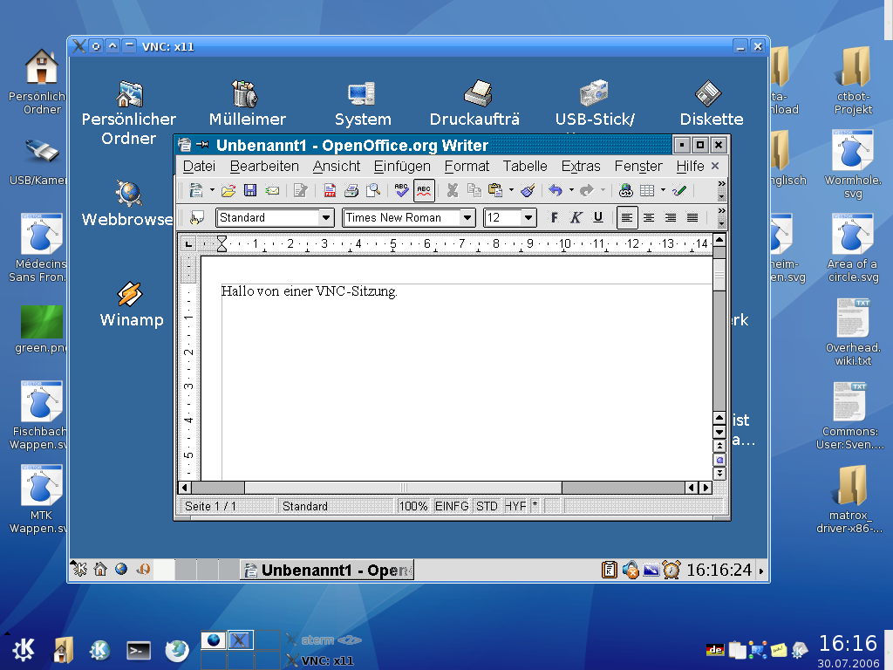
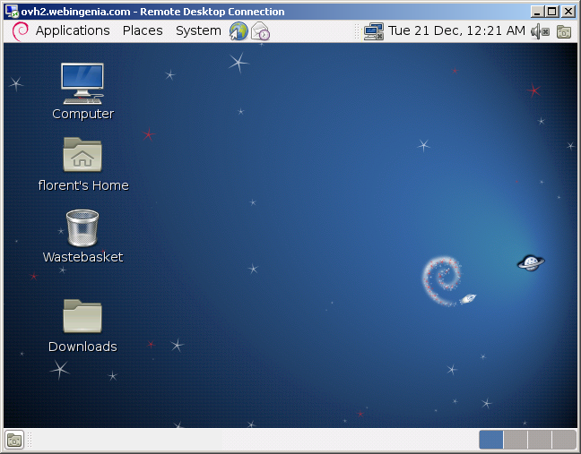
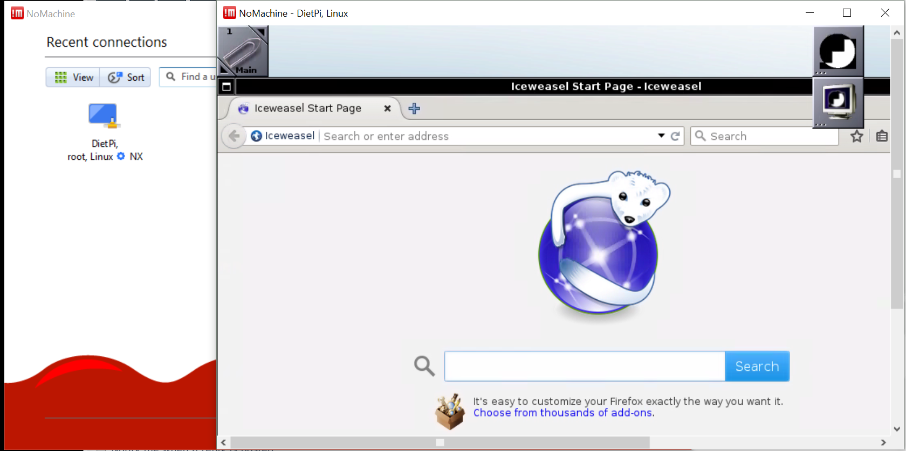
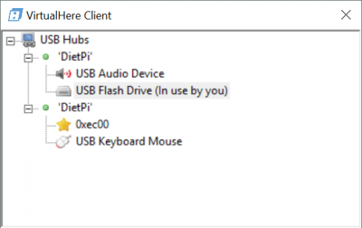

# Remote Desktop Access

Run a **Desktop environment** on your device and access it accessed remotely via network. It is a great option for headless SBC devices.

## Overview

### Remote Desktop

- [**TigerVNC Server - Desktop for remote connection**](#tigervnc-server)
- [**RealVNC Server - Desktop for remote connection**](#realvnc-server)
- [**XRDP - Remote desktop server for Windows Remote Desktop Client**](#xrdp)
- [**NoMachine - Feature rich remote desktop connection**](#nomachine)

### Remote Access

- [**Remote.It - Access your device over the internet**](#remoteit)
- [**VirtualHere - Share physically attached USB devices from your SBC over the network**](#virtualhere)

??? info "How do I run **DietPi-Software** and install **optimised software** items?"
    To install any of the **DietPi optimised software items** listed below run from the command line:

    ```sh
    dietpi-software
    ```

    Choose **Browse Software** and select one or more items. Finally select `Install`.  
    DietPi will do all the necessary steps to install and start these software items.

    {: width="643" height="365" loading="lazy"}

    To see all the DietPi configurations options, review the [DietPi Tools](../../dietpi_tools/) section.

!!! info Desktop environment

    From the list of **Browse Software**, together with any of the Remote Desktop Software choose also one of [_Graphical Desktop environment_](../desktop/). DietPi will install both of them, enabling you to use your keyboard and mouse to interact with a graphical desktop environment on your device.

[Return to the **Optimised Software list**](../../software/)

## TigerVNC Server

{: width="600" height="482" loading="lazy"}

=== "Quick start"

    You can monitor the VNC service with:

    ```sh
    systemctl status vncserver
    ```

    Although any VNC viewer may work, the latest official TigerVNC viewer can be downloaded here: <https://sourceforge.net/projects/tigervnc/files/stable/>

    #### Connection Details

    - Use the IP address of your DietPi device, e.g.: `192.168.0.100`.  
      If you can't connect, try connecting to screen `1`, e.g.: `192.168.0.100:1`.
    - Use the password you entered during the installation. If you would like to change the password execute from the console/terminal, run `vncpasswd`.
    - The default port is **5901**.  
      **Note:** To enable access from outside of your local network, this port needs to be forwarded from your router.

=== "Config options"

    #### Shared desktop

    The *shared desktop* mode is used to have more than one single VNC viewer connected to the same desktop session. To enable this mode, edit `/boot/dietpi.txt`, e.g. via `nano /boot/dietpi.txt`.
    Change to value `1` the following line:

    ```sh
    SOFTWARE_VNCSERVER_SHARE_DESKTOP=1
    ```

    A running desktop is required for this mode, therefore enable desktop autostart via `dietpi-autostart 2`, or assure that a local desktop session is active before starting TigerVNC manually.

    #### Resolution settings

    The following shows an example how to run VNC server on screen **:1** by creating a new desktop with 1280x720 resolution by editing `/boot/dietpi.txt`:

    ```sh
    nano /boot/dietpi.txt
    ```

    and change the following settings:

    ```sh
    SOFTWARE_VNCSERVER_WIDTH=1280
    SOFTWARE_VNCSERVER_HEIGHT=720
    SOFTWARE_VNCSERVER_DEPTH=32
    SOFTWARE_VNCSERVER_DISPLAY_INDEX=1
    ```

    At last restart the service to activate the new settings:

    ```sh
    systemctl restart vncserver
    ```

=== "Autostart"

    TigerVNC is enabled by default to start automatically at boot. Run `systemctl disable vncserver` to disable this behaviour and `systemctl start vncserver` to start it manually from console.

    To re-enabled TigerVNC autostart, run `systemctl enable vncserver`, to stop it manually `systemctl stop vncserver` can be used.

***

See also <https://tigervnc.org>  
Man page: <https://tigervnc.org/doc/Xvnc.html>  
Source code: <https://github.com/TigerVNC/tigervnc>

## RealVNC Server

RealVNC consists of the *VNC Server* and the *VNC Viewer* application to share the desktop or control the computer running the VNC Server.

{: width="600" height="450" loading="lazy"}

=== "VNC Server modes"

    #### Basics

    By default DietPi will start a virtual VNC session on boot at screen **:1** for user **root**.  
    The screen index can be changed via `SOFTWARE_VNCSERVER_DISPLAY_INDEX` in `/boot/dietpi.txt`.
    Logs can be viewed via `journalctl -t Xvnc:1 -t vncserver` and in `/root/.vnc/`.
    When you logout (instead of only closing the VNC Viewer window), the session will exit. Restart it via `systemctl restart vncserver`.

    #### Shared desktop

    If you set `SOFTWARE_VNCSERVER_SHARE_DESKTOP=1` in `/boot/dietpi.txt` or select desktop auto login via `dietpi-autostart` (index 2), RealVNC server will be started on boot in shared desktop mode, attaching to the first found local desktop session.  
    Check the service status via `systemctl status vncserver-x11-serviced`.
    Check all logs via `journalctl -u vncserver-x11-serviced`.

    #### RealVNC enterprise subscription

    If you have an enterprise subscription on RealVNC, you can have virtual VNC sessions spawning automatically on demand per-client connection and closing once the client disconnects. That way no resource-intense X11/desktop session needs to be persistently active on the server to allow VNC connections.  
    To enable this, after adding your enterprise subscription credentials, do the following:

    - `systemctl disable --now vncserver` disables the persistent virtual VNC session on screen **:1**.
    - `systemctl enable --now vncserver-virtuald` enables the on demand VNC session daemon.

=== "Setup the VNC Viewer"

    Simply select a VNC viewer for your system and download: <https://www.realvnc.com/connect/download/viewer/>

    #### Connection details

    - To connect on the persistent VNC session on screen :1, add the screen index to your local IP or hostname, e.g. `192.168.0.100:1`.
    - To connect to a shared desktop session, skip the screen index, e.g. `192.168.0.100`.
    - Username = `root`
    - Password = `<root password>` (default: `dietpi`)

=== "Running directly rendered apps"

     This may be the case e.g. if you want to run Minecraft remotely.

    - Enable shared desktop mode:
        - Run `dietpi-autostart 2` to autostart into a desktop session and have RealVNC attached to it automatically.
        - Then `reboot` the system to have the changes taking effect.
    - Follow the instructions within the section *Running directly rendered apps such as Minecraft remotely* in <https://help.realvnc.com/hc/en-us/articles/360002249917-VNC-Connect-and-Raspberry-Pi>.

## XRDP

XRDP is a remote desktop application using the *Windows Remote Desktop Client*.

{: width="648" height="507" loading="lazy"}

=== "Connect to your desktop"

    To connect to the desktop, open the remote desktop application in Windows (or any other XRDP compatible client).  
    Enter the IP address of your DietPi device, e.g. `192.168.0.100`.  
    Click connect and enter the following details once connected:

    - Module = `Xorg`
    - Username = `root`
    - Password = `dietpi`

=== "Access from outside your local network"

    XRDP uses port **3389** by default, so you need to open/forward it from your router to DietPi.

## NoMachine

NoMachine is a remote desktop server with advanced features, such as screen recording. The client also scans for all available NoMachine servers on your network, allowing easy connection and maintenance of your remote desktops.

{: width="600" height="299" loading="lazy"}

=== "Download NoMachine Client"

    Download the *NoMachine* client software from:

    - URL = <https://www.nomachine.com>

=== "Connect to DietPi"

    Once the NoMachine client is installed, and running on your system, you should see a device named *DietPi*. Execute the following steps:

    1. Double click it.
    2. Select `Yes` for *Remote host identification has changed*.
    3. Select `Yes` for *Verify host authenticity*.
    4. Enter the username `root` and password `dietpi`.
    5. Select `Yes` for *Do you want NoMachine to create a new display*.

    You will now be connected to your device.

## Remote.It

Remote.It allows you to easily access your DietPi device over the internet.

{: width="400" height="140" loading="lazy"}

Remote.It works by connecting you to a specific TCP port on your device, all of which can be customised during first run setup.

Examples of TCP ports for Remote.It:

- SSH port **22**. Open a remote terminal to your device.
- Transmission port **9091**. Monitor your BitTorrent downloads.
- Webserver port **80**. Access your internal websites.

=== "Quick start"

    While the DietPi-Software installation run, if not done yet, you may create an account at the Remote.It web portal: <https://app.remote.it/>

    After the DietPi-Software installation finished, you can register the device at your Remote.It desktop application. For this, retrieve your claim code via:

    ```sh
    mawk -F\" '/claim/{print $4}' /etc/remoteit/config.json
    ```

    Then follow these instructions: <https://docs.remote.it/software/device-package/installation#3.-claim-and-register-the-device>

***

YouTube video tutorial (German language): [Raspberry Pi einfach fernsteuern: Remote.It SSH ohne VPN von überall - Installation unter DietPi](https://www.youtube.com/watch?v=V5MZXBo3hGw){:class="nospellcheck"}

## VirtualHere

VirtualHere allows USB devices to be used remotely over a network just as if they were locally connected!

{: width="400" height="252" loading="lazy"}

The functionality consists of two parts:

- The [server](https://virtualhere.com/content/usb-servers): This software part is installed with the DietPi software package. It serves your USB device over the network.
- The [client](https://virtualhere.com/usb_client_software): This software part needs to be installed on every client which wants to access the USB devices.

Download the client for your PC from:

- <https://www.virtualhere.com/usb_client_software>

Once installed, available VirtualHere devices will be shown in the client user interface and can be used on the client PC.

!!! info "VirtualHere trial version is restricted to one single USB device per server instance"
    The base installation of this DietPi software package installs the VirtualHere server. Basically it starts as a trial version supporting only one single USB device. To overcome this, you need to [buy a licence](https://virtualhere.com/purchase).

!!! warning "USB Storage - WARNING: Data loss, service and system crashes may occur"
    USB devices cannot be used on the host server and the client system at the same time. VirtualHere will forcefully "detach" even actively used USB drives on the host system, once you start using them with the client. Be hence very careful to not select the wrong USB device in clients, especially when DietPi userdata or swap files are located on a USB drive.  
    If a device must stay available at the server, it is best to let it be ignored by VirtualHere, making use of the `IgnoredDevices` option: It takes `xxxx/yyyy` as value with `xxxx` being the vendor ID and `yyyy` being the device ID, which can be obtained from the output of `lsusb`. See the "Configuration" tab below and the official documentation link for further details.

??? hint "What to do if the VirtualHere GUI client is not displayed on your DietPi graphical desktop (e.g. Xfce)"
    In some cases, the GUI client does not start an X11 window. This might be caused by a missing root permission to access X. In this case you need to execute `xhost local:root` in advance.  
    With this you need to execute (example 64 bit Intel machine where the VirtualHere client was copied to `/usr/local/bin`)

    ```sh
    xhost local:root
    sudo /usr/local/bin/vhuit64
    ```

=== "Network port"

    The VirtualHere server listens on the TCP port **7575** by default for client connections.

=== "Service control"

    The service is started automatically at boot. As systemd service, it can be controlled with the following commands:

    ```sh
    systemctl status virtualhere
    ```

    ```sh
    systemctl start virtualhere
    ```

    ```sh
    systemctl stop virtualhere
    ```

    ```sh
    systemctl restart virtualhere
    ```

=== "Configuration"

    The configuration file can be found at:

    ```
    /opt/virtualhere/config.ini
    ```

    When doing changes, apply them by restart the service:

    ```sh
    systemctl restart virtualhere
    ```

=== "Logs"

    Since VirtualHere runs as systemd service, its logs can be viewed via:

    ```sh
    journalctl -u virtualhere
    ```

=== "Update"

    When a new version is available, VirtualHere can be updated by simply reinstalling it:

    ```sh
    dietpi-software reinstall 138
    ```

***

Official website: <https://virtualhere.com/>  
Official server docs: <https://virtualhere.com/configuration_faq>

[Return to the **Optimised Software list**](../../software/)
