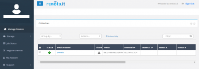

# Remote Desktop Access

Run a **Desktop environment** on your device and access it accessed remotely via network. It is a great option for headless SBC devices.

## Overview

### Remote Desktop

- [**TigerVNC Server - Desktop for remote connection**](#29-tigervnc-server-desktop-for-remote-connection)
- [**RealVNC Server - Desktop for remote connection**](#realvnc-server-desktop-for-remote-connection)
- [**XRDP - Remote desktop server for Windows Remote Desktop Client**](#xrdp-remote-desktop-server-for-windows-remote-desktop-client)
- [**NoMachine - Feature rich remote desktop connection**](#nomachine-feature-rich-remote-desktop-connection)

### Remote Access:

- [**Remot3.it - (Weaved) Access your device over the internet**](#remot3it-weaved-access-your-device-over-the-internet)  
- [**VirtualHere - Share physically attached USB devices from your SBC over the network**](#virtualhere-share-physically-attached-usb-devices-from-your-sbc-over-the-network)  

[Return to the **Optimised Software list**](../../dietpi_optimised_software)

??? info "How do I run **DietPi-Software** and install **Optimised software** ?"
    To install any of the **DietPi Optimised Software** listed below run from the command line:
    ```
    dietpi-launcher
    ```
    and selected _DietPi-Software_. or launch directly the tool:
    ```
    dietpi-software
    ```

    Choose **Software optimised** and select one or more items. Finally click on `Install`. DietPi will do all the necessary steps to install and start these software items.

    

    To see all the DietPi configurations options, review [DietPi Tools](../../dietpi_tools) section.

!!! info Desktop environment

    From the list of **Optimised Software**, together with any of the Remote Desktop Software choose also one of [_Graphical Desktop environment_](../desktop). DietPi will install both of them, enabling you to use your keyboard and mouse to interact with a graphical desktop environment on your device.

## TigerVNC Server - Desktop for remote connection

{: style="width:600px"}

=== "Quick start"

    You can monitor the VNC service with:

    ```
    systemctl status vncserver
    ```

    **Connection Details:**

    - Use the IP address of your DietPi device (e.g.: `192.168.0.100`).  
      If you can't connect, try connecting to screen 1 (e.g.: `192.168.0.100:1`).
    - Use the password you entered during the installation. If you would like to change the password execute from the console/terminal `vncpasswd`.
    - The default port is 5901.  
      **Note:** To enable access from outside of your local network, this port needs to be forwarded from your router.

=== "VNC Server settings"

    #### VNC Server - Shared desktop

    The *shared desktop* mode is used to have more than one single VNC viewer connected to the VNC server. To enable this mode, edit dietpi.txt (e.g. via `nano /boot/dietpi.txt`).  
    Change to value 1 the following line

    ```
    SOFTWARE_VNCSERVER_SHARE_DESKTOP=1
    ```

    A running desktop is required in this mode, therefore set the desktop to autostart from boot via `dietpi-autostart`.

    #### VNC Server - Resolution settings

    The following shows an example how to run VNC server on screen :1 by creating a new desktop with 1280x720 resolution by editing dietpi.txt:

    ```
    nano /boot/dietpi.txt
    ```

    and change the following settings:

    ```
    SOFTWARE_VNCSERVER_WIDTH=1280
    SOFTWARE_VNCSERVER_HEIGHT=720
    SOFTWARE_VNCSERVER_DEPTH=32
    SOFTWARE_VNCSERVER_DISPLAY_INDEX=1
    ```

    At last restart the service to activate the new settings:

    ```
    systemctl restart vncserver
    ```

=== "Enable autostart"

    VNC servers start automatically during boot, unless you have selected **Desktop** from the `dietpi-autostart` configuration tool.

    To enable a different startup setup, run from the command line the main DietPi tool `dietpi-autostart`. To see all the DietPi configurations options, review the [DietPi Tools](../../dietpi_tools) section.

=== "Official documentation"

    - [LXDE Website](https://www.lxde.org)
    - [LXDE Wiki](https://wiki.lxde.org/en/Main_Page)

## RealVNC Server - Desktop for remote connection

RealVNC consists of the *VNC Server* and the *VNC Viewer* application to share the desktop or control the computer running the VNC Server.

{: style="width:600px"}

=== "VNC Server modes"

    #### Basics

    By default DietPi will start a virtual VNC session on boot at screen :1 for user root.  
    The screen index can be changed via `SOFTWARE_VNCSERVER_DISPLAY_INDEX` in `/boot/dietpi.txt`.
    Logs can be viewed via `journalctl -t Xvnc:1 -t vncserver` and in `/root/.vnc/`.
    When you logout (instead of only closing the VNC Viewer window), the session will exit. Restart it via `systemctl restart vncserver`.

    #### Autostart

    If you set `SOFTWARE_VNCSERVER_SHARE_DESKTOP=1` in /boot/dietpi.txt or select desktop auto login via `dietpi-autostart` (index 2), RealVNC server will be started on boot in shared desktop mode, attaching to the first found local desktop session.  
    Check the service status via `systemctl status vncserver-x11-serviced`.
    Check all logs via `journalctl -u vncserver-x11-serviced`.

    #### RealVNC enterprise subscription

    If you have an enterprise subscription on RealVNC, you can have virtual VNC sessions spawning automatically on demand per-client connection and closing once the client disconnects. That way no resource-intense X11/desktop session needs to be persistently active on the server to allow VNC connections.  
    To enable this, after adding your enterprise subscription credentials, do the following:

    - `systemctl disable --now vncserver`. This disables the persistent virtual VNC session on screen :1
    - `systemctl enable --now vncserver-virtuald`.  This enables the on demand VNC session daemon

=== "Setup the VNC Viewer"

    Simply select a VNC viewer for your system and download: <https://www.realvnc.com/connect/download/viewer/>

    **Connection details:**

    - To connect on the persistent VNC session on screen :1, add the screen index to your local IP or hostname, e.g. `192.168.0.100:1`.
    - To connect to a shared desktop session, skip the screen index, e.g. `192.168.0.100`.
    - Username = `root`
    - Password = `<root password>` (default: `dietpi`)

=== "Running directly rendered apps"

     This may be the case e.g. if you want to run Minecraft remotely.

    - Enable shared desktop mode:
        - Run `dietpi-autostart`
        - Select *Desktops autostart* option, exit, then reboot system
    - Follow the instructions within the section *Running directly rendered apps such as Minecraft remotely* in <https://www.realvnc.com/docs/raspberry-pi.html>.

## XRDP - Remote desktop server for Windows Remote Desktop Client

XRDP is a remote desktop application using the *Windows Remote Desktop Client*.

{: style="width:600px"}

=== "Connect to your desktop"

    To connect to the desktop, open the remote desktop application in Windows (or any other XRDP compatible client).  
    Enter the IP address of your DietPi device (e.g.: 192.168.0.100).  
    Click connect and enter the following details once connected:

    - Module = `Xvnc` (Jessie = `Sesman-Xvnc`)
    - Username = `root`
    - Password = `dietpi`

=== "Access from outside your local network"

    XRDP uses port 3389 by default, so you need to open/forward it from your router to DietPi.

## NoMachine - Feature rich remote desktop connection

NoMachine is a remote desktop server with advanced features, such as screen recording. The client also scans for all available NoMachine servers on your network, allowing easy connection and maintenance of your remote desktops.

{: style="width:600px"}

=== "Download NoMachine Client"

    Download the *NoMachine* client software from:

    - URL = <https://www.nomachine.com>

=== "Connect to DietPi"

    Once the NoMachine client is installed, and running on your system, you should see a device named *DietPi*. Execute the following steps:

    1. Double click it.
    2. Select `Yes` for *Remote host identification has changed*.
    3. Select `Yes` for *Verify host authenticity*.
    4. Enter the username `root` and password `dietpi`.
    5. Select `Yes` for *Do you want NoMachine to create a new display*.

    You will now be connected to your device.


## Remot3.it - (Weaved) Access your device over the internet

Remot3.it allows you to easily access your DietPi device over the internet.

{: style="width:600px"}

Weaved works by connecting you to a specific TCP port on your device, all of which can be customized during first run setup.

Examples of TCP ports for Remot3.it:

- SSH port 22. Open a remote terminal to your device.
- Transmission port 9091. Monitor your BitTorrent downloads.
- Webserver port 80. Access your internal webserver and/or websites.

=== "First Run Setup"

    The first run setup is executed once `dietpi-software` has completed the installation and the system is rebooted. Run the following command. Follow the onscreen instructions to setup and link an account:

    - `connectd_installer`

    Once your account is created and linked to this system, you can select a port for Remot3.it to enable remote access.

=== "Access your device"

    Sign into your Remot3.it account to access your devices remotely:

    - URL = <https://www.remot3.it>

## VirtualHere - Share physically attached USB devices from your SBC over the network

The VirtualHere package is used to share physically attached USB devices from your SBC over the network to other systems.

{: style="width:600px"}

Download the client for your PC from:

- <https://www.virtualhere.com/usb_client_software>

Once installed, available VirtualHere devices will be shown in the client user interface and can be used on the client PC.

!!! warning "USB Storage WARNING"
    - As per <https://github.com/MichaIng/DietPi/issues/852#issuecomment-292781475> it it highly recommended that you do not install VirtualHere if your DietPi user data is stored on a USB drive.
    - VirtualHere does not take into account mounted drives when selecting them for remote use. This is potentially dangerous for any mounted drive that is in use and may cause data loss.
    - Do not use drives on the client that are mounted on the SBC.  
      Unmount the drive before hand in `dietpi-drive_manager`.
