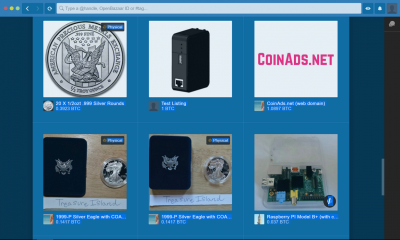
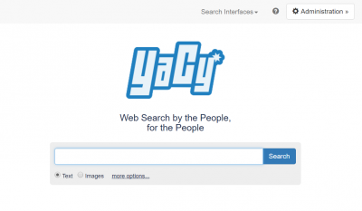

# Social / Search

## Overview

- [**FreshRSS - A self-hosted RSS feed aggregator**](#freshrss)
- [**phpBB - Free flat-forum bulletin board software solution**](#phpbb)
- [**Wordpress - Website Blog and Publishing platform**](#wordpress)
- [**Single File PHP Gallery - Host and browse your images from a web interface**](#single-file-php-gallery)
- [**Baïkal - Lightweight CalDAV + CardDAV server**](#baikal)
- [**OpenBazaar - Decentralized peer to peer market server using Bitcoin**](#openbazaar)
- [**YaCy - Decentralized open source search engine**](#yacy)

??? info "How do I run **DietPi-Software** and install **optimised software** ?"
    To install any of the **DietPi optimised software** listed below run from the command line:

    ```
    dietpi-software
    ```

    Choose **Software Optimised** and select one or more items. Finally click on `Install`. DietPi will do all the necessary steps to install and start these software items.

    

    To see all the DietPi configurations options, review [DietPi Tools](../../dietpi_tools) section.

[Return to the **Optimised Software list**](../../dietpi_optimised_software)

## FreshRSS

FreshRSS is a self-hosted RSS feed aggregator.

{: style="width:500px"}

=== "Access to the web interface"

    - URL = `<http://<your.IP>/freshrss`
    - Username = `dietpi`
    - Password = `dietpi`

***

Official documentation: <https://freshrss.github.io/FreshRSS/en/users/02_First_steps.html>

## phpBB

If you always wanted your very own forum, phpBB is all you need.

Also Installs:

- Webserver

{: style="width:500px"}

### Access Forums

URL = `http://<your.IP>/phpbb`

### First Run Setup

DietPi automatically creates the SQL database for phpBB. Please follow the steps below to enter those details into phpBB to complete the setup.

#### Access to the phpBB website

- URL = `http://<your.IP>/phpbb`
- Click the "Install" tab
- Click "Proceed to next step"
- Click "Start install"

#### MySQL/MariaDB database details

To enter the MySQL/MariaDB database details:

- Database server hostname or data source name (DSN) = `localhost`
- Database username = `phpbb`
- Database name = `phpbb`
- Database password = `dietpi` (respectively your chosen global software password)

- Click "Proceed to next step"
- Click "Proceed to next step"

#### Create your admin account

This account will be used for full access to phpBB forum.

- Click "Proceed to next step"
- Click "Proceed to next step"
- Click "Proceed to next step"

#### Email and Server URL settings

Use the default values.

- Click "Proceed to next step"
- Click "Proceed to next step"

The database tables will now be generated, please wait.

#### Login

Click "Login"  
Using your admin login details that you created previously, you can now manage and create your forum pages.

As the installation is now completed, you will need to remove the installation folder, before the forum can be live. Run the following command:

```sh
rm -R /var/www/phpbb/install
```

Your forum is now ready.

## Wordpress

WordPress is a state-of-the-art semantic personal publishing platform with a focus on aesthetics, web standards, and usability.
It allows you to create your own website.

{: style="width:500px"}

=== "Access to the web interface"

    URL = `http://<your.IP>/wordpress`

=== "First time connect"

    The first time you connect, enter the following MySQL database details:

    - Database name = `wordpress`
    - Username = `wordpress`
    - Password = your global application password
    - Database Host = `localhost`
    - Table Prefix = `wp_`

## Single File PHP Gallery

*Single File PHP Gallery* allows you to host and browse your images from a web interface.

Also Installs:

- LASP Webserver

{: style="width:500px"}

=== "Access to Image Gallery"

    URL = `http://<your.IP>/gallery`

=== "Add images"

    To add your own images:

    - Create your image folder

        ```sh
        mkdir /var/www/gallery/MyImageFolder
        ```

    - Put an image file inside your new folder

        ```sh
        wget https://dietpi.com/images/dietpi-logo_192x192.png
        mv dietpi-logo_192x192.png /var/www/gallery/MyImageFolder/
        ```

***

Website: <https://sye.dk/sfpg>  
YouTube video: [DietPi: Easily set up Raspberry Pi projects (e.g. a shared photo gallery)](https://www.youtube.com/watch?v=0by117lpq_o)

## Baïkal

Baïkal is a lightweight CalDAV + CardDAV server.

{: style="width:500px"}

=== "First run setup"

    Access the setup page:

    - URL = `http://<your.IP>/baikal/html`
    - Enter a new admin password for your account, then click the next/save button.

    Enter MySQL Details:

    - Use MySQL = Yes
    - MySQL host = `127.0.0.1`
    - MySQL database name = `baikal`
    - MySQL username = `baikal`
    - MySQL password = your global software password (default: `dietpi`)

=== "Access the web interface"

    - URL = `http://<your.IP>/baikal/html/admin`
    - Username = `admin`
    - Password = What you set during first run setup above.

## OpenBazaar

OpenBazaar is a free decentralised peer to peer market server for all. No fees. Usage of Bitcoins.  
Oldschool: Think Napster, but for buying and selling stuff using your Bitcoins.

{: style="width:500px"}

=== "OpenBazaar Client"

    The client will allow you to browse and trade, within the OpenBazaar market network.  
    <https://www.openbazaar.org/download/>

=== "Connecting OpenBazaar Client to your OpenBazaar Server"

    Step 1:  
    During installation, you will be asked to enter a username, password, and allowed IP address.

    Step 2:  
    Next, you will need to open the OpenBazaar Client and add your server:

    - Click Menu (top right)
    - Click New Server
    - Select Standalone
    - Enter the IP address of your DietPi device, and, the username and password you applied in step 1.

## YaCy

YaCy is a decentralized open source search engine.  
Essentially, it is a "peer-to-peer" Google search engine, not controlled by Google.

{: style="width:500px"}

=== "Access to the web interface"

    URL = `http://<your.IP>:8090`

=== "Admin Interface Login"

    Set password with:

    ```sh
    /etc/yacy/bin/passwd.sh mypassword
    ```

    Login details are then:

    - Username = `admin`
    - Password = `mypassword`

=== "Reduce CPU usage"

    YaCy is extremely CPU intensive, coupled with constant background processing, we highly recommend using `dietpi-services` to reduce process priority.

    Recommended setting: Nice = 19

[Return to the **Optimised Software list**](../../dietpi_optimised_software)
