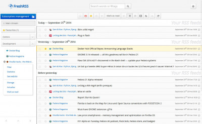

# Social & Search

## Overview

- [**FreshRSS - A self-hosted RSS feed aggregator**](#freshrss)
- [**phpBB - Free flat-forum bulletin board software solution**](#phpbb)
- [**Wordpress - Website Blog and Publishing platform**](#wordpress)
- [**Single File PHP Gallery - Host and browse your images from a web interface**](#single-file-php-gallery)
<!-- markdownlint-disable-next-line MD051 -->
- [**Baïkal - Lightweight CalDAV + CardDAV server**](#baikal)
- [**Synapse - Decentralized communication with the Matrix protocol**](#synapse)

??? info "How do I run **DietPi-Software** and install **optimised software** items?"
    To install any of the **DietPi optimised software items** listed below run from the command line:

    ```sh
    dietpi-software
    ```

    Choose **Browse Software** and select one or more items. Finally select `Install`.  
    DietPi will do all the necessary steps to install and start these software items.

    {: width="643" height="365" loading="lazy"}

    To see all the DietPi configurations options, review the [DietPi Tools](../../dietpi_tools/) section.

[Return to the **Optimised Software list**](../../software/)

## FreshRSS

FreshRSS is a self-hosted RSS feed aggregator.

{: width="400" height="247" loading="lazy"}

=== "Access to the web interface"

    - URL = `<http://<your.IP>/freshrss`
    - Username = `dietpi`
    - Password = `dietpi`

***

Official documentation: <https://freshrss.github.io/FreshRSS/en/users/02_First_steps.html>

## phpBB

If you always wanted your very own forum, phpBB is all you need.

Also Installs:

- Webserver

{: width="400" height="298" loading="lazy"}

### Access Forums

URL = `http://<your.IP>/phpbb`

### First Run Setup

DietPi automatically creates the SQL database for phpBB. Please follow the steps below to enter those details into phpBB to complete the setup.

#### Access to the phpBB website

- URL = `http://<your.IP>/phpbb`
- Click the "Install" tab
- Click "Proceed to next step"
- Click "Start install"

#### MySQL/MariaDB database details

To enter the MySQL/MariaDB database details:

- Database server hostname or data source name (DSN) = `localhost`
- Database username = `phpbb`
- Database name = `phpbb`
- Database password = `dietpi` (respectively your chosen global software password)

- Click "Proceed to next step"
- Click "Proceed to next step"

#### Create your admin account

This account will be used for full access to phpBB forum.

- Click "Proceed to next step"
- Click "Proceed to next step"
- Click "Proceed to next step"

#### Email and Server URL settings

Use the default values.

- Click "Proceed to next step"
- Click "Proceed to next step"

The database tables will now be generated, please wait.

#### Login

Click "Login"  
Using your admin login details that you created previously, you can now manage and create your forum pages.

As the installation is now completed, you will need to remove the installation folder, before the forum can be live. Run the following command:

```sh
rm -R /var/www/phpbb/install
```

Your forum is now ready.

## Wordpress

WordPress is a state-of-the-art semantic personal publishing platform with a focus on aesthetics, web standards, and usability.
It allows you to create your own website.

{: width="400" height="242" loading="lazy"}

=== "Access to the web interface"

    URL = `http://<your.IP>/wordpress`

=== "First time connect"

    The first time you connect, enter the following MySQL database details:

    - Database name = `wordpress`
    - Username = `wordpress`
    - Password = your global application password
    - Database Host = `localhost`
    - Table Prefix = `wp_`

## Single File PHP Gallery

*Single File PHP Gallery* allows you to host and browse your images from a web interface.

Also Installs:

- LASP Webserver

{: width="400" height="248" loading="lazy"}

=== "Access to Image Gallery"

    URL = `http://<your.IP>/gallery`

=== "Add images"

    To add your own images:

    - Create your image folder

        ```sh
        mkdir /var/www/gallery/MyImageFolder
        ```

    - Put an image file inside your new folder

        ```sh
        wget https://dietpi.com/images/dietpi-logo_192x192.png
        mv dietpi-logo_192x192.png /var/www/gallery/MyImageFolder/
        ```

***

Website: <https://sye.dk/sfpg>  
YouTube video tutorial: [DietPi: Easily set up Raspberry Pi projects (e.g. a shared photo gallery)](https://www.youtube.com/watch?v=0by117lpq_o)

## Baïkal

Baïkal is a lightweight CalDAV + CardDAV server.

{: width="400" height="219" loading="lazy"}

=== "First run setup"

    Access the setup page:

    - URL = `http://<your.IP>/baikal/html`
    - Enter a new admin password for your account, then click the next/save button.

    Enter MySQL Details:

    - Use MySQL = Yes
    - MySQL host = `127.0.0.1`
    - MySQL database name = `baikal`
    - MySQL username = `baikal`
    - MySQL password = your global software password (default: `dietpi`)

=== "Access the web interface"

    - URL = `http://<your.IP>/baikal/html/admin`
    - Username = `admin`
    - Password = What you set during first run setup above.

## Synapse

Synapse is a server, written in Python, for communication using the Matrix protocol.

=== "Client"

    For communicating with Synapse, you can use [Element](https://element.io/), however any client that supports the Matrix protocol should work.

=== "Federation"

    Synapse is by default set up to be a private server, with no connection to any other servers. To connect to other servers (federate), see <https://github.com/matrix-org/synapse/blob/develop/docs/federate.md>.  
    Note that [frp](../advanced_networking/#frp) does not currently work with Synapse.

=== "Configuration"

    - Config directory:  
        `/mnt/dietpi_userdata/synapse`
    - Main config file:  
        `/mnt/dietpi_userdata/synapse/homeserver.yaml`
    - DietPi config override:  
        `/mnt/dietpi_userdata/synapse/homeserver.yaml.d/00-dietpi.yaml`  
        This also contains the PostgreSQL database details and that file is hence only readable to root or the `synapse` user.

    To add or change settings, best practice is to create a new override configuration, e.g.:

    ```
    /mnt/dietpi_userdata/synapse/homeserver.yaml.d/99-local.yaml
    ```

    For changes to take effect, the service needs to be reloaded:

    ```sh
    systemctl reload synapse
    ```

=== "Service handling"

    The DietPi Synapse implementation creates a systemd service `synapse.service` to start and control the Synapse server. The following commands can be used:

    - Start: `systemctl start synapse`
    - Stop: `systemctl stop synapse`
    - Restart: `systemctl restart synapse`
    - Reload config: `systemctl reload synapse`
    - Print status: `systemctl status synapse`

=== "View logs"

    Logs are done to the system journal an can be viewed via:

    ```sh
    journalctl -u synapse
    ```

=== "Update to latest version"

    Since Synapse is installed via Python 3 pip, you can update it via:

    ```sh
    pip3 install -U matrix-synapse
    ```

***

Official website: <https://matrix.org/>  
Official documentation: <https://matrix.org/docs/guides>  
Source code: <https://github.com/matrix-org/synapse>  
License: [Apache 2.0](https://github.com/matrix-org/synapse/blob/develop/LICENSE)

[Return to the **Optimised Software list**](../../software/)
