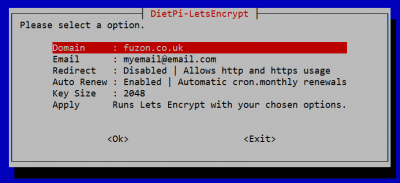
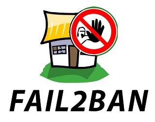
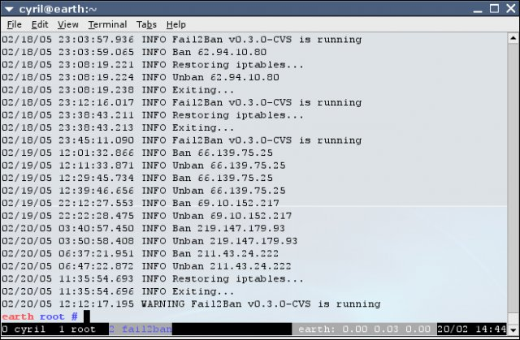

# System Security

## Overview

- [**Let’s Encrypt - Enable HTTPS / SSL**](#lets-encrypt)
- [**Fail2Ban - Protects your system from brute-force attacks**](#fail2ban)

??? info "How do I run **DietPi-Software** and install **optimised software** items?"
    To install any of the **DietPi optimised software items** listed below run from the command line:

    ```sh
    dietpi-software
    ```

    Choose **Browse Software** and select one or more items. Finally select `Install`.  
    DietPi will do all the necessary steps to install and start these software items.

    {: width="643" height="365" loading="lazy"}

    To see all the DietPi configurations options, review the [DietPi Tools](../dietpi_tools.md) section.

[Return to the **Optimised Software list**](../software.md)

## Let’s Encrypt

Let's Encrypt is a free SSL certificate provider. Certbot is the official client to apply Let's Encrypt SSL certificates to your webserver. This will allow you to have `https://` (encrypted and authenticated) access to your websites.

### Requirements

To use Certbot you need:

- A working Apache, Nginx or Lighttpd webserver
- A URL/domain (e.g.: `mysite.org`). No-IP can be used for a URL/domain that points to your device.
- Ports 80 and 443 (TCP) need to be forwarded to your device. This is typically set within your router.

???+ important "Keep port 80 open for Certbot renewal"
    Even when you use only HTTPS on port 443, Let's Encrypt requires port 80 to stay opened for certificate renewals (in your router's forwarding functionality).

{: width="400" height="183" loading="lazy"}

### Create and apply your cert

Once Certbot has been installed from `dietpi-software`, run `dietpi-letsencrypt` to configure, create and apply your SSL certificate:

```sh
dietpi-letsencrypt
```

Simply enter the details and settings you require, then select `Apply`.  
Let's Encrypt is that simple!

***

Website: <https://letsencrypt.org>

## Fail2Ban

Fail2Ban protects your system from brute-force attacks by banning the source IP address.  
We have enabled detection for SSH servers (OpenSSH and Dropbear), however, Fail2Ban also supports additional software.

{: width="200" height="157" loading="lazy"}

{: width="550" height="360" loading="lazy"}

An IP address is by default ban triggered after 3 failed SSH login attempts. Fail2Ban will ban the source IP address for 10 minutes.

=== "Check status of block activity"

    The status can be checked with these commands:

    ```sh
    fail2ban-client status sshd
    fail2ban-client status dropbear
    ```

=== "Configuration"

    Fail2Ban can handle several configuration options like general configuration and configurations for special programs on a config file base. The location of these config files is a directory structure within `/etc/fail2ban/` and its subdirectories.  
    See the [Fail2Ban documentation](https://github.com/fail2ban/fail2ban/wiki) for further information including [many filter configuration examples for programs](https://github.com/fail2ban/fail2ban/tree/master/config/filter.d).

=== "Enable support for additional programs"

    Fail2Ban supports brute-force protection for other software, like Apache and ProFTPD. Pre-defined software filters can be found in the `/etc/fail2ban/filter.d/` directory.  
    You can enable/disable these by adding additional `[software]` filter blocks to the `/etc/fail2ban/jail.conf` file, using the filters' file names without file extension. Properties not defined in a specific filter block, are taken from the `[DEFAULT]` block.  
    See also the Fail2Ban configuration examples for [vsftpd](https://github.com/fail2ban/fail2ban/blob/master/config/filter.d/vsftpd.conf) and [ProFTPD](https://github.com/fail2ban/fail2ban/blob/master/config/filter.d/proftpd.conf).

***

Website: <https://github.com/fail2ban/fail2ban/wiki>

[Return to the **Optimised Software list**](../software.md)
