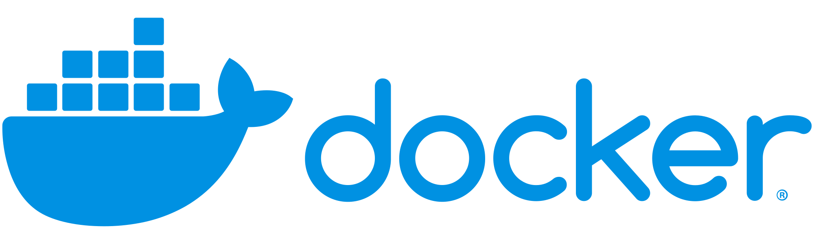

# System Security

## Overview

- [**Fail2Ban - Protects your system from brute-force attacks**](#fail2ban-protects-your-system-from-brute-force-attacks)  
- [**Docker - Build, ship, and run distributed applications**](#docker-build-ship-and-run-distributed-applications)  

??? info "How do I run **DietPi-Software** and install **Optimised software** ?"
    To install any of the **DietPi Optimised Software** listed below run from the command line:
    ```
    dietpi-launcher
    ```
    and selected _DietPi-Software_. or launch directly the tool:
    ```
    dietpi-software
    ```

    Choose **Software optimised** and select one or more items. Finally click on `Install`. DietPi will do all the necessary steps to install and start these software items.

    

    To see all the DietPi configurations options, review [DietPi Tools](../../dietpi_tools) section.

[Return to the **Optimised Software list**](../../dietpi_optimised_software)

## Fail2Ban - Protects your system from brute-force attacks

Fail2Ban protects your system from brute-force attacks by banning the source IP address.  
We have enabled detection for SSH servers (OpenSSH and Dropbear), however, Fail2Ban also supports additional software.

{: style="width:100px"}

{: style="width:550px"}

Source: [<Lostcontrol\> of Fail2ban wiki](http://www.fail2ban.org/wiki/index.php/File:Fail2ban-screenshot.jpg), [GPL](https://commons.wikimedia.org/w/index.php?curid=19776087)

An IP address is by default ban triggered after 3 failed SSH login attempts. Fail2Ban will ban the source IP address for 10 minutes.

=== "Check status of block activity"

    The status can be checked with these commands:

    - `fail2ban-client status sshd`
    - `fail2ban-client status dropbear`

=== "Enable support for additional programs"

    Fail2Ban supports brute-force protection for other software (e.g. Apache, ProFTPD etc).  
    You can enable/disable these features by modifying the */etc/fail2ban/jail.conf* file, and setting `enable = true` under the *[software]* name.

See also <https://www.fail2ban.org>.

## Docker - Build, ship, and run distributed applications

Docker is used to build, ship, and run distributed applications.

{: style="width:200px"}

{: style="width:400px"}

Source: [<User:Maklaan\> - Based on a Docker blog post](https://commons.wikimedia.org/w/index.php?curid=37965701)

=== "Access logs"

    Access logs can be viewed with this command: `journalctl -u docker -u containerd`

=== "Config files"

    The Docker configuration files are:

    - Docker: `/etc/docker/daemon.json`
    - containerd: `/etc/containerd/config.toml`

=== "Official documentation"

    - Configuration file: <https://docs.docker.com/engine/reference/commandline/dockerd/#daemon-configuration-file>
    - Logging: <https://docs.docker.com/config/containers/logging/configure>

See also <https://wikipedia.org/wiki/Docker_(software)> resp. <https://docs.docker.com/get-started/overview>.
