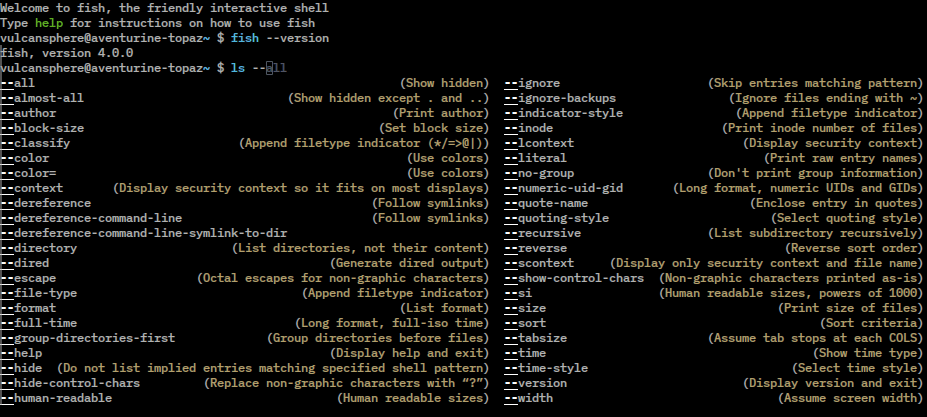

# System Software

## Overview

- [**fish - the friendly interactive shell**](#fish)

[//]: # (Include software expandable infoblock)
--8<---------- "snippet-includes/DietPi-Software_infoblock.md"

[Return to the **Optimised Software list**](../software.md)

## fish

fish ( **f**`riendly` **i**`nteractive` **sh**`ell`) is a smart and user-friendly command line shell for Linux, macOS, and the rest of the family.

{: width="256" height="256" loading="lazy"}

!!! cite "*Logo by `Axel Liljencrantz`, [GitHub Fish shell](https://github.com/fish-shell/fish-shell/blob/master/doc_src/python_docs_theme/static/fish.png)*"

fish is a shell with nice features like e.g.

- tab completion
- syntax highlighting
- scriptable with a simple, clean, and consistent syntax
- command suggestions based on history and completions

Example screenshot for tab completion:

{: width="927" height="417" loading="lazy"}

!!! cite "*`VulcanSphere`, [developers screenshot](https://commons.wikimedia.org/w/index.php?curid=161253970)*"

***

Website: <https://fishshell.com/>  
GitHub: <https://github.com/fish-shell/fish-shell>  
Wikipedia: <https://wikipedia.org/wiki/Fish_(Unix_shell)>

[Return to the **Optimised Software list**](../software.md)
