# System Stats & Management

## Overview

- [**DietPi-Dashboard - Official lightweight standalone DietPi web interface**](#dietpi-dashboard)
- [**DietPi-CloudShell - Lightweight system stats for your LCD display or monitor**](#dietpi-cloudshell)
- [**Linux Dash - Web interface system stats**](#linux-dash)
- [**phpSysInfo - Web interface system stats**](#phpsysinfo)
- [**RPi-Monitor - Web interface system stats**](#rpi-monitor)
- [**Netdata - Web interface system stats**](#netdata)
- [**Webmin - Remote system management with web interface**](#webmin)
- [**K3s - Lightweight Kubernetes**](#k3s)
- [**MicroK8s - Low-ops, minimal production Kubernetes**](#microk8s)
- [**Prometheus Node Exporter - Prometheus exporter for hardware and OS metrics**](#prometheus-node-exporter)
- [**Homer - A modern homepage for your services**](#homer)

??? info "How do I run **DietPi-Software** and install **optimised software** items?"
    To install any of the **DietPi optimised software items** listed below run from the command line:

    ```sh
    dietpi-software
    ```

    Choose **Browse Software** and select one or more items. Finally select `Install`.  
    DietPi will do all the necessary steps to install and start these software items.

    {: width="643" height="365" loading="lazy"}

    To see all the DietPi configurations options, review the [DietPi Tools](../../dietpi_tools/) section.

[Return to the **Optimised Software list**](../../software/)

## DietPi-Dashboard

DietPi-Dashboard is a very lightweight and standalone web interface for monitoring and managing your DietPi system with your favourite web browser. It is written in Rust. An overview of its features is given by our article [here](https://dietpi.com/blog/?p=1137).

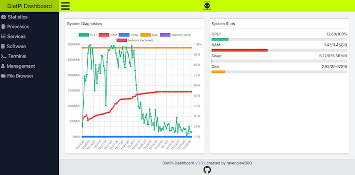{: width="700" height="346" loading="lazy"}

!!! warning "DietPi-Dashboard is still in Beta!"

    We hence do not recommend to actively use it on sensitive production systems yet.

=== "Web interface"

    DietPi-Dashboard is accessible by default at TCP port **5252**:

    - URL: `http://<your.IP>:5252`
    - Password: `<your software password>` (default: `dietpi`)

=== "Directories"

    The DietPi-Dashboard executable and its configuration file can be found at:

    ```
    /opt/dietpi-dashboard
    ```

=== "Configuration"

    The configuration file is located at:

    ```
    /opt/dietpi-dashboard/config.toml
    ```

    When doing changes, you need to restart the service afterwards:

    ```sh
    systemctl restart dietpi-dashboard
    ```

=== "Password protection"

    Password protection is enabled by default from DietPi v7.9 on. If you installed it before, you'll need to enable it via configuration file. For this, create a SHA512 hash of the `PASSWORD` you want to use for logging into the web interface, and a random 64-character secret which is used to generate a token to transfer and store securely in your browser. Apply those to the configuration file and restart the service for the changes to take effect:

    ```sh
    hash=$(echo -n 'PASSWORD' | sha512sum | mawk '{print $1}')
    secret=$(openssl rand -hex 32)
    G_CONFIG_INJECT 'pass[[:blank:]]' 'pass = true' /opt/dietpi-dashboard/config.toml
    GCI_PASSWORD=1 G_CONFIG_INJECT 'hash[[:blank:]]' "hash = \"$hash\"" /opt/dietpi-dashboard/config.toml
    GCI_PASSWORD=1 G_CONFIG_INJECT 'secret[[:blank:]]' "secret = \"$secret\"" /opt/dietpi-dashboard/config.toml
    unset -v hash secret
    systemctl restart dietpi-dashboard
    ```

    To change the password, just replace the hash in the config file and restart the service.

    If you want to force a logout of all browsers without changing the password, you can instead change the secret. Generate an apply a new secret to the configuration file and restart the service. Every client and browser will then need to login again to continue using the DietPi-Dashboard, as the stored token that is based on password and secret has been invalidated.

=== "Multiple nodes"

    From DietPi v8.0 on, you can install DietPi-Dashboard as backend only node, with does not include an own web interface. Such backend only nodes can then be accessed from another full DietPi-Dashboard frontend/web interface. Additional nodes would need to be added manually into configuration file located at:

    ```
    /opt/dietpi-dashboard/config.toml
    ```    

    When doing changes, you need to restart the service afterwards:

    ```sh
    systemctl restart dietpi-dashboard
    ```

    !!! hint "Full DietPi-Dashboard nodes with frontend included can currently not be accessed from other frontends."

=== "Service control"

    DietPi-Dashboard by default is started as systemd service and can hence be controlled with the following commands:

    ```sh
    systemctl status dietpi-dashboard
    ```

    ```sh
    systemctl stop dietpi-dashboard
    ```

    ```sh
    systemctl start dietpi-dashboard
    ```

    ```sh
    systemctl restart dietpi-dashboard
    ```

=== "Logs"

    Service logs can be reviewed with the following command:

    ```sh
    journalctl -u dietpi-dashboard
    ```

=== "Update"

    You can easily update DietPi-Dashboard by reinstalling it and restarting the service for the change to take effect:

    ```sh
    dietpi-software reinstall 200
    systemctl restart dietpi-dashboard
    ```

***

Source code: <https://github.com/ravenclaw900/DietPi-Dashboard>  
License: [GPLv3](https://github.com/ravenclaw900/DietPi-Dashboard/blob/main/LICENSE)

## DietPi-CloudShell

DietPi-CloudShell turns your console or LCD screen into a lightweight system stats display.

### Sample screenshots

The following screenshots shall give an overview over the displaying features of *DietPi-CloudShell*.

=== "CPU usage"

    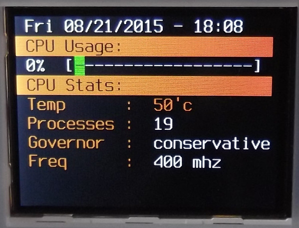{: width="400" height="305" loading="lazy"}

=== "Memory usage"

    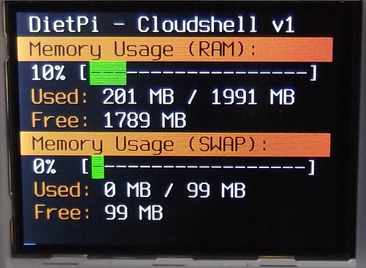{: width="400" height="293" loading="lazy"}

=== "Storage details"

    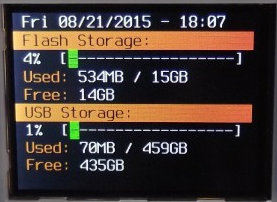{: width="400" height="292" loading="lazy"}

=== "Network details"

    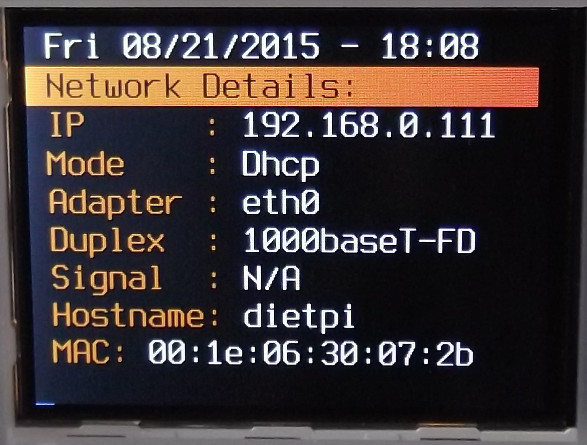{: width="400" height="303" loading="lazy"}

=== "Pi-hole stats"

    {: width="400" height="305" loading="lazy"}

***

YouTube video tutorial: [DietPi CloudShell (RPi / Odroid XU4)](https://www.youtube.com/watch?v=O-W8Z33as_U)

### Configuration

=== "Configuration"

    Launch the DietPi-CloudShell control panel:

    ```sh
    dietpi-cloudshell
    ```

    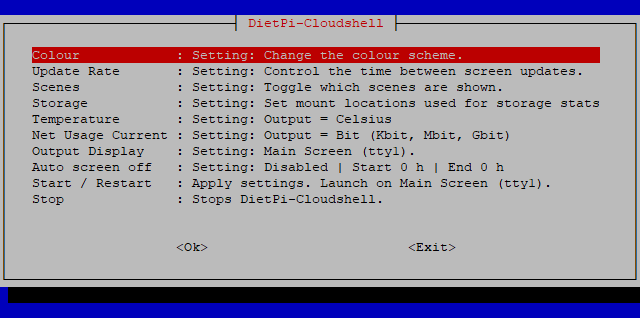{: width="600" height="298" loading="lazy"}

=== "Scenes"

    DietPi-CloudShell offers scenes with predefined display outputs resp. layouts.  
    Scenes are configured in the *Scenes* dialog within `dietpi-cloudshell`.

    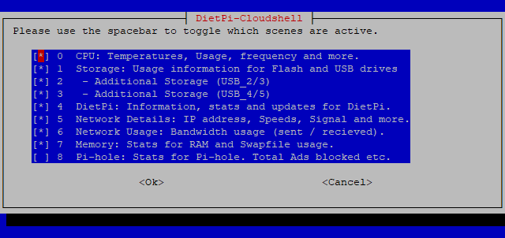{: width="600" height="283" loading="lazy"}

=== "Power saving"

    This feature will allow you to automatically power down the screen and disable DietPi-CloudShell processing during a specific time.  
    Please note this feature requires DietPi-CloudShell to be launched with `dietpi-autostart`, or run `dietpi-cloudshell` from the main screen (`tty1`).  
    If you make changes to DietPi-CloudShell over SSH, once saved, please reboot the system to ensure this feature becomes activated.

    Power saving: `Auto screen off`

### Touchscreen support

=== "Waveshare32"

    See <https://www.waveshare.com/3.2inch-rpi-lcd-b.htm>.  
    This is available for all Raspberry Pi and Odroid versions. DietPi will automatically configure your system for the device.  
    Simply run `dietpi-config`, select `Display Options`, then select `waveshare32`.   
    After a reboot, your *Waveshare32* will become active.

    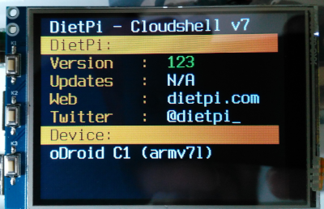{: width="400" height="258" loading="lazy"}

=== "Odroid 3.5 LCD shield"

    See <https://www.hardkernel.com/shop/c1-3-2inch-tfttouchscreen-shield/>.  
    This is available for all Odroid versions. DietPi will automatically configure your system for the device.  
    Simply run `dietpi-config`, select `Display Options`, then select `odroid-lcd35`.   
    After a reboot, your *Odroid 3.5 LCD* will become active.

    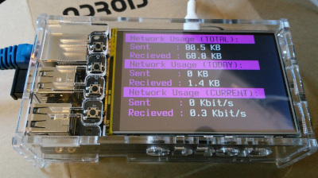{: width="400" height="224" loading="lazy"}

=== "Other touchscreens"

    The display feature of *DietPi-CloudShell* works generally with any LCD display or monitor with a resolution of at least 320x240 pixels.

## Linux Dash

Linux Dash allows you to monitor your system stats from a web page.

- Also Installs: [LASP webserver stack](../webserver_stack/)

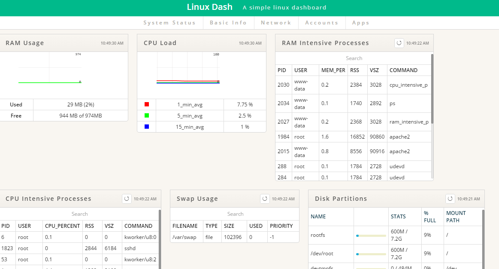{: width="500" height="270" loading="lazy"}

=== "Access to Linux Dash"

    The web interface of *Linux Dash* can be accessed via:

    - URL = `http://<your.IP>/linuxdash/app`

***

Official documentation: <https://github.com/afaqurk/linux-dash/wiki>

## phpSysInfo

Allows you to monitor your system stats from a web page. The display output can be customized via an `.ini` file.

- Also Installs: [LASP webserver stack](../webserver_stack/)

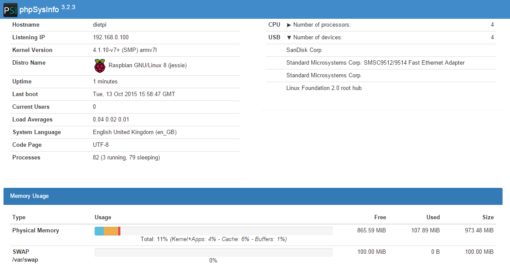{: width="500" height="268" loading="lazy"}

=== "Access to phpSysInfo"

    The web interface of *phpSysInfo* can be accessed via:

    - URL = `http://<your.IP>/phpsysinfo`

=== "Customization"

    This is done via the file `phpsysinfo.ini` which is located in the phpSysInfo main directory (typical `/var/www/phpsysinfo`). An example file `phpsysinfo.ini.new` is present and gives inline information about all configuration options. Just walk through this file and discover all these bells an whistles.

***

Official website: <https://phpsysinfo.github.io/phpsysinfo>

## RPi-Monitor

RPi-Monitor is a slick, lightweight system stats monitor with web interface.

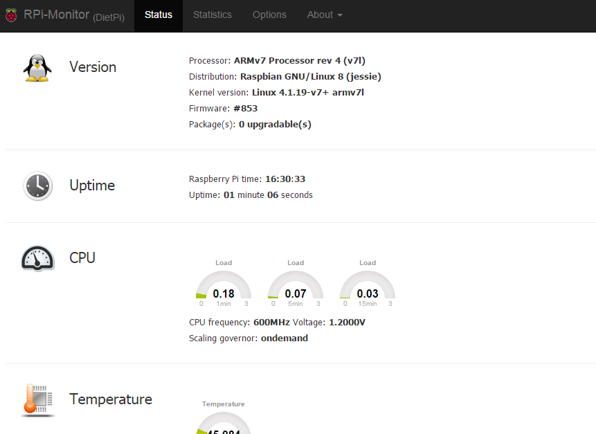{: width="500" height="364" loading="lazy"}

=== "Main features"

    The main features of *RPi-Monitor* are:

    - Collecting, storing and presenting metrics
    - It's flexibly configurable
    - It's user extendable
    - Metrics sharing can be done via JSON file or via SNMP
    - Alert option

=== "Access to RPi-Monitor"

    The web interface is accessible via port **8888**:

    - URL = `http://<your.IP>:8888`

=== "Configuration"

    The configuration is described there: <https://xavierberger.github.io/RPi-Monitor-docs/20_index.html>

***

Official website: <https://github.com/XavierBerger/RPi-Monitor>.

## Netdata

Netdata is a slick and feature-rich system stats monitor, with web interface.

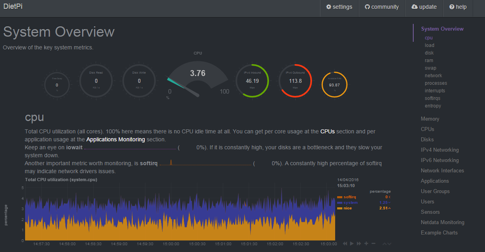{: width="500" height="260" loading="lazy"}

=== "Access to Netdata"

    The web interface is accessible via port **19999**:

    - URL = `http://<your.IP>:19999`

=== "Troubleshooting"

    Depending on your system, by default Netdata might be not accessible from remote browsers. If this is the case, open the configuration file  
    `/etc/netdata/netdata.conf`  
    and change the line  
    `bind socket to IP = 127.0.0.1`  
    to match either the local network IP or static public IP of your DietPi server depending on your needs.
    Alternatively comment it e.g. if your server does not have a static public IP but you require remote access. But note that an unprotected publicly accessible Netdata web interface is a potential security risk. Head over to the "Security hardening" tab to learn more about how to restrict access to Netdata.

    Once saved, you will need to restart the service to implement the changes by entering the below into the terminal:

    ```sh
    systemctl restart netdata
    ```

=== "Security hardening"

    Note that having Netdata accessible to anyone gives potential attackers a bunch of useful information where to start hacking.  
    To learn about how to limit access to Netdata, please refer to their documentation regarding [the configuration of access lists](https://learn.netdata.cloud/docs/agent/web/server/#access-lists).

***

Official documentation: <https://learn.netdata.cloud/docs/overview/what-is-netdata>  
Wikipedia: <https://wikipedia.org/wiki/Netdata>

## Webmin

Webmin is a web-based feature-rich remote system management tool. Many system settings can easily be set using the web interface dialogues.

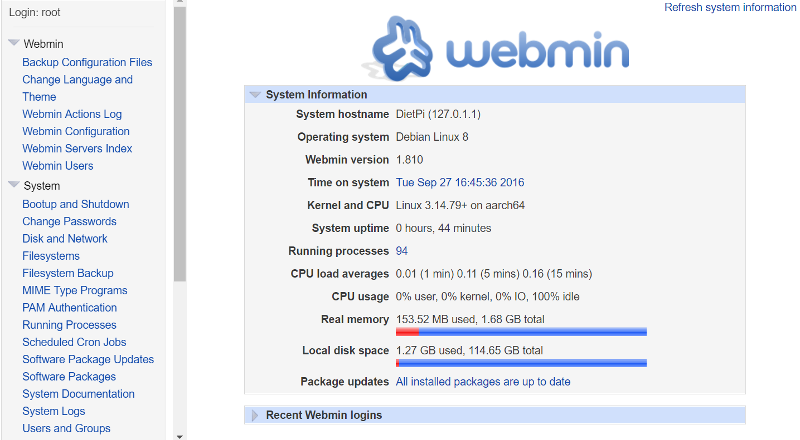{: width="500" height="276" loading="lazy"}

=== "Access to Webmin"

    The web interface is accessible via port **10000**:

    - URL = `https://<your.IP>:10000`
    - Username = `root`
    - Password = `<your software password>` (default: `dietpi`)

    ???+ hint "Use HTTPS"

        Please ensure `https://` URL is typed, `http://` won't work!

=== "System logging"

    The Webmin system logging panel still depends on a classical file logger, like Rsyslog. However DietPi will not impose this logging overhead on systems by default. If you need to see system logs via the *Webmin online panel*, you can either configure a custom *syslog* daemon or install *Rsyslog* manually:

    ```sh
    apt install rsyslog
    ```

    DietPi comes with *systemd* and the related *journald* system logger, which can be accessed via the command `journalctl`.

***

Official website: <https://webmin.com/>  
<!--Official documentation: <https://doxfer.webmin.com/Webmin/Main_Page>  -->
Wikipedia: <https://wikipedia.org/wiki/Webmin>

## K3s

Lightweight Kubernetes - The certified Kubernetes distribution built for IoT & Edge computing

{: width="300" height="116" loading="lazy"}

=== "Before installation"

    The default installation of K3s creates a single-node cluster.
    If you want to have a multi-node setup, you need to configure the nodes to speak to the others.

    In `/boot/dietpi.txt`, edit the `SOFTWARE_K3S_EXEC` parameter to set command (`server` or `agent`).
    You can add other command-line parameters after the command.

    Example:

    ```
    SOFTWARE_K3S_EXEC=server --disable=local-storage
    ```

    If you need to add many command-line parameters, it is recommended to put them in a file instead,
    keeping only the command (`server` or `agent`) in `/boot/dietpi.txt`.
    During installation, if `/boot/dietpi-k3s.yaml` exists, it is copied to `/etc/rancher/k3s/config.yaml`, and used by K3s.
    The format of this file is documented in the [K3s docs](https://rancher.com/docs/k3s/latest/en/installation/install-options/#configuration-file).

=== "Connecting to your cluster"

    When running in `server` mode, K3s generates a `kubeconfig` file at `/etc/rancher/k3s/k3s.yaml`.
    Copy this to your client machine, and edit the `server` setting to point to the hostname of the server.

    Place the file in the default location (`~/.kube/config`), or point to it using the `KUBECONFIG` environment-variable.

    You should now be able to interact with your Kubernetes cluster using `kubectl`:

    ```sh
    kubectl get nodes
    kubectl get pods -A
    ```

=== "View logs"

    - Service: `journalctl -u k3s`

***

Official website: <https://k3s.io>  
Official documentation: <https://rancher.com/docs/k3s/latest/en/>  
Source code: <https://github.com/k3s-io/k3s>  
License: [Apache 2.0](https://github.com/k3s-io/k3s/blob/master/LICENSE)

## MicroK8s

High availability - Low-ops, minimal production Kubernetes, for developers, cloud, clusters, workstations, Edge and IoT.

{: width="300" height="150" loading="lazy"}

=== "Connecting to your cluster"

    To create a cluster out of two or more already-running MicroK8s instances, use the `microk8s` add-node command:

    ```sh
    microk8s add-node
    ```

    From the node you wish to join to this cluster, run the following:

    ```sh
    microk8s join 192.168.1.230:25000/92b2db237428470dc4fcfc4ebbd9dc81/2c0cb3284b05
    ```

    Use the `--worker` flag to join a node as a worker not running the control plane, e.g.:

    ```sh
    microk8s join 192.168.1.230:25000/92b2db237428470dc4fcfc4ebbd9dc81/2c0cb3284b05 --worker
    ```

    For most commands, you can use `microk8s` in front like below.

    ```sh
    microk8s kubectl get nodes
    microk8s kubectl get napspaces
    ```

    MicroK8s does provide a few "addons", which can be seen below with the enable and disable command.

    ```sh
    microk8s status # to view the addons
    microk8s enable dns # to enable addons
    microk8s enable dashboard # to enable Kubernetes dashboard
    ```

=== "View logs"

    Per-node log files can be in:

    ```
    /var/log/pods
    ```

***

Official website: <https://microk8s.io/>  
Official documentation: <https://microk8s.io/docs>  
Addons documentation: <https://microk8s.io/docs/addons>  
Source code: <https://github.com/ubuntu/microk8s>  
License: [Apache 2.0](https://github.com/ubuntu/microk8s/blob/master/LICENSE)

## Prometheus Node Exporter

Prometheus exporter for hardware and OS metrics. This component exposes system metrics, so they can be scraped by an external [Prometheus server](https://prometheus.io/), which can aggregate metrics from many devices. These metrics can then be visualized through [Grafana](https://grafana.com/), the final piece of a very powerful monitoring stack.

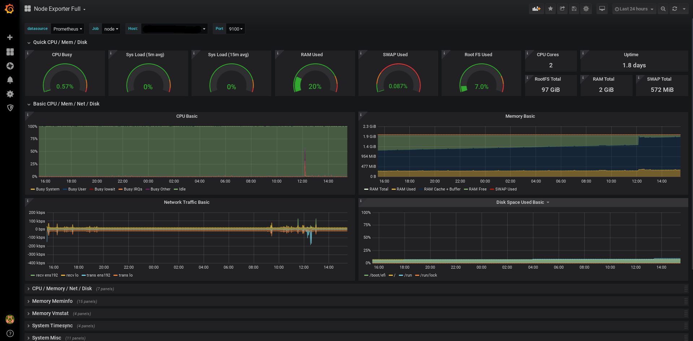{: width="800" height="395" loading="lazy"}

On Raspberry Pi SBCs, this software will include the [Raspberry Pi Exporter](https://github.com/fahlke/raspberrypi_exporter), which will add RPi-specific metrics such as voltages, CPU frequencies and temperatures.

=== "Metrics access"

    The metrics endpoint of *Prometheus Node Exporter* is exposed at TCP port **9100** and can be accessed via:

    - URL = `http://<your.IP>:9100/metrics`

=== "Configuration"

    ???+ important "Prometheus server not included"
        Note that this software component **does not** install or configure a Prometheus server, it must be installed separately.

    Your Prometheus server needs to be configured in order to scrape Node Exporter metrics. Full configuration of the Prometheus server is outside the scope of this documentation, but here is a sample `prometheus.yml` file for reference:

    ```yaml
    global:
      scrape_interval: 15s

    scrape_configs:
    - job_name: your.hostname
      static_configs:
      - targets: ['your.IP:9100']
    ```

=== "Grafana dashboard"

    ???+ important "Grafana not included"
        Note that this software component **does not** install or configure Grafana, it must be installed separately.

    There are [many pre-made templates](https://grafana.com/grafana/dashboards/?search=node+exporter) of Grafana dashboards for visualizing data collected from a Prometheus Node Exporter. A good starting point is [Node Exporter Full](https://grafana.com/grafana/dashboards/1860). You can import it directly into your Grafana instance by using ID **1860**.

=== "Service control"

    Since Prometheus Node Exporter runs as a systemd service, it can be controlled with the following commands:

    ```sh
    systemctl status node_exporter
    ```

    ```sh
    systemctl start node_exporter
    ```

    ```sh
    systemctl stop node_exporter
    ```

    ```sh
    systemctl restart node_exporter
    ```

=== "Logs"

    Prometheus Node Exporter runs as a systemd service, hence logs can be viewed with the following command:

    ```sh
    journalctl -u node_exporter
    ```

=== "Update"

    Prometheus Node Exporter can be updated by simply reinstalling it:

    ```sh
    dietpi-software reinstall 99
    ```

***

Official website: <https://github.com/prometheus/node_exporter>  
Documentation: <https://prometheus.io/docs/guides/node-exporter/>  
Prometheus RPi Exporter: <https://github.com/fahlke/raspberrypi_exporter>  
License: [Apache 2.0](https://github.com/prometheus/node_exporter/blob/master/LICENSE), [MIT](https://github.com/fahlke/raspberrypi_exporter/blob/master/LICENSE) (for RPi Exporter)

[Return to the **Optimised Software list**](../../software/)

## Homer

Homer is a modern and lightweight dashboard & homepage for your services

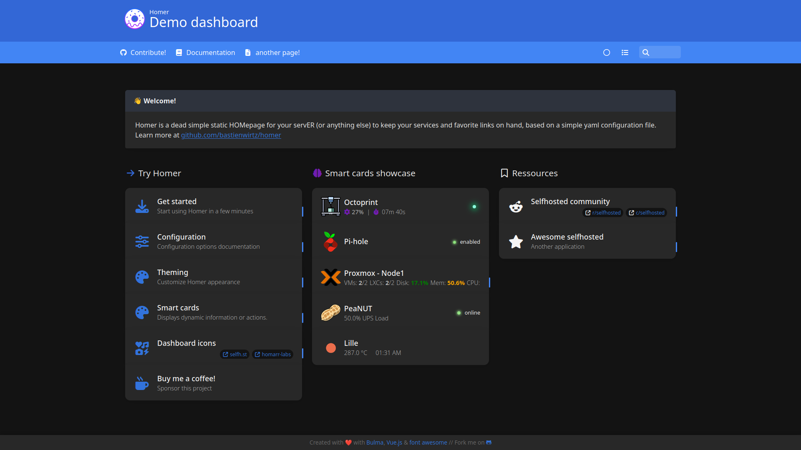{: width="400" height="218" loading="lazy"}

=== "Access to Homer"

    The *Homer* dashboard can be accessed via:

    - URL: `http://<your.IP>/homer`
    
    You may bookmark this and save it as your browser's home page, or alternatively look into tools like **Nginx Proxy Manager** and a DNS server such as **AdGuard Home** to give it a nice internal domain name such as `homer.box`.

=== "Configuration"

    To configure entries and icons for Homer, you can edit it's config file `/var/www/homer/assets/config.yml`.
    Example contents:

    ```yaml
    services:
      - name: "Selfhosted"
        icon: "fas fa-cloud"
        items:
          - name: "Adguard Home"
            logo: "assets/icons2/adguard.png"
            subtitle: "A blackhole for the internet"
            tag: "Selfhosted"
            url: "https://adguard.box"
            target: "_blank"
          - name: "Nginx"
            logo: "assets/icons2/nginx.png"
            subtitle: "Reverse proxy - load balancer"
            tag: "Selfhosted"
            url: "https://nginx.box"
            target: "_blank"
          - name: "Shiori"
            logo: "assets/icons2/shiori.png"
            subtitle: "Web archiving + Read later"
            tag: "Selfhosted"
            url: "https://shiori.box"
            target: "_blank"
          - name: "Nextcloud"
            logo: "assets/icons2/nextcloud.png"
            subtitle: "A google suite alternative"
            tag: "Selfhosted"
            url: "https://nextcloud.box"
            target: "_blank"
    ```
 
    In the example above, a column titled `Selfhosted` is being made which contains 4 entries. In the same directory as the `config.yml`, an `icons2` folder exists, which contains icon images.

=== "Update"

    To update Homer simply re-run the installer by executing

    ```sh
    dietpi-software reinstall 205
    ```

    Remark: The `dietpi-software` script update procedure preserves the file `config.yml` automatically, there is no necessity for the user to do a restore manually.

    If other files in `/var/www/homer` were previously changed by the user, they need to be copied in place (from the backup location `/mnt/dietpi_userdata/homer_backup`). As an example for a changed file `manifest.json` this could be done via:

    ```sh
    cd /mnt/dietpi_userdata/homer_backup
    mv manifest.json /var/www/homer/assets
    ```

=== "Theming - Dracula"

    To apply the [Dracula theme](https://draculatheme.com/static/img/screenshots/homer.png) to Homer execute these steps:

    1. Get theme:

        ```sh
        curl -fL 'https://raw.githubusercontent.com/dracula/homer/master/custom.css' -o /var/www/homer/assets/custom.css
        curl -fL 'https://raw.githubusercontent.com/dracula/homer/master/dracula-background.png' -o /var/www/homer/assets/dracula-background.png
        ```

    1. Edit your `config.yml` with:

        ```sh
        nano /var/www/homer/assets/config.yml
        ```

    1. Add the following lines:

        ```yaml
        # Will load Dracula theme
        stylesheet:
        - "assets/custom.css"
        ```

=== "Theming - macOS"

    To apply the [macOS styled theme](https://raw.githubusercontent.com/WalkxCode/Homer-Theme/main/preview.png) to Homer execute these steps:

    1. Get theme:

        ```sh
        cd /tmp
        curl -fLO 'https://github.com/walkxcode/homer-theme/archive/main.tar.gz'
        tar xf main.tar.gz
        rm main.tar.gz
        cp Homer-Theme-main/custom.css /var/www/homer/assets/custom.css
        cp Homer-Theme-main/wallpaper.jpeg /var/www/homer/assets/wallpaper.jpeg
        cp -R Homer-Theme-main/fonts /var/www/homer/assets/
        rm -R Homer-Theme-main
        ```

    1. Edit your `config.yml` with:

        ```sh
        nano /var/www/homer/assets/config.yml
        ```

    1. Add the following lines (make sure to remove content for colors, theme, and columns if they previously existed):

        ```yaml
        stylesheet:
        - "assets/custom.css"

        columns: "3" # You can change this to any number that is a factor of 12: (1, 2, 3, 4, 6, 12)
        theme: default
        colors:
        light:
            highlight-primary: "#fff5f2"
            highlight-secondary: "#fff5f2"
            highlight-hover: "#bebebe"
            background: "#12152B"
            card-background: "rgba(255, 245, 242, 0.8)"
            text: "#ffffff"
            text-header: "#fafafa"
            text-title: "#000000"
            text-subtitle: "#111111"
            card-shadow: rgba(0, 0, 0, 0.5)
            link: "#3273dc"
            link-hover: "#2e4053"
            background-image: "../assets/wallpaper.jpeg" # Change wallpaper.jpeg to the name of your own custom wallpaper!
        dark:
            highlight-primary: "#181C3A"
            highlight-secondary: "#181C3A"
            highlight-hover: "#1F2347"
            background: "#12152B"
            card-background: "rgba(24, 28, 58, 0.8)"
            text: "#eaeaea"
            text-header: "#7C71DD"
            text-title: "#fafafa"
            text-subtitle: "#8B8D9C"
            card-shadow: rgba(0, 0, 0, 0.5)
            link: "#c1c1c1"
            link-hover: "#fafafa"
            background-image: "../assets/wallpaper.jpeg"
        ```

=== "Theming - Catppuccin"

    To apply the [Catppuccin theme](https://github.com/mrpbennett/catppucin-homer/blob/main/assets/images/examples/preview.png?raw=true) to Homer execute these steps:

    1. Get theme:

        ```sh
        apt install git
        git clone https://github.com/mrpbennett/catppucin-homer
        ```

    1. Choose one of the `css` files, they all have varying colour schemes, and copy it to Homer, for example the `catppuccin-macchiato` style sheet:

        ```sh
        cp catppuccin-homer/flavours/catppuccin-macchiato.css /var/www/homer/assets
        ```

    1. Edit the `config.yml` file with:
    
        ```sh
        nano /var/www/homer/assets/config.yml
        ``` 
        
    1. Add the following lines (change `macchiato` to the wanted theme): 

        ```yaml
        # Will load catppuccin theme.
        stylesheet:
        - "assets/catppuccin-macchiato.css"
        ```

***

Official website: <https://github.com/bastienwirtz/homer>  
Official demo: <https://homer-demo.netlify.app/>
