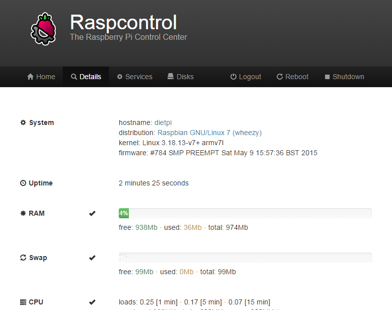

# System Stats / Management

## Overview

- [**DietPi-CloudShell - Lightweight system stats for your LCD display or monitor**](#dietpi-cloudshell-lightweight-system-stats-for-your-lcd-display-or-monitor)
- [**Raspcontrol - Web interface system stats**](#raspcontrol-web-interface-system-stats)
- [**Linux Dash - Web interface system stats**](#linux-dash-web-interface-system-stats)
- [**phpSysInfo - Web interface system stats**](#phpsysinfo-web-interface-system-stats)
- [**RPi-Monitor - Web interface system stats**](#rpi-monitor-web-interface-system-stats)
- [**Netdata - Web interface system stats**](#netdata-web-interface-system-stats)
- [**webmin - Remote system management with web interface**](#webmin-remote-system-management-with-web-interface)

??? info "How do I run **DietPi-Software** and install **optimised software** ?"
    To install any of the **DietPi optimised software** listed below run from the command line:

    ```
    dietpi-software
    ```

    Choose **Software Optimised** and select one or more items. Finally click on `Install`. DietPi will do all the necessary steps to install and start these software items.

    

    To see all the DietPi configurations options, review [DietPi Tools](../../dietpi_tools) section.

[Return to the **Optimised Software list**](../../dietpi_optimised_software)

## DietPi-CloudShell - Lightweight system stats for your LCD display or monitor

CloudShell is a Network Attached Storage (NAS) solution with RAID support. It supports a color LCD and IR receiver.  
CloudShell turns your Odroid CloudShell, Odroid 3.5 LCD Touchscreen Shield, Waveshare32, or monitor into a dedicated lightweight system stats display.

### Sample screenshots

The following screenshots shall give an overview over the displaying features of *CloudShell*.

=== "CPU usage"

    {: style="width:400px"}

=== "Memory usage"

    {: style="width:400px"}

=== "Storage details"

    {: style="width:400px"}

=== "Network details"

    {: style="width:400px"}

=== "Pi-hole stats"

    {: style="width:400px"}

Video: <https://youtu.be/O-W8Z33as_U>.

### Configuration

=== "Configuration"

    Launch the DietPi-CloudShell control panel:  
    `dietpi-cloudshell`

    {: style="width:600px"}

=== "Scenes"

    *CloudShell* offers scenes with predefined display outputs resp. layouts.  
    Scenes are configured in the *Scenes* dialog within `dietpi-cloudshell`.

    {: style="width:600px"}

=== "Power saving"

    This feature will allow you to automatically power down the screen and disable DietPi-CloudShell processing during a specific time.  
    Please note this feature requires DietPi-CloudShell to be launched with `dietpi-autostart`, or run `dietpi-cloudshell` from the main screen (`tty1`).  
    If you make changes to DietPi-CloudShell over SSH, once saved, please reboot the system to ensure this feature becomes activated.

    Power saving: `Auto screen off`

### Touchscreen support

=== "Waveshare32"

    See <http://www.waveshare.com/3.2inch-rpi-lcd-b.htm>.  
    This is available for all Raspberry PI and Odroid versions. DietPi will automatically configure your system for the device.  
    Simply run `dietpi-config` -\> *Display Options* then select `waveshare32`.   
    After a reboot, your `waveshare32` will become active.

    {: style="width:400px"}

=== "Odroid 3.5 LCD shield"

    See <https://www.hardkernel.com/shop/c1-3-2inch-tfttouchscreen-shield/>.  
    This is available for all Odroid versions. DietPi will automatically configure your system for the device.  
    Simply run `dietpi-config` -\> *Display Options* then select `odroid-lcd35`.   
    After a reboot, your *odroid-lcd35* will become active.

    {: style="width:400px"}

=== "Other touchscreens"

    The display feature of *CloudShell* works generally with any LCD display or monitor with a resolution of at least 320x240.

See also

- <https://www.hardkernel.com/shop/cloudshell-for-xu4/>
- <https://www.hardkernel.com/shop/cloudshell-2-for-xu4/>
- <https://wiki.odroid.com/accessory/add-on_boards/xu4_cloudshell2/xu4_cloudshell2>

## Raspcontrol - Web interface system stats

Raspcontrol allows you to monitor your system stats from a web page. It also supports restarting and powering off your device.

{: style="width:500px"}

=== "Access to Raspcontrol"

    The web interface of *Raspcontrol* can be accessed via:

    - URL = `http://<your.IP>/raspcontrol`
    - Username = `root`
    - Password = `dietpi`

=== "Change login credentials"

    The login credentials can be modified editing the file `/etc/raspcontrol/database.aptmnt`.

=== "Troubleshooting"

    If no page is displayed: Raspcontrol will only work if OpenSSH-Server is installed.  
    Run `dietpi-software` and select OpenSSH-Server from the menu to change.

See also <https://wikipedia.org/wiki/Raspcontrol>.

## Linux Dash - Web interface system stats

Linux Dash allows you to monitor your system stats from a web page.

- Also Installs: [LASP webserver stack](../webserver_stack/)

{: style="width:500px"}

=== "Access to Linux Dash"

    The web interface of *Linux Dash* can be accessed via:

    - URL = `http://<your.IP>/linuxdash/app`

See also <https://github.com/afaqurk/linux-dash/wiki>.

## phpSysInfo - Web interface system stats

Allows you to monitor your system stats from a web page. The display output can be customized via an ini file.

- Also Installs: [LASP webserver stack](../webserver_stack/)

{: style="width:500px"}

=== "Access to phpSysInfo"

    The web interface of *phpSysInfo* can be accessed via:

    - URL = `http://<your.IP>/phpsysinfo`

=== "Customization"

    This is done via the file `phpsysinfo.ini` which is located in the phpSysInfo main directory (typical `/var/www/phpsysinfo`). An example file `phpsysinfo.ini.new` is present and gives inline information about all configuration options. Just walk through this file and discover all these bells an whistles.

See also <https://phpsysinfo.github.io/phpsysinfo/>.

## RPi-Monitor - Web interface system stats

RPi-Monitor is a slick, lightweight system stats monitor with web interface.

{: style="width:500px"}

=== "Main features"

    The main features of *RPi-Monitor* are:

    - Collecting, storing and presenting metrics
    - It's flexibly configurable
    - It's user extendable
    - Metrics sharing can be done via JSON file or via SNMP
    - Alert option

=== "Access to RPi-Monitor"

    The web interface of *RPi-Monitor* can be accessed via:

    - URL = `http://<your.IP>:8888`

=== "Configuration"

    The configuration is described there: <https://xavierberger.github.io/RPi-Monitor-docs/20_index.html>.  

See also <https://github.com/XavierBerger/RPi-Monitor>.

## Netdata - Web interface system stats

Netdata is a slick and feature-rich system stats monitor, with web interface.

{: style="width:500px"}

=== "Access to Netdata"

    The web interface of *Netdata* can be accessed via:

    - URL = `http://<your.IP>:19999`

=== "Troubleshooting"

    Depending on your system, by default Netdata might be not accessible from remote browsers. If this is the case, open the configuration file  
    `/etc/netdata/netdata.conf`  
    and change the line  
    `bind socket to IP = 127.0.0.1`  
    to match either the local network IP or static public IP of your server depending on your needs.  
    Alternatively comment it e.g. if your server does not have a static public IP but you require remote access.

=== "Security hardening"

    Note that having Netdata accessible to anyone gives potential attackers a bunch of useful information where to start hacking.  
    About how to limit access to Netdata, check as well: <https://docs.netdata.cloud/web/server/>.

=== "Pi-hole & Netdata"

    The monitoring of a *Pi-hole* system via Netdata is described there: <https://learn.netdata.cloud/guides/monitor/pi-hole-raspberry-pi>.

See also <https://wikipedia.org/wiki/Netdata> resp. <https://learn.netdata.cloud/docs/overview/what-is-netdata>.

## webmin - Remote system management with web interface

The webmin package is a web based feature-rich remote system management tool. Many system settings can easily be set using the web interface dialogs.

{: style="width:500px"}

=== "Access to webmin"

    The web interface of *webmin* can be accessed via:

    - URL = `https://<your.IP>:10000`
    - Username = `root`
    - Password = root password at time of installation (default: `dietpi`)

    ???+ hint "Use https"

        Please ensure https URL is typed, http will not function

=== "System logging"

    The Webmin system logging panel still depends on a classical file logger, like Rsyslog. However DietPi will not impose this logging overhead on systems by default. If you need to see system logs via the *webmin online panel*, you can either configure a custom *syslog* daemon or install *Rsyslog* manually:  
    `apt install rsyslog`

    DietPi comes with *systemd* and the related *journald* system logger, which can be accessed via the command `journalctl`.

See also <https://wikipedia.org/wiki/Webmin> resp. <https://www.webmin.com/>.

[Return to the **Optimised Software list**](../../dietpi_optimised_software)
