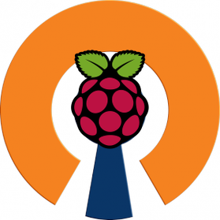

# VPN

## Overview

- [**OpenVPN - Easy to use, minimal hassle VPN server**](#openvpn)
- [**PiVPN - OpenVPN server installer and management tool**](#pivpn)
- [**WireGuard - An extremely simple yet fast and modern VPN**](#wireguard)
- [**Tailscale - Zero config VPN**](#tailscale)
- [**ZeroTier - Free easy to deploy cloud-hosted VPN service**](#zerotier)

??? info "How do I run **DietPi-Software** and install **optimised software** items?"
    To install any of the **DietPi optimised software items** listed below run from the command line:

    ```sh
    dietpi-software
    ```

    Choose **Browse Software** and select one or more items. Finally select `Install`.  
    DietPi will do all the necessary steps to install and start these software items.

    {: width="643" height="365" loading="lazy"}

    To see all the DietPi configurations options, review the [DietPi Tools](../../dietpi_tools/) section.

[Return to the **Optimised Software list**](../../software/)

## OpenVPN

An easy to use VPN server and client system. The DietPi installation of OpenVPN uses a single client file to get you connected with minimal hassle.

{: width="200" height="58" loading="lazy"}

=== "Client connection file"

    #### Generate client connection file for your VPN client system

    As a prerequisite, a client connection file (`DietPi_OpenVPN_Client.ovpn`) has to be obtained and put on your target system where your VPN client is running.  
    DietPi will automatically generate unique 2048 bit server and client keys during installation and place them into a unified client config file. You will need this file to connect to your OpenVPN server from a client.

    Client file location:

    - DietPi will generate the client config file and place it here:  
      `/boot/DietPi_OpenVPN_Client.ovpn`.  
      Simply power off and plug the SD card into your target system to obtain the file from the FAT partition.
    - DietPi will also create a copy of the file in  
      `/mnt/dietpi_userdata/DietPi_OpenVPN_Client.ovpn`.  
      Use one of DietPi's file servers to access this file.

    ???+ warning "Security issue"
        For security reasons, please remove those client connection files after they have been deployed on the client system!

    #### Changing the target address for the client file

    You will need to open the `DietPi_OpenVPN_Client.ovpn` file in a text editor to change the target domain/IP address. This can be anything from a website address, No-IP domain name, or IP address.  
    Examples for changing `mywebsite.com`. e.g.:  

    - `remote MySuperDooperWebsite.com 1194`
    - `remote 81.252.0.1 1194`

=== "Router setup"

    You have to set up your router to enable external access.  
    OpenVPN server uses the following ports:

    - TCP 443
    - TCP 943
    - UDP 1194

    These ports must all be enabled in port forwarding on your router and point to the IP address of your DietPi system.

=== "Windows client"

    Installation of the Windows OpenVPN client program is done with the following steps:

    1. Download the software under  
      URL = <https://openvpn.net/community-downloads/>
    2. Download and install the installer that suites to your Windows version.

=== "Connecting to your OpenVPN server (Windows)"

    Method 1 - Quick:  
    Simply right click the `DietPi_OpenVPN_Client.ovpn` file and choose "Start OpenVPN on this config file".

    Method 2 - GUI:  
    If you want to use the OpenVPN GUI, you will need to copy `DietPi_OpenVPN_Client.ovpn` to the OpenVPN config location (e.g.: `C:\Program Files\OpenVPN\config`).

=== "OpenVPN + Pi-hole"

    To allow VPN clients accessing your local Pi-hole instance, you need to allow DNS requests from all network interfaces:  
    `pihole -a -i local`

***

Website: <https://openvpn.net>  
Wikipedia: <https://wikipedia.org/wiki/OpenVPN>  
Installation article (German language): [PiVPN: Raspberry Pi mit OpenVPN – Raspberry Pi Teil3](https://www.kuketz-blog.de/pivpn-raspberry-pi-mit-openvpn-raspberry-pi-teil3/){:class="nospellcheck"}

## PiVPN

PiVPN is an OpenVPN and WireGuard installer and management tool. It also has a command `pivpn` which allows for simple creation of additional user profiles and configurations.

{: width="100" height="100" loading="lazy"}

=== "Using PiVPN"

    Run the command `pivpn` to see a list of options.

=== "Create a new user profile"

    Simply run the command `pivpn -a`.

=== "Unattended installation"

    For an unattended PiVPN installation during first boot of DietPi, place a configuration file named `unattended_pivpn.conf` into the boot partition/directory. For example configs, have a look at <https://github.com/pivpn/pivpn/tree/master/examples>.  
    More details can be found in the [corresponding part of the PiVPN installation documentation](https://docs.pivpn.io/install/#non-interactive-installation).

***

Website: <https://pivpn.io/>  
Documentation: <https://docs.pivpn.io/>  
YouTube video tutorial: [VPN configuration using Raspberry Pi and DietPi](https://www.youtube.com/watch?v=aYPaDeqtMG8)  
YouTube video tutorial: [DietPi PiVPN Server Setup on Raspberry Pi 3 B Plus](https://www.youtube.com/watch?v=0t0bwskZJFw)

## WireGuard

WireGuard is an extremely simple yet fast and modern VPN that utilizes state-of-the-art cryptography. It aims to be faster, simpler, leaner and more useful than IPsec, while avoiding the massive headache.

{: width="300" height="53" loading="lazy"}

When installing using `dietpi-software`, you can choose whether to install WireGuard as VPN server or client.

=== "Installing as VPN server"

    #### General

    You are asked to enter your public IP/domain and the port on which the VPN server should be available. Remember to open/forward the port (UDP) through NAT on your router.  
    During installation, a client configuration file will be automatically created as well at:  
    `/etc/wireguard/wg0-client.conf`

    Configure the client configuration to your needs, it contains some informational comments. By default it will pass all clients network traffic through the VPN tunnel, including DNS requests which will be resolved by the servers DNS resolver.  
    If you e.g. want to use the servers Pi-hole instance on the client only, but keep all other traffic outside the VPN tunnel, you would edit the following values:

    - `DNS = 192.168.0.100`
    - `AllowedIPs = 192.168.0.100/32` (where the IP needs to match your DietPi servers local IP)

    If your client is another Linux machine with iptables installed, you can uncomment the two kill switch lines to have all network traffic automatically disabled, when VPN connection is lost.
    If your client is a mobile phone with WireGuard app installed, you can simply apply the config by printing a QR code onto the servers terminal via:  
    `grep -v '^#' /etc/wireguard/wg0-client.conf | qrencode -t ansiutf8`.  
    To allow VPN clients accessing your local Pi-hole instance, you need to allow DNS requests from all network interfaces: `pihole -a -i local`

    #### Adding multiple clients

    Navigate to the servers WireGuard configuration directory: `cd /etc/wireguard`

    Create a second client key pair:

    ```sh
    umask 0077
    wg genkey > client2_private.key
    wg pubkey < client2_private.key > client2_public.key
    umask 0022
    ```

    Clone and configure the client config:

    ```sh
    cp -a wg0-client.conf wg0-client2.conf
    G_CONFIG_INJECT 'Address = ' 'Address = 10.9.0.3/24' wg0-client2.conf
    G_CONFIG_INJECT 'PrivateKey = ' "PrivateKey = $(<client2_private.key)" wg0-client2.conf
    ```

    Configure `wg0.conf` (server config) so the last lines match:

    ```
    [Peer]
    PublicKey = <paste content of client2_public.key here>
    AllowedIPs = 10.9.0.3/32
    ```

    Restart the VPN server (`systemctl restart wg-quick@wg0`) and apply `wg0-client2.conf` to your second VPN client as you did for the first before.  
    Repeat similar for third, fourth, ... VPN client.

=== "Installing as VPN client"

    Usually the VPN provider will have install instructions and ship a configuration file.  
    If the you want to connect to another DietPi machine, use the generated `/etc/wireguard/wg0-client.conf` as mentioned above.  
    If no WireGuard (auto)start instructions are included, but you require it, please do the following:

    - Check for the created configuration file/interface name: `ls -Al /etc/wireguard/`
    - It has a `.conf` file ending, lets assume: `wg0-client.conf`
    - To start the VPN interface, run: `systemctl start wg-quick@wg0-client`
    - To autostart the VPN interface on boot, run: `systemctl enable wg-quick@wg0-client`
    - To disable autostart again, run: `systemctl disable wg-quick@wg0-client`

    Remark: If the client config sets the DNS server via `DNS = ...` directive, assure that resolvconf is installed: `apt install resolvconf`

=== "View logs"

    Logging can be viewed with:

    ```sh
    journalctl -u wg-quick@wg0
    ```

    respectively

    ```sh
    journalctl -u wg-quick@<config_name>
    ```

???+ info "Kernel update"

    The WireGuard kernel module needs to rebuild whenever the kernel is updated. On most devices this will be done automatically, when the kernel (+headers) is updated via APT package, which then usually triggers the module rebuild.  
    If you update the kernel outside of APT, via `source build` or commands like `rpi-update`, assure that matching kernel headers are installed as well and rebuild the WireGuard module via: `dpkg-reconfigure wireguard-dkms`

***

Website: <https://www.wireguard.com>  
Wikipedia: <https://wikipedia.org/wiki/WireGuard>  
YouTube video tutorial (German language): [Raspberry Pi & PiVPN mit WireGuard: Installation unter DietPi mit NoIP und AVM Fritzbox](https://www.youtube.com/watch?v=yRkdzGmnvA4){:class="nospellcheck"}

## Tailscale

Zero config VPN.

Tailscale is a VPN service that makes the devices and applications you own accessible anywhere in the world, securely and effortlessly. It enables encrypted point-to-point connections using the open source WireGuard protocol, which means only devices on your private network can communicate with each other.

{: width="242" height="44" loading="lazy"}

=== "Quick start"

    Step 1: Sign up for an account

    [Sign up for a Tailscale account](https://login.tailscale.com/start). Get started with a free personal plan or trial for an organizational plan.

    Tailscale requires a Single Sign-On (SSO) provider, so you’ll need a Google, Microsoft, GitHub, Okta, OneLogin, or other supported SSO identity provider account to begin.

    Step 2: Add this device to your network

    ```sh
    tailscale up
    ```

    Tailscale helps you connect your devices together. For that to be possible, Tailscale needs to also be installed on other devices that you want to connect to.

=== "Service control"

    Since Tailscale runs as a systemd service, it can be controlled with the following commands:

    ```sh
    systemctl status tailscaled
    ```

    ```sh
    systemctl start tailscaled
    ```

    ```sh
    systemctl stop tailscaled
    ```

    ```sh
    systemctl restart tailscaled
    ```

=== "Logs"

    Tailscale runs as a systemd service, hence logs can be viewed with the following command:

    ```sh
    journalctl -u tailscaled
    ```

=== "Update"

    Tailscale is installed as an APT package and can hence be upgraded using the following commands:

    ```sh
    apt update
    apt install tailscale
    ```

***

[What is Tailscale?](https://tailscale.com/kb/1151/what-is-tailscale/)  
Website: <https://tailscale.com/>  
Docs: <https://tailscale.com/kb/>  
License: [BSD 3-Clause](https://github.com/tailscale/tailscale/blob/main/LICENSE)  
YouTube video tutorial: [Tailscale VPN - WireGuard was never so easy!](https://www.youtube.com/watch?v=Kzyolu9yn0E)

## ZeroTier

ZeroTier is a smart programmable Ethernet switch for planet Earth. It allows all networked devices, VMs, containers, and applications to communicate as if they all reside in the same physical data centre or cloud region.

{: width="300" height="71" loading="lazy"}

=== "Creation of P2P Network on controller"

    In order to use ZeroTier you firstly need to create network in controller either in ZeroTier ltd. hosted or self-hosted controllers.  
    Firstly let's show step-by-step instructions for ZeroTier hosted networks. For that we will need to:
    1. Register on <https://my.zerotier.com>
    2. Press on **"Create A Network"**
    3. Go to page of created network, where we need to choose which type network we would like to have:
        - Private: Nodes must be authorized to become members
        - Public: Any node can become a member. Members cannot be de-authorized or deleted. Members that haven't been online in 30 days will be removed, but can rejoin.

=== "Joining to network via `zerotier-cli`"

    By running `sudo zerotier-cli join <network-id>`, whereas `<network-id>` could be found in controllers web page in list of networks, we will join network.  
    If Network type is Private, then we will need to go to controller website and authorize joining node by going to `https://my.zerotier.com/network/<network-id>` and scrolling down to members list where we will find on first column checkbox, if we fill it then node is authorized else it's not.  
    If Network type is Public, then we automatically have access to other nodes.  
    In order to leave certain network we need to run next command:

    ```sh
    zerotier-cli leave <network-id>
    ```

    For printing out the node ID, run:

    ```sh
    zerotier-cli info
    ```

=== "Self-hosting controllers"

    ZeroTier supports self-hosting controllers on nodes.
    - Self-hosting a controller: <https://docs.zerotier.com/self-hosting/network-controllers>
    - Self-hosting the controller UI: <https://github.com/dec0dOS/zero-ui>

=== "Service control"

    Since ZeroTier runs as a systemd service, it can be controlled with the following commands:

    ```sh
    systemctl status zerotier-one
    ```

    ```sh
    systemctl start zerotier-one
    ```

    ```sh
    systemctl stop zerotier-one
    ```

    ```sh
    systemctl restart zerotier-one
    ```

=== "Logs"

    ZeroTier runs as a systemd service, hence logs can be viewed with the following command:

    ```sh
    journalctl -u zerotier-one
    ```

=== "Update"

    ZeroTier is installed as an APT package and can hence be upgraded using the following commands:

    ```sh
    apt update
    apt install zerotier-one
    ```

***

Website: <https://zerotier.com>  
Wikipedia : <https://en.wikipedia.org/wiki/ZeroTier>  
Source code: <https://github.com/zerotier/ZeroTierOne>
License: [BSLv1.1](https://github.com/zerotier/ZeroTierOne/blob/master/LICENSE.txt)  
YouTube video tutorial: [ZeroTier Tutorial: Delivering the Capabilities of VPN, SDN, and SD-WAN via an Open Source System](https://www.youtube.com/watch?v=Bl_Vau8wtgc)  
YouTube video tutorial: [How To Work Remotely Using ZeroTier & Windows Remote Desktop (RDP)](https://www.youtube.com/watch?v=ZShna7v77xc)

[Return to the **Optimised Software list**](../../software/)
