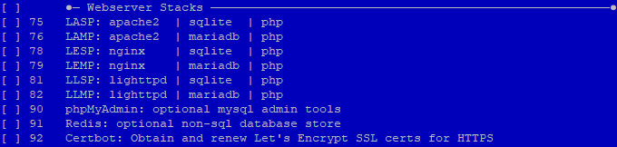
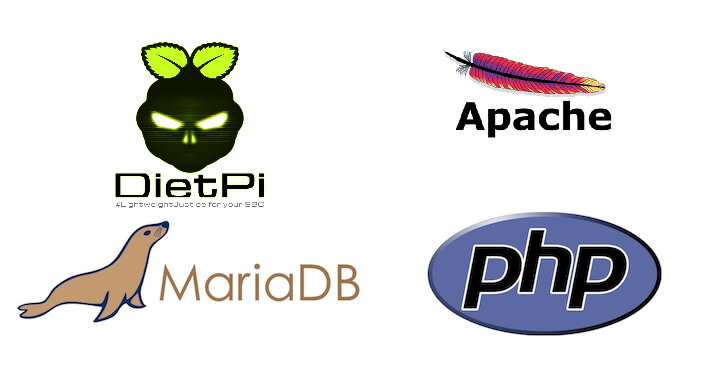
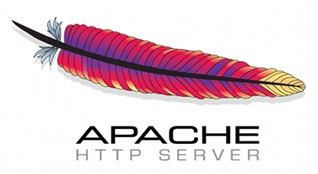
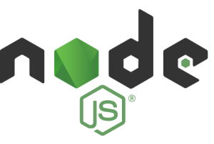

# Web Development

## Overview

[**Stacks for Web Development**](#stacks-for-web-development)

- [**LAMP** web stack - **Apache / MariaDB / PHP**](#lamp-web-stack)
- [**LASP** web stack - **Apache / SQLite / PHP**](#lasp-web-stack)
- [**LEMP** web stack - **Nginx / MariaDB / PHP**](#lemp-web-stack)
- [**LESP** web stack - **Nginx / SQLite / PHP**](#lesp-web-stack)  
- [**LLMP** web stack - **Lighttpd / MariaDB / PHP**](#llmp-web-stack)
- [**LLSP** web stack - **Lighttpd / SQLite / PHP**](#llsp-web-stack)

[**Web Servers**](#webservers)

- [**Apache** - Feature-rich webserver](#apache)  
- [**Nginx** - High performance web server, load balancer & reverse proxy](#nginx)  
- [**Lighttpd** - Extremely lightweight webserver](#lighttpd)
- [**Tomcat** - Apache Tomcat server](#tomcat)

<!-- markdownlint-disable-next-line MD051 -->
[**Web development - Programming & Frameworks**](#web-development-programming-frameworks)

- [**PHP** - Scripting language suited to web development](#php)
- [**PHP Composer** - A Dependency Manager for PHP](#php-composer)
- [**Flask** - Micro web framework powered by Python](#flask)
- [**Node.js** - JavaScript runtime designed to build scalable network applications](#nodejs)

??? info "How do I run **DietPi-Software** and install **optimised software** items?"
    To install any of the **DietPi optimised software items** listed below run from the command line:

    ```sh
    dietpi-software
    ```

    Choose **Browse Software** and select one or more items. Finally select `Install`.  
    DietPi will do all the necessary steps to install and start these software items.

    {: width="643" height="365" loading="lazy"}

    To see all the DietPi configurations options, review the [DietPi Tools](../../dietpi_tools/) section.

[Return to the **Optimised Software list**](../../software/)

## Stacks for Web Development

DietPi offers an **one-click-installation** of the following web development stacks:

- [**LAMP** web stack - **Apache / MariaDB / PHP**](#lamp-web-stack)
- [**LASP** web stack - **Apache / SQLite / PHP**](#lasp-web-stack)
- [**LEMP** web stack - **Nginx / MariaDB / PHP**](#lemp-web-stack)
- [**LESP** web stack - **Nginx / SQLite / PHP**](#lesp-web-stack)  
- [**LLMP** web stack - **Lighttpd / MariaDB / PHP**](#llmp-web-stack)
- [**LLSP** web stack - **Lighttpd / SQLite / PHP**](#llsp-web-stack)

!!! hint "Meaning of the acronyms *LAMP*, *LASP*, *LEMP*, *LESP*, *LLMP*, *LLSP*"

    - OS: **L** for Linux / DietPi
    - Webserver: **A** for Apache, **E** for [Nginx](#nginx), **L** for [Lighttpd](#lighttpd)
    - Database: **M** for MariaDB, **S** for [SQLite](../databases/#sqlite)
    - Scripting language: **P** for [PHP](#php)

!!! hint ""
    All stacks come with **PHP caches** (APCu and OPcache), being optimized based on a share of the total memory.

### Which Web Application Stack is best for you ?

=== "Which WEBSERVER to CHOOSE ?"

    **[Apache](#apache)**

    - Memory use = **High** | Multithreaded = **Yes**

    It is feature-rich and popular. It is recommended for beginners and users who are looking to follow Apache based guides.

    **[Nginx](#nginx)**

    - Memory use = **Medium** | Multithreaded = **Yes**

    It is a lightweight alternative to [Apache](#apache) and claims[^4] faster webserver performance compared to [Apache](#apache). It is ideal for medium-high traffic situations where [Lighttpd](#lighttpd) will suffer.

    **[Lighttpd](#lighttpd)**

    - Memory use = **Low** | Multithreaded = **Optional** - Some drawbacks

    It is extremely lightweight and is generally considered to offer the "best" webserver performance on Linux for SBCs (single board computers). It is recommended for users who expect low webserver traffic and/or personal use.  

    Although the DietPi installation of Lighttpd is set to single threaded, do not be put off by this, in low usage scenarios (<10 users) it will still outperform [Nginx](#nginx) and [Apache](#apache). Activation of multithreading is described in the [Lighttpd](#lighttpd) package description.

    !!! info ""

        For further details see [The battle of the web servers Apache vs. Nginx vs. Lighttpd 2](https://detechter.com/the-battle-of-the-web-servers-apache-vs-Nginx-vs-lighttpd-2/) and [^4].

=== "Which DATABASE to CHOOSE ?"

    **[MariaDB](../databases/#mariadb)**  
    It is an open source RDBMS (relational data base management system). It is application compatible to MySQL, i.e. it can be used as a *drop in* replacement for MySQL. It has more features, fewer bugs, and a better performance compared to MySQL.[^2]

    **[SQLite](../databases/#sqlite)**  
    It is an RDBMS, also compatible to MySQL. It offers a broader language support (i.e. more bindings to programming languages) compared to [MariaDB](../databases/#mariadb). [SQLite](../databases/#sqlite) has a very small footprint. As drawbacks, it has no multi user capabilities and a couple of SQL features are missing.[^3]

***

### How to install?

DietPi contains the option to choose the web stack of your favourite. Basically choosing the web stack resp. webserver is done via ***Browse Software*** within `dietpi-software`:

{: width="680" height="162" loading="lazy"}

Using this option you select the complete web stack for installation. Just select the web stack you want to install and do the installation via the *Install* execution within `dietpi-software`.

***

YouTube video tutorial: [*DietPi Web Server Tutorial | Host a website from Home | Raspberry Pi*](https://www.youtube.com/watch?v=nB-i959ZGzQ)

***

### LAMP Web Stack

LAMP stack is a popular open source web platform commonly used to run dynamic web sites and servers. It is considered by many, as the platform of choice for development and deployment of high performance web applications which require a solid and reliable foundation.

{: width="702" height="369" loading="lazy"}

=== "Quick start"

    **Access website:**

    - URL = `http://<your.IP>` or `http://<your.host.name>`
    - Local directory = `/var/www`

    **Access PHP info page:**

    - URL = `http://<your.IP>/phpinfo.php`

    **Access memory cache info:**

    - APCu = `http://<your.IP>/apc.php`
    - OPcache = `http://<your.IP>/opcache.php`

    For database, check **[MariaDB](../databases/#mariadb)** details.

=== "Secured access - HTTPS/SSL"

    **Let's Encrypt** is highly recommended - [see here how to install](../../dietpi_tools/#dietpi-letsencrypt). This will automate the creation and setup of your free SSL cert.

    ??? note "Alternative way: Manually enable HTTP/SSL by installing a self-signed SSL certificate"

        !!! caution "Recommended only in case **Let's encrypt** is not a viable option."

        **Step 1. Create key**

        ```sh
        mkdir -p /etc/apache2/ssl
        openssl req -x509 -nodes -days 1000 -newkey rsa:2048 -keyout /etc/apache2/ssl/apache.key -out /etc/apache2/ssl/apache.crt
        ```

        **Step 2. Enable SSL config and restart Apache**

        ```sh
        chmod 600 /etc/apache2/ssl/*
        cat << '_EOF_' > /etc/apache2/sites-enabled/default-ssl.conf
        <IfModule mod_ssl.c>
            <VirtualHost _default_:443>
                    ServerAdmin webmaster@localhost
                    ServerName example.com:443
                    DocumentRoot /var/www

                    LogLevel error
                    ErrorLog ${APACHE_LOG_DIR}/error.log
                    #CustomLog ${APACHE_LOG_DIR}/access.log combined

                    SSLEngine on

                    SSLCertificateFile /etc/apache2/ssl/apache.crt
                    SSLCertificateKeyFile /etc/apache2/ssl/apache.key

                    <FilesMatch "\.(cgi|shtml|phtml|php)$">
                                    SSLOptions +StdEnvVars
                    </FilesMatch>
                    <Directory /usr/lib/cgi-bin>
                                    SSLOptions +StdEnvVars
                    </Directory>
                </VirtualHost>
            </IfModule>
        _EOF_
        a2ensite ssl
        systemctl restart apache2
        ```

    Access website:

    - URL = `https://<your.IP>` or `https://<your.host.name>`

***

### LASP Web Stack

LASP is a variation of the popular open source [LAMP web stack](#lamp-web-stack), providing [SQLite](../databases/#sqlite) instead of [MariaDB](../databases/#mariadb).

[SQLite](../databases/#sqlite) is an embedded relational database engine. It is popular and together with [Apache](#apache) and PHP could be a good candidate for single board computer.

=== "Quick start"

    **Access website:**

    - URL = `http://<your.IP>` or `http://<your.host.name>`
    - Local directory = `/var/www`

    **Access memory cache info:**

    - APCu = `http://<your.IP>/apc.php`
    - OPcache = `http://<your.IP>/opcache.php`

=== "Secured access - HTTPS/SSL"

    **Let's Encrypt** is highly recommended - [see here how to install](../../dietpi_tools/#dietpi-letsencrypt). This will automate the creation and setup of your free SSL cert.

    ??? note "Alternative way: Manually enable HTTP/SSL by installing a self-signed SSL certificate"

        !!! caution "Recommended only in case **Let's encrypt** is not a viable option."

        **Step 1. Create key**

        ```sh
        mkdir -p /etc/apache2/ssl
        openssl req -x509 -nodes -days 1000 -newkey rsa:2048 -keyout /etc/apache2/ssl/apache.key -out /etc/apache2/ssl/apache.crt
        ```

        **Step 2. Enable SSL config and restart Apache**

        ```sh
        chmod 600 /etc/apache2/ssl/*
        cat << '_EOF_' > /etc/apache2/sites-enabled/default-ssl.conf
        <IfModule mod_ssl.c>
            <VirtualHost _default_:443>
                    ServerAdmin webmaster@localhost
                    ServerName example.com:443
                    DocumentRoot /var/www

                    LogLevel error
                    ErrorLog ${APACHE_LOG_DIR}/error.log
                    #CustomLog ${APACHE_LOG_DIR}/access.log combined

                    SSLEngine on

                    SSLCertificateFile /etc/apache2/ssl/apache.crt
                    SSLCertificateKeyFile /etc/apache2/ssl/apache.key

                    <FilesMatch "\.(cgi|shtml|phtml|php)$">
                                    SSLOptions +StdEnvVars
                    </FilesMatch>
                    <Directory /usr/lib/cgi-bin>
                                    SSLOptions +StdEnvVars
                    </Directory>
                </VirtualHost>
            </IfModule>
        _EOF_
        a2ensite ssl
        systemctl restart apache2
        ```

    Access website:

    - URL = `https://<your.IP>` or `https://<your.host.name>`

***

### LEMP Web Stack

LEMP is a variation of the popular open source [LAMP web stack](#lamp-web-stack), providing [Nginx](#nginx) instead of [Apache](#apache) web server.

**Nginx** is a popular choice, thanks to its lightweight utilization of resources and its flexibility to scale simply even with minimal equipment.

=== "Quick start"

    **Access website:**

    - URL = `http://<your.IP>` or `http://<your.host.name>`

    **Access PHP info page:**

    - URL = `http://<your.IP>/phpinfo.php`

    **Access memory cache info:**

    - APCu = `http://<your.IP>/apc.php`
    - OPcache = `http://<your.IP>/opcache.php`

    For database, check **[MariaDB](../databases/#mariadb)** details.

=== "Secured access - HTTPS/SSL"

    **Let's Encrypt** is highly recommended - [see here how to install](../../dietpi_tools/#dietpi-letsencrypt). This will automate the creation and setup of your free SSL cert.

    ??? note "Alternative way: Manually enable HTTP/SSL by installing a self-signed SSL certificate"

        !!! caution "Recommended only in case **Let's encrypt** is not a viable option."

        **Step 1. Create key**

        ```sh
        mkdir -p /etc/apache2/ssl
        openssl req -x509 -nodes -days 1000 -newkey rsa:2048 -keyout /etc/apache2/ssl/apache.key -out /etc/apache2/ssl/apache.crt
        ```

        **Step 2. Enable SSL config and restart Apache**

        ```sh
        chmod 600 /etc/apache2/ssl/*
        cat << '_EOF_' > /etc/apache2/sites-enabled/default-ssl.conf
        <IfModule mod_ssl.c>
            <VirtualHost _default_:443>
                    ServerAdmin webmaster@localhost
                    ServerName example.com:443
                    DocumentRoot /var/www

                    LogLevel error
                    ErrorLog ${APACHE_LOG_DIR}/error.log
                    #CustomLog ${APACHE_LOG_DIR}/access.log combined

                    SSLEngine on

                    SSLCertificateFile /etc/apache2/ssl/apache.crt
                    SSLCertificateKeyFile /etc/apache2/ssl/apache.key

                    <FilesMatch "\.(cgi|shtml|phtml|php)$">
                                    SSLOptions +StdEnvVars
                    </FilesMatch>
                    <Directory /usr/lib/cgi-bin>
                                    SSLOptions +StdEnvVars
                    </Directory>
                </VirtualHost>
            </IfModule>
        _EOF_
        a2ensite ssl
        systemctl restart apache2
        ```

    Access website:

    - URL = `https://<your.IP>` or `https://<your.host.name>`

***

### LESP Web Stack

LESP is a variation of the popular open source [LAMP web stack](#lamp-web-stack), providing [Nginx](#nginx) instead of [Apache](#apache) web server, and [SQLite](../databases/#sqlite) instead of MariaDB.

**[Nginx](#nginx)** is a popular choice, thanks to its lightweight utilization of resources and its flexibility to scale simply even with minimal equipment.

=== "Quick start"

    **Access website:**

    - URL = `http://<your.IP>` or `http://<your.host.name>`

    **Access memory cache info:**

    - APCu = `http://<your.IP>/apc.php`
    - OPcache = `http://<your.IP>/opcache.php`

=== "Secured access - HTTPS/SSL"

    **Let's Encrypt** is highly recommended - [see here how to install](../../dietpi_tools/#dietpi-letsencrypt). This will automate the creation and setup of your free SSL cert.

    Access website:

    - URL = `https://<your.IP>` or `https://<your.host.name>`

***

### LLMP Web Stack

LLMP is a variation of the popular open source [LAMP web stack](#lamp-web-stack), providing [Lighttpd](#lighttpd) instead of [Apache](#apache) web server.

=== "Quick start"

    **Access website:**

    - URL = `http://<your.IP>` or `http://<your.host.name>`
    - Local directory = `/var/www`

    **Access PHP info page:**

    - URL = `http://<your.IP>/phpinfo.php`

    **Access memory cache info:**

    - APCu = `http://<your.IP>/apc.php`
    - OPcache = `http://<your.IP>/opcache.php`

    For database, check **[MariaDB](../databases/#mariadb)** details.

=== "Secured access - HTTPS/SSL"

    **Let's Encrypt** is highly recommended - [see here how to install](../../dietpi_tools/#dietpi-letsencrypt). This will automate the creation and setup of your free SSL cert.

    Access website:

    - URL = `https://<your.IP>` or `https://<your.host.name>`

***

### LLSP web stack

LLSP is a variation of the popular open source [LAMP web stack](#lamp-web-stack), providing **[Lighttpd](#lighttpd)** instead of [Apache](#apache) web server and **[SQLite](../databases/#sqlite)** instead of [MariaDB](../databases/#mariadb).

=== "Quick start"

    **Access website:**

    - URL = `http://<your.IP>` or `http://<your.host.name>`
    - Local directory = `/var/www`

    **Access PHP info page:**

    - URL = `http://<your.IP>/phpinfo.php`

    **Access memory cache info:**

    - APCu = `http://<your.IP>/apc.php`
    - OPcache = `http://<your.IP>/opcache.php`

    For database, check **[MariaDB](../databases/#mariadb)** details.

=== "Secured access - HTTPS/SSL"

    **Let's Encrypt** is highly recommended - [see here how to install](../../dietpi_tools/#dietpi-letsencrypt). This will automate the creation and setup of your free SSL cert.

    Access website:

    - URL = `https://<your.IP>` or `https://<your.host.name>`

=== "Individual installation"

    The web development stack could be also individually installed. This option offers more flexibility giving the opportunity to select:

    - **Webserver**

    Depending on your needs, you may choose the web server that fits best your needs. In case **[Lighttpd](#lighttpd)** is not the right choice, you could continue with **Apache Web Server**, **[Nginx](#nginx)** or **Tomcat webserver**.

    - Database

    You may choose to install **[MariaDB](../databases/#mariadb)** or other available databases like **[InfluxDB](../databases/#influxdb)**, **[Redis](../databases/#redis)**, **[SQLite](../databases/#sqlite)**.

## WebServers

### Apache

Apache is open source and it is the most commonly used Web server on Linux systems.

{: width="200" height="109" loading="lazy"}

Web servers are used to serve Web pages requested by client computers. Clients typically request and view Web pages using Web browser applications such as Firefox, Opera, Chromium, Microsoft Edge, Internet Explorer etc.

Apache is a Apache Software Foundation project. The goal is to provide a secure, efficient and extensible server that provides HTTP services in sync with the current HTTP standards.

=== "Logging"

    Logging is done to journal by default, and you can view the details by executing next command:

    ```sh
    journalctl -u apache2
    ```

=== "Server name"

    The `ServerName` directive is updated with the local IP. This helps muting the related startup warnings.

    **Notes:**

    - This may imply access and CORS failures [^6] when applications check for the server name. In such case, generally applications provide a way to define a list of permitted hostnames.

    - Without a server name set, usually webserver simply apply the HTTP_HOST header, which bypasses every related check. Apache, according to the logged warning, seems to use 127.0.1.1 then.

***

Official documentation: <https://httpd.apache.org/docs>

### Nginx

**Nginx** [engine x] is an HTTP and reverse proxy server, a mail proxy server, and a generic TCP/UDP proxy server. It was released in 2004 to address the problem of increased web traffic. It has earned an excellent reputation and it is used in top million busiest sites - some of the success stories are: Dropbox, Netflix, Wordpress.com, FastMail.FM.[^1]

{: width="200" height="85" loading="lazy"}

The innovation of Nginx compared to earlier servers such as Apache was to use an asynchronous, event-driven architecture. Nginx is blazing fast, being extremely efficient when it comes to hardware utilization, allowing servers to get more speed out of their limited CPU and RAM. As a result, it is one of the fastest web server options for serving static content.

***

Official documentation: <https://www.nginx.com>

### Lighttpd

**Lighttpd** is a web server for UNIX/Linux and Windows operating systems. It is an alternative to Apache web server. It is also called Lighty.

{: width="200" height="163" loading="lazy"}

Source: Fair use, <https://en.wikipedia.org/w/index.php?curid=10881730>.

It is designed to be secure, fast, standards-compliant, and flexible while being optimized for speed-critical environments. Its low memory footprint compared to other web servers, light CPU load and its speed goals make Lighttpd a perfect candidate for SBCs.

=== "Quick access"

    After the installation, check if Lighttpd service is running on `http://<your.IP>`.

=== "Scale to multiple CPU"

    Multithreading is supported by Lighttpd and can be enabled in the configuration file `/etc/lighttpd/lighttpd.conf`. Change the value of `4` to your total core count:

    ```
    server.max-worker = 4
    ```

    Then restart services:

    ```sh
    systemctl restart lighttpd
    ```

***

Official documentation: <https://www.lighttpd.net>

### Tomcat

What is **Apache Tomcat**? Essentially it’s an open-source Java servlet and Java Server Page container that lets developers implement an array of enterprise Java applications. Tomcat also runs a HTTP web server environment in which Java code can run.

{: width="200" height="133" loading="lazy"}

Source: [The Apache Software Foundation](https://svn.apache.org/viewvc/jakarta/site/xdocs/images/logos/tomcat.eps), [Apache License 2.0](https://commons.wikimedia.org/w/index.php?curid=11302180).

=== "Install"

    Starting with DietPi 7.3 `Tomcat 8` has been removed from the DietPi Software List. The reason is that `Tomcat 8` is available until Debian Stretch only. From Debian Buster and newer versions, it will be supported only Tomcat 9.

    To install Tomcat 9, run next command in the console:

    ```sh
    apt install tomcat9
    ```

=== "Quick access"

    The web interface is accessible via port **8080**:

    - URL = `http://<your.IP>:8080`

***

Official documentation: <https://tomcat.apache.org>

## Web development - Programming & Frameworks

### PHP

{: width="150" height="78" loading="lazy"}

Source: [Colin Viebrock](https://www.php.net/download-logos.php), [CC BY-SA 4.0](https://commons.wikimedia.org/w/index.php?curid=9632398).

First introduced by Rasmus Lerdorf, PHP is an open-source, server-side general scripting language that has now become a de-facto coding standard in the web development industry.

=== "Quick start"

    - There are many tutorials - here is the official [_Getting started_](https://www.php.net/manual/en/getting-started.php) from PHP documentation.

***

Website: <https://www.php.net>  
Official documentation: <https://www.php.net/manual/en/index.php>

### PHP Composer

{: width="150" height="182" loading="lazy"}

Source: [WizardCat](https://getcomposer.org){: class="nospellcheck"} via [Wikimedia tech blog, MIT](https://commons.wikimedia.org/w/index.php?curid=38131432).

Composer is a tool for dependency management in PHP. It allows you to declare the libraries your project depends on and it will manage (install/update) them for you.

***

Website: <https://getcomposer.org/>  
Official documentation: <https://getcomposer.org/doc/>

### Flask

Flask is a lightweight web application framework. It is designed to make getting started quick and easy, with the ability to scale up to complex applications and it has become one of the most popular Python web application frameworks.

=== "Quick start"

    In order to use **Flask** it is first required first to install the Python Package Manager - [see Python 3](../programming/#python-3). Then run the next command.

    ```sh
    pip3 install -U Flask
    ```

***

Website: <https://palletsprojects.com/p/flask>  
Official documentation: <https://flask.palletsprojects.com/en/1.1.x>  
PyPI package page: <https://pypi.org/project/Flask>

### Node.js

Node.js is JavaScript runtime built on Chrome's V8 JavaScript engine.



Source: By [nodejs.org](https://nodejs.org), [Trademark policy](https://trademark-policy.openjsf.org/)

By using the event-callback/non-blocking approach, Node.js offers a single-threaded event-io model that allows orchestration of tasks running in parallel. It supports multiple connections without a need for a large memory footprint. Amazon, Netflix, eBay, Reddit, LinkedIn, Tumblr, and PayPal use Node.js.[^5]

=== "Node.js version"

    Starting with version 7.2, DietPi added support for [Node.js unofficial builds from unofficial-builds.nodejs.org](https://unofficial-builds.nodejs.org/download/release/). In this way, you can get the benefits of using the latest Node.js version.

    _Why this ?_ We believe that's important and more secure to use the most recent version. At the moment of writing the documentation, latest official ARMv6 build for Node.js has the version 11 and the latest _unofficial build_ issued by Node.js is v15.14.  

***

Website: <https://nodejs.org/>  
Official documentation: <https://nodejs.org/api/>  

<!-- markdownlint-disable MD053 -->
[^1]: Find out more about the success stories of Nginx on: <https://nginx.org/en/>
[^2]: ["Dead database walking: MySQL's creator on why the future belongs to MariaDB - MariaDB, open source, mysql, Oracle"](https://www2.computerworld.com.au/article/457551/dead_database_walking_mysql_creator_why_future_belongs_mariadb/). Computerworld. Retrieved 22 November 2020.
[^3]: [Most Widely Deployed and Used Database Engine](https://www.sqlite.org/mostdeployed.html). Retrieved 12 December 2020
[^4]: [NGINX vs. Apache: Our View of a Decade-Old Question](https://www.nginx.com/blog/nginx-vs-apache-our-view/). Retrieved 12 December 2020
[^5]: <https://hostingtribunal.com/blog/node-js-stats/#gref>. Retrieved 29 May 2021
[^6]: [CORS Errors Mozilla](https://developer.mozilla.org/en-US/docs/Web/HTTP/CORS/Errors). Retrieved 05 December 2021

[Return to the **Optimised Software list**](../../software/)
