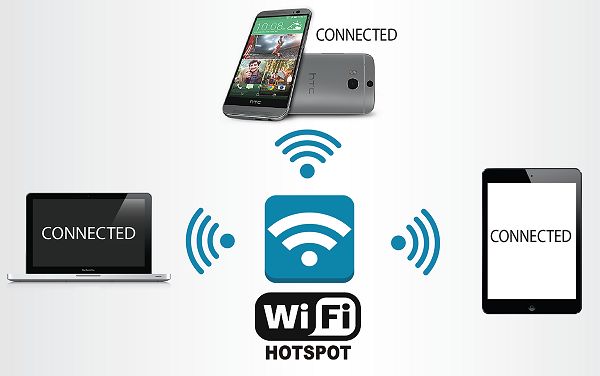

# WiFi HotSpot

## Overview

- [**WiFi HotSpot - Turn your device into a wireless hotspot/access point**](#wifi-hotspot_1)  
- [**Tor HotSpot - Optional: Routes all WiFi HotSpot traffic through the Tor network**](#tor-hotspot)  

??? info "How do I run **DietPi-Software** and install **Optimised software** ?"
    To install any of the **DietPi Optimised Software** listed below run from the command line:

    ```
    dietpi-software
    ```

    Choose **Software optimised** and select one or more items. Finally click on `Install`. DietPi will do all the necessary steps to install and start these software items.

    

    To see all the DietPi configurations options, review [DietPi Tools](../../dietpi_tools) section.

[Return to the **Optimised Software list**](../../dietpi_optimised_software)

## WiFi HotSpot

The WiFi HotSpot package turns your device into a wireless hotspot/access point. This allows other wireless devices to connect and share the internet connection.

{: style="width:550px"}

=== "Requirements"

    The requirements are:

    - 1x Ethernet connection
    - 1x Supported USB WiFi adapter or onboard WiFi. This may vary depending on device and available WiFi drivers/modules. However, common adapters (e.g.: Atheros) should be fine.

=== "Initial connection credentials"

    Use the following credentials to initially connect devices to your hotspot.

    - SSID = `DietPi-HotSpot`
    - Access Key = `dietpihotspot`

=== "Change WiFi HotSpot settings"

    Once installed, you can change the WiFi HotSpot settings (SSID/Key/Channel) at any time:

    1. Run `dietpi-config`
    2. Navigate to *Networking Options: Adapters*, then select *WiFi*
    3. Whilst in this menu, it is highly recommended you set the Country Code to your country. Depending on your country regulations, this could allow for channels 12/13 and increased power output (range) for the hotspot

## Tor HotSpot

The Tor HotSpot package turns your device into a WiFi HotSpot/Access Point with Tor routing. All WiFi HotSpot traffic for all connected WiFi devices will be routed through the Tor network.  
This is perfect for users requiring anonymity and privacy.

It also Installs:

- [WiFi HotSpot](#wifi-hotspot_1)

{: style="width:550px"}

=== "Requirements"

    The requirements are:

    - 1x Ethernet connection
    - 1x Supported USB WiFi adapter or onboard WiFi. This may vary depending on device and available WiFi drivers/modules. However, common adapters (e.g.: Atheros) should be fine.

=== "Connection credentials"

    These are identical to the [WiFi HotSpot credentials](#wifi-hotspot_1).

=== "Verification"

    To verify that the traffic is being routed through Tor you can check the following:  
    On the connected WiFi device, go to the following URL: <https://check.torproject.org>

See also <https://wikipedia.org/wiki/Tor_(anonymity_network)>.
