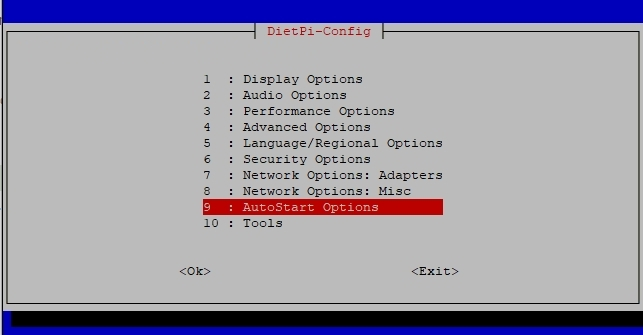

# DietPi-Config

Configure various system settings, from display / audio / network to *auto start* options. To start the system configuration, use the following command:

```sh
dietpi-config
```

{: width="643" height="335" loading="lazy"}

## Display Options

The display options are used to

- Set your screen resolution, or go headless to save additional resources.  
- Control your GPU memory splits.  
- Enable/disable the RPi camera.

## Audio Options

The audio options are used to

- Change sound cards with ease (e.g.: HiFiBerry / Odroid HiFi shield).

## Performance Options

The performance options are used to

- Overclock your system with a vast selection of overclocking profiles for your device.
- Change the CPU governor and tweak your ARM temperature limits.

## Advanced Options

The advanced options are used to

- Configure swap file size
- Configure time synchronization and real time clock source
- Update device firmware
- Toggle serial console
- Toggle Bluetooth

## Security Options

The security options are used to

- Change password and hostname

## Language/Regional Options

The language/regional options are used to

- Set timezone, locale and keyboard options. Everything you will need to make it feel like home

## Network Options: Adapters

The network options are used to

- Scan and connect to your WiFi router with ease
- Change to a static IP address on your network
- Configure your proxy settings
- Test internet connection
- Toggle IPv6 support

## Network Options: Misc

The miscellaneous network options options are used to

- Select an **APT mirror** to connect to the Debian (or Raspbian) APT repository.
- Select an **NTP mirror** to synchronise your system time.
- Choose timeouts for network and URL connection tests.
- **Network Drives** redirects you to the **DietPi-Drive_Manager** which allows you to mount Samba and NFS shares on your DietPi system.
- **No-IP** is a [dynamic DNS](https://wikipedia.org/wiki/Dynamic_DNS) provider which allows you to access your home network/server with a static domain name. The client is required to inform No-IP of your current dynamic external IP on a regular basis.

## AutoStart Options

The autostart options are used to

- Quickly and easily change what software runs after boot. Kodi, Desktop, console and many more

## Tools

The tools options are used to

- Perform CPU, RAM, filesystem and network **benchmarks**, optionally upload your results and review statistics at: <https://dietpi.com/survey/#benchmark>
- Perform CPU/IO/RAM/DISK **stress tests** to test the stability of your system, e.g. after applying some overclocking.

---
