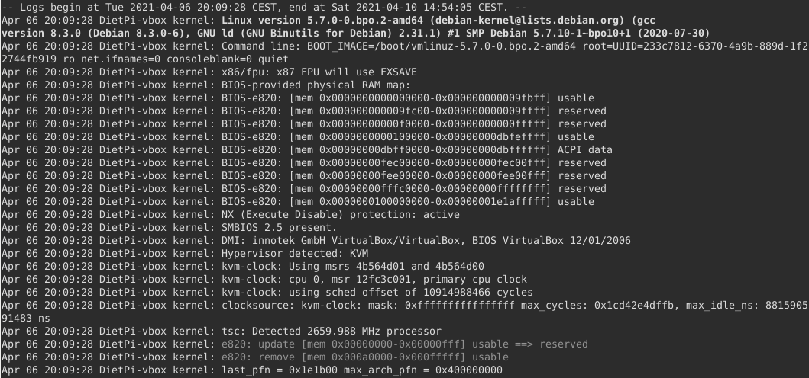

# Usage hints / HowTo

This chapter contains several documents describing the usage of DietPi.

## How to upgrade to Buster

Debian Bullseye has been released on August 14, 2021, and Debian Stretch has become "oldoldstable". Regular support for Debian Stretch ended last year and LTS support will end in 2022. We hence highly recommend to upgrade to the new Debian Bullseye.

If you are fine with flashing a new image, follow the brief instructions on our [blog post](https://dietpi.com/blog/?p=811#2.1-fresh-install) to cover common migration steps.

If too much customisation has been done without having it well documented or scripted, an upgrade of the running system may be easier. Run the below commands step by step to perform the upgrade from Stretch to Buster in a first step. If you face any errors and are unsure how to resolve, please contact us via our [community forum](https://dietpi.com/forum/c/troubleshooting/10) or [GitHub issue](https://github.com/MichaIng/DietPi/issues) to find help.

```sh
dietpi-backup 1
sed -i 's/stretch/buster/g' /etc/apt/sources.list{,.d/*.list}
rm -f /etc/apt/sources.list.d/dietpi-php.list
rm -f /etc/apt/trusted.gpg.d/dietpi-php.gpg
rm -f /etc/apt/preferences.d/dietpi-{php,openssl,xrdp}
rm -f /etc/mysql/mariadb.conf.d/97-dietpi.cnf
/boot/dietpi/func/dietpi-set_software apt-cache clean
apt update
apt upgrade
apt full-upgrade
apt autopurge
/boot/dietpi/func/dietpi-obtain_hw_model
. /boot/dietpi/func/dietpi-globals
```

If you have PHP installed, also run the following commands to prevent issues when installing additional PHP modules:

```bash
mapfile -t packages < <(dpkg --get-selections '*php*' | mawk '$2=="install" {print $1}')
dpkg -r --force-depends "${packages[@]}"
apt -y install "${packages[@]}"
unset -v packages
```

If `dietpi-update` migrated you to the dedicated Stretch update branch already, you can now migrate back to the stable `master` branch to apply DietPi updates to v8.0 and above:

```sh
G_CONFIG_INJECT 'DEV_GITBRANCH=' 'DEV_GITBRANCH=master' /boot/dietpi.txt
dietpi-update
```

If you have **Python 3** installed, as of its upgrade from v3.5 to v3.7, it needs to be reinstalled and old modules can be removed for cleanup:

```sh
rm -Rf /usr/local/lib/python3.5 /usr/local/bin/pip3*
dietpi-software reinstall 130
```

You may need to reinstall other Python-based software titles as well and modules manually installed with the `pip3` command. Your data and settings are preserved.

Check if everything is working fine, do a `reboot` and check again. If so, we recommend to continue directly upgrading further to the current stable Debian Bullseye release, following the instructions given in our blog post: <https://dietpi.com/blog/?p=811#2.2-manual-upgrade>

---

## How to use the logging mechanism

DietPi uses systemd as system and service manager, which includes the `systemd-journald` logging daemon.
An additional syslog daemon, like `rsyslog`, is not required and hence not pre-installed on DietPi. The basic command to access `systemd-journald` logs is

```sh
journalctl [options]
```

### Logging basic output

Using simply `journalctl` prints out all logging messages stored in the system.  
Each line shows:  
<timestamp\> <hostname\> <process name\>[PID]: <log message\>

The following screenshot shows the logging of the boot process (of a DietPi virtual machine). You can see the various fields (timestamp, hostname, etc.) in the log entries:

{: width="640" height="300" loading="lazy"}

### Logging output filtering options

Some of the options are described in the following table.  
More detailed options may be studied in the [man pages of `journalctl`](https://man7.org/linux/man-pages/man1/journalctl.1.html).

| Command | Remark |
| - | - |
| `journalctl -u UNITNAME` <br>(`--unit UNITNAME`) | Displays messages of the given unit |
| `journalctl _PID=<process_id>` | Displays messages of process with PID equals to <process_id\> |
| `journalctl -r` <br>(`--reverse`) | Displays list in reverse order, i.e. newest messages first |
| `journalctl -f` <br>(`--follow`) | Displays the tail of the log message list and shows new entries *live* |
| `journalctl -b` <br>(`--boot`) | Displays messages since the last boot (i.e. no older messages). See also option `--list-boots` |
| `journalctl -k` <br>(`--dmesg`) | Displays kernel messages |
| `journalctl -p PRIORITY` <br>(--priority PRIORITY) | Displays messages with the given priority. PRIORITY may be `merg`, `alert`, `crit`, `err`, `warning`, `notice`, `info` and `debug`. Also numbers as PRIORITY are possible |
| `journalctl -o verbose` | Displays additional meta data |
| `journalctl --disk-usage` | Displays the amount of disk space used by the logging messages |
| `journalctl --no-pager | grep <filter>` | Filters log messages (filtering with `grep`) |

In the software package descriptions, sometimes there is a tab called "View Logs". This gives a `jounalctl -u UNITNAME` command example how to filter the logging messages of a given software package.  
Example: See [tab "View logs"](../software/dns_servers/#unbound) of *Unbound*. It gives: `journalctl -u unbound`.

### Logging options

As described in the chapter [Log system choices](../software/log_system/), DietPi has several options how the logging system operates. Especially the log history, the memory consumption and the frequency of SD card write accesses varies.  
Find and set the options which fit to your demands, it is also an option to change the logging to examine some problems.

| Log option | location | log depth | log persistence |
| - | - | - | - |
| DietPi-RAMlog #1 | RAM | last hour | volatile, i.e. not saved to disk |
| DietPi-RAMlog #2 | RAM | long term | stored, i.e. hourly saved to disk |
| Full logging | disk | long term | stored, i.e. immediately saved to disk <br>(with Rsyslog and Logrotate)|

---

## How to do an automatic base installation at first boot (DietPi-Automation)

DietPi offers the option for an automatic first boot installation. Normally, during the first system boot there is an installation procedure which sets up your system initially. The steps described in the section ["First logon on DietPi"](../install/#4-first-logon-on-dietpi) are then conducted.

These steps need an amount of user interaction which can be overcome with the automatic base installation option described in this section.  
The automatized setup is based on the configuration file `/boot/dietpi.txt`. It can be edited prior to the first boot and will be evaluated during the first boot procedure. On subsequent boot procedures, the most options in the file are not evaluated any more.

??? info "Editing the file `/boot/dietpi.txt` contents"

    On some hardware options (e.g. Raspberry Pi) the file is located on an own FAT partition which can be accessed on a Windows PC. In this case `dietpi.txt` can be found in its root.

    Some hardware options (e.g. NanoPi) do not have this extra partition, i.e. the system is located on a single partition, usually ext4. In this case the SD card needs to be mounted to be able to access the `dietpi.txt` file which then can be found within the `/boot` directory.

The result of the automated installation can cover the following areas:

- **Network configuration** (e.g. WiFi, network and proxy settings)
- **System options** (e.g. timezone, hostname, root password)
- **Software preferences** (e.g. SSH server, file server, web server)
- **Software options** (e.g. VNC, Nextcloud, DietPi Dashboard)
- **Automatic software installation** (packages from `dietpi-software`)
- **User script** pre and post initial installation
- **Restore** from a previous made system backup

To achieve this automated installation, the following steps need to be conducted in the given order:

1. Flash the boot media (e.g. SD card)
1. Edit the file `/boot/dietpi.txt` on the boot media
1. Attach the boot media to your system
1. Start up the system the first time
1. Wait for completion of the automated setup

### Options within the file

The options are generally described within the file itself. Basically see the file contents for details about the configuration options.  
Below, only the most important options are listed. For further options go into the file `dietpi.txt` itself.

#### Network configuration

To achieve the basic network configuration the following options shall be taken into account:

- Run with WiFi: `AUTO_SETUP_NET_WIFI_ENABLED`, `AUTO_SETUP_NET_WIFI_COUNTRY_CODE` in combination with `dietpi-wifi.txt`
- Use a static IP address: `AUTO_SETUP_NET_USESTATIC`, `AUTO_SETUP_NET_STATIC_IP`, `AUTO_SETUP_NET_STATIC_MASK`, `AUTO_SETUP_NET_STATIC_GATEWAY`, `AUTO_SETUP_NET_STATIC_DNS`, `AUTO_SETUP_DHCP_TO_STATIC`
- Usage of a proxy server: `CONFIG_PROXY_ADDRESS`, `CONFIG_PROXY_PORT`, `CONFIG_PROXY_USERNAME`, `CONFIG_PROXY_PASSWORD`

#### System options

Many of the system options can be set with the automated installation and can be also changed afterwards via `dietpi-config`:

- Basic settings: `AUTO_SETUP_NET_HOSTNAME`, `AUTO_SETUP_GLOBAL_PASSWORD`
- Localization: `AUTO_SETUP_LOCALE`, `AUTO_SETUP_KEYBOARD_LAYOUT`, [`AUTO_SETUP_TIMEZONE`](https://en.wikipedia.org/wiki/List_of_tz_database_time_zones#Time_Zone_abbreviations)
- Autostart: `AUTO_SETUP_AUTOSTART_TARGET_INDEX`, `AUTO_SETUP_AUTOSTART_LOGIN_USER`
- Overclocking: `CONFIG_CPU_GOVERNOR`, `CONFIG_CPU_MAX_FREQ`, `CONFIG_CPU_MIN_FREQ`, etc.
- Auto-updating: `CONFIG_CHECK_DIETPI_UPDATES`, `CONFIG_CHECK_APT_UPDATES`

#### Software preferences

Some server options can be set via `AUTO_SETUP_SSH_SERVER_INDEX`, `AUTO_SETUP_FILE_SERVER_INDEX`, `AUTO_SETUP_WEB_SERVER_INDEX`.

#### Software packages installation

All software packages, which can be installed via `dietpi-software` can also be installed automatically using the keyword `AUTO_SETUP_INSTALL_SOFTWARE_ID`.  
The software packages are given with their software ID (a number) which can be found on the left side when browsing the software in the `dietpi-software` script. Additionally they are given in the [list of available software IDs](https://github.com/MichaIng/DietPi/wiki/DietPi-Software-list).

As an example the software package "Plex Media Server" has the ID 42.

#### User script

Execution of a user script can be done at these two instants of time:

- pre-networking and pre-DietPi install (`/boot/Automation_Custom_PreScript.sh`)
- post-networking and post-DietPi install (`/boot/Automation_Custom_Script.sh`)

Search `AUTO_SETUP_CUSTOM_SCRIPT_EXEC` for details.

#### System restore

A restore process can be executed automatically using the keyword `AUTO_SETUP_BACKUP_RESTORE`. This gives the option to start up a system with a previous made system backup (e.g. for generating many identical systems).

#### General options

These keywords are general ones and need to be used for fully automated setups:

- `AUTO_SETUP_ACCEPT_LICENSE`
- `AUTO_SETUP_AUTOMATED`

Remark: If `AUTO_SETUP_AUTOMATED=1` is used, the `AUTO_SETUP_ACCEPT_LICENCE` needs not to be set.

### Wait for completion of the automated setup / Logging

The duration of an automated setup depends on the selected options, especially the software packages to be installed and of course of the system's speed. It may take a long time (more than an hour may be possible). To find out whether the automatic installation process is running the user can login to the system via another SSH connection. During the installation process a cyclic message will appear after the login.

The result of the automated installation process is written to the file `/var/tmp/dietpi/logs/dietpi-firstrun-setup.log`.

### Example #1 of file contents

The following lines give an example of needed changes within the `dietpi.txt` file. The target to be achieved is:

- Ethernet connection, DHCP, no proxy, no WiFi
- German localization
- Hostname `myDietpiSystem`

Then these entries need to be set within the file `dietpi.txt` prior the initial boot:

```sh
AUTO_SETUP_ACCEPT_LICENSE=1
AUTO_SETUP_LOCALE=de_DE.UTF-8
AUTO_SETUP_KEYBOARD_LAYOUT=de
AUTO_SETUP_TIMEZONE=Europe/Berlin
AUTO_SETUP_NET_HOSTNAME=myDietPiSystem
```

### Example #2 of file contents

The following lines give an example of needed changes within the `dietpi.txt` file. The target to be achieved is:

- Automatic updates
- Ethernet connection, DHCP, no proxy, no WiFi
- German localization
- Hostname `myDietpiSystem`
- X11 desktop with XFCE and Chromium
- Autostart to X11 login screen

Then these entries need to be set within the file `dietpi.txt` prior the initial boot:

```sh
AUTO_SETUP_LOCALE=de_DE.UTF-8
AUTO_SETUP_KEYBOARD_LAYOUT=de
AUTO_SETUP_TIMEZONE=Europe/Berlin
AUTO_SETUP_NET_HOSTNAME=myDietPiSystem
AUTO_SETUP_BROWSER_INDEX=-2
AUTO_SETUP_AUTOSTART_TARGET_INDEX=16
AUTO_SETUP_AUTOMATED=1
AUTO_SETUP_INSTALL_SOFTWARE_ID=25
CONFIG_CHECK_DIETPI_UPDATES=1
CONFIG_CHECK_APT_UPDATES=2
```

---

### References

Blog entry (German language) from `Holger Erbe`: [Vollautomatische Installation eines Raspberry Pi unter DietPi – Schritt für Schritt](https://blog.login.gmbh/vollautomatische-installation-eines-raspberry-pi-unter-dietpi-schritt-fuer-schritt/){:class="nospellcheck"}  
Blog entry (German language) from `DMW007`: [Raspberry Pi Ersteinrichtung mit DietPi Installation ohne Monitor automatisiert einrichten (Windows + Linux)](https://u-labs.de/portal/raspberry-pi-ersteinrichtung-mit-dietpi-installation-ohne-monitor-automatisiert-einrichten-windows-linux/){:class="nospellcheck"}
