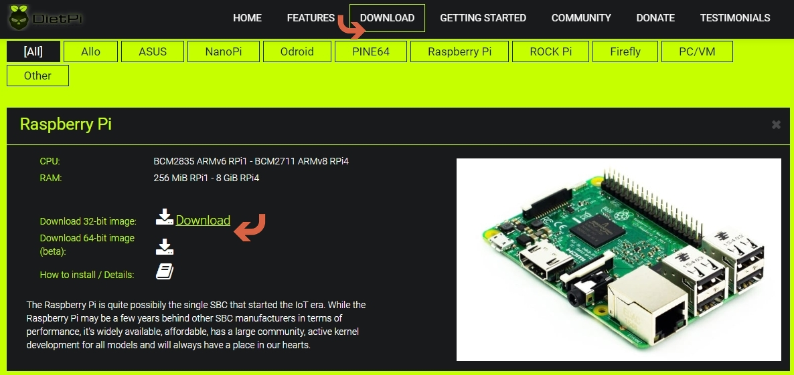

# How to install DietPi

## What do you need ?

To follow this tutorial, you will need the next hardware list:

 - A Raspberry Pi, Odroid or other SBC - open [the list of all supported SBC](../hardware-supported_sbc/)
 - An SD card of at least 4 GiB, and a way to read it on your computer (integrated slot or external SD card reader)
 - Optional: Ethernet (network) cable

_Note_: Following this guide you could run the installation directly or via network. If you choose an installation via network you will not need a monitor or keyboard connected to your SBC or virtualized environment. 

## 1. Download and extract the DietPi disk image

Open [dietpi.com](https://dietpi.com#download) and select “Download”. Various supported devices will be displayed. Choose the preferred SBC or virtualized environment and click on the **Download**. The disk image will be downloaded locally. 

_Example:_


**Unzip the dowloaded file to a local folder.** 

It is a _7z_ archive format so you will need to install either [7zip for Windows](https://www.7-zip.org/) or [The Unarchiver (Macintosh)](https://wakaba.c3.cx/s/apps/unarchiver.html). Both are free of charge and have been tested to unzip the image correctly.

Linux users will need to download and install `p7zip` (the terminal version of `7zip`).

??? info "How do I extract DietPi image on Linux" 
	On Debian and Ubuntu-based systems, open a terminal and type:
	```
	sudo apt install p7zip-full
	```
	
	Once p7zip is installed, type the following at the terminal to extract the file:
	```
	7za e DietPi-Image.7z 
	```	
	
	Replace **DietPi-Image.7z** with the correct name of your compressed DietPi file, example: **DietPi_RPi-ARMv6-Buster.7z**. This will extract the DietPi image file for you to use.

## 2. Run balenaEtcher and flash the image 

Download and install [balenaEtcher](https://etcher.io/) - it flashes OS images to SD cards & USB drives, safely and easily on Windows, macOS, Linux.

Start the program and make sure you have your SD card inserted into your computer. Locate and select the DietPi image.


Next, ensure that the SD card selected is the correct one. It will wipe the drive clean, so if you choose the wrong one, you may risk losing data.


Once you have confirmed all the details are correct, proceed to flash the SD card. This process may take a while.


??? info "Click here if you want to pre-configure WiFi network " 
	To setup Wifi, open the SD card folder, and update next two files using a text editor of your choice:

	1.  Open the file named `dietpi.txt`. Find `AUTO_SETUP_NET_WIFI_ENABLED` and set to value 1.
	2.  Open the file `dietpi-wifi.txt` and set `aWIFI_SSID[0]` to the name of your WiFi network. 
    3.  In the same file `dietpi-wifi.txt`, set `aWIFI_KEY[0]` to the password of your WiFi network.
    4.  Save and close the files

Remove the SD card from the PC and insert it into your device, preparing to boot for the first time. 

## 3. First boot on DietPi

Insert the SD card into your device (e.g. Raspberry Pi) and start it. A few seconds later, you can connect following the instructions on the screen, or connecting via network.

Use:

- login: **root**
- password: **dietpi**

??? info "Click here if you want to connect via network (running a _headless install_)" 

    **WARNING**

    On first login DietPi will immediately  install updated software packages, if the network connection is not stable it is recommended to perform this step locally instead.

    **IP Scanning tool**

    For the following steps we require an IP Scanning tool to determine the IP address of the Raspberry Pi. 
    
	- For Windows, you could try `Advanced IP Scanner`. Download the tool from [here](https://download.advanced-ip-scanner.com).
	
	- For Linux, you can use nmap command:

		```
		sudo apt-get install nmap #For installing Nmap
		sudo nmap -sn 192.168.1.0/24 #For scanning IP address
		```

	**Connect to DietPi via SSH**
	
	- A popular SSH Client for Windows is PUTTY. You can download putty from [here](https://www.chiark.greenend.org.uk/~sgtatham/putty/latest.html). Enter in the `Host name` field the IP address found during the scanning, select `SSH` and then click on _Open_ button.
	

	- Most Linux distributions come packaged with an ssh client. Type in your Terminal next command (replace the sample IP address 192.168.1.20 with the one found via scanning the network).
	```
	ssh pi@192.168.1.20
	```

To further proceed you’ll need to accept the DietPi GPL license. Hit the Enter key on your keyboard to do this. 


DietPi will then immediately begin to search for and install updated software packages, which will take some time to complete. 

Once the packages have been updated, DietPi will ask you to confirm whether you would like to enable user analytics. 

DietPi Survey is **optional**, and not enabled by default. It is anonymous, secured and requires a minimal data transfer. ALL the shared details are published on the [dietpi.com/survey](https://dietpi.com/survey/) page. Checkout and see how DietPi is used ! 


The default DietPi password is public, so you’ll be asked to change this at the next stage for both the `root` and `dietpi` user accounts. Select OK and hit enter, then provide your password (twice) to confirm. 

You can change the password again later by typing `passwd` at the terminal.


## 4. Install software with the DietPi-Software tool

The base installation of DietPi is minimal **by design**, allowing you to choose what software you want to install and use. If you’re unsure what software to install, checkout [DietPi Optimised Software](../user-optimised-software) page for more details.

!!! info "How do I run **DietPi-Software** and install **Optimised software** ?" 

	This tool will automatically launch when you first boot your Raspberry Pi using DietPi after the initial configuration process has completed. You can also launch it manually by typing `dietpi-software` in the terminal.

	- To begin, select **Software Optimized** in the main menu list and hit Enter.    
	- Scroll through the list of available software - for more details check [DietPi Optimised Software](../user-optimised_software)
	- To install software on your DietPi, select it in the list and press the **space bar** to add it to the installation list. If you change your mind, hit space again to remove it.
	- Once you’ve selected the software you wish to install, press the tab key on your keyboard to switch to the confirmation options at the bottom. Select **OK**, then hit enter on your keyboard to confirm.
	- To begin installing your software, select **Install** from the main menu list, then hit the Enter key. DietPi will ask you to confirm your choice(s). Select OK, then hit enter to begin the installation.

	The software you selected will begin to install at this point. Once the process is completed, you may be asked to restart your device. Press OK to confirm. 
	


You can return to the **DietPi-Software** tool to make further changes at any time by typing `dietpi-software` at the terminal, or enter `dietpi-launcher` and select **DietPi-Software** tool.

If you want to make further changes to your DietPi configuration, you can run `dietpi-launcher` at the terminal to view all the available DietPi tools, including **DietPi-Update** to update your device and **DietPi-Backup** to back up your device. 

For more details, check [DietPi Tools](../user-guide_tools) section.

## Install by community (YouTube)
A video tutorial on _How to install and initially configure DietPi_ by Roberto Jorge. 

<iframe width="560" height="315" src="https://www.youtube-nocookie.com/embed/Me0PfuNLl-Q?rel=0" frameborder="0" allow="accelerometer; autoplay; encrypted-media; gyroscope" allowfullscreen></iframe>
