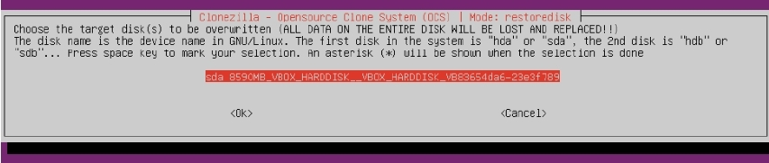

# How to install DietPi on native PC (with UEFI)

## Intro

The Native PC images are great for those occasions where SBC performance just isn’t enough.One example could be [Intel NUC Kit](https://www.intel.com/content/www/us/en/products/boards-kits/nuc/kits.html?page=2). It is a small, versatile, upgradable, and affordable desktop PC with the same basic feature set as that of a much larger machine. 

It could be also a great way to make use of an old computer that’s not capable of running the latest version of Windows or macOS. 

## Let's start

You would need the next:

- one **working PC with internet access**, helping to flash the boot media.
- one **bootable USB flash drive** (at least 2 GB), to hold the DietPi installer image and to boot the target PC
- **target PC** to be installed

!!! warning "All data on the USB medium and on the target PCs harddisk will be erased !" 
	Before starting the installation make first backup of the data available on the target PC and USB drive ! 

## 1. Download and extract the DietPi disk image

Download the **DietPi installer image** from [dietpi.com](https://dietpi.com/#download) and 
Unzip the downloaded file to a local folder. It is a _7z_ archive format so you will need to install either [7zip for Windows](https://www.7-zip.org/) or other alternative tools. 

Download **[Rufus](https://rufus.ie/)** and run the application. There is a portable version available which doesn't require any local installation.

!!! warning "Be careful if you run alternative applications !" 
	While [Balena Etcher](https://www.balena.io/etcher/) is recommended for installing DietPi on SBCs, it does not provide good results for UEFI images. The same also with win32diskimager, which does not work as an alternative.

## 2. Flash image to USB drive

Start **[Rufus](https://rufus.ie/)** application and make sure you have your USB drive inserted into your computer. Follow the next steps:

- (1) Select the USB device
- (2) Select the downloaded **DietPi** image.
- (3) Select GPT as partition scheme
- (4) Select UEFI as target system
- (5) Click on _Start_ button
	
	_Note: Ensure the selected USB card is the correct one ! The app will wipe the drive, so if you choose the wrong one, you may risk losing data._

## 3. Boot target PC and install the image on the local disk

Boot **target PC** from USB image and install image on the local disk / harddisk. Put the USB stick into the target PC and boot from this USB stick _Note: it may be necessary to change BIOS settings to enabled the UEFI boot. This action is not described here._

During the initial boot, the following dialog may appear to boot from the USB stick:

After booting the graphics selection dialog appears:

You can select the default settings. In case of problems, please select "Safe graphic settings".

Once this step is completed, you will able to select a different keyboard. If necessary, change your keyboard settings and go through the appropriate dialogs.

Then the installation process begins with the help of the Wunderful Clonezilla tool. 

Select the image file to be installed on the target PC harddisk. Normally you should only see one single option:

After this, you have to select the target PCs harddisk where your DietPi shall be installed. In this example there is only one harddisk present:

Then the installation process starts with several steps, e.g. showing the process of the image copying:

These steps take some time, be patient ! Otherwise buy an SSD. :-)
At the end the system shutdown.

## 4. First boot of the target PC with DietPi

At first disconnect your USB stick from the target PC. Then power on the PC. The system will boot up and do the DietPi installation. 

[Follow the rest of initialization](../user-guide_install/#3-first-boot-on-dietpi). This is similar to the SBC installation.
