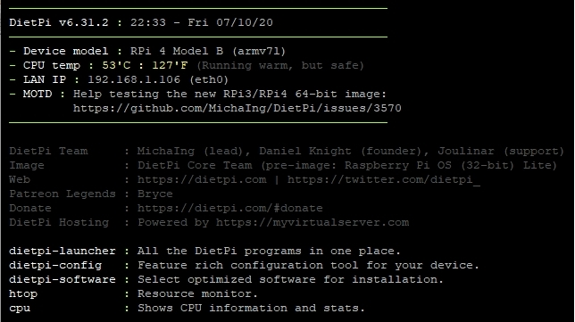

# Getting started

## Overview

Once you did the [DietPi Installation](../user-guide_install) you could choose to install one or more [Optimised software](../user-optimised-software) items or run one of the [DietPi tools](../user-guide_tools).

## Initial start 

This will be the first screen displayed.

## DietPi-Launcher

Once you run `dietpi-launcher` you could see all available DietPi tools. It provides a quick  way to run any the DietPi tools: from installing **DietPi Optimised software** to simple configure your device, from enabling services to start to backup your installation and so on.

.

## Choose the software you need

Start by selecting one or more  [_DietPi Optimised Software_](../user-optimised-software) for your system. 

The list includes desktop environments, Remote Desktop, Media Systems/Players, Torrents/Downloading (Transmission, Cloud/Backup, Gaming, Social, Surveillance, Hotspots, System Stats, Hardware Projects, Stacks (LAMP/LEMP), PiHole/PiVPN, File Servers, Home Automation, Printing, and [much more...](../user-optimised-software).

## Supported SBC

See the list of [Supported Single Board Computers (SBCs)](../hardware-supported_sbc)
