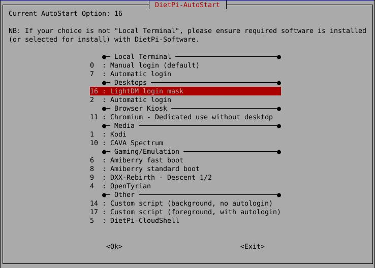
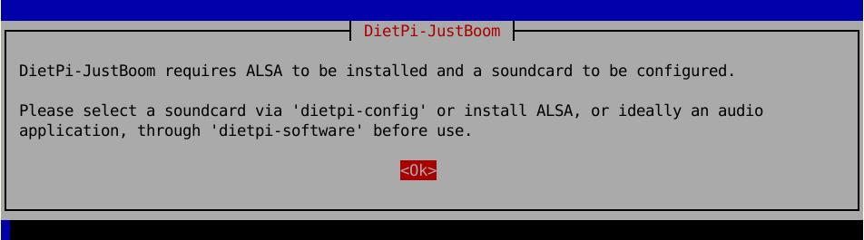
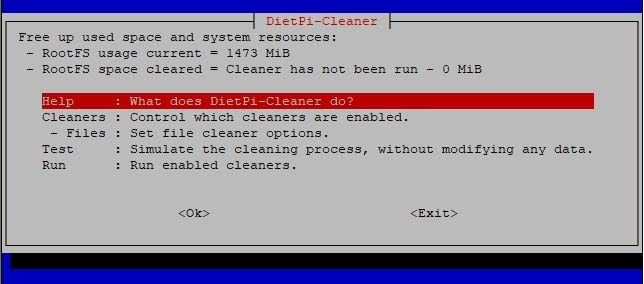

# DietPi Tools

## DietPi-Launcher

It is the main program to run whenever you have a DietPi OS. It provides a quick access to all the main DietPi programs.

## DietPi-Software

DietPi-Software will be automatically displayed on the first login. It is one of the core tools, enabling the installation of one or multiple software items, either:

=== "Software Optimised"
    This contains a long list of optimised software. You either browse the list by selecting **Software optimised** or used the option **Search**. 

=== "Software Additional"
    This section provides:
    
    - software packages that are often used and installed via `apt install <package>`, without additional optimisation from DietPi team. 
    - _or_ packages not directly required, but pulled as a dependency, like: build tools, libraries or runtime systems. 

### Software Optimised 

Select DietPi optimised software to install.

### Install / Uninstall

Use this option to: 

 - install selected software items (either **optimised software** or **additional software** items)
 - or select and then remove installed software from your operating system.

## Configuration

### DietPi-Config

Configure various system settings, from display / audio / network to _auto start_ options.  

### DietPi-Drive_Manager

Feature-rich drive management utility.

### Dietpi-AutoStart

Defines software packages to start when the DietPi OS boots up. Example, boot into the desktop with Kodi running.

### Dietpi-Services

Provides service control, priority level tweaks and status print.

### Dietpi-LED_control

### Dietpi-Cron

Modify the start times of specific cron job groups.

### Dietpi-JustBoom

Change the audio settings

## Dietpi Update / Backup / Sync

### DietPi-Update 

Update DietPi OS version to the latest version available.

### Dietpi-Backup

Fully backup DietPi setup or restore from an already available DietPi backup.

### Dietpi-Sync

Sync or duplicate a directory to another

## Misc

### Dietpi-CPUInfo

Displays CPU temperature, processor frequency, throttle level etc.

### DietPi-LetsEncrypt

Access the frontend for the `Let's Encrypt` integration.

### DietPi-NordVPN

### DietPi-Survey

### DietPi-BugReport

### Dietpi-Morsecode

Convert a text file into morse code.

## Maintenance

### Dietpi-Explorer

Lightweight file manager and explorer

### Dietpi-Cleaner

Clean up not necessary files from the operating system and free up valuable disk space.

### Dietpi-LogClear

Clear log files in /var/log/.

